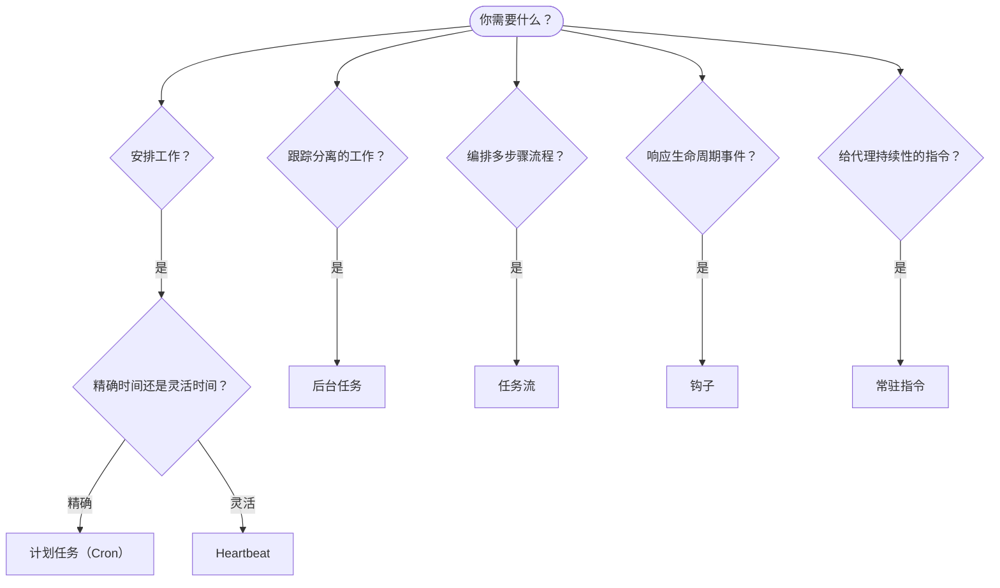

OpenClaw 通过任务、计划任务、事件 hooks，
和固定指令在后台运行工作。使用此页面来选择合适的机制。

## 快速决策指南

| 使用场景                                | 推荐项                  | 原因                                             |
| --------------------------------------- | ---------------------- | ------------------------------------------------ |
| 每天上午 9 点准时发送日报              | 计划任务（Cron）       | 时间精确，执行隔离                 |
| 20 分钟后提醒我                        | 计划任务（Cron）       | 一次性且时间精确（`--at`）            |
| 每周运行深度分析                       | 计划任务（Cron）       | 独立任务，可使用不同模型         |
| 每 30 分钟检查收件箱                   | Heartbeat              | 可与其他检查批量处理，且具备上下文感知         |
| 监控日历中的即将到来的事件             | Heartbeat              | 很适合周期性地保持感知               |
| 检查子代理或 ACP 运行状态              | 后台任务                | 任务账本会跟踪所有分离的工作            |
| 审计哪些任务何时运行                   | 后台任务                | `openclaw tasks list` 和 `openclaw tasks audit` |
| 多步骤研究然后总结                     | 任务流                  | 具有修订跟踪的持久编排     |
| 会话重置时运行脚本                     | 钩子                   | 事件驱动，在生命周期事件上触发          |
| 每次工具调用时执行代码                 | 插件钩子                | 进程内钩子可以拦截工具调用        |
| 始终在回复前检查合规性                 | 常驻指令                | 自动注入到每个会话中        |

### 计划任务（Cron） vs Heartbeat

| 维度           | 计划任务（Cron）                 | Heartbeat                             |
| -------------- | -------------------------------- | ------------------------------------- |
| 时间           | 精确（cron 表达式、一次性）      | 近似（默认每 30 分钟）                 |
| 会话上下文     | 新鲜（隔离）或共享               | 完整的主会话上下文                    |
| 任务记录       | 始终创建                         | 从不创建                               |
| 传递方式       | 渠道、webhook 或静默             | 在主会话内联                          |
| 最适合         | 报告、提醒、后台作业             | 收件箱检查、日历、通知               |

当你需要精确时间或隔离执行时，使用计划任务（Cron）。当工作受益于完整会话上下文且近似时间足够时，使用 Heartbeat。

## 核心概念

### 计划任务（cron）

Cron 是 Gateway 内置的精确时间调度器。它会持久化作业，在正确的时间唤醒代理，并且可以将输出传递到聊天频道或 webhook 端点。支持一次性提醒、周期性表达式以及入站 webhook 触发器。

参见 [Scheduled Tasks](/automation/cron-jobs)。

### 任务

后台任务账本会跟踪所有分离的工作：ACP 运行、子代理启动、隔离的 cron 执行以及 CLI 操作。任务是记录，不是调度器。使用 `openclaw tasks list` 和 `openclaw tasks audit` 来检查它们。

参见 [Background Tasks](/automation/tasks)。

### Task Flow

Task Flow 是位于后台任务之上的流程编排基础设施。它管理具有持久性的多步骤流程，支持 managed 和 mirrored 同步模式、修订跟踪，以及用于检查的 `openclaw tasks flow list|show|cancel`。

参见 [Task Flow](/automation/taskflow)。

### 固定指令

固定指令为代理授予针对定义程序的永久操作权限。它们存在于工作区文件中（通常是 `AGENTS.md`），并会注入到每个会话中。可与 cron 结合用于基于时间的强制执行。

参见 [Standing Orders](/automation/standing-orders)。

### Hooks

内部 hooks 是由代理生命周期事件
(`/new`, `/reset`, `/stop`)、会话压缩、Gateway 启动以及消息
流触发的事件驱动脚本。它们从 hook 目录中发现，并通过
`openclaw hooks` 管理。对于进程内工具调用拦截，请使用
[Plugin hooks](/plugins/hooks)。

参见 [Hooks](/automation/hooks)。

### 心跳

Heartbeat 是一个周期性的主会话轮次（默认每 30 分钟一次）。它将清单式监控（收件箱、日历、通知）批量整合到一次代理轮次中，并保留完整的会话上下文。Heartbeat 轮次不会创建任务记录，也不会延长每日/空闲会话重置的新鲜度。Heartbeat 监控 scratch 是较小的提示上下文；将重复工作安排为 cron 作业。空的 scratch 会被跳过，并标记为 `empty-heartbeat-file`。计划中的 heartbeats 会在主队列或 cron 工作繁忙、同一代理的其他回复或嵌入式运行处于活动状态，或者解析出的目标会话存在活动或排队中的工作时自动延后。

参见 [Heartbeat](/gateway/heartbeat)。

## 它们如何协同工作

- **Cron** 负责精确的计划安排（每日报告、每周审查）和一次性提醒。所有 cron 执行都会创建任务记录。
- **Heartbeat** 负责每 30 分钟一次的批量监控清单；需要独立节奏的检查由 cron 负责。
- **Hooks** 通过自定义脚本响应特定事件（会话重置、压缩、消息流）。插件 hooks 覆盖工具调用。
- **Standing orders** 为代理提供持久上下文和权限边界。
- **Task Flow** 在单个任务之上协调多步骤流程。
- **Tasks** 自动跟踪所有分离的工作，因此你可以检查和审计它。

## 相关内容

- [计划任务](/automation/cron-jobs) — 精确调度和一次性提醒
- [后台任务](/automation/tasks) — 所有分离工作的任务账本
- [任务流](/automation/taskflow) — 持久化的多步骤流程编排
- [钩子](/automation/hooks) — 事件驱动的生命周期脚本
- [插件钩子](/plugins/hooks) — 进程内工具、提示、消息和生命周期钩子
- [常设指令](/automation/standing-orders) — 持久化的代理指令
- [心跳](/gateway/heartbeat) — 周期性的主会话轮次
- [配置参考](/gateway/configuration-reference) — 所有配置键
