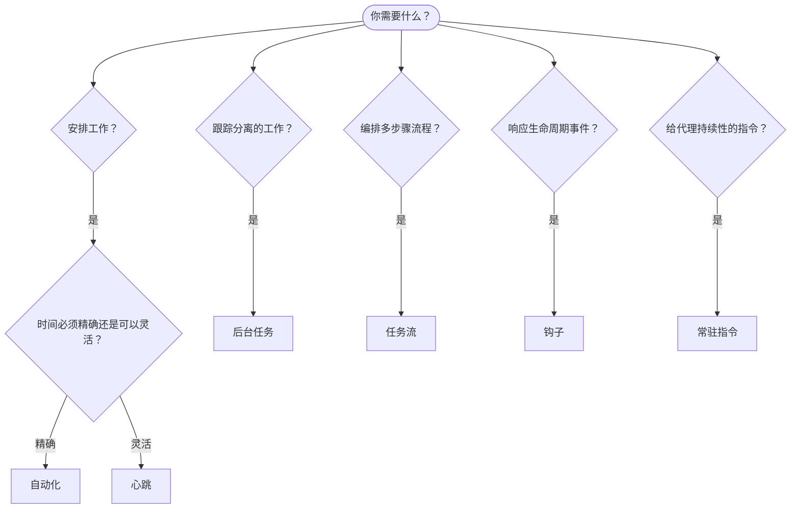

OpenClaw 通过任务、自动化、事件钩子和固定指令在后台运行工作。使用此页面来选择合适的机制。

## 快速决策指南

| 使用场景                           | 推荐方案       | 原因                                             |
| ---------------------------------- | -------------- | ------------------------------------------------ |
| 每天上午 9 点准时发送报告          | 自动化         | 时间精确，隔离执行                               |
| 20 分钟后提醒我                    | 自动化         | 使用精确时间的一次性任务（`--at`）               |
| 每周运行一次深度分析               | 自动化         | 独立任务，可使用不同的模型                       |
| 每 30 分钟检查一次收件箱            | 心跳           | 可与其他检查批量执行，具备上下文感知能力         |
| 监控日历中的即将到来的事件          | 心跳           | 非常适合周期性地获取信息                         |
| 检查子代理或 ACP 运行的状态         | 后台任务       | 任务账本会跟踪所有分离的工作                     |
| 审计运行过什么以及运行时间          | 后台任务       | `openclaw tasks list` 和 `openclaw tasks audit` |
| 进行多步骤研究后再总结              | 任务流         | 持久化编排，并跟踪修订记录                       |
| 会话重置时运行脚本                  | 钩子           | 事件驱动，在生命周期事件发生时触发               |
| 每次工具调用时执行代码              | 插件钩子       | 进程内钩子可以拦截工具调用                       |
| 回复前始终检查合规性                | 常驻指令       | 自动注入每个会话                                 |

### 自动化 vs 心跳

| 维度           | 自动化                              | 心跳                                |
| -------------- | ----------------------------------- | ----------------------------------- |
| 时间安排       | 精确（cron 表达式、一次性任务）     | 近似（默认每 30 分钟一次）          |
| 会话上下文     | 全新（隔离）或共享                  | 完整的主会话上下文                  |
| 任务记录       | 始终创建                            | 从不创建                            |
| 交付方式       | 通道、Webhook 或静默                | 在主会话中内联                      |
| 最适合         | 报告、提醒、后台任务                | 收件箱检查、日历、通知              |

当你需要精确的时间安排或隔离执行时，请使用自动化。当工作受益于完整的会话上下文且可以接受近似的时间安排时，请使用心跳。

## 核心概念

### 自动化

自动化是 OpenClaw 内置的精确定时调度器。调度器会持久化任务，在正确的时间唤醒代理，并将输出发送到聊天频道或 webhook 端点。支持一次性提醒、周期性 cron 表达式以及入站 webhook 触发器。

参见 [自动化](/automation/cron-jobs)。

### 任务

后台任务账本会跟踪所有脱离式工作：ACP 运行、子代理生成、隔离的自动化运行以及 CLI 操作。任务是记录，而不是调度器。使用 `openclaw tasks list` 和 `openclaw tasks audit` 进行检查。

参见 [后台任务](/automation/tasks)。

### 任务流

任务流是位于后台任务之上的流程编排基础设施。它管理具有持久性的多步骤流程，支持 managed 和 mirrored 同步模式、修订跟踪，以及用于检查的 `openclaw tasks flow list|show|cancel`。

参见 [任务流](/automation/taskflow)。

### 固定指令

固定指令授予代理对指定程序的永久操作权限。它们存储在工作区文件中（通常是 `AGENTS.md`），并注入到每个会话中。与自动化结合使用，可实现基于时间的强制执行。

参见 [固定指令](/automation/standing-orders)。

### Hooks

内部 hooks 是由代理生命周期事件
(`/new`、`/reset`、`/stop`)、会话压缩、Gateway 启动以及消息
流触发的事件驱动脚本。它们从 hook 目录中发现，并通过
`openclaw hooks` 管理。对于进程内工具调用拦截，请使用
[插件 hooks](/plugins/hooks)。

参见 [Hooks](/automation/hooks)。

### 心跳

心跳是定期执行的主会话轮次（默认每 30 分钟一次）。它会在一次代理轮次中批量处理清单式监控任务（收件箱、日历、通知），并拥有完整的会话上下文。心跳轮次不会创建任务记录，也不会延长每日或空闲会话重置的新鲜度。心跳监控的临时内容属于较小的提示上下文；应将周期性工作安排为自动化任务。当临时内容为空时，将以 `empty-heartbeat-file` 跳过。主队列或自动化工作繁忙、同一代理正在处理其他回复或嵌入式运行，或者解析后的目标会话存在活动中或排队中的工作时，计划的心跳会自动延后。

参见 [心跳](/gateway/heartbeat)。

## 它们如何协同工作

- **Automations** 负责精确的计划任务（每日报告、每周复盘）和一次性提醒。所有自动化运行都会创建任务记录。
- **Heartbeat** 每 30 分钟处理一次批量监控清单；需要独立执行周期的检查则由自动化负责。
- **Hooks** 通过自定义脚本响应特定事件（会话重置、压缩、消息流）。插件钩子涵盖工具调用。
- **Standing orders** 为代理提供持久化上下文和权限边界。
- **Task Flow** 协调单个任务之上的多步骤流程。
- **Tasks** 自动跟踪所有分离的工作，方便你进行检查和审计。

## 相关内容

- [自动化](/automation/cron-jobs) — 精确的计划安排和一次性提醒
- [后台任务](/automation/tasks) — 所有分离任务的任务记录
- [任务流程](/automation/taskflow) — 持久化的多步骤流程编排
- [钩子](/automation/hooks) — 事件驱动的生命周期脚本
- [插件钩子](/plugins/hooks) — 进程内工具、提示、消息和生命周期钩子
- [常设指令](/automation/standing-orders) — 持久化的代理指令
- [心跳](/gateway/heartbeat) — 定期进行主会话轮次
- [配置参考](/gateway/configuration-reference) — 所有配置键
