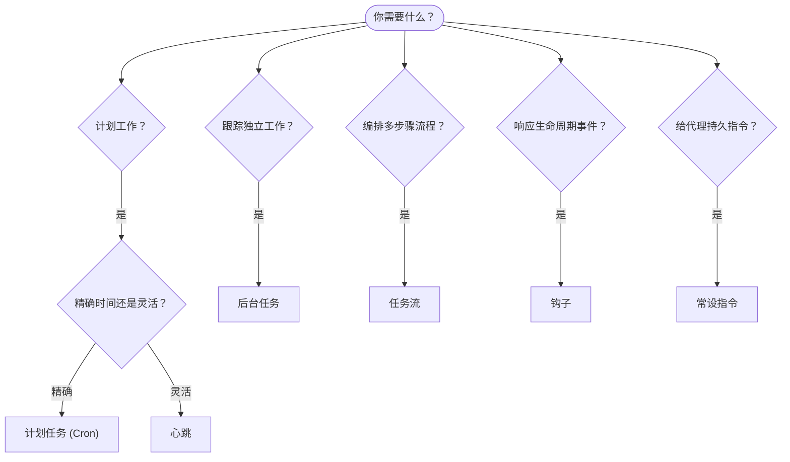

OpenClaw 通过任务、计划作业、事件钩子和常设指令在后台执行工作。本页将帮助您选择合适的机制，并了解它们如何协同工作。

## 快速决策指南

| 用例 | 推荐 | 原因 |
| --------------------------------------- | ---------------------- | ------------------------------------------------ |
| 在上午 9 点整发送每日报告         | 计划任务 (Cron) | 精确时间，隔离执行                 |
| 20 分钟后提醒我                 | 计划任务 (Cron) | 一次性且时间精确（`--at`）            |
| 每周运行深度分析                | 计划任务 (Cron) | 独立任务，可使用不同模型         |
| 每 30 分钟检查收件箱                | 心跳              | 与其他检查批处理，感知上下文         |
| 监控日历中的即将到来的事件    | 心跳              | 周期性感知的自然适配               |
| 检查子代理或 ACP 运行状态 | 后台任务       | 任务账簿跟踪所有分离的工作            |
| 审计何时运行了什么                 | 后台任务       | `openclaw tasks list` 和 `openclaw tasks audit` |
| 先进行多步骤研究再总结      | 任务流              | 具有修订跟踪的持久编排     |
| 在会话重置时运行脚本         | 钩子                  | 事件驱动，在生命周期事件上触发          |
| 在每次工具调用时执行代码         | 插件钩子           | 进程内钩子可拦截工具调用        |
| 始终在回复前检查合规性 | 常设指令        | 自动注入到每个会话中       |

### 计划任务 (Cron) vs 心跳

| 维度 | 计划任务 (Cron) | 心跳 |
| --------------- | ----------------------------------- | ------------------------------------- |
| 时间 | 精确 (cron 表达式，一次性) | 近似 (默认每 30 分钟) |
| 会话上下文 | 全新 (隔离) 或共享 | 完整主会话上下文 |
| 任务记录 | 始终创建 | 从不创建 |
| 交付 | 渠道、webhook 或静默 | 主会话内联 |
| 最适合 | 报告、提醒、后台作业 | 收件箱检查、日历、通知 |

当您需要精确时间或隔离执行时，请使用计划任务 (Cron)。当工作受益于完整会话上下文且可以接受近似时间时，请使用心跳。

## 核心概念

### 计划任务 (cron)

Cron 是 Gateway 内置的精确时间调度器。它持久化作业，在正确时间唤醒代理，并可以将输出交付到聊天渠道或 webhook 端点。支持一次性提醒、重复表达式和入站 webhook 触发。

参见 [计划任务](/automation/cron-jobs)。

### 任务

后台任务账簿跟踪所有独立工作：ACP 运行、子代理生成、隔离的 cron 执行和 CLI 操作。任务是记录，而不是调度器。使用 `openclaw tasks list` 和 `openclaw tasks audit` 来检查它们。

参见 [后台任务](/automation/tasks)。

### 任务流

任务流是后台任务之上的流程编排基底。它管理具有管理和镜像同步模式、修订跟踪的持久多步骤流程，并使用 `openclaw tasks flow list|show|cancel` 进行检查。

参见 [任务流](/automation/taskflow)。

### 常设指令

常设指令授予代理定义程序的永久操作权限。它们存在于工作区文件中（通常是 `AGENTS.md`），并注入到每个会话中。与 cron 结合以实现基于时间的执行。

参见 [常设指令](/automation/standing-orders)。

### 钩子

内部钩子是由代理生命周期事件
(`/new`, `/reset`, `/stop`)、会话压缩、Gateway 启动和消息
流触发的事件驱动脚本。它们会从目录中自动发现，并可通过
`openclaw hooks` 进行管理。对于进程内工具调用拦截，请使用
[插件钩子](/plugins/hooks)。

参见 [钩子](/automation/hooks)。

### 心跳

心跳是定期的主会话轮次（默认每 30 分钟）。它在一个代理轮次中批处理多个检查（收件箱、日历、通知），并具有完整会话上下文。心跳轮次不创建任务记录。使用 `HEARTBEAT.md` 作为小型检查列表，或者当您想要在心跳本身内部进行仅到期周期性检查时使用 `tasks:` 块。空心跳文件会跳过并返回 `empty-heartbeat-file`；仅到期任务模式会跳过并返回 `no-tasks-due`。

参见 [心跳](/gateway/heartbeat)。

## 它们如何协同工作

- **Cron** 处理精确计划（每日报告、每周回顾）和一次性提醒。所有 cron 执行都会创建任务记录。
- **Heartbeart** 处理常规监控（收件箱、日历、通知），每 30 分钟在一次批处理轮次中完成。
- **钩子** 通过自定义脚本响应特定事件（会话重置、压缩、消息流）。插件钩子覆盖工具调用。
- **常设指令** 为代理提供持久上下文和权限边界。
- **任务流** 在单个任务之上协调多步骤流程。
- **任务** 自动跟踪所有分离的工作，以便您可以检查和审计。

## 相关内容

- [计划任务](/automation/cron-jobs) — 精确调度和一次性提醒
- [后台任务](/automation/tasks) — 所有分离工作的任务账簿
- [任务流](/automation/taskflow) — 持久多步骤流程编排
- [钩子](/automation/hooks) — 事件驱动的生命周期脚本
- [插件钩子](/plugins/hooks) — 进程内工具、提示、消息和生命周期钩子
- [常设指令](/automation/standing-orders) — 持久代理指令
- [心跳](/gateway/heartbeat) — 周期性的主会话轮次
- [配置参考](/gateway/configuration-reference) — 所有配置键
