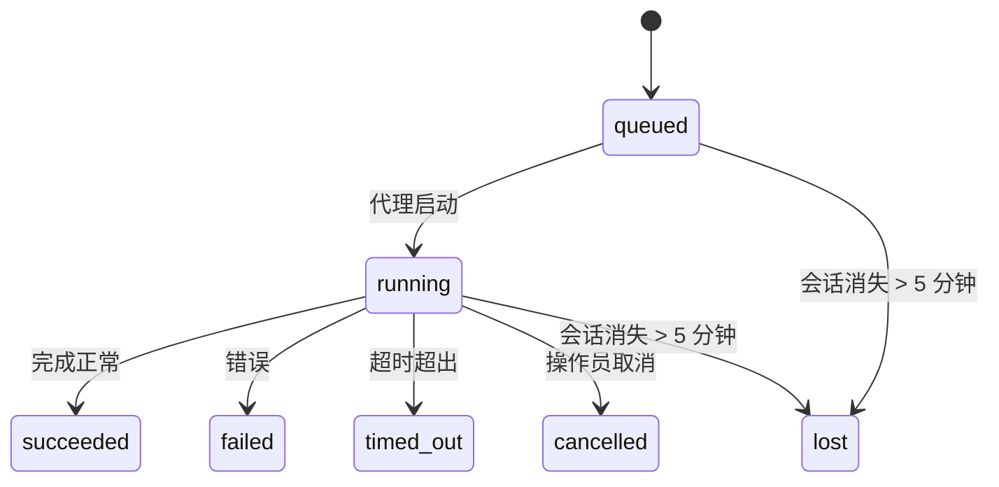

> **在找调度功能？** 请参阅 [Automation & Tasks](/automation)，以选择合适的机制。本页仅介绍后台工作的**跟踪**，不涉及调度。

后台任务跟踪在**主对话会话之外**运行的工作：
ACP 运行、子代理生成、独立 Cron 任务执行和 CLI 发起的操作。

任务**不**替代会话、Cron 任务或心跳——它们是记录分离工作发生了什么、何时发生以及是否成功的**活动账本**。

<Note>
并非每个代理运行都会创建任务。心跳回合和正常交互式聊天不会。所有 Cron 执行、ACP 生成、子代理生成和 CLI 代理命令都会。
</Note>

## 概要

- 任务是**记录**，而非调度器——cron 和心跳决定工作_何时_运行，任务跟踪_发生了什么_。
- ACP、子代理、所有 cron 任务和 CLI 操作都会创建任务。心跳回合不会。
- 每个任务经历 `queued → running → terminal`（成功、失败、超时、取消或丢失）。
- Cron 任务在 cron 运行时仍拥有作业时保持活跃；聊天支持的 CLI 任务仅在其拥有的运行上下文仍活跃时保持活跃。
- 完成是推送驱动的：分离的工作完成后可以直接通知或唤醒请求者会话/心跳，因此状态轮询循环通常是错误的形状。
- 独立 cron 运行和子代理完成会在最终清理记账之前，尽力清理其子会话跟踪的浏览器标签/进程。
- 独立 cron 交付在后端子代理工作仍在排水时抑制过时的临时父回复，并且当最终子代输出在交付前到达时优先选择它。
- 完成通知直接交付到通道或排队等待下次心跳。
- `openclaw tasks list` 显示所有任务；`openclaw tasks audit` 暴露问题。
- 终端记录保留 7 天，然后自动修剪。

## 快速开始

```bash
# 列出所有任务（最新的在前）
openclaw tasks list

# 按运行时或状态过滤
openclaw tasks list --runtime acp
openclaw tasks list --status running

# 显示特定任务的详细信息（通过 ID、运行 ID 或会话密钥）
openclaw tasks show <lookup>

# 取消运行中的任务（杀死子会话）
openclaw tasks cancel <lookup>

# 更改任务的通知策略
openclaw tasks notify <lookup> state_changes

# 运行健康审计
openclaw tasks audit

# 预览或应用维护
openclaw tasks maintenance
openclaw tasks maintenance --apply

# 检查 TaskFlow 状态
openclaw tasks flow list
openclaw tasks flow show <lookup>
openclaw tasks flow cancel <lookup>
```

## 什么创建任务

| 来源                 | 运行时类型 | 何时创建任务记录                          | 默认通知策略 |
| ---------------------- | ------------ | ------------------------------------------------------ | --------------------- |
| ACP 后台运行    | `acp`        | 生成子 ACP 会话                           | `done_only`           |
| 子代理编排 | `subagent`   | 通过 `sessions_spawn` 生成子代理               | `done_only`           |
| Cron 任务（所有类型）  | `cron`       | 每次 cron 执行（主会话和独立）       | `silent`              |
| CLI 操作         | `cli`        | 通过网关运行的 `openclaw agent` 命令 | `silent`              |
| 代理媒体任务       | `cli`        | 会话支持的 `video_generate` 运行                   | `silent`              |

主会话 Cron 任务默认使用 `silent` 通知策略——它们创建记录用于跟踪但不生成通知。独立 Cron 任务也默认为 `silent`，但因为它们在自有会话中运行所以更可见。

会话支持的 `video_generate` 运行也使用 `silent` 通知策略。它们仍然创建任务记录，但完成状态会作为内部唤醒交回给原始代理会话，以便代理可以编写后续消息并附加完成的视频本身。如果你选择了 `tools.media.asyncCompletion.directSend`，异步 `music_generate` 和 `video_generate` 完成会首先尝试直接通道交付，然后再回退到请求者会话唤醒路径。

当会话支持的 `video_generate` 任务仍活跃时，该工具也充当护栏：同一会话中重复的 `video_generate` 调用返回活跃任务状态而不是启动第二个并发生成。当你想要从代理侧进行明确的进度/状态查找时使用 `action: "status"`。

**不创建任务的内容：**

- 心跳回合——主会话；参见 [心跳](/gateway/heartbeat)
- 正常交互式聊天回合
- 直接 `/command` 响应

## 任务生命周期



| 状态      | 含义                                                              |
| ----------- | -------------------------------------------------------------------------- |
| `queued`    | 已创建，等待代理启动                                    |
| `running`   | 代理回合正在积极执行                                           |
| `succeeded` | 成功完成                                                     |
| `failed`    | 完成时出错                                                    |
| `timed_out` | 超出配置的超时时间                                            |
| `cancelled` | 操作员通过 `openclaw tasks cancel` 停止                        |
| `lost`      | 运行时在 5 分钟宽限期后丢失了权威支持状态 |

转换自动发生——当关联的代理运行结束时，任务状态更新以匹配。

`lost` 是运行时感知的：

- ACP 任务：支持的 ACP 子会话元数据消失。
- 子代理任务：支持的子会话从目标代理存储中消失。
- Cron 任务：cron 运行时不再将作业跟踪为活跃。
- CLI 任务：独立子会话任务使用子会话；聊天支持的 CLI 任务使用实时运行上下文，因此遗留的通道/组/直接会话行不会使它们保持活跃。

## 交付和通知

当任务达到终止状态时，OpenClaw 会通知你。有两条交付路径：

**直接交付** — 如果任务有通道目标（`requesterOrigin`），完成消息直接发送到该通道（Telegram, Discord, Slack 等）。对于子代理完成，OpenClaw 还可以在可用时保留绑定的线程/主题路由，并且可以在放弃直接交付之前从请求者会话的存储路由（`lastChannel` / `lastTo` / `lastAccountId`）填充缺失的 `to` / 账户。

**会话排队交付** —— 如果直接交付失败或未设置来源，更新作为系统事件排队在请求者的会话中，并在下次心跳时显示。

<Tip>
任务完成触发立即心跳唤醒，以便你快速看到结果——你不必等待下次计划的心跳滴答。
</Tip>

这意味着通常的工作流是推送式的：启动分离工作一次，然后让运行时在完成时唤醒或通知你。仅当你需要调试、干预或明确审计时才轮询任务状态。

### 通知策略

控制你听到每个任务多少信息：

| 策略                | 交付内容                                                       |
| --------------------- | ----------------------------------------------------------------------- |
| `done_only`（默认） | 仅终止状态（成功、失败等）——**这是默认值** |
| `state_changes`       | 每个状态转换和进度更新                              |
| `silent`              | 无任何内容                                                          |

在任务运行时更改策略：

```bash
openclaw tasks notify <lookup> state_changes
```

## CLI 参考

### `tasks list`

```bash
openclaw tasks list [--runtime <acp|subagent|cron|cli>] [--status <status>] [--json]
```

输出列：任务 ID、种类、状态、交付、运行 ID、子会话、摘要。

### `tasks show`

```bash
openclaw tasks show <lookup>
```

查找令牌接受任务 ID、运行 ID 或会话密钥。显示完整记录包括计时、交付状态、错误和终止摘要。

### `tasks cancel`

```bash
openclaw tasks cancel <lookup>
```

对于 ACP 和子代理任务，这将终止子会话。对于 CLI 跟踪的任务，取消操作记录在任务注册表中（没有单独的子运行时句柄）。状态转换为 `cancelled`，并在适用时发送交付通知。

### `tasks notify`

```bash
openclaw tasks notify <lookup> <done_only|state_changes|silent>
```

### `tasks audit`

```bash
openclaw tasks audit [--json]
```

暴露操作问题。当检测到问题时，发现也会出现在 `openclaw status` 中。

| 发现                   | 严重程度 | 触发条件                                               |
| ------------------------- | ----------------------------------------------------- | ----------------------------------------------------- |
| `stale_queued`            | warn     | 排队超过 10 分钟                       |
| `stale_running`           | error    | 运行超过 30 分钟                      |
| `lost`                    | error    | 运行时支持的任务所有权消失             |
| `delivery_failed`         | warn     | 交付失败且通知策略不是 `silent`     |
| `missing_cleanup`         | warn     | 终端任务无清理时间戳               |
| `inconsistent_timestamps` | warn     | 时间线违规（例如结束早于开始） |

### `tasks maintenance`

```bash
openclaw tasks maintenance [--json]
openclaw tasks maintenance --apply [--json]
```

使用此命令预览或应用任务和任务流状态的对账、清理标记和修剪。

对账是运行时感知的：

- ACP/子代理任务检查其支持的子会话。
- Cron 任务检查 cron 运行时是否仍拥有该作业。
- 聊天支持的 CLI 任务检查拥有的实时运行上下文，而不仅仅是聊天会话行。

完成清理也是运行时感知的：

- 子代理完成会在公告清理继续之前，尽力关闭为子会话跟踪的浏览器标签/进程。
- 独立 cron 完成会在运行完全拆除之前，尽力关闭为 cron 会话跟踪的浏览器标签/进程。
- 独立 cron 交付在需要时会等待后代子代理的后续处理，并且会抑制过时的父级确认文本，而不是公告它。
- 子代理完成交付优先使用最新可见的助手文本；如果为空，则回退到已清理的最新工具/工具结果文本，而仅工具调用且超时的运行可能折叠为简短的部分进度摘要。终端失败运行会公告失败状态，而不会重放捕获的回复文本。
- 清理失败不会掩盖真实的任务结果。

### `tasks flow list|show|cancel`

```bash
openclaw tasks flow list [--status <status>] [--json]
openclaw tasks flow show <lookup> [--json]
openclaw tasks flow cancel <lookup>
```

当你关心的是编排任务流而不是单个后台任务记录时使用这些命令。

## 聊天任务板（`/tasks`）

在任何聊天会话中使用 `/tasks` 查看与该会话关联的后台任务。任务板显示活动和最近完成的任务，包括运行时、状态、计时以及进度或错误详情。

当当前会话没有可见的关联任务时，`/tasks` 会回退到代理本地任务计数，这样你仍然可以获得概览而不会泄露其他会话的详情。

如需完整的操作员账本，请使用 CLI：`openclaw tasks list`。

## 状态集成（任务压力）

`openclaw status` 包括一目了然的任务摘要：

```
任务：3 queued · 2 running · 1 问题
```

摘要报告：

- **active** — `queued` + `running` 的计数
- **failures** — `failed` + `timed_out` + `lost` 的计数
- **byRuntime** — 按 `acp`, `subagent`, `cron`, `cli` 分解

`/status` 和 `session_status` 工具都使用感知清理的任务快照：优先显示活动任务，隐藏过期的完成行，并且仅在没有活动工作时才显示最近的失败。这使得状态卡片专注于当前重要的内容。

## 存储和维护

### 任务存放位置

任务记录持久化在 SQLite 中：

```
$OPENCLAW_STATE_DIR/tasks/runs.sqlite
```

注册表在网关启动时加载到内存中，并将写入同步到 SQLite 以跨重启持久化。

### 自动维护

清理程序每 **60 秒** 运行一次，处理三件事：

1. **一致性检查** — 检查活动任务是否仍拥有权威的运行时支持。ACP/子代理任务使用子会话状态，Cron 任务使用活动作业所有权，基于聊天的 CLI 任务使用所属运行上下文。如果该支持状态丢失超过 5 分钟，任务将被标记为 `lost`。
2. **清理标记** — 在终端任务上设置 `cleanupAfter` 时间戳（`endedAt` + 7 天）。
3. **修剪** — 删除超过 `cleanupAfter` 日期的记录。

**保留**：终止任务记录保留 **7 天**，然后自动修剪。无需配置。

## 任务如何与其他系统关联

### 任务与任务流

[任务流](/automation/taskflow) 是后台任务之上的流编排层。单个流在其生命周期内可以使用托管或镜像同步模式协调多个任务。使用 `openclaw tasks` 检查单个任务记录，使用 `openclaw tasks flow` 检查编排流。

详见 [任务流](/automation/taskflow)。

### 任务与 Cron

A cron job **definition** lives in `~/.openclaw/cron/jobs.json`; runtime execution state lives beside it in `~/.openclaw/cron/jobs-state.json`. **Every** cron execution creates a task record — both main-session and isolated. Main-session cron tasks default to `silent` notify policy so they track without generating notifications.

参见 [Cron 任务](/automation/cron-jobs)。

### 任务与心跳

心跳运行是主会话回合——它们不创建任务记录。当任务完成时，它可以触发心跳唤醒以便你及时看到结果。

参见 [心跳](/gateway/heartbeat)。

### 任务与会话

任务可能引用 `childSessionKey`（工作运行处）和 `requesterSessionKey`（谁启动的）。会话是对话上下文；任务是在此之上的活动跟踪。

### 任务与代理运行

任务的 `runId` 链接到执行工作的代理运行。代理生命周期事件（开始、结束、错误）自动更新任务状态——你无需手动管理生命周期。

## 相关内容

- [Automation & Tasks](/automation) — 所有自动化机制一览
- [Task Flow](/automation/taskflow) — 位于任务之上的流编排
- [Scheduled Tasks](/automation/cron-jobs) — 调度后台工作
- [Heartbeat](/gateway/heartbeat) — 定期主会话回合
- [CLI: Tasks](/cli/tasks) — CLI 命令参考
