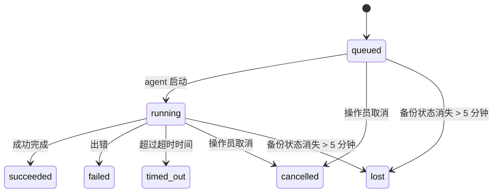

<Note>
在找调度功能？请参阅 [自动化](/automation) 以选择合适的机制。本页是后台工作的活动台账，而不是调度器。
</Note>

后台任务跟踪在**主对话会话之外**运行的工作：ACP 运行、子代理启动、cron 作业执行以及由 CLI 触发的操作。

任务并不**替代**会话、cron 作业或 heartbeat——它们是**活动台账**，用于记录发生了什么分离运行、何时发生，以及是否成功。

<Note>
并非每次代理运行都会创建任务。Heartbeat 回合和正常的交互式聊天不会。所有 cron 执行、ACP 启动、子代理启动以及由网关分发的 CLI 代理命令都会创建。
</Note>

## TL;DR

- 任务是**记录**，不是调度器——cron 和 heartbeat 决定 _何时_ 执行工作，任务则记录 _发生了什么_。
- ACP、subagents、所有 cron 作业以及 CLI 操作都会创建任务。Heartbeat turn 不会。
- 每个任务都会经历 `queued → running → terminal`（succeeded、failed、timed_out、cancelled 或 lost）。
- 只要 cron 运行时仍持有该作业，cron 任务就会保持活跃；如果内存中的运行时状态已消失，任务维护会先检查持久化的 cron 运行历史，再将任务标记为 lost。
- 完成是推送驱动的：分离的工作完成后可以直接通知，或唤醒请求者会话/heartbeat，因此状态轮询循环通常不是合适的模式。
- 隔离的 cron 运行和 subagent 完成会尽力在最终清理记录之前，清理其子会话所跟踪的浏览器标签页/进程。
- 隔离的 cron 投递会在后代 subagent 工作仍在收尾时，抑制过时的中间父级回复；如果最终后代输出在投递前到达，它会优先使用该最终输出。
- 完成通知会直接投递到通道，或排队到下一次 heartbeat。
- `openclaw tasks list` 显示所有任务；`openclaw tasks audit` 会暴露问题。
- 终态记录会保留 7 天（`lost` 记录保留 24 小时），然后自动清理。

## 快速开始

<Tabs>
  <Tab title="列出和筛选">
    ```bash
    # 列出所有任务（最新优先）
    openclaw tasks list

    # 按运行时或状态筛选
    openclaw tasks list --runtime acp
    openclaw tasks list --status running
    ```

  </Tab>
  <Tab title="检查">
    ```bash
    # 显示某个特定任务的详细信息（按任务 ID、运行 ID 或会话键）
    openclaw tasks show <lookup>
    ```
  </Tab>
  <Tab title="取消和通知">
    ```bash
    # 取消一个正在运行的任务（会终止子会话）
    openclaw tasks cancel <lookup>

    # 更改某个任务的通知策略
    openclaw tasks notify <lookup> state_changes
    ```

  </Tab>
  <Tab title="审计和维护">
    ```bash
    # 运行健康审计
    openclaw tasks audit

    # 预览或应用维护
    openclaw tasks maintenance
    openclaw tasks maintenance --apply
    ```

  </Tab>
  <Tab title="任务流">
    ```bash
    # 检查 TaskFlow 状态
    openclaw tasks flow list
    openclaw tasks flow show <lookup>
    openclaw tasks flow cancel <lookup>
    ```
  </Tab>
</Tabs>

## 什么会创建任务

| 来源                   | 运行时类型 | 创建任务记录的时机                                         | 默认通知策略 |
| ---------------------- | ---------- | ---------------------------------------------------------- | ------------ |
| ACP 后台运行            | `acp`      | 启动一个子 ACP 会话                                        | `done_only`  |
| 子代理编排              | `subagent` | 通过 `sessions_spawn` 启动子代理                          | `done_only`  |
| Cron 作业（所有类型）   | `cron`     | 每次 cron 执行（主会话和隔离会话）                        | `silent`     |
| CLI 操作                | `cli`      | 通过网关运行的 `openclaw agent` 命令                      | `silent`     |
| 代理媒体任务            | `cli`      | 由会话支持的 `image_generate`/`music_generate`/`video_generate` 运行 | `silent`     |

<AccordionGroup>
  <Accordion title="Cron 和媒体的默认通知">
    Cron 任务（主会话和隔离会话）使用 `silent` 通知策略——它们会创建记录用于跟踪，但不会自行生成任务通知；cron 自身负责其交付路径。

    基于会话的 `image_generate`、`music_generate` 和 `video_generate` 运行也使用 `silent` 通知策略。它们仍然会创建任务记录，但完成会作为一次内部唤醒交回原始代理会话，以便代理可以写出后续消息并自行附加已完成的媒体内容。请求者代理遵循其正常的可见回复约定：在配置时自动发送最终回复，或者在会话要求使用消息工具回复时使用 `message(action="send")` 加 `NO_REPLY`。如果请求者会话不再活跃，或者其活动唤醒失败，并且完成代理遗漏了部分或全部生成的媒体，OpenClaw 会向原始通道目标发送一次幂等的直接回退，仅包含缺失的媒体。

  </Accordion>
  <Accordion title="并发媒体生成保护机制">
    当一个基于会话的媒体生成任务仍在进行中时，`image_generate`、`music_generate` 和 `video_generate` 会防止意外重试：对同一提示/请求重复调用会返回匹配的活动任务状态，而不会启动重复任务；而不同的提示可以启动各自的任务。当你希望从代理侧显式查询进度/状态时，请使用 `action: "status"`。
  </Accordion>
  <Accordion title="哪些情况不会创建任务">
    - 心跳回合——主会话；请参阅 [Heartbeat](/gateway/heartbeat)
    - 普通的交互式聊天回合
    - 直接 `/command` 响应

  </Accordion>
</AccordionGroup>

## 任务生命周期



| 状态         | 含义                                                                         |
| ------------ | ---------------------------------------------------------------------------- |
| `queued`     | 已创建，等待 agent 启动                                                       |
| `running`    | agent 回合正在执行中                                                          |
| `succeeded`  | 已成功完成                                                                  |
| `failed`     | 以错误结束                                                                  |
| `timed_out`  | 超过了已配置的超时时间                                                       |
| `cancelled`  | 由操作员通过 `openclaw tasks cancel` 停止，或运行已被中止                     |
| `lost`       | 在 5 分钟宽限期后，运行时失去了权威备份状态                                   |

状态迁移会自动发生——agent 运行生命周期事件（开始、结束、出错）会更新任务状态；你无需手动管理。

对于活跃的任务记录，agent 运行完成结果具有权威性。成功的分离运行会最终归类为 `succeeded`，普通运行错误会最终归类为 `failed`，超时会最终归类为 `timed_out`，取消/中止结果会最终归类为 `cancelled`。一旦任务进入终态，后续的生命周期信号不会将其降级——即使之后收到成功信号，已被操作员取消或已经处于 `failed`/`timed_out`/`lost` 的任务也会保持原状态。

`lost` 具有运行时感知：

- ACP 任务：只有 Gateway 中一个存活的、进程内的 ACP 回合才能证明运行仍然存活；仅有持久化的会话元数据并不足以证明。离线 CLI 审计会保持保守，不会回收 ACP 任务。
- 子 agent 任务：目标 agent 存储中的备份子会话已消失（或带有 restart-recovery 墓碑标记）。
- Cron 任务：cron 运行时不再将该作业视为活跃，并且持久化的 cron 运行历史没有显示该运行的终态结果。离线 CLI 审计不会把自身空的进程内 cron 运行时状态视为权威。
- CLI 任务：带有 run id/source id 的任务使用实时运行上下文，因此当 Gateway 拥有的运行消失后，残留的子会话或聊天会话行不会让它们继续存活。没有运行身份的旧版 CLI 任务仍会回退到子会话。由 Gateway 支持的 `openclaw agent` 运行也会依据其运行结果最终归类，因此已完成的运行不会一直保持活跃，直到 sweeper 将其标记为 `lost`。

## 投递和通知

当任务到达终态时，OpenClaw 会通知你。投递路径有两种：

**直接投递** - 如果任务具有一个频道目标（`requesterOrigin`），完成消息会直接发送到该频道（Discord、Slack、Telegram 等）。对于组和频道任务的完成结果，则会改为通过请求者会话路由，这样父代理就可以写入可见回复。对于子代理完成，OpenClaw 还会在可用时保留绑定的线程/主题路由，并且在放弃直接投递之前，可以从请求者会话存储的路由（`lastChannel` / `lastTo` / `lastAccountId`）中补全缺失的 `to` / account。

**会话排队投递**——如果直接投递失败或未设置来源，该更新会作为系统事件排入请求者会话，并在下一次 heartbeat 时显示。

<Tip>
会话排队的任务完成会触发一次即时 heartbeat 唤醒，因此你会很快看到结果——不必等待下一次计划中的 heartbeat tick。
</Tip>

这意味着通常的工作流是推送式的：先启动一次分离的工作，然后让运行时在完成时唤醒或通知你。只有在需要调试、干预，或进行明确审计时，才轮询任务状态。

### 通知策略

控制你从每个任务中接收到多少信息：

| Policy                | What is delivered                                       |
| -------------------- | ------------------------------------------------------- |
| `done_only` (default) | 仅终态（成功、失败等）                                    |
| `state_changes`       | 每一次状态转换和进度更新                                 |
| `silent`              | 完全不发送任何内容（cron、CLI 和媒体任务的默认值）         |

在任务运行期间更改通知策略：

```bash
openclaw tasks notify <lookup> state_changes
```

## CLI 参考

<AccordionGroup>
  <Accordion title="tasks list">
    ```bash
    openclaw tasks list [--runtime <acp|subagent|cron|cli>] [--status <status>] [--json]
    ```

    输出列：Task、Kind、Status、Delivery、Run、Child Session、Summary。直接输入 `openclaw tasks` 的行为与 `openclaw tasks list` 相同。

  </Accordion>
  <Accordion title="tasks show">
    ```bash
    openclaw tasks show <lookup> [--json]
    ```

    查找令牌可以接受 task ID、run ID 或 session key。显示完整记录，包括计时、传递状态、错误和终端摘要。

  </Accordion>
  <Accordion title="tasks cancel">
    ```bash
    openclaw tasks cancel <lookup>
    ```

    对于 ACP 和 subagent 任务，这会终止子会话；ACP 和 cron 的取消会通过正在运行的 Gateway（`tasks.cancel`）路由。对于 CLI 跟踪的任务，取消会记录到任务注册表中（没有单独的子运行时句柄）。状态会转换为 `cancelled`，并在适用时发送传递通知。

  </Accordion>
  <Accordion title="tasks notify">
    ```bash
    openclaw tasks notify <lookup> <done_only|state_changes|silent>
    ```
  </Accordion>
  <Accordion title="tasks audit">
    ```bash
    openclaw tasks audit [--severity <warn|error>] [--code <name>] [--limit <n>] [--json]
    ```

    在一份报告中同时展示任务和 TaskFlow 的运行问题。检测到问题时，这些发现也会出现在 `openclaw status` 中。

    Task 发现项：

    | 发现项                    | 严重性     | 触发条件                                                                                                      |
    | ------------------------- | ---------- | ------------------------------------------------------------------------------------------------------------ |
    | `stale_queued`            | warn       | 排队超过 10 分钟                                                                                             |
    | `stale_running`           | error      | 运行超过 30 分钟                                                                                             |
    | `lost`                    | warn/error | 由运行时支持的任务所有权消失；保留的 lost 任务在 `cleanupAfter` 之前显示为警告，之后变为错误                  |
    | `delivery_failed`         | warn       | 传递失败且通知策略不是 `silent`                                                                              |
    | `missing_cleanup`         | warn       | 终态任务缺少 cleanup 时间戳                                                                                  |
    | `inconsistent_timestamps` | warn       | 时间线违规（例如结束时间早于开始时间）                                                                       |

    TaskFlow 发现项：

    | 发现项                  | 严重性     | 触发条件                                                                  |
    | ---------------------- | ---------- | --------------------------------------------------------------------------- |
    | `restore_failed`       | error      | 从 SQLite 恢复 Flow 注册表失败                                               |
    | `stale_running`        | error      | 运行中的 flow 超过 30 分钟未推进                                              |
    | `stale_waiting`        | warn       | 等待中的 flow 超过 30 分钟未推进                                              |
    | `stale_blocked`        | warn       | 被阻塞的 flow 超过 30 分钟未推进                                              |
    | `cancel_stuck`         | warn       | 距离取消请求已超过 5 分钟、没有活动子任务，且仍非终态                             |
    | `missing_linked_tasks` | warn/error | 长期未推进的托管 flow 没有链接任务或等待状态                                     |
    | `blocked_task_missing` | warn       | 被阻塞的 flow 指向一个已不存在的 task id                                     |

  </Accordion>
  <Accordion title="tasks maintenance">
    ```bash
    openclaw tasks maintenance [--json]
    openclaw tasks maintenance --apply [--json]
    ```

    用于预览或应用任务、TaskFlow 状态以及过期 cron 运行会话注册表行的协调修复、清理打标和剪枝。

    协调修复感知运行时：

    - ACP 任务要求 Gateway 中存在一个活跃的进程内回合；subagent 任务会检查其对应的子会话。
    - 其子会话带有 restart-recovery tombstone 的 subagent 任务会被标记为 lost，而不会被视为可恢复的后备会话。
    - Cron 任务会检查 cron 运行时是否仍拥有该作业，然后先从持久化的 cron 运行日志/作业状态中恢复终态，之后才回退到 `lost`。只有 Gateway 进程对内存中的 cron 活动作业集合具有权威性；离线 CLI 审计会使用持久化历史记录，但不会仅因为本地集合为空就将 cron 任务标记为 lost。
    - 带有运行标识的 CLI 任务会检查其所属的活动运行上下文，而不仅仅是子会话或聊天会话行。

    完成清理同样感知运行时：

    - 子代理完成会尽力在清理公告继续之前，为子会话关闭已跟踪的浏览器标签页/进程。
    - 隔离 cron 完成会尽力在运行完全拆解之前，为 cron 会话关闭已跟踪的浏览器标签页/进程。
    - 隔离 cron 投递在需要时会等待后代子代理的后续工作，并抑制过时的父级确认文本，而不是直接公告它。
    - 子代理完成投递仅使用子级最近可见的助手文本。工具/工具结果输出不会被提升为子级结果文本。终态失败运行会公告失败状态，而不会回放捕获到的回复文本。
    - 清理失败不会掩盖真实的任务结果。

    应用维护时，OpenClaw 还会移除超过 7 天的过期 `cron:<jobId>:run:<runId>` 会话注册表行，同时保留当前正在运行的 cron 作业对应的行，并且不影响非 cron 的会话行。

  </Accordion>
  <Accordion title="tasks flow list | show | cancel">
    ```bash
    openclaw tasks flow list [--status <status>] [--json]
    openclaw tasks flow show <lookup> [--json]
    openclaw tasks flow cancel <lookup>
    ```

    flow 查找令牌可以接受 flow id 或 owner key。当你关心的是编排的 [Task Flow](/automation/taskflow) 本身，而不是某一条单独的后台任务记录时，请使用这些命令。

  </Accordion>
</AccordionGroup>

## 聊天任务面板（`/tasks`）

在任何聊天会话中使用 `/tasks`，即可查看与该会话关联的后台任务。该面板最多显示五个正在运行和最近完成的任务，并包含运行时间、状态、时序以及进度或错误详情。

当当前会话没有可见的关联任务时，`/tasks` 会回退到 agent 本地任务计数，因此你仍能获得概览，而不会泄露其他会话的详情。

如需完整的操作员账本，请使用 CLI：`openclaw tasks list`。

## 状态集成（任务压力）

`openclaw status` 包含一行一目了然的任务概览：

```
Tasks    2 active · 1 queued · 1 running · 1 issue · audit clean · 6 tracked
```

汇总会统计活跃工作（`queued` + `running`）、失败（`failed` + `timed_out` + `lost`）、审计发现以及已跟踪记录总数；JSON 负载还会按运行时（`acp`、`subagent`、`cron`、`cli`）细分统计。

`/status` 和 `session_status` 工具都使用一种具备清理感知的任务快照：优先显示活跃任务，隐藏已过期的行，终态任务仅会在最近的短时间窗口内显示（5 分钟），当没有活跃工作时则聚焦失败任务。这让状态卡片始终聚焦于当前最重要的内容。

## 存储与维护

### 任务存放位置

任务记录和交付状态保存在共享的 OpenClaw SQLite 状态数据库中：

```
~/.openclaw/state/openclaw.sqlite   (tables: task_runs, task_delivery_state, flow_runs)
```

将 `OPENCLAW_STATE_DIR` 设置为其他位置，可以移动整个状态根目录（默认是 `~/.openclaw`）；共享数据库路径也会随之移动。

注册表会在首次使用时加载到内存，并将每次写入持久化回 SQLite，因此即使网关重启，记录也会保留。WAL 增长会通过 SQLite 默认的自动检查点阈值以及周期性的 `PASSIVE` 检查点保持在有限范围内；关闭时和显式维护检查点会使用 `TRUNCATE`，这样正常关闭就能回收 WAL 空间，而不会让后台清理程序等待活跃读者。

旧版安装中的遗留旁路存储（`tasks/runs.sqlite`、`flows/registry.sqlite`）会由 `openclaw doctor` 导入到共享数据库中。

### 自动维护

清理程序每 **60 秒** 运行一次（第一次大约在网关启动后 5 秒），并处理四件事：

<Steps>
  <Step title="Reconciliation">
    检查活跃任务是否仍有权威运行支撑。ACP 任务需要一个存活的进程内轮次，子代理任务使用子会话状态，cron 任务使用活跃作业所有权加持久化运行历史，而带有运行标识的 CLI 任务则使用所属运行上下文。如果支撑状态消失超过 5 分钟（无子任务的原生子代理任务为 30 分钟），该任务会被标记为 `lost`。
  </Step>
  <Step title="ACP 会话修复">
    关闭终态或孤立的、由父级拥有的一次性 ACP 会话，并且只有在不再存在活跃会话绑定时，才关闭过期终态或孤立的持久 ACP 会话。
  </Step>
  <Step title="Cleanup stamping">
    为终态任务设置一个 `cleanupAfter` 时间戳（终态时间 + 保留窗口）。在保留期内，丢失的任务仍会在审计中显示为警告；在 `cleanupAfter` 过期后，或者缺少清理元数据时，它们会变成错误。
  </Step>
  <Step title="裁剪">
    删除超过其 `cleanupAfter` 日期的记录。
  </Step>
</Steps>

<Note>
**保留策略：** 终态任务记录会保留 **7 天**（`lost` 记录保留 **24 小时**），然后自动清理。无需配置。
</Note>

## How Tasks Relate to Other Systems

<AccordionGroup>
  <Accordion title="Tasks and Task Flows">
    [Task Flow](/automation/taskflow) is the orchestration layer above background tasks. A single flow can coordinate multiple tasks in hosted or mirrored synchronous mode throughout its lifecycle. Use `openclaw tasks` to view individual task records, and `openclaw tasks flow` to view orchestration flows.

  </Accordion>
  <Accordion title="Tasks and cron">
    Cron job definitions, runtime execution state, and run history live in OpenClaw's shared SQLite state database. **Every** cron execution creates a task record - both main-session and isolated - with `silent` notify policy, so cron runs are tracked without generating task notifications of their own.

    See [Cron Jobs](/automation/cron-jobs) for details.

  </Accordion>
  <Accordion title="Tasks and heartbeat">
    Heartbeat runs are main-session turns—they do not create task records. When a task completes, it can trigger a heartbeat wake-up so you can see the result promptly.

    See [Heartbeat](/gateway/heartbeat) for details.

  </Accordion>
  <Accordion title="Tasks and sessions">
    Tasks may reference `childSessionKey` (where the work runs) and `requesterSessionKey` (who started it). Its `agentId` identifies the agent performing the work, while the requester and owner fields preserve the start and control context. Sessions are conversational context; tasks are activity tracking built on top of it.
  </Accordion>
  <Accordion title="Tasks and Agent runs">
    A task's `runId` connects to the agent run executing the work. Agent lifecycle events (start, end, error) automatically update task status—you don't need to manage the lifecycle manually.
  </Accordion>
</AccordionGroup>

## 相关内容

- [自动化](/automation) - 所有自动化机制一览
- [CLI：任务](/cli/tasks) - CLI 命令参考
- [Heartbeat](/gateway/heartbeat) - 周期性的主会话轮次
- [计划任务](/automation/cron-jobs) - 调度后台工作
- [任务流](/automation/taskflow) - 位于任务之上的流程编排
