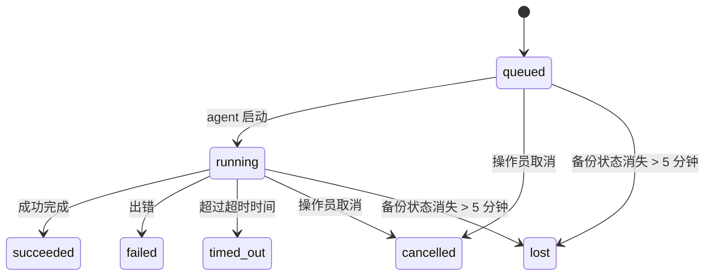

<Note>
在找调度功能？请参阅 [自动化](/automation) 以选择合适的机制。本页是后台工作的活动台账，而不是调度器。
</Note>

后台任务跟踪在**主会话之外**运行的工作：ACP 运行、子代理启动、自动化作业运行以及由 CLI 发起的操作。

任务不会取代会话、自动化或心跳——它们是记录分离式工作发生了什么、何时发生以及是否成功的**活动台账**。

对于在 CI 或脚本中进行的严格、短暂的一次性代理运行，请使用 [`openclaw agent exec`](/cli/agent#agent-exec)，而不是受管理的后台工作。

<Note>
并非每次代理运行都会创建任务。心跳轮次和正常的交互式聊天不会创建任务。所有自动化运行、ACP 启动、子代理启动、网关分发的 CLI 代理命令以及由代理启动的后台 `exec` 命令都会创建任务。
</Note>

## TL;DR

- 任务是**记录**，而不是调度器——自动化和心跳决定工作_何时_运行，任务记录_发生了什么_。
- ACP、子代理、所有自动化作业和 CLI 操作都会创建任务。心跳轮次不会。
- 每个任务都会经历 `queued → running → terminal`（succeeded、failed、timed_out、cancelled 或 lost）。
- 当自动化运行时仍拥有该作业时，自动化任务会保持活动状态；如果内存中的运行时状态消失，任务维护会先检查持久化的自动化运行历史，然后再将任务标记为 lost。
- 完成通知由推送驱动：分离运行的工作完成时可以直接发送通知，或唤醒请求方会话/心跳，因此状态轮询循环通常不是正确的实现方式。
- 隔离的自动化运行和子代理完成时，会尽力在最终清理记录前，为其子会话清理已跟踪的浏览器标签页/进程。
- 隔离的自动化交付会在后代子代理工作仍在处理时，抑制过时的中间父级回复；如果后代输出在交付前到达，则优先使用最终的后代输出。
- 完成通知会直接发送到某个频道，或排队等待下一次心跳。
- `openclaw tasks list` 显示所有任务；`openclaw tasks audit` 显示相关问题。
- 终止状态的记录会保留 7 天（`lost` 记录保留 24 小时），之后会自动清理。

## 快速开始

<Tabs>
  <Tab title="列出和筛选">
    ```bash
    # 列出所有任务（最新优先）
    openclaw tasks list

    # 按运行时或状态筛选
    openclaw tasks list --runtime acp
    openclaw tasks list --status running
    ```

  </Tab>
  <Tab title="检查">
    ```bash
    # 显示某个特定任务的详细信息（按任务 ID、运行 ID 或会话键）
    openclaw tasks show <lookup>
    ```
  </Tab>
  <Tab title="取消和通知">
    ```bash
    # 取消一个正在运行的任务（会终止子会话）
    openclaw tasks cancel <lookup>

    # 更改某个任务的通知策略
    openclaw tasks notify <lookup> state_changes
    ```

  </Tab>
  <Tab title="恢复交付">
    ```bash
    # 重试或忽略最多 10 个被阻塞的完成交付
    openclaw tasks retry <lookup> [lookup...]
    openclaw tasks dismiss <lookup> [lookup...]
    ```

  </Tab>
  <Tab title="审计和维护">
    ```bash
    # 运行健康审计
    openclaw tasks audit

    # 预览或应用维护
    openclaw tasks maintenance
    openclaw tasks maintenance --apply
    ```

  </Tab>
  <Tab title="任务流">
    ```bash
    # 检查任务流状态
    openclaw tasks flow list
    openclaw tasks flow show <lookup>
    openclaw tasks flow cancel <lookup>
    ```
  </Tab>
</Tabs>

## 什么会创建任务

| 来源                       | 运行时类型   | 创建任务记录的时机                                                   | 默认通知策略 |
| -------------------------- | ------------ | -------------------------------------------------------------------- | ------------ |
| ACP 后台运行               | `acp`        | 启动子 ACP 会话                                                     | `done_only`  |
| 子代理编排                 | `subagent`   | 通过 `sessions_spawn` 启动子代理                                   | `done_only`  |
| 自动化任务（所有类型）     | `cron`       | 每次自动化运行（主会话和隔离会话）                                 | `silent`     |
| CLI 操作                   | `cli`        | 通过网关运行的 `openclaw agent` 命令                               | `silent`     |
| 代理媒体任务               | `cli`        | 基于会话的 `image_generate`/`music_generate`/`video_generate` 运行 | `silent`     |

<AccordionGroup>
  <Accordion title="自动化和媒体的通知默认设置">
    自动化任务（主会话和隔离会话）使用 `silent` 通知策略——它们会创建记录用于跟踪，但不会自行生成任务通知；调度器负责其投递路径。

    基于会话的 `image_generate`、`music_generate` 和 `video_generate` 运行也使用 `silent` 通知策略。它们仍然会创建任务记录，但完成会作为一次内部唤醒交回原始代理会话，以便代理可以写出后续消息并自行附加已完成的媒体内容。请求者代理遵循其正常的可见回复约定：在配置时自动发送最终回复，或者在会话要求使用消息工具回复时使用 `message(action="send")` 加 `NO_REPLY`。如果请求者会话不再活跃，或者其活动唤醒失败，并且完成代理遗漏了部分或全部生成的媒体，OpenClaw 会向原始通道目标发送一次幂等的直接回退，仅包含缺失的媒体。

  </Accordion>
  <Accordion title="并发媒体生成保护机制">
    当一个基于会话的媒体生成任务仍在进行中时，`image_generate`、`music_generate` 和 `video_generate` 会防止意外重试：对同一提示/请求重复调用会返回匹配的活动任务状态，而不会启动重复任务；而不同的提示可以启动各自的任务。当你希望从代理侧显式查询进度/状态时，请使用 `action: "status"`。
  </Accordion>
  <Accordion title="哪些情况不会创建任务">
    - 心跳回合——主会话；请参阅 [Heartbeat](/gateway/heartbeat)
    - 普通的交互式聊天回合
    - 直接 `/command` 响应

  </Accordion>
</AccordionGroup>

## 任务生命周期



| 状态         | 含义                                                                         |
| ------------ | ---------------------------------------------------------------------------- |
| `queued`     | 已创建，等待 agent 启动                                                       |
| `running`    | agent 回合正在执行中                                                          |
| `succeeded`  | 已成功完成                                                                  |
| `failed`     | 以错误结束                                                                  |
| `timed_out`  | 超过了已配置的超时时间                                                       |
| `cancelled`  | 由操作员通过 `openclaw tasks cancel` 停止，或运行已被中止                     |
| `lost`       | 在 5 分钟宽限期后，运行时失去了权威备份状态                                   |

状态迁移会自动发生——agent 运行生命周期事件（开始、结束、出错）会更新任务状态；你无需手动管理。

执行和结果交付是分开的。子 agent 任务可以保持为
`succeeded`，而其 `deliveryStatus` 为 `session_queued` 或 `failed`。交付完成后，最终结果为
`succeeded`；如果工作已完成但结果无法传回，则为 `blocked`。这样可以保留已完成的
结果，而不会将子任务执行错误地报告为失败。

agent 运行完成状态是活动任务记录的权威依据。成功的分离运行最终状态为
`succeeded`，普通运行错误最终状态为 `failed`，超时最终状态为 `timed_out`，取消/中止结果最终状态为
`cancelled`。任务进入终态后，后续的生命周期信号不会将其降级——由操作员取消或已经处于
`failed`/`timed_out`/`lost` 状态的任务会保持不变，即使之后收到成功信号也是如此。

`lost` 具有运行时感知：

- ACP 任务：只有 Gateway 中正在运行的进程内 ACP 回合才能证明运行仍然存活；仅持久化的会话元数据不能证明这一点。离线 CLI 审计保持保守，不会回收 ACP 任务。
- 子 agent 任务：目标 agent 存储中的后备子会话已消失（或带有重启恢复墓碑）。
- 自动化任务：自动化运行时不再将该作业跟踪为活动状态，并且持久化运行历史没有显示该运行的终态结果。离线 CLI 审计不会将其自身进程内自动化运行时的空状态视为权威依据。
- CLI 任务：具有运行 ID/来源 ID 的任务使用实时运行上下文，因此当 Gateway 所有的运行消失后，残留的子会话或聊天会话记录不会使其继续保持活动状态。没有运行标识的旧版 CLI 任务仍会回退到子会话。由 Gateway 支持的 `openclaw agent` 运行也会根据其运行结果完成，因此已完成的运行不会一直处于活动状态，直到清理器将其标记为 `lost`。

## 投递和通知

当任务到达终态时，OpenClaw 会通知你。投递路径有两种：

**直接投递** - 如果任务具有一个频道目标（`requesterOrigin`），完成消息会直接发送到该频道（Discord、Slack、Telegram 等）。对于组和频道任务的完成结果，则会改为通过请求者会话路由，这样父代理就可以写入可见回复。对于子代理完成，OpenClaw 还会在可用时保留绑定的线程/主题路由，并且在放弃直接投递之前，可以从请求者会话存储的路由（`lastChannel` / `lastTo` / `lastAccountId`）中补全缺失的 `to` / account。

**会话排队投递**——如果直接投递失败或未设置来源，该更新会作为系统事件排入请求者会话，并在下一次 heartbeat 时显示。

持久化的子代理完成交接会在最长 30 分钟内重试，并采用封顶的指数退避策略。排队中的交接只有在队列处理完成后才会被报告为已投递。如果投递达到截止期限或永久失败，任务会显示为阻塞的终态结果，并将其规范结果保留 7 天。使用 `openclaw tasks retry` 创建一个受隔离的新投递代次，或使用 `openclaw tasks dismiss` 记录有意不投递。重试可能会在较早的提供商确认结果不明确时，导致可见结果重复。

<Tip>
会话排队的任务完成会触发一次即时 heartbeat 唤醒，因此你会很快看到结果——不必等待下一次计划中的 heartbeat tick。
</Tip>

这意味着通常的工作流是推送式的：先启动一次分离的工作，然后让运行时在完成时唤醒或通知你。只有在需要调试、干预，或进行明确审计时，才轮询任务状态。

### 通知策略

控制你从每个任务中接收到多少信息：

| Policy                | What is delivered                                             |
| --------------------- | ------------------------------------------------------------- |
| `done_only` (default) | Only terminal state (succeeded, failed, etc.)                 |
| `state_changes`       | Every state transition and progress update                    |
| `silent`              | Nothing at all (default for automation, CLI, and media tasks) |

在任务运行期间更改通知策略：

```bash
openclaw tasks notify <lookup> state_changes
```

## CLI 参考

<AccordionGroup>
  <Accordion title="任务列表">
    ```bash
    openclaw tasks list [--runtime <acp|subagent|cron|cli>] [--status <status>] [--json]
    ```

    输出列：任务、类型、状态、传递、运行、子会话、摘要。直接输入 `openclaw tasks` 的行为与 `openclaw tasks list` 相同。

  </Accordion>
  <Accordion title="任务详情">
    ```bash
    openclaw tasks show <lookup> [--json]
    ```

    查找令牌可以接受 task ID、run ID 或 session key。显示完整记录，包括计时、传递状态、错误和终端摘要。

  </Accordion>
  <Accordion title="取消任务">
    ```bash
    openclaw tasks cancel <lookup>
    ```

    对于 ACP 和 subagent 任务，此操作会终止子会话；ACP 和自动化任务的取消操作通过运行中的 Gateway（`tasks.cancel`）执行。对于 CLI 跟踪的任务，取消操作会记录在任务注册表中（不存在单独的子运行时句柄）。状态会转换为 `cancelled`，并在适用时发送传递通知。

  </Accordion>
  <Accordion title="tasks retry | dismiss">
    ```bash
    openclaw tasks retry <lookup> [lookup...]
    openclaw tasks dismiss <lookup> [lookup...]
    ```

    这些命令用于恢复被阻塞的 subagent 完成传递。每个请求接受 1-10 个任务查找令牌。重试会保留规范结果，并启动新的隔离队列生成；dismiss 会保持任务阻塞状态，并记录操作员已主动停止传递。

  </Accordion>
  <Accordion title="任务通知">
    ```bash
    openclaw tasks notify <lookup> <done_only|state_changes|silent>
    ```
  </Accordion>
  <Accordion title="任务审计">
    ```bash
    openclaw tasks audit [--severity <warn|error>] [--code <name>] [--limit <n>] [--json]
    ```

    在一份报告中同时展示任务和 TaskFlow 的运行问题。检测到问题时，这些发现也会出现在 `openclaw status` 中。

    Task 发现项：

    | 发现项                    | 严重性     | 触发条件                                                                                                      |
    | ------------------------- | ---------- | ------------------------------------------------------------------------------------------------------------ |
    | `stale_queued`            | warn       | 排队超过 10 分钟                                                                                             |
    | `stale_running`           | error      | 运行超过 30 分钟                                                                                             |
    | `lost`                    | warn/error | 由运行时支持的任务所有权消失；保留的 lost 任务在 `cleanupAfter` 之前显示为警告，之后变为错误                  |
    | `delivery_failed`         | warn       | 传递失败且通知策略不是 `silent`                                                                              |
    | `missing_cleanup`         | warn       | 终态任务缺少 cleanup 时间戳                                                                                  |
    | `inconsistent_timestamps` | warn       | 时间线违规（例如结束时间早于开始时间）                                                                       |

    TaskFlow 发现项：

    | 发现项                  | 严重性     | 触发条件                                                                  |
    | ---------------------- | ---------- | --------------------------------------------------------------------------- |
    | `restore_failed`       | error      | 从 SQLite 恢复 Flow 注册表失败                                               |
    | `stale_running`        | error      | 运行中的 flow 超过 30 分钟未推进                                              |
    | `stale_waiting`        | warn       | 等待中的 flow 超过 30 分钟未推进                                              |
    | `stale_blocked`        | warn       | 被阻塞的 flow 超过 30 分钟未推进                                              |
    | `cancel_stuck`         | warn       | 距离取消请求已超过 5 分钟、没有活动子任务，且仍非终态                             |
    | `missing_linked_tasks` | warn/error | 长期未推进的托管 flow 没有链接任务或等待状态                                     |
    | `blocked_task_missing` | warn       | 被阻塞的 flow 指向一个已不存在的 task id                                     |

  </Accordion>
  <Accordion title="任务维护">
    ```bash
    openclaw tasks maintenance [--json]
    openclaw tasks maintenance --apply [--json]
    ```

    使用此命令可以预览或应用任务、TaskFlow 状态以及过期自动化运行会话注册表行的协调、清理标记和修剪操作。

    协调修复感知运行时：

    - ACP tasks require a live in-process turn in the Gateway; subagent tasks check their backing child session.
    - Subagent tasks whose child session has a restart-recovery tombstone are marked lost instead of being treated as recoverable backing sessions.
    - Automation tasks check whether the automations runtime still owns the job, then recover terminal status from persisted run logs/job state before falling back to `lost`. Only the Gateway process is authoritative for the in-memory active-job set; offline CLI audit uses durable history but does not mark an automation task lost solely because that local set is empty.
    - CLI tasks with run identity check the owning live run context, not just child-session or chat-session rows.

    完成清理同样感知运行时：

    - Subagent completion best-effort closes tracked browser tabs/processes for the child session before announce cleanup continues.
    - Isolated automation completion best-effort closes tracked browser tabs/processes for the run's session before the run fully tears down.
    - Isolated automation delivery waits out descendant subagent follow-up when needed and suppresses stale parent acknowledgement text instead of announcing it.
    - Subagent completion delivery uses the child's latest visible assistant text only. Tool/toolResult output is not promoted into child result text. Terminal failed runs announce failure status without replaying captured reply text.
    - Cleanup failures do not mask the real task outcome.

    When applying maintenance, OpenClaw also removes stale `cron:<jobId>:run:<runId>` session registry rows older than 7 days, while preserving rows for currently running automation jobs and leaving other session rows untouched.

  </Accordion>
  <Accordion title="任务流 列表 | 详情 | 取消">
    ```bash
    openclaw tasks flow list [--status <status>] [--json]
    openclaw tasks flow show <lookup> [--json]
    openclaw tasks flow cancel <lookup>
    ```

    flow 查找令牌可以接受 flow id 或 owner key。当你关心的是编排的 [Task Flow](/automation/taskflow) 本身，而不是某一条单独的后台任务记录时，请使用这些命令。

  </Accordion>
</AccordionGroup>

## 聊天任务面板（`/tasks`）

在任何聊天会话中使用 `/tasks`，即可查看与该会话关联的后台任务。该面板最多显示五个正在运行和最近完成的任务，并包含运行时间、状态、时序以及进度或错误详情。

当当前会话没有可见的关联任务时，`/tasks` 会回退到 agent 本地任务计数，因此你仍能获得概览，而不会泄露其他会话的详情。

如需完整的操作员账本，请使用 CLI：`openclaw tasks list`。

### 控制台 UI

Web 控制台 UI 在侧边栏中提供一个**任务**页面，其中包含实时的活动任务和最近的后台任务。你可以使用它检查进度、打开关联会话、刷新账本、取消排队中和正在运行的任务，或重试/忽略被阻塞的完成交付。任务详情会将执行状态与交付状态分开显示，并提供保留的结果供复制。

聊天面板还提供一个可折叠的**后台任务**侧栏，范围限定为该面板的 agent，包含正在运行的工作、停止控制和已完成部分。可从面板标题栏中的活动切换按钮（在单栏聊天中也可通过浮动活动按钮）打开它。

选择某个任务后，列表会被替换为侧栏内的紧凑详情视图；使用返回按钮可回到列表。详情视图显示受限的输入提示、最新输出或错误摘要、时间信息以及当前工具活动。子 agent 的详情会保留在侧栏中，而不会在主聊天面板中打开其子对话；对于需要直接检查的任务运行，关联会话操作仍然可用。在 iOS 上，打开**聊天操作 → 后台任务**；在 Android 上，打开聊天溢出菜单并选择**后台任务**。这两种移动端视图都使用相同的“运行中”和“已完成”分组，并在选择任务时打开其详情。

## 状态集成（任务压力）

`openclaw status` 包含一行一目了然的任务概览：

```
Tasks    2 active · 1 queued · 1 running · 1 issue · audit clean · 6 tracked
```

汇总会统计活跃工作（`queued` + `running`）、失败（`failed` + `timed_out` + `lost`）、审计发现以及已跟踪记录总数；JSON 负载还会按运行时（`acp`、`subagent`、`cron`、`cli`）细分统计。

`/status` 和 `session_status` 工具都使用一种具备清理感知的任务快照：优先显示活跃任务，隐藏已过期的行，终态任务仅会在最近的短时间窗口内显示（5 分钟），当没有活跃工作时则聚焦失败任务。这让状态卡片始终聚焦于当前最重要的内容。

## 存储与维护

### 任务存放位置

任务记录和交付状态保存在共享的 OpenClaw SQLite 状态数据库中：

```
~/.openclaw/state/openclaw.sqlite   (表：task_runs、task_delivery_state、flow_runs)
```

将 `OPENCLAW_STATE_DIR` 设置为其他位置，可以移动整个状态根目录（默认是 `~/.openclaw`）；共享数据库路径也会随之移动。

注册表在首次使用时加载到内存中，并将每次写入持久化回 SQLite，因此记录会在网关重启后继续保留。WAL 增长会通过 SQLite 默认的自动检查点阈值以及定期的 `PASSIVE` 检查点保持在有限范围内。检查点完成后，下一次提交会重置 WAL，并应用 64 MiB 的 `journal_size_limit` 上限，因此读者不会因为重启而让文件长期停留在异常的高水位。关闭和显式维护检查点会使用 `TRUNCATE`，因此正常关闭时无需等待后台清理器避开活动读者，也能回收 WAL 空间。

旧版安装中的遗留旁路存储（`tasks/runs.sqlite`、`flows/registry.sqlite`）会由 `openclaw doctor` 导入到共享数据库中。

### 自动维护

清理程序每 **60 秒** 运行一次（第一次大约在网关启动后 5 秒），并处理四件事：

<Steps>
  <Step title="协调">
    检查活动任务是否仍有权威的运行时支撑。ACP 任务要求进程内轮次仍处于活动状态，子代理任务使用子会话状态，自动化任务使用活动作业所有权以及持久化的运行历史，而具有运行标识的 CLI 任务使用所属的运行上下文。如果支撑状态消失超过 5 分钟（无子任务的原生子代理任务为 30 分钟），则将任务标记为 `lost`。
  </Step>
  <Step title="ACP 会话修复">
    关闭终态或孤立的、由父级拥有的一次性 ACP 会话，并且只有在不再存在活跃会话绑定时，才关闭过期终态或孤立的持久 ACP 会话。
  </Step>
  <Step title="清理时间戳标记">
    为终态任务设置一个 `cleanupAfter` 时间戳（终态时间 + 保留窗口）。在保留期内，丢失的任务仍会在审计中显示为警告；在 `cleanupAfter` 过期后，或者缺少清理元数据时，它们会变成错误。
  </Step>
  <Step title="裁剪">
    删除超过其 `cleanupAfter` 日期的记录。
  </Step>
</Steps>

<Note>
**保留策略：** 终态任务记录会保留 **7 天**（`lost` 记录保留 **24 小时**），然后自动清理。无需配置。
</Note>

## 任务如何与其他系统关联

<AccordionGroup>
  <Accordion title="任务和任务流">
    [任务流](/automation/taskflow) 是后台任务之上的编排层。单个流程可以在其生命周期内，以托管或镜像的同步模式协调多个任务。使用 `openclaw tasks` 查看单个任务记录，使用 `openclaw tasks flow` 查看编排流程。

  </Accordion>
  <Accordion title="任务和自动化">
    自动化任务定义、运行时执行状态和运行历史记录都存储在 OpenClaw 的共享 SQLite 状态数据库中。**每一次**自动化运行都会创建一条任务记录——无论是主会话还是隔离会话——并采用 `silent` 通知策略，因此自动化运行会被跟踪，但不会自行生成任务通知。

    请参阅[自动化](/automation/cron-jobs)。

  </Accordion>
  <Accordion title="任务和心跳">
    心跳运行是主会话轮次——它们不会创建任务记录。当任务完成时，它可以触发心跳唤醒，以便你及时看到结果。

    有关详细信息，请参见 [心跳](/gateway/heartbeat)。

  </Accordion>
  <Accordion title="任务和会话">
    任务可能会引用 `childSessionKey`（工作运行的位置）和 `requesterSessionKey`（发起者）。其 `agentId` 标识执行工作的代理，而请求者和所有者字段保留了启动和控制上下文。会话是对话上下文；任务是在其之上构建的活动跟踪。
  </Accordion>
  <Accordion title="任务和 Agent 运行">
    任务的 `runId` 连接到执行工作的代理运行。代理生命周期事件（开始、结束、错误）会自动更新任务状态——你无需手动管理生命周期。
  </Accordion>
</AccordionGroup>

## 相关内容

- [自动化](/automation) - 一览所有自动化机制
- [CLI：任务](/cli/tasks) - CLI 命令参考
- [心跳](/gateway/heartbeat) - 主会话的周期性轮次
- [自动化任务](/automation/cron-jobs) - 安排后台工作
- [任务流](/automation/taskflow) - 位于任务之上的流程编排
