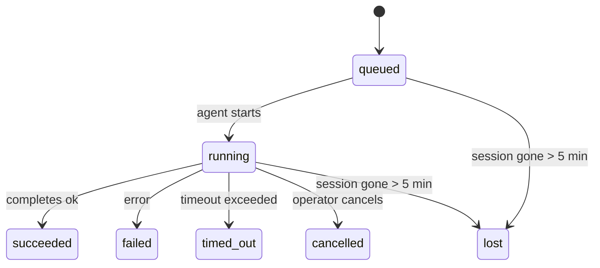

<Note>
在找调度功能？请参阅 [自动化](/automation) 以选择合适的机制。本页是后台工作的活动台账，而不是调度器。
</Note>

后台任务用于跟踪**在主对话会话之外**运行的工作：ACP 运行、子代理启动、隔离的 cron 作业执行，以及由 CLI 发起的操作。

任务并不**替代**会话、cron 作业或 heartbeat——它们是**活动台账**，用于记录发生了什么分离运行、何时发生，以及是否成功。

<Note>
并非每次代理运行都会创建任务。heartbeat 回合和普通的交互式聊天不会。所有 cron 执行、ACP 启动、子代理启动以及 CLI 代理命令都会创建任务。
</Note>

## TL;DR

- 任务是**记录**，不是调度器——cron 和 heartbeat 决定 _何时_ 运行工作，任务记录 _发生了什么_。
- ACP、子代理、所有 cron 作业和 CLI 操作都会创建任务。heartbeat 回合不会。
- 每个任务都会经历 `queued → running → terminal`（succeeded、failed、timed_out、cancelled 或 lost）。
- Cron 任务在 cron 运行时仍然持有该作业时保持存活；如果
  内存中的运行时状态已经丢失，任务维护会先检查持久化的 cron
  运行历史，再将任务标记为 lost。
- 完成是推送驱动的：分离运行可以在结束时直接通知或唤醒
  请求者会话/heartbeat，因此状态轮询循环通常不是合适的模式。
- 隔离 cron 运行和子代理完成会尽力在最终清理记账之前，为其子会话清理已跟踪的浏览器标签页/进程。
- 隔离 cron 投递会在后代子代理工作仍在收尾时抑制过时的中间父级回复，并且在最终后代输出先到达时会优先采用它。
- 完成通知会直接投递到某个通道，或排入下一次 heartbeat。
- `openclaw tasks list` 显示所有任务；`openclaw tasks audit` 可暴露问题。
- 终态记录会保留 7 天，然后自动裁剪。

## 快速开始

<Tabs>
  <Tab title="列出和筛选">
    ```bash
    # 列出所有任务（最新优先）
    openclaw tasks list

    # 按运行时或状态筛选
    openclaw tasks list --runtime acp
    openclaw tasks list --status running
    ```

  </Tab>
  <Tab title="检查">
    ```bash
    # 显示某个特定任务的详情（按 ID、run ID 或 session key）
    openclaw tasks show <lookup>
    ```
  </Tab>
  <Tab title="取消和通知">
    ```bash
    # 取消一个正在运行的任务（会终止子会话）
    openclaw tasks cancel <lookup>

    # 更改某个任务的通知策略
    openclaw tasks notify <lookup> state_changes
    ```

  </Tab>
  <Tab title="审计和维护">
    ```bash
    # 运行健康审计
    openclaw tasks audit

    # 预览或应用维护
    openclaw tasks maintenance
    openclaw tasks maintenance --apply
    ```

  </Tab>
  <Tab title="任务流">
    ```bash
    # 检查 TaskFlow 状态
    openclaw tasks flow list
    openclaw tasks flow show <lookup>
    openclaw tasks flow cancel <lookup>
    ```
  </Tab>
</Tabs>

## 什么会创建任务

| 来源                   | 运行时类型 | 创建任务记录的时机                                         | 默认通知策略 |
| ---------------------- | ---------- | ---------------------------------------------------------- | ------------ |
| ACP 后台运行            | `acp`      | 启动一个子 ACP 会话                                        | `done_only`  |
| 子代理编排              | `subagent` | 通过 `sessions_spawn` 启动子代理                          | `done_only`  |
| Cron 作业（所有类型）   | `cron`     | 每次 cron 执行（主会话和隔离会话）                        | `silent`     |
| CLI 操作                | `cli`      | 通过网关运行的 `openclaw agent` 命令                      | `silent`     |
| 代理媒体任务            | `cli`      | 由会话支持的 `image_generate`/`music_generate`/`video_generate` 运行 | `silent`     |

<AccordionGroup>
  <Accordion title="Cron 和媒体的通知默认值">
    主会话 cron 任务默认使用 `silent` 通知策略——它们会创建记录用于跟踪，但不会生成通知。隔离 cron 任务也默认是 `silent`，但因为它们在自己的会话中运行，所以更显眼。

    由会话支持的 `image_generate`、`music_generate` 和 `video_generate` 运行也使用 `silent` 通知策略。它们仍会创建任务记录，但完成结果会作为内部唤醒返回给原始代理会话，以便代理可以自己写后续消息并附加已完成的媒体。群组/频道的完成则遵循正常的可见回复策略，因此当源端投递需要它时，代理会使用消息工具。如果完成代理在仅工具路径中未能提供消息工具投递证据，OpenClaw 会将完成回退直接发送到原始通道，而不是让媒体保持私有。

  </Accordion>
  <Accordion title="并发媒体生成保护">
    当一个由会话支持的媒体生成任务仍在进行时，该工具也会充当保护机制：在同一会话中重复调用 `image_generate`、`music_generate` 或 `video_generate` 时，会返回当前活动任务状态，而不是启动第二个并发生成。若你希望从代理侧显式查询进度/状态，请使用 `action: "status"`。
  </Accordion>
  <Accordion title="哪些情况不会创建任务">
    - Heartbeat 回合——主会话；请参阅 [Heartbeat](/gateway/heartbeat)
    - 普通的交互式聊天回合
    - 直接 `/command` 响应

  </Accordion>
</AccordionGroup>

## 任务生命周期



| 状态         | 含义                                                               |
| ------------ | ------------------------------------------------------------------ |
| `queued`     | 已创建，等待代理开始                                               |
| `running`    | 代理回合正在执行                                                   |
| `succeeded`  | 成功完成                                                         |
| `failed`     | 以错误结束                                                       |
| `timed_out`  | 超过了配置的超时时间                                             |
| `cancelled`  | 被操作员通过 `openclaw tasks cancel` 停止                        |
| `lost`       | 在 5 分钟宽限期后，运行时失去了权威的后备状态                    |

Transitions happen automatically - when the associated agent run ends, the task status updates to match.

代理运行完成是活动任务记录的权威来源。一次成功的分离运行会最终标记为 `succeeded`，普通运行错误会最终标记为 `failed`，而超时或中止结果会最终标记为 `timed_out`。如果操作员已经取消了该任务，或者运行时已经记录了更强的终态，例如 `failed`、`timed_out` 或 `lost`，那么稍后到达的成功信号不会降低该终态状态。

`lost` 是具备运行时感知的：

- ACP 任务：支撑的 ACP 子会话元数据消失了。
- 子代理任务：支撑的子会话从目标代理存储中消失了。
- Cron 任务：cron 运行时不再将该作业视为活动项，并且持久化的
  cron 运行历史未显示该运行的终态结果。离线 CLI
  审计不会把它自己空的进程内 cron 运行时状态视为权威。
- CLI 任务：带有 run id/source id 的任务使用实时运行上下文，因此
  即使网关持有的运行消失，残留的子会话或聊天会话行也不会让它们继续存活。
  没有运行身份的旧版 CLI 任务仍然回退到子会话。
  由网关支持的 `openclaw agent` 运行也会根据其运行结果最终定稿，
  因此已完成的运行不会一直保持活跃，直到 sweeper 将它们标记为 `lost`。

## 投递和通知

当任务到达终态时，OpenClaw 会通知你。投递路径有两种：

**直接投递** - 如果任务有一个通道目标（`requesterOrigin`），完成消息会直接发送到该通道（Telegram、Discord、Slack 等）。群组和频道任务完成则会改为通过请求者会话路由，以便父代理可以写出可见回复。对于子代理完成，如果可用，OpenClaw 还会保留绑定的 thread/topic 路由，并且在放弃直接投递之前，可以从请求者会话存储的路由（`lastChannel` / `lastTo` / `lastAccountId`）中补全缺失的 `to` / account。

**会话排队投递**——如果直接投递失败或未设置来源，该更新会作为系统事件排入请求者会话，并在下一次 heartbeat 时显示。

<Tip>
任务完成会触发一次立即的 heartbeat 唤醒，因此你会很快看到结果——不必等待下一次计划中的 heartbeat tick。
</Tip>

这意味着通常的工作流是推送式的：先启动一次分离的工作，然后让运行时在完成时唤醒或通知你。只有在需要调试、干预，或进行明确审计时，才轮询任务状态。

### 通知策略

控制你从每个任务中接收到多少信息：

| 策略                  | 投递内容                                                              |
| --------------------- | --------------------------------------------------------------------- |
| `done_only`（默认）   | 仅投递终态（succeeded、failed 等）——**这是默认值**                  |
| `state_changes`       | 每一次状态转换和进度更新                                              |
| `silent`              | 完全不投递                                                            |

在任务运行期间更改通知策略：

```bash
openclaw tasks notify <lookup> state_changes
```

## CLI 参考

<AccordionGroup>
  <Accordion title="tasks list">
    ```bash
    openclaw tasks list [--runtime <acp|subagent|cron|cli>] [--status <status>] [--json]
    ```

    输出列：任务 ID、类型、状态、投递、Run ID、子会话、摘要。

  </Accordion>
  <Accordion title="tasks show">
    ```bash
    openclaw tasks show <lookup>
    ```

    查找令牌可以接受 task ID、run ID 或 session key。显示完整记录，包括计时、传递状态、错误和终端摘要。

  </Accordion>
  <Accordion title="tasks cancel">
    ```bash
    openclaw tasks cancel <lookup>
    ```

    对于 ACP 和子代理任务，这会终止子会话。对于由 CLI 跟踪的任务，取消会记录在任务注册表中（没有单独的子运行时句柄）。状态会变为 `cancelled`，并在适用时发送传递通知。

  </Accordion>
  <Accordion title="tasks notify">
    ```bash
    openclaw tasks notify <lookup> <done_only|state_changes|silent>
    ```
  </Accordion>
  <Accordion title="tasks audit">
    ```bash
    openclaw tasks audit [--json]
    ```

    暴露运行问题。检测到问题时，发现项也会出现在 `openclaw status` 中。

    | 发现项                    | 严重性     | 触发条件                                                                                                      |
    | ------------------------- | ---------- | ------------------------------------------------------------------------------------------------------------ |
    | `stale_queued`            | warn       | 排队超过 10 分钟                                                                                             |
    | `stale_running`           | error      | 运行超过 30 分钟                                                                                             |
    | `lost`                    | warn/error | 由运行时支持的任务所有权消失；保留的 lost 任务在 `cleanupAfter` 之前显示为警告，之后变为错误                  |
    | `delivery_failed`         | warn       | 传递失败且通知策略不是 `silent`                                                                              |
    | `missing_cleanup`         | warn       | 终态任务缺少 cleanup 时间戳                                                                                  |
    | `inconsistent_timestamps` | warn       | 时间线违规（例如结束时间早于开始时间）                                                                       |

  </Accordion>
  <Accordion title="tasks maintenance">
    ```bash
    openclaw tasks maintenance [--json]
    openclaw tasks maintenance --apply [--json]
    ```

    用于预览或应用任务、Task Flow 状态以及过期 cron 运行会话注册表行的协调修复、清理打标和裁剪。

    协调修复感知运行时：

    - ACP/子代理任务会检查其支撑的子会话。
    - 子会话带有 restart-recovery tombstone 的子代理任务会被标记为 lost，而不是被视为可恢复的支撑会话。
    - Cron 任务会检查 cron 运行时是否仍然持有该作业，然后在回退到 `lost` 之前，从持久化的 cron 运行日志/作业状态中恢复终态。只有 Gateway 进程对内存中的 cron 活跃作业集合拥有权威性；离线 CLI 审计会使用持久化历史，但不会仅因为本地 Set 为空就把 cron 任务标记为 lost。
    - 带有运行身份的 CLI 任务会检查拥有该任务的实时运行上下文，而不只是子会话或聊天会话行。

    完成清理同样感知运行时：

    - 子代理完成时会尽力在公告清理继续之前关闭该子会话跟踪的浏览器标签页/进程。
    - 隔离 cron 完成时会尽力在运行完全拆除之前关闭该 cron 会话跟踪的浏览器标签页/进程。
    - 隔离 cron 投递会在需要时等待后代子代理后续跟进，并抑制过时的父级确认文本，而不是宣布它。
    - 子代理完成投递优先使用最新可见的 assistant 文本；如果为空，则回退到已清理的最新 tool/toolResult 文本，而仅因超时工具调用的运行可能会折叠为简短的部分进度摘要。终态失败的运行会宣布失败状态，而不会回放捕获到的回复文本。
    - 清理失败不会掩盖真实的任务结果。

    应用维护时，OpenClaw 还会移除超过 7 天的过期 `cron:<jobId>:run:<uuid>` 会话注册表行，同时保留当前正在运行的 cron 作业对应的行，并且不影响非 cron 的会话行。

  </Accordion>
  <Accordion title="tasks flow list | show | cancel">
    ```bash
    openclaw tasks flow list [--status <status>] [--json]
    openclaw tasks flow show <lookup> [--json]
    openclaw tasks flow cancel <lookup>
    ```

    当你关心的是编排用的 Task Flow，而不是某一条单独的后台任务记录时，请使用这些命令。

  </Accordion>
</AccordionGroup>

## 聊天任务面板（`/tasks`）

在任意聊天会话中使用 `/tasks` 来查看与该会话关联的后台任务。面板会显示活跃和最近完成的任务，以及运行时、状态、时间信息和进度或错误详情。

当当前会话没有可见的关联任务时，`/tasks` 会回退到 agent 本地任务计数，因此你仍能获得概览，而不会泄露其他会话的详情。

如需完整的操作员账本，请使用 CLI：`openclaw tasks list`。

## 状态集成（任务压力）

`openclaw status` 包含一目了然的任务摘要：

```
Tasks: 3 queued · 2 running · 1 issues
```

该摘要报告：

- **活跃** - `queued` + `running` 的数量
- **失败** - `failed` + `timed_out` + `lost` 的数量
- **按运行时** - 按 `acp`、`subagent`、`cron`、`cli` 的细分

`/status` 和 `session_status` 工具都使用一个具备清理感知的任务快照：优先显示活跃任务，隐藏过期的已完成行，并且只有在没有活跃工作时才显示最近的失败。这使状态卡片专注于当前最重要的内容。

## 存储与维护

### 任务存放位置

任务记录持久化在 SQLite 中，路径为：

```
$OPENCLAW_STATE_DIR/tasks/runs.sqlite
```

注册表在 gateway 启动时加载到内存，并将写入同步到 SQLite，以确保跨重启的持久性。  
Gateway 通过使用 SQLite 默认的
autocheckpoint 阈值以及定期和关闭时的 `TRUNCATE` 检查点，来限制 SQLite 写前日志的大小。

### 自动维护

每 **60 秒** 运行一次 sweeper，并处理四件事：

<Steps>
  <Step title="对账">
    检查活跃任务是否仍有权威的运行时支撑。ACP/subagent 任务使用子会话状态，cron 任务使用活跃作业所有权，而带有运行身份的 CLI 任务使用所属的运行上下文。如果该支撑状态消失超过 5 分钟，则任务会被标记为 `lost`。
  </Step>
  <Step title="ACP 会话修复">
    关闭终态或孤立的、由父级拥有的一次性 ACP 会话，并且只有在不再存在活跃会话绑定时，才关闭过期终态或孤立的持久 ACP 会话。
  </Step>
  <Step title="设置清理时间戳">
    为终态任务设置 `cleanupAfter` 时间戳（endedAt + 7 天）。在保留期内，lost 任务在审计中仍作为警告出现；在 `cleanupAfter` 过期后，或清理元数据缺失时，它们会变成错误。
  </Step>
  <Step title="裁剪">
    删除超过其 `cleanupAfter` 日期的记录。
  </Step>
</Steps>

<Note>
**保留期：** 终态任务记录会保留 **7 天**，然后自动裁剪。无需配置。
</Note>

## 任务如何与其他系统关联

<AccordionGroup>
  <Accordion title="任务与任务流">
    [任务流](/automation/taskflow) 是位于后台任务之上的流程编排层。单个 flow 在其生命周期内可使用托管或镜像同步模式协调多个任务。使用 `openclaw tasks` 查看单个任务记录，使用 `openclaw tasks flow` 查看编排 flow。

    详情参见 [任务流](/automation/taskflow)。

  </Accordion>
  <Accordion title="任务与 cron">
    cron 作业的 **定义** 存放在 `~/.openclaw/cron/jobs.json` 中；运行时执行状态存放在相邻的 `~/.openclaw/cron/jobs-state.json` 中。**每一次** cron 执行都会创建一条任务记录——无论是主会话还是隔离会话。主会话 cron 任务默认使用 `silent` 通知策略，因此它们会被跟踪，但不会生成通知。

    详情参见 [Cron Jobs](/automation/cron-jobs)。

  </Accordion>
  <Accordion title="任务与 heartbeat">
    Heartbeat 运行是主会话轮次——它们不会创建任务记录。任务完成时，它可以触发 heartbeat 唤醒，以便你及时看到结果。

    详情参见 [Heartbeat](/gateway/heartbeat)。

  </Accordion>
  <Accordion title="任务与会话">
    任务可以引用 `childSessionKey`（工作运行的位置）和 `requesterSessionKey`（发起者）。会话是对话上下文；任务是在此之上的活动跟踪。
  </Accordion>
  <Accordion title="任务与 Agent 运行">
    任务的 `runId` 连接到正在执行工作的 agent run。Agent 生命周期事件（开始、结束、错误）会自动更新任务状态——你无需手动管理生命周期。
  </Accordion>
</AccordionGroup>

## 相关内容

- [自动化](/automation) - 所有自动化机制一览
- [CLI：任务](/cli/tasks) - CLI 命令参考
- [Heartbeat](/gateway/heartbeat) - 周期性的主会话轮次
- [计划任务](/automation/cron-jobs) - 调度后台工作
- [任务流](/automation/taskflow) - 位于任务之上的流程编排
