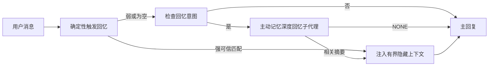

主动记忆是适用于符合条件的对话会话的深度回忆通道。
默认的 `escalate` 模式只会在消息询问过去，并且确定性记忆通道没有找到强可信触发匹配时，才运行其阻塞式回忆子代理。
这使普通回复保持快速，同时为先前的决策、对话，以及时间性或多跳问题保留更深的搜索路径。

扁平检索在直接事实匹配方面最强，但在时间性和多会话问题上较弱。[LongMemEval (arXiv:2410.10813)](https://arxiv.org/abs/2410.10813)
衡量了这种差距，而 PrefEval 基准则突出了偏好相关提醒的价值。
默认情况下的升级会把阻塞式模型调用用在这些更难的回忆形态实际上出现的地方。

## 跨会话记忆

对于个人或完全受信任的代理，请通过每个代理的设置启用其其他
私有对话之间的有限回忆：

```json5
{
  agents: {
    entries: {
      personal: {
        memory: {
          search: {
            rememberAcrossConversations: true,
          },
        },
      },
    },
  },
}
```

对于个人安装，此设置默认开启：全局 `session.dmScope` 必须未设置或为
`"main"`，且任何绑定都不得覆盖 `session.dmScope`。任何已配置的 DM 隔离都会将其默认关闭。显式的 `true` 或 `false` 始终优先生效。启用后，OpenClaw 会索引该代理的会话转录，并在适用的私有回复之前运行一次主动记忆检索步骤。该步骤可以从该代理的其他私有对话中读取相关的转录摘录。它不会包含当前正在回复的对话。

隐私边界是固定的：

- 私有直连和持久化的显式 UI 对话可以相互回忆
- 群组和频道既不是回忆来源，也不是回忆目的地
- 其他代理的转录内容永远不符合条件
- 元数据不足的未知或已归档转录会被拒绝

这不会合并转录、改变会话密钥或传递路由、扩大 `tools.sessions.visibility`，也不会授予更广泛的 `sessions_*` 工具访问权限。共享工作区记忆（`MEMORY.md` 和 `memory/*.md`）保持其现有行为。

主动记忆必须保持启用。检索会为符合条件的回复增加一个有界的阻塞步骤；超时、搜索不可用以及结果为空时，都会在没有回忆的转录上下文的情况下继续回复。OpenClaw 的内置记忆提供程序支持这一受保护的转录回忆路径。其他记忆提供程序会保留各自的回忆行为，但不会自动获得私有转录授权。`openclaw doctor`
会报告不受支持的提供程序或缺少 `memory_search` 工具。

## 高级 Active Memory 快速开始

将以下内容粘贴到 `openclaw.json` 中，作为高级安全默认配置：启用插件，仅作用于
`main`，仅限直接消息会话，模型继承自当前会话。

```json5
{
  plugins: {
    entries: {
      "active-memory": {
        enabled: true,
        config: {
          enabled: true,
          mode: "escalate",
          agents: ["main"],
          allowedChatTypes: ["direct"],
          modelFallback: "google/gemini-3-flash",
          queryMode: "recent",
          promptStyle: "balanced",
          timeoutMs: 15000,
          maxSummaryChars: 220,
          persistTranscripts: false,
          logging: true,
        },
      },
    },
  },
}
```

`plugins.entries.*`（包括 `active-memory.config`）属于[无需重启的配置类别](/gateway/configuration#what-hot-applies-vs-what-needs-a-restart)：
Gateway 会自动重新加载插件运行时，无需手动重启。如果你仍想强制完整重启，请运行：

```bash
openclaw gateway restart
```

要在对话中实时查看它：

```text
/verbose on
/trace on
```

各关键字段的作用：

- `plugins.entries.active-memory.enabled: true` 启用该插件
- `config.mode: "escalate"` 仅在存在回忆意图且没有强确定性命中时执行深度回忆
- `config.agents: ["main"]` 仅将 `main` agent 纳入
- `config.allowedChatTypes: ["direct"]` 将其限定为直接消息会话（如需群组/频道请显式启用）
- `config.model`（可选）固定专用回忆模型；未设置时继承当前会话模型
- `config.modelFallback` 仅在没有显式或继承模型可用时使用
- `config.fastMode` 可选地为回忆覆盖快速模式，而不更改主 agent
- `config.promptStyle: "balanced"` 是 `recent` 模式的默认值
- active memory 仍然只会在符合条件的交互式持久聊天会话中运行（参见[运行时机](#when-it-runs)）。

## 工作原理



深度回忆子代理只能调用已配置的记忆回忆工具（见
[记忆工具](#memory-tools)）。如果查询与
可用记忆之间的关联较弱，它会返回 `NONE`，而主回复将
在不附加额外上下文的情况下继续。

主动记忆是一种会话增强功能，而不是平台范围的推理功能：

| 表面                                                               | 是否运行主动记忆？                                    |
| ------------------------------------------------------------------ | ----------------------------------------------------- |
| 控制界面 / Web 聊天持久会话                                          | 是，当任一激活路径目标指向该代理时                       |
| 同一持久聊天路径上的其他交互式通道会话                                  | 是，当任一激活路径允许该对话时                           |
| 无头的一次性运行                                                     | 否                                                    |
| 心跳/后台运行                                                       | 否                                                    |
| 通用内部 `agent-command` 路径                                      | 否                                                    |
| 子代理/内部辅助执行                                                  | 否                                                    |

当会话是持久的、面向用户的，且代理拥有有意义的长期记忆可供搜索，并且连续性/个性化比原始提示词的确定性更重要时，应使用它：稳定的偏好、重复出现的习惯、应自然浮现的长期上下文。它不适合自动化、内部工作流、一次性 API 任务，或任何隐藏个性化会令人意外的场景。

## 何时运行

Active Memory 有两个面向 deep-recall 通道的定位路径：

1. **跨会话记忆** 会自动定位到其有效 `memory.search.rememberAcrossConversations` 设置已启用的 agent，但仅限于私密直接对话或持久化的显式 UI 会话。
2. **高级 Active Memory** 会定位到列在 `plugins.entries.active-memory.config.agents` 中的 agent ID，并应用该插件的聊天类型和聊天 ID 控制。

这两条路径都要求插件已启用，并且会话必须是符合条件的交互式持久会话。会话级 `/active-memory off` 会暂停该会话的这两条路径。如果任何条件不满足，active memory 就不会在该轮运行，主回复也不会受影响。

`config.mode` 控制目标轮次何时启动阻塞式子 agent：

| 模式       | 行为                                                                 |
| ---------- | -------------------------------------------------------------------- |
| `escalate` | 默认值。仅在 lane 1 没有强匹配时，针对 recall 意图运行。             |
| `always`   | 保留之前的行为，在每个符合条件的目标轮次都运行。                     |
| `off`      | 在不卸载插件的情况下禁用 deep recall。                               |

确定性的 trusted-trigger lane 在 `off` 模式下仍然可用。  
`rememberAcrossConversations` 不变：它仍然控制 deep recall 是否可以搜索其他私密会话。

### 会话类型

`config.allowedChatTypes` 控制哪些类型的会话可以运行高级 Active Memory 路径。它不能扩大跨会话记忆的范围：即使高级 Active Memory 允许在群组或频道中运行，该产品设置仍然只限私密场景。默认值：

```json5
allowedChatTypes: ["direct"];
```

有效值：`direct`、`group`、`channel`、`explicit`（门户风格会话，具有一个不透明的 session id，例如 `agent:main:explicit:portal-123`）。直接消息会话默认运行；group、channel 和 explicit 会话需要显式启用：

```json5
allowedChatTypes: ["direct", "group"];
allowedChatTypes: ["direct", "group", "channel"];
```

如果要在某个允许的聊天类型内进行更小范围的灰度发布，可以添加  
`config.allowedChatIds` 和 `config.deniedChatIds`：

- `allowedChatIds` 是已解析会话 id 的允许名单。非空时，active memory 只会在会话 id 位于该列表中的会话上运行——这会一次性收窄**所有**允许的聊天类型，包括直接消息。若要保留所有直接消息，同时只收窄群组，请把直接对端 id 也加入 `allowedChatIds`，或者将 `allowedChatTypes` 仅限制在你正在测试的 group/channel 灰度范围内。
- `deniedChatIds` 是拒绝名单，优先级始终高于 `allowedChatTypes` 和 `allowedChatIds`。

id 来自持久通道会话键（例如飞书的 `chat_id`/`open_id`、Telegram 的 chat id、Slack 的 channel id）。匹配大小写不敏感。如果 `allowedChatIds` 非空，而 OpenClaw 无法为该会话解析出 conversation id，active memory 会跳过该轮，而不是猜测。

```json5
allowedChatTypes: ["direct", "group"],
allowedChatIds: ["ou_operator_open_id", "oc_small_ops_group"],
deniedChatIds: ["oc_large_public_group"]
```

## 会话切换

在不编辑配置的情况下，暂停或恢复当前聊天会话的活动记忆：

```text
/active-memory status
/active-memory off
/active-memory on
```

这只会影响当前会话；不会更改
`plugins.entries.active-memory.config.enabled`、代理的
`memory.search.rememberAcrossConversations` 设置，或其他全局
配置。

如果要对所有会话暂停/恢复，请使用全局形式（需要
owner 或 `operator.admin`）：

```text
/active-memory status --global
/active-memory off --global
/active-memory on --global
```

全局形式会写入 `plugins.entries.active-memory.config.enabled`，但
会保持 `plugins.entries.active-memory.enabled` 为开启状态，因此该命令仍可用来稍后重新开启活动记忆。

## 如何查看它

默认情况下，active memory 会注入一个隐藏的、不受信任的提示前缀，
它不会显示在正常回复中。打开与你想要的
输出相匹配的会话切换项：

```text
/verbose on
/trace on
```

开启后，OpenClaw 会在正常回复之后追加诊断行（作为
后续内容，因此渠道客户端不会闪烁出一个单独的预回复气泡）：

- `/verbose on` 会添加一行状态信息：`🧩 Active Memory: status=ok elapsed=842ms query=recent summary=34 chars`
- `/trace on` 会添加一条调试摘要：`🔎 Active Memory Debug: Lemon pepper wings with blue cheese.`

示例流程：

```text
/verbose on
/trace on
what wings should i order?
```

```text
...正常的助手回复...

🧩 Active Memory: status=ok elapsed=842ms query=recent summary=34 chars
🔎 Active Memory Debug: Lemon pepper wings with blue cheese.
```

使用 `/trace raw` 时，被跟踪的 `Model Input (User Role)` 区块会显示原始
隐藏前缀：

```text
Context:
<active_memory_plugin>
...
</active_memory_plugin>
```

默认情况下，blocking 子代理的转录是临时的，并会在
运行完成后删除；参见 [Transcript persistence](#transcript-persistence) 以
保留它。

## 查询模式

`config.queryMode` 控制阻塞子代理能看到多少对话内容。请选择仍能很好回答后续问题的最小模式；随着上下文大小增加，相应增大 `timeoutMs`，从 `message` 到 `recent` 再到 `full`。

<Tabs>
  <Tab title="message">
    只发送最新的用户消息。

    ```text
    仅最新的用户消息
    ```

    当你希望获得最快的行为、最强的稳定偏好回忆倾向，并且后续轮次不需要对话上下文时使用。`config.timeoutMs` 建议从大约 `3000` 到 `5000` 毫秒开始。

  </Tab>

  <Tab title="recent">
    最新的用户消息加上一小段最近的对话尾部。

    ```text
    最近的对话尾部：
    user: ...
    assistant: ...
    user: ...

    最新的用户消息：
    ...
    ```

    适用于在速度和对话依据之间取得平衡的场景，尤其是后续问题经常依赖最近几轮对话时。建议从大约 `15000` 毫秒开始。

  </Tab>

  <Tab title="full">
    将完整对话发送给阻塞子代理。

    ```text
    完整的对话上下文：
    user: ...
    assistant: ...
    user: ...
    ...
    ```

    当回忆质量比延迟更重要，或者重要的设置内容在对话较早位置时使用。根据线程大小，建议从 `15000` 毫秒或更高开始。

  </Tab>
</Tabs>

## 提示词样式

`config.promptStyle` 控制子代理在返回记忆时的积极程度或严格程度。

| 样式              | 行为                                                                       |
| ----------------- | -------------------------------------------------------------------------- |
| `balanced`        | `recent` 模式下的通用默认值                                                |
| `strict`          | 最不积极；与附近上下文的轻微混淆最少                                       |
| `contextual`      | 最注重连续性；对话历史更重要                                               |
| `recall-heavy`    | 在较弱但仍合理的匹配下也会展示记忆                                         |
| `precision-heavy` | 除非匹配非常明显，否则强烈偏向 `NONE`                                      |
| `preference-only` | 针对偏好、习惯、例行事项、口味、重复出现的个人事实进行优化                 |

当未设置 `config.promptStyle` 时的默认映射：

```text
message -> strict
recent -> balanced
full -> contextual
```

显式设置的 `config.promptStyle` 始终会覆盖该映射。

## 模型回退策略

如果 `config.model` 未设置，active memory 会按以下顺序解析模型：

```text
显式插件模型（config.model）
-> 当前会话模型
-> agent 主模型
-> 可选配置的回退模型（config.modelFallback）
```

```json5
modelFallback: "google/gemini-3-flash";
```

如果这条链路中都没有解析出模型，active memory 会在该轮跳过 recall。`config.modelFallbackPolicy` 是一个已废弃的兼容字段，仅为旧配置保留；它不再改变运行时行为——`modelFallback` 严格来说只是上述链路中的最后手段，而不是在已解析模型出错时切换到另一个模型的运行时故障转移。

### 速度建议

保留 `config.model` 未设置（继承会话模型）是最稳妥的默认方式：它会沿用你现有的提供商、认证和模型偏好。若想降低延迟，建议改用专门的快速模型——recall 的质量很重要，但在这里延迟更重要，因为主回答路径之外的工具面很窄（只有 memory recall 工具）。

推荐的快速模型选项：

- `cerebras/gpt-oss-120b`，专用于低延迟 recall 的模型
- `google/gemini-3-flash`，在不更改主聊天模型的情况下提供低延迟回退
- 通过保留 `config.model` 未设置，继续使用你的常规会话模型

#### Cerebras 配置

```json5
{
  models: {
    providers: {
      cerebras: {
        baseUrl: "https://api.cerebras.ai/v1",
        apiKey: "${CEREBRAS_API_KEY}",
        api: "openai-completions",
        models: [{ id: "gpt-oss-120b", name: "GPT OSS 120B (Cerebras)" }],
      },
    },
  },
  plugins: {
    entries: {
      "active-memory": {
        enabled: true,
        config: { model: "cerebras/gpt-oss-120b" },
      },
    },
  },
}
```

请确认 Cerebras API key 对所选模型拥有 `chat/completions` 访问权限——仅能看到 `/v1/models` 并不能保证这一点。

## 记忆工具

`config.toolsAllow` 设置阻塞子代理可调用的具体工具名称，用于高级 Active Memory。默认值取决于当前的记忆提供方：

| Memory provider | Default `toolsAllow`              |
| --------------- | --------------------------------- |
| Built-in memory | `["memory_search", "memory_get"]` |
| LanceDB         | `["memory_recall"]`               |

如果没有任何已配置的工具可用，或者子代理运行失败，active memory 会跳过该轮的召回，主回复会在没有记忆上下文的情况下继续。对于自定义召回工具，只要面向模型可见的工具输出非空，就会被视为召回证据，除非结构化结果字段明确报告结果为空或失败。

`toolsAllow` 只接受具体的记忆工具名称：通配符、`group:*` 条目，以及核心代理工具（`read`、`exec`、`message`、`web_search` 以及类似工具）都会在隐藏子代理启动前被静默过滤掉。

### Built-in memory

无需显式设置 `toolsAllow`：

```json5
{
  plugins: {
    entries: {
      "active-memory": {
        enabled: true,
        config: {
          agents: ["main"],
          // 默认：["memory_search", "memory_get"]
        },
      },
    },
  },
}
```

### LanceDB memory

在[安装并配置 LanceDB](/plugins/memory-lancedb)后，Active
Memory 会自动使用 `memory_recall`；无需显式设置 `toolsAllow`：

```json5
{
  plugins: {
    entries: {
      "active-memory": {
        enabled: true,
        config: {
          agents: ["main"],
          promptAppend: "对于长期用户偏好、过去的决定以及之前讨论过的话题，请使用 memory_recall。如果召回没有找到有用内容，请返回 NONE。",
        },
      },
    },
  },
}
```

这是 LanceDB 自身已存储记忆的高级 Active Memory 路径。
`memory.search.rememberAcrossConversations` 不会通过 `memory_recall` 暴露私有会话转录。当 LanceDB 是活动记忆提供方时，请使用 LanceDB 的自动召回或上面的高级配置。

### Lossless Claw

[Lossless Claw](https://github.com/martian-engineering/lossless-claw) 是一个外部上下文引擎插件（`openclaw plugins install
@martian-engineering/lossless-claw`），拥有自己的召回工具。请先将其作为上下文引擎进行设置；参见 [上下文引擎](/concepts/context-engine)。然后将 active memory 指向它的工具：

```json5
{
  plugins: {
    slots: {
      contextEngine: "lossless-claw",
    },
    entries: {
      "lossless-claw": {
        enabled: true,
      },
      "active-memory": {
        enabled: true,
        config: {
          agents: ["main"],
          toolsAllow: ["memory_search", "lcm_grep", "lcm_describe", "lcm_expand_query"],
          promptAppend: "优先使用 lcm_grep 进行压缩后的对话召回。使用 lcm_describe 检查特定摘要。仅当最新用户消息需要精确细节、且这些细节可能已在压缩过程中丢失时，才使用 lcm_expand_query。如果检索到的上下文不明显有用，请返回 NONE。",
        },
      },
    },
  },
}
```

不要在这里将 `lcm_expand` 添加到 `toolsAllow`；Lossless Claw 将其用作更底层的工具，用于委派扩展，不适合顶层的 active-memory 子代理。Lossless Claw 会改变上下文组装方式，但不会替换当前的记忆提供方。在同时使用 `rememberAcrossConversations` 时，请将 `memory_search` 保留在 `toolsAllow` 中；仅包含 LCM 工具的列表对于高级 Active Memory 仍然有效，但会禁用产品的转录召回路径。

## 高级逃生通道

不属于推荐的配置。

`config.thinking` 会覆盖子代理的思考级别（默认值为 `"off"`，
因为主动记忆运行在回复路径中，额外的思考时间会直接
增加用户可感知的延迟）：

```json5
thinking: "medium"; // 默认值: "off"
```

`config.fastMode` 只会覆盖阻塞式记忆子代理的快速模式。
可使用 `true`、`false` 或 `"auto"`；保持未设置以继承正常
代理、会话和模型默认值。`"auto"` 使用召回模型配置的
`fastAutoOnSeconds` 截止值：

```json5
fastMode: true;
```

`config.promptAppend` 会在默认提示之后、对话上下文之前添加操作员指令——
当非核心记忆插件需要特定的工具顺序或查询形状时，可将其与自定义的
`toolsAllow` 配对使用：

```json5
promptAppend: "优先考虑稳定的长期偏好，而不是一次性事件。";
```

`config.promptOverride` 会完全替换默认提示（之后仍会附加对话上下文）。除非你有意
测试不同的召回契约，否则不建议这样做——默认提示经过调优，旨在返回
`NONE` 或供主模型使用的简洁用户事实上下文：

```json5
promptOverride: "你是一个记忆搜索代理。返回 NONE，或者返回一条简洁的用户事实。";
```

## 转录持久化

阻塞式子代理运行会将其运行时转录保存在代理的 SQLite 存储中。默认情况下，OpenClaw 会在运行结束后删除临时的子代理会话行，并且不会创建 JSONL 文件。

要将这些转录导出为用于调试的 JSONL 产物：

```json5
{
  plugins: {
    entries: {
      "active-memory": {
        enabled: true,
        config: {
          agents: ["main"],
          persistTranscripts: true,
          transcriptDir: "active-memory",
        },
      },
    },
  },
}
```

导出的转录产物位于目标代理的 sessions 文件夹下，和活动运行时状态分开存放于一个独立目录中：

```text
agents/<agent>/sessions/active-memory/<blocking-memory-sub-agent-session-id>.jsonl
```

可通过 `config.transcriptDir` 更改相对产物子目录。请谨慎使用：导出内容在繁忙会话中会迅速累积，`full` 查询模式会复制大量对话上下文，这些产物还包含隐藏的提示上下文以及检索到的记忆。

## 配置

所有活跃记忆配置都位于 `plugins.entries.active-memory` 下。

| Key                          | Type                                                                                                 | 含义                                                                                                                                                                                                                                           |
| ---------------------------- | ---------------------------------------------------------------------------------------------------- | ------------------------------------------------------------------------------------------------------------------------------------------------------------------------------------------------------------------------------------------------- |
| `enabled`                    | `boolean`                                                                                            | 启用插件本身                                                                                                                                                                                                                         |
| `config.mode`                | `"escalate" \| "always" \| "off"`                                                                    | 控制阻塞式深度回忆子代理何时运行；默认值为 `"escalate"`                                                                                                                                                                       |
| `config.agents`              | `string[]`                                                                                           | 可以使用活跃记忆的代理 ID                                                                                                                                                                                                              |
| `config.model`               | `string`                                                                                             | 可选的阻塞式子代理模型引用；未设置时继承当前会话模型                                                                                                                                                             |
| `config.allowedChatTypes`    | `("direct" \| "group" \| "channel" \| "explicit")[]`                                                 | 允许运行活跃记忆的会话类型；默认为 `["direct"]`                                                                                                                                                                                |
| `config.allowedChatIds`      | `string[]`                                                                                           | 可选的会话级允许列表，在 `allowedChatTypes` 之后应用；非空列表采用默认拒绝策略                                                                                                                                                 |
| `config.deniedChatIds`       | `string[]`                                                                                           | 可选的会话级拒绝列表，优先于允许的会话类型和允许的 ID                                                                                                                                                           |
| `config.queryMode`           | `"message" \| "recent" \| "full"`                                                                    | 控制阻塞式子代理可以看到多少对话内容                                                                                                                                                                                        |
| `config.promptStyle`         | `"balanced" \| "strict" \| "contextual" \| "recall-heavy" \| "precision-heavy" \| "preference-only"` | 控制阻塞式子代理在决定是否返回记忆时的积极程度或严格程度                                                                                                                                                     |
| `config.toolsAllow`          | `string[]`                                                                                           | 阻塞式子代理可以调用的具体记忆工具名称；默认为 `["memory_search", "memory_get"]`；当 `plugins.slots.memory` 为 `memory-lancedb` 时，默认为 `["memory_recall"]`；通配符、`group:*` 条目和核心代理工具会被忽略 |
| `config.thinking`            | `"off" \| "minimal" \| "low" \| "medium" \| "high" \| "xhigh" \| "adaptive" \| "max"`                | 阻塞式子代理的高级思考覆盖设置；默认为 `off` 以提升速度                                                                                                                                                                    |
| `config.fastMode`            | `boolean \| "auto"`                                                                                  | 可选的阻塞式子代理快速模式覆盖设置；未设置时继承代理、会话和模型的常规默认值                                                                                                                                  |
| `config.promptOverride`      | `string`                                                                                             | 高级完整提示词替换；不建议正常使用                                                                                                                                                                                  |
| `config.promptAppend`        | `string`                                                                                             | 附加到默认提示词或替换后提示词末尾的高级额外指令                                                                                                                                                                          |
| `config.timeoutMs`           | `number`                                                                                             | 阻塞式子代理的硬超时时间（范围为 250-120000 毫秒；默认值为 15000）                                                                                                                                                                      |
| `config.setupGraceTimeoutMs` | `number`                                                                                             | 回忆超时前额外提供的高级初始化时间；范围为 0-30000 毫秒，默认值为 0。有关 v2026.4.x 的升级指导，请参阅[冷启动宽限时间](#cold-start-grace)                                                                                                                                              |
| `config.maxSummaryChars`     | `number`                                                                                             | 活跃记忆摘要中的最大字符数（范围为 40-1000；默认值为 220）                                                                                                                                                                      |
| `config.logging`             | `boolean`                                                                                            | 调优期间输出活跃记忆日志                                                                                                                                                                                                             |
| `config.persistTranscripts`  | `boolean`                                                                                           | 将阻塞式子代理的会话记录导出为 JSONL 文件，然后删除其临时 SQLite 会话行                                                                                                                                     |
| `config.transcriptDir`       | `string`                                                                                             | 代理会话文件夹下的相对会话记录文件目录（默认值为 `"active-memory"`）                                                                                                                                                |
| `config.modelFallback`       | `string`                                                                                             | 仅在[模型回退链](#model-fallback-policy)的最后一步使用的可选模型                                                                                                                                                   |

有用的调优字段：

| Key                                | Type     | 含义                                                                                                                                                         |
| ---------------------------------- | -------- | --------------------------------------------------------------------------------------------------------------------------------------------------------------- |
| `config.recentUserTurns`           | `number` | 当 `queryMode` 为 `recent` 时，要包含的之前用户轮次（范围 0-4；默认 2）                                                                                 |
| `config.recentAssistantTurns`      | `number` | 当 `queryMode` 为 `recent` 时，要包含的之前助手轮次（范围 0-3；默认 1）                                                                            |
| `config.recentUserChars`           | `number` | 每个最近用户轮次的最大字符数（范围 40-1000；默认 220）                                                                                                     |
| `config.recentAssistantChars`      | `number` | 每个最近助手轮次的最大字符数（范围 40-1000；默认 180）                                                                                                |
| `config.cacheTtlMs`                | `number` | 重复相同查询时的缓存复用时间（范围 1000-120000 ms；默认 15000）                                                                                |
| `config.circuitBreakerMaxTimeouts` | `number` | 对同一 agent/model，连续超时达到此次数后跳过回忆。成功回忆或冷却期结束后重置（范围 1-20；默认 3）。 |
| `config.circuitBreakerCooldownMs`  | `number` | 熔断器触发后跳过回忆的时长，单位 ms（范围 5000-600000；默认 60000）。                                                              |

## 推荐配置

从 `recent` 开始：

```json5
{
  plugins: {
    entries: {
      "active-memory": {
        enabled: true,
        config: {
          agents: ["main"],
          mode: "escalate",
          queryMode: "recent",
          promptStyle: "balanced",
          timeoutMs: 15000,
          maxSummaryChars: 220,
          logging: true,
        },
      },
    },
  },
}
```

使用 `/verbose on` 来显示状态行，使用 `/trace on` 来显示调试摘要，
并在调优时使用——这两者都会在主回复之后作为后续消息发送，而不是
在之前发送。只有当每个符合条件的轮次都值得这份延迟时才使用 `always`。保留
`escalate` 作为推荐的平衡方案，然后在深度召回查询本身中选择 `message`、`recent` 或 `full`。

### 冷启动宽限

在 v2026.5.2 之前，插件会在冷启动期间静默地将 `timeoutMs` 额外延长 30000 ms，因此模型预热、嵌入索引加载和第一次召回可以共用一个更大的预算。v2026.5.2 将这段宽限移到了显式的 `setupGraceTimeoutMs` 配置之后：现在默认情况下，`timeoutMs` 只是召回工作的预算，除非你显式启用它。阻塞钩子会把这段预算分成两个固定阶段：召回开始前最多 1500 ms 用于会话/配置预检，然后在召回工作停止后再单独提供固定的 1500 ms 用于中止结算和转录恢复。这两个额度都不会延长模型或工具执行时间。

如果你是从 v2026.4.x 升级，并且为了旧的隐式宽限环境调过 `timeoutMs`（推荐的入门值 `timeoutMs: 15000` 就是一个例子），请设置 `setupGraceTimeoutMs: 30000` 以恢复 v5.2 之前的有效预算：

```json5
{
  plugins: {
    entries: {
      "active-memory": {
        config: {
          timeoutMs: 15000,
          setupGraceTimeoutMs: 30000,
        },
      },
    },
  },
}
```

最坏情况下的阻塞时间是 `timeoutMs + setupGraceTimeoutMs + 3000` ms（即配置的召回工作预算，加上最多 1500 ms 的预检，再加上固定的 1500 ms 召回后完成额度）。内嵌的召回运行器使用相同的有效超时预算，因此 `setupGraceTimeoutMs` 同时覆盖外层的提示构建看门狗和内层的阻塞式召回运行。

对于资源紧张、且可以接受冷启动延迟权衡的网关，较低的值（5000-15000 ms）也可以使用——代价是网关重启后第一次召回在预热完成前返回空结果的概率更高。

## 调试

如果 active memory 没有出现在你预期的位置：

1. 确认插件已在 `plugins.entries.active-memory.enabled` 下启用。
2. 对于跨会话记忆，请确认代理的有效
   `memory.search.rememberAcrossConversations` 设置已启用，运行
   `openclaw doctor` 以验证当前记忆提供程序支持受保护的
   转录回忆，并在显式配置时确认 `config.toolsAllow` 包含
   `memory_search`。
   对于高级 Active Memory，请确认代理 ID
   已列在 `config.agents` 中。
3. 确认你是在符合条件的交互式持久会话中进行测试。
4. 请记住，群组和频道永远不会使用跨会话转录回忆。
5. 开启 `config.logging: true` 并查看 gateway 日志。
6. 使用 `openclaw status --deep` 验证 memory search 本身是否正常工作。

如果 memory 命中过于嘈杂，请收紧 `maxSummaryChars`。如果 active memory 太
慢，请降低 `queryMode`、降低 `timeoutMs`，或者减少最近轮次数量和每轮字符上限。

## 常见问题

Advanced Active Memory 依赖于所配置的内存插件的召回
流程，因此大多数召回异常其实是嵌入提供方的问题，而不是
active-memory 的 bug。默认的 `memory-core` 路径使用 `memory_search` 和
`memory_get`；`memory-lancedb` 插槽使用 `memory_recall`。如果你使用了其他
内存插件，请确认 `config.toolsAllow` 中列出了该插件实际注册的工具。跨会话记忆
的范围更窄：当前内存提供方必须支持 OpenClaw 的受保护同 agent/private-session 召回
路径。

<AccordionGroup>
  <Accordion title="嵌入提供方已切换或停止工作">
    如果未设置 `memory.search.provider`，OpenClaw 会使用 OpenAI embeddings。请为
    Bedrock、DeepInfra、Gemini、GitHub Copilot、LM Studio、local、Mistral、Ollama、
    Voyage 或兼容 OpenAI 的 embeddings 显式设置 `memory.search.provider`。如果已配置的
    provider 无法运行，`memory_search` 可能会退化为仅词法检索；一旦 provider 已经选定，
    运行时失败不会自动回退。

    仅当你需要一个明确的单一 fallback 时，才设置可选的 `memory.search.fallback`。
    有关提供方的完整列表和示例，请参见 [记忆搜索](/concepts/memory-search)。

  </Accordion>

  <Accordion title="召回速度慢、结果为空或不一致">
    - 打开 `/trace on`，以在会话中显示插件拥有的 Active Memory 调试
      摘要。
    - 打开 `/verbose on`，以便在每次回复后也能看到 `🧩 Active Memory: ...` 状态行。
    - 关注 gateway 日志中的 `active-memory: ... start|done`、
      `memory sync failed (search-bootstrap)` 或 provider embedding 错误。
    - 运行 `openclaw status --deep` 来检查 memory-search 后端和
      index 健康状况。
    - 如果你使用 `ollama`，请确认已安装 embedding 模型
      （`ollama list`）。
  </Accordion>

  <Accordion title="gateway 重启后的第一次召回返回 `status=timeout`">
    在 v2026.5.2 及更高版本中，如果冷启动设置（model warm-up + embedding
    index load）在第一次召回触发时尚未完成，运行可能会耗尽配置的
    `timeoutMs` 预算，并返回 `status=timeout` 且输出为空。gateway 日志会在重启后
    第一个符合条件的回复附近显示 `active-memory timeout after Nms`。

    请参见“推荐配置”下的 [冷启动宽限](#cold-start-grace) 以获取
    推荐的 `setupGraceTimeoutMs` 值。

  </Accordion>
</AccordionGroup>

## 相关页面

- [内存搜索](/concepts/memory-search)
- [内存配置参考](/reference/memory-config)
- [插件 SDK 设置](/plugins/sdk-setup)
