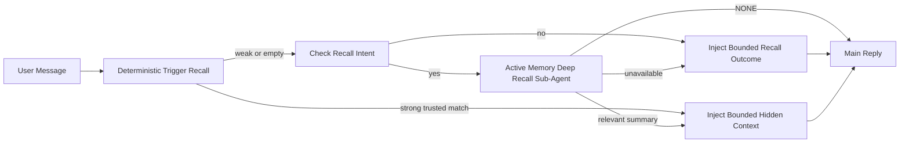

## How it works



The deep-recall sub-agent can call only the configured memory recall tools (see
[Memory tools](/concepts/active-memory/memory-tools#memory-tools)). If the connection between the query and
available memory is weak, it returns `NONE` and the main reply proceeds without
extra context. Intentional no-intent skips and unavailable recall add only a
fixed, bounded outcome note.

Active memory is a conversational enrichment feature, not a platform-wide
inference feature:

| Surface                                                             | Runs active memory?                                      |
| ------------------------------------------------------------------- | -------------------------------------------------------- |
| Control UI / web chat persistent sessions                           | Yes, when either activation path targets the agent       |
| Other interactive channel sessions on the same persistent chat path | Yes, when either activation path allows the conversation |
| Headless one-shot runs                                              | No                                                       |
| Heartbeat/background runs                                           | No                                                       |
| Generic internal `agent-command` paths                              | No                                                       |
| Sub-agent/internal helper execution                                 | No                                                       |

Use it when the session is persistent and user-facing, the agent has
meaningful long-term memory to search, and continuity/personalization matter
more than raw prompt determinism: stable preferences, recurring habits,
long-term context that should surface naturally. It is a poor fit for
automation, internal workers, one-shot API tasks, or anywhere hidden
personalization would be surprising.

## When it runs

Active Memory has two targeting paths for the deep-recall lane:

1. **Remember across conversations** automatically targets agents whose
   effective `memory.search.rememberAcrossConversations` setting is enabled, but
   only for private direct or persistent explicit UI conversations.
2. **Advanced Active Memory** targets agent IDs listed in
   `plugins.entries.active-memory.config.agents` and applies the plugin's chat
   type and chat ID controls.

Both paths require the plugin to be enabled and an eligible interactive
persistent conversation. A session-scoped `/active-memory off` pauses both
paths for that conversation. If any condition fails, active memory does not run
for that turn, and the main reply is unaffected.

`config.mode` controls when a targeted turn starts the blocking sub-agent:

| Mode       | Behavior                                                                |
| ---------- | ----------------------------------------------------------------------- |
| `escalate` | Default. Run only for recall intent when lane 1 has no strong hit.      |
| `always`   | Preserve the previous behavior and run on every eligible targeted turn. |
| `off`      | Disable deep recall without unloading the plugin.                       |

The deterministic trusted-trigger lane remains available in `off` mode.
`rememberAcrossConversations` is unchanged: it still controls whether deep
recall may search other private conversations.

### Session types

`config.allowedChatTypes` controls which kinds of conversations may run the
advanced Active Memory path. It cannot widen Remember across conversations:
that product setting remains private-only even when advanced Active Memory is
allowed in groups or channels. Default:

```json5
allowedChatTypes: ["direct"]
```

Valid values: `direct`, `group`, `channel`, `explicit` (portal-style sessions
with an opaque session id, for example `agent:main:explicit:portal-123`).
Direct-message sessions run by default; group, channel, and explicit sessions
need to be opted in:

```json5
allowedChatTypes: ["direct", "group"]
allowedChatTypes: ["direct", "group", "channel"]
```

For narrower rollout inside an allowed chat type, add
`config.allowedChatIds` and `config.deniedChatIds`:

- `allowedChatIds` is an allowlist of resolved conversation ids. When
  non-empty, active memory only runs for sessions whose conversation id is in
  the list — this narrows **every** allowed chat type at once, including
  direct messages. To keep all direct messages while narrowing only groups,
  add the direct peer ids to `allowedChatIds` too, or keep `allowedChatTypes`
  scoped to the group/channel rollout you are testing.
- `deniedChatIds` is a denylist that always wins over `allowedChatTypes` and
  `allowedChatIds`.

Ids come from the persistent channel session key (for example Feishu
`chat_id`/`open_id`, Telegram chat id, Slack channel id). Matching is
case-insensitive. If `allowedChatIds` is non-empty and OpenClaw cannot
resolve a conversation id for the session, active memory skips the turn
instead of guessing.

```json5
allowedChatTypes: ["direct", "group"],
allowedChatIds: ["ou_operator_open_id", "oc_small_ops_group"],
deniedChatIds: ["oc_large_public_group"]
```
