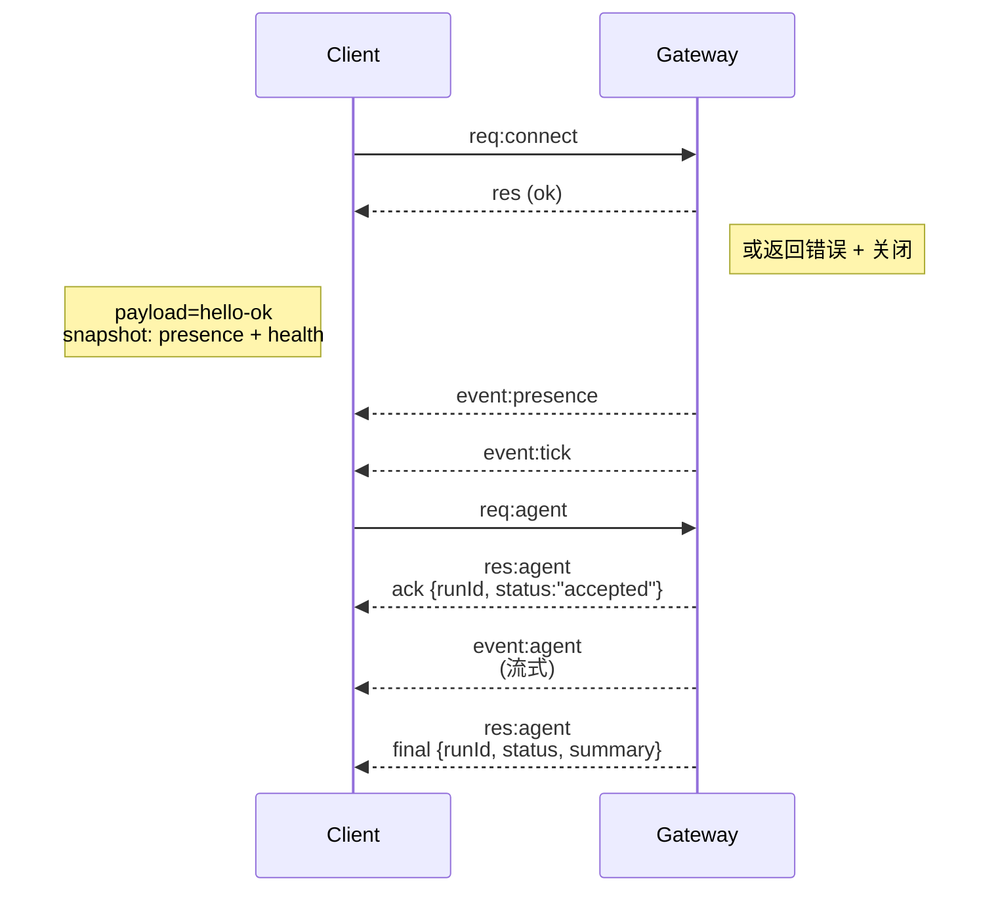

# 网关架构

## 概述

- 单个长连接的 **网关（Gateway）** 负责所有消息面（WhatsApp 通过 Baileys，Telegram 通过 grammY，Slack，Discord，Signal，iMessage，WebChat）。
- 控制面客户端（macOS 应用、CLI、Web UI、自动化）通过配置的绑定主机上的 **WebSocket** 连接到网关（默认 `127.0.0.1:18789`）。
- **节点（Nodes）**（macOS/iOS/Android/无头模式）也通过 **WebSocket** 连接，但声明 `role: node`，并具有明确的能力/命令。
- 每个主机仅有一个网关；这是唯一能打开 WhatsApp 会话的位置。
- **画布主机（canvas host）** 由网关的 HTTP 服务器提供，路径为：
  - `/__openclaw__/canvas/`（代理可编辑的 HTML/CSS/JS）
  - `/__openclaw__/a2ui/`（A2UI 主机）
    使用与网关相同的端口（默认 `18789`）。

## 组件与流程

### 网关（守护进程）

- 维护供应商连接。
- 提供类型化的 WS API（请求、响应、服务器推送事件）。
- 根据 JSON Schema 验证入站帧。
- 发出如 `agent`、`chat`、`presence`、`health`、`heartbeat`、`cron` 等事件。

### 客户端（mac 应用 / CLI / Web 管理端）

- 每个客户端一个 WS 连接。
- 发送请求（`health`、`status`、`send`、`agent`、`system-presence`）。
- 订阅事件（`tick`、`agent`、`presence`、`shutdown`）。

### 节点（macOS / iOS / Android / 无头）

- 连接至 **同一 WS 服务器**，带 `role: node`。
- 在 `connect` 中提供设备身份；配对是**基于设备的**（角色 `node`），批准存储在设备配对存储中。
- 暴露命令如 `canvas.*`、`camera.*`、`screen.record`、`location.get`。

协议详情：

- [网关协议](/gateway/protocol)

### WebChat

- 静态 UI，使用网关 WS API 获取聊天历史并发送消息。
- 远程部署时通过与其他客户端相同的 SSH/Tailscale 隧道连接。

## 连接生命周期（单客户端）



## 线协议（摘要）

- 传输：WebSocket，文本帧，JSON 载荷。
- 第一帧**必须**是 `connect`。
- 握手后：
  - 请求：`{type:"req", id, method, params}` → `{type:"res", id, ok, payload|error}`
  - 事件：`{type:"event", event, payload, seq?, stateVersion?}`
- 如果设置了 `OPENCLAW_GATEWAY_TOKEN`（或 `--token`），`connect.params.auth.token` 必须匹配，否则连接关闭。
- 需要幂等键用于有副作用的方法（`send`、`agent`）以安全重试；服务器保留短期去重缓存。
- 节点必须在 `connect` 中包含 `role: "node"` 以及能力/命令/权限信息。

## 配对与本地信任

- 所有 WS 客户端（操作员与节点）在 `connect` 时都包含**设备身份**。
- 新设备 ID 需要配对批准；网关会发放**设备令牌**供后续连接使用。
- **本地**连接（环回或网关主机自身 tailnet 地址）可自动批准，以保持同主机 UX 流畅。
- 所有连接必须对 `connect.challenge` 随机数进行签名。
- 签名载荷版本 `v3` 绑定 `platform` 和 `deviceFamily`; 网关在重连时绑定配对元数据，元数据变更需重新配对。
- **非本地**连接仍需明确批准。
- 网关认证（`gateway.auth.*`）适用于**所有**连接，无论本地或远程。

详情请见：[网关协议](/gateway/protocol)、[配对](/channels/pairing)、[安全](/gateway/security)。

## 协议类型与代码生成

- 使用 TypeBox schema 定义协议。
- 从 schema 生成 JSON Schema。
- 从 JSON Schema 生成 Swift 模型。

## 远程访问

- 推荐：Tailscale 或 VPN。
- 备选：SSH 隧道

  ```bash
  ssh -N -L 18789:127.0.0.1:18789 user@host
  ```

- 同样的握手和认证令牌适用于隧道连接。
- 远程部署中可以启用 TLS 和可选的证书绑定以保证 WS 连接安全。

## 运营快照

- 启动命令：`openclaw gateway`（前台，日志输出到 stdout）。
- 健康检查：通过 WS 发送 `health` 请求（也包含在 `hello-ok` 中）。
- 守护进程管理：使用 launchd/systemd 自动重启。

## 不变量

- 每个主机严格只有一个网关控制一个 Baileys 会话。
- 握手是强制的；非 JSON 或非首帧为 `connect` 会被强制关闭连接。
- 事件不进行重放；客户端需丢包时主动刷新。
