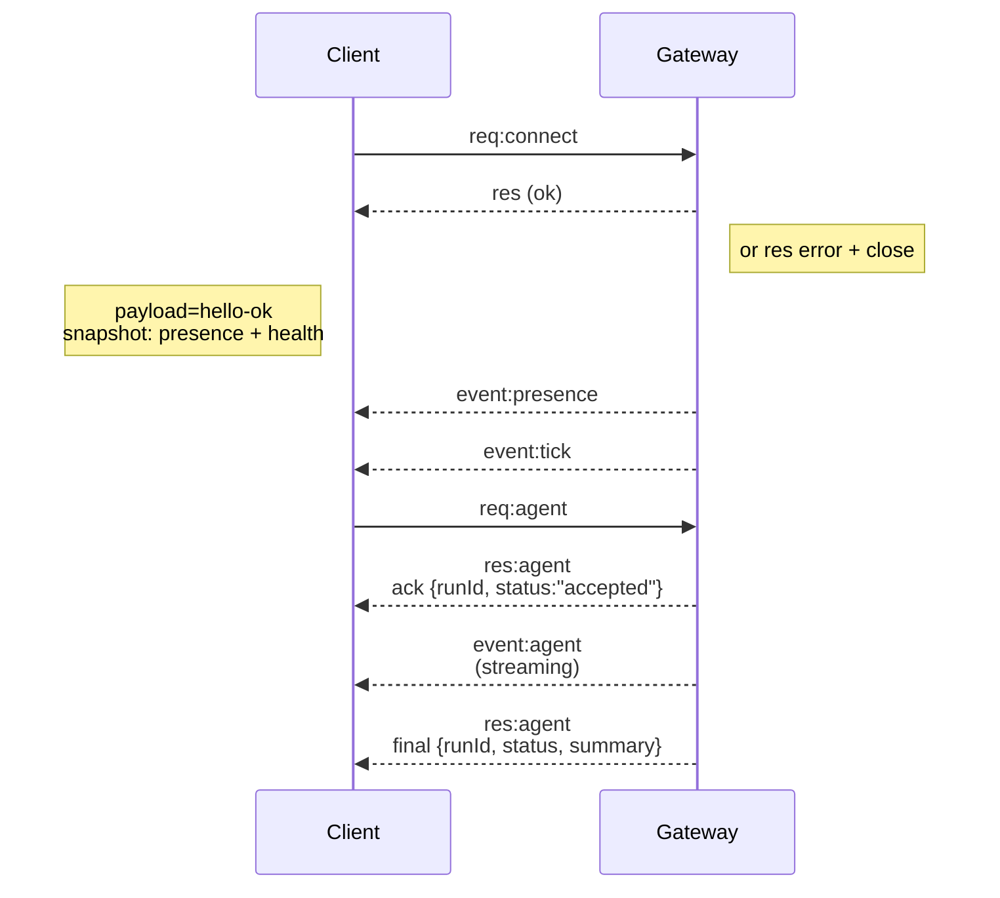

## 概览

- 一个单一、长生命周期的 **Gateway** 负责所有消息表面（通过
  Baileys 的 WhatsApp、通过 grammY 的 Telegram、Slack、Discord、Signal、iMessage、WebChat）。
- 控制平面客户端（macOS 应用、CLI、Web UI、自动化）通过配置的绑定主机上的 **WebSocket**
  连接到 Gateway（默认
  `127.0.0.1:18789`）。
- **Nodes**（macOS/iOS/Android/headless）也通过 **WebSocket** 连接，但会
  声明 `role: node`，并提供明确的 caps/commands。
- 每台主机一个 Gateway；只有它会打开 WhatsApp 会话。
- **canvas host** 由 Gateway HTTP 服务器提供，路径位于：
  - `/__openclaw__/canvas/`（agent 可编辑的 HTML/CSS/JS）
  - `/__openclaw__/a2ui/`（A2UI host）
    它使用与 Gateway 相同的端口（默认 `18789`）。

## 组件与流程

### Gateway（守护进程）

- 维护各个 provider 的连接。
- 暴露类型化的 WS API（请求、响应、服务端推送事件）。
- 根据 JSON Schema 验证传入帧。
- 发送如 `agent`、`chat`、`presence`、`health`、`heartbeat`、`cron` 等事件。

### 客户端（mac 应用 / CLI / web 管理）

- 每个客户端一个 WS 连接。
- 发送请求（`health`、`status`、`send`、`agent`、`system-presence`）。
- 订阅事件（`tick`、`agent`、`presence`、`shutdown`）。

### Nodes（macOS / iOS / Android / headless）

- 以 `role: node` 连接到**同一个 WS 服务器**。
- 在 `connect` 中提供设备身份；配对是**基于设备的**（`node` 角色），并且
  由设备配对存储负责批准。
- 暴露如 `canvas.*`、`camera.*`、`screen.record`、`location.get` 之类的命令。

协议细节：

- [Gateway protocol](/gateway/protocol)

### WebChat

- 使用 Gateway WS API 获取聊天历史并发送消息的静态 UI。
- 在远程部署中，通过与其他客户端相同的 SSH/Tailscale 隧道连接。

## 连接生命周期（单个客户端）


```mermaid
sequenceDiagram
    participant Client
    participant Gateway

    Client->>Gateway: req:connect
    Gateway-->>Client: res (ok)
    Note right of Gateway: or res error + close
    Note left of Client: payload=hello-ok<br>snapshot: presence + health

    Gateway-->>Client: event:presence
    Gateway-->>Client: event:tick

    Client->>Gateway: req:agent
    Gateway-->>Client: res:agent<br>ack {runId, status:"accepted"}
    Gateway-->>Client: event:agent<br>(streaming)
    Gateway-->>Client: res:agent<br>final {runId, status, summary}
```

## 线路协议（摘要）

- 传输：WebSocket，文本帧承载 JSON 负载。
- 第一帧**必须**是 `connect`。
- 握手之后：
  - 请求：`{type:"req", id, method, params}` → `{type:"res", id, ok, payload|error}`
  - 事件：`{type:"event", event, payload, seq?, stateVersion?}`
- `hello-ok.features.methods` / `events` 是发现元数据，不是
  每个可调用 helper 路由的生成式转储。
- 共享密钥认证使用 `connect.params.auth.token` 或
  `connect.params.auth.password`，取决于配置的 gateway auth 模式。
- Tailscale Serve 这类带身份的模式
  (`gateway.auth.allowTailscale: true`) 或非 loopback 的
  `gateway.auth.mode: "trusted-proxy"` 会根据请求头完成认证，
  而不是使用 `connect.params.auth.*`。
- 私有入口的 `gateway.auth.mode: "none"` 会完全禁用共享密钥认证；
  请不要在公网/不受信任入口上开启该模式。
- 对于会产生副作用的方法（`send`、`agent`），需要幂等键以便
  安全重试；服务器会维护一个短期去重缓存。
- Nodes 必须在 `connect` 中包含 `role: "node"` 以及 caps/commands/permissions。

## 配对 + 本地信任

- 所有 WS 客户端（操作员 + nodes）在 `connect` 中都包含一个**设备身份**。
- 新设备 ID 需要配对批准；Gateway 会为后续连接签发一个**设备令牌**。
- 直接的本地 loopback 连接可以自动批准，以保持同主机 UX 流畅。
- OpenClaw 还拥有一个较窄的后端/容器本地自连接路径，用于受信任的共享密钥 helper 流程。
- Tailnet 和 LAN 连接，包括同主机的 tailnet 绑定，仍然需要明确的配对批准。
- 所有连接都必须对 `connect.challenge` nonce 进行签名。
- 签名载荷 `v3` 还会绑定 `platform` + `deviceFamily`；gateway
  在重连时会固定已配对的元数据，并在元数据变更时要求重新配对。
- **非本地**连接仍然需要明确批准。
- Gateway 认证（`gateway.auth.*`）仍然适用于**所有**连接，无论本地还是远程。

详情：[Gateway protocol](/gateway/protocol)、[Pairing](/channels/pairing)、
[Security](/gateway/security)。

## 协议类型与代码生成

- TypeBox schemas 定义协议。
- JSON Schema 从这些 schemas 生成。
- Swift models 从 JSON Schema 生成。

## 远程访问

- 首选：Tailscale 或 VPN。
- 替代方案：SSH 隧道

  ```bash
  ssh -N -L 18789:127.0.0.1:18789 user@host
  ```

- 隧道中仍适用相同的握手 + 认证令牌。
- 远程部署中的 WS 可启用 TLS + 可选 pinning。

## 运行概览

- 启动：`openclaw gateway`（前台运行，日志输出到 stdout）。
- 健康检查：通过 WS 的 `health`（也包含在 `hello-ok` 中）。
- 守护：使用 launchd/systemd 自动重启。

## 不变量

- 每台主机上恰好一个 Gateway 控制一个 Baileys 会话。
- 握手是强制性的；任何非 JSON 或第一帧不是 `connect` 的情况都会被硬关闭。
- 事件不会重放；客户端在出现缺口时必须刷新。

## 相关内容

- [Agent Loop](/concepts/agent-loop) — 详细的 agent 执行周期
- [Gateway Protocol](/gateway/protocol) — WebSocket 协议契约
- [Queue](/concepts/queue) — 命令队列与并发
- [Security](/gateway/security) — 信任模型与加固
