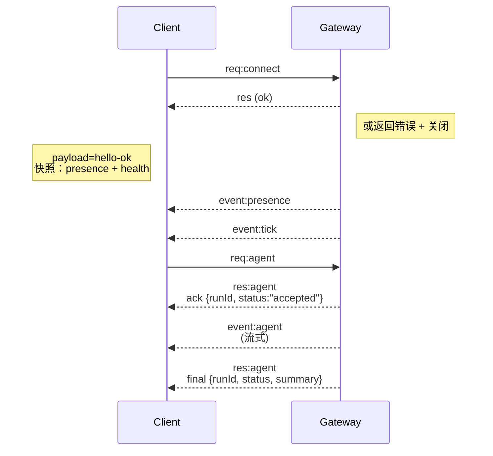

## 概览

- 单个长连接的 **网关（Gateway）** 负责所有消息面（WhatsApp 通过 Baileys，Telegram 通过 grammY，Slack，Discord，Signal，iMessage，WebChat）。
- 控制面客户端（macOS 应用、CLI、Web UI、自动化）通过配置的绑定主机上的 **WebSocket** 连接到网关（默认 `127.0.0.1:18789`）。
- **节点（Nodes）**（macOS/iOS/Android/无头模式）也通过 **WebSocket** 连接，但声明 `role: node`，并具有明确的能力/命令。
- 每个主机仅有一个网关；这是唯一能打开 WhatsApp 会话的位置。
- **画布主机（canvas host）** 由网关的 HTTP 服务器提供，路径为：
  - `/__openclaw__/canvas/`（代理可编辑的 HTML/CSS/JS）
  - `/__openclaw__/a2ui/`（A2UI 主机）
    使用与网关相同的端口（默认 `18789`）。

## 组件与流程

### 网关（守护进程）

- 维护供应商连接。
- 提供类型化的 WS API（请求、响应、服务器推送事件）。
- 根据 JSON Schema 验证入站帧。
- 发出如 `agent`、`chat`、`presence`、`health`、`heartbeat`、`cron` 等事件。

### 客户端（mac 应用 / CLI / Web 管理端）

- 每个客户端一个 WS 连接。
- 发送请求（`health`、`status`、`send`、`agent`、`system-presence`）。
- 订阅事件（`tick`、`agent`、`presence`、`shutdown`）。

### 节点（macOS / iOS / Android / 无头）

- 连接至 **同一 WS 服务器**，带 `role: node`。
- 在 `connect` 中提供设备身份；配对是**基于设备的**（角色 `node`），批准存储在设备配对存储中。
- 暴露命令如 `canvas.*`、`camera.*`、`screen.record`、`location.get`。

协议详情：

- [网关协议](/gateway/protocol)

### WebChat

- 静态 UI，使用网关 WS API 获取聊天历史并发送消息。
- 远程部署时通过与其他客户端相同的 SSH/Tailscale 隧道连接。

## 连接生命周期（单客户端）


```mermaid
sequenceDiagram
    participant Client
    participant Gateway

    Client->>Gateway: req:connect
    Gateway-->>Client: res (ok)
    Note right of Gateway: 或返回错误 + 关闭
    Note left of Client: payload=hello-ok<br>快照：presence + health

    Gateway-->>Client: event:presence
    Gateway-->>Client: event:tick

    Client->>Gateway: req:agent
    Gateway-->>Client: res:agent<br>ack {runId, status:"accepted"}
    Gateway-->>Client: event:agent<br>(流式)
    Gateway-->>Client: res:agent<br>final {runId, status, summary}
```

## 线协议（摘要）

- 传输：WebSocket，带有 JSON payload 的文本帧。
- 第一帧**必须**是 `connect`。
- 握手后：
  - 请求：`{type:"req", id, method, params}` → `{type:"res", id, ok, payload|error}`
  - 事件：`{type:"event", event, payload, seq?, stateVersion?}`
- `hello-ok.features.methods` / `events` 是发现元数据，而不是每个可调用辅助路由的生成转储。
- 共享密钥认证使用 `connect.params.auth.token` 或 `connect.params.auth.password`，具体取决于配置的网关认证模式。
- 携带身份的模式（如 Tailscale Serve (`gateway.auth.allowTailscale: true`) 或非回环 `gateway.auth.mode: "trusted-proxy"`）通过请求头满足认证，而不是 `connect.params.auth.*`。
- 私有入口 `gateway.auth.mode: "none"` 完全禁用共享密钥认证；请在公共/不可信入口上关闭该模式。
- 幂等键是副作用方法（`send`、`agent`）安全重试所必需的；服务器保留一个短生命周期的去重缓存。
- 节点必须在 `connect` 中包含 `role: "node"` 以及能力/命令/权限。

## 配对与本地信任

- 所有 WS 客户端（操作员 + 节点）在 `connect` 时包含一个 **设备身份**。
- 新设备 ID 需要配对批准；网关为后续连接颁发 **设备令牌**。
- 直接本地回环连接可以自动批准，以保持同主机用户体验流畅。
- OpenClaw 还有一个狭窄的后端/容器本地自连接路径，用于受信任的共享密钥辅助流程。
- Tailnet 和局域网连接，包括同主机 tailnet 绑定，仍然需要显式配对批准。
- 所有连接必须签署 `connect.challenge` nonce。
- 签名 payload `v3` 还绑定 `platform` + `deviceFamily`；网关在重连时固定配对元数据，并要求元数据更改时进行修复配对。
- **非本地** 连接仍然需要显式批准。
- 网关认证 (`gateway.auth.*`) 仍然适用于 **所有** 连接，无论是本地还是远程。

详情请见：[网关协议](/gateway/protocol)、[配对](/channels/pairing)、[安全](/gateway/security)。

## 协议类型与代码生成

- 使用 TypeBox schema 定义协议。
- 从 schema 生成 JSON Schema。
- 从 JSON Schema 生成 Swift 模型。

## 远程访问

- 推荐：Tailscale 或 VPN。
- 备选：SSH 隧道

  ```bash
  ssh -N -L 18789:127.0.0.1:18789 user@host
  ```

- 同样的握手和认证令牌适用于隧道连接。
- 远程部署中可以启用 TLS 和可选的证书绑定以保证 WS 连接安全。

## 运营快照

- 启动命令：`openclaw gateway`（前台，日志输出到 stdout）。
- 健康检查：通过 WS 发送 `health` 请求（也包含在 `hello-ok` 中）。
- 守护进程管理：使用 launchd/systemd 自动重启。

## 不变量

- 每台主机恰好有一个网关控制单个 Baileys 会话。
- 握手是强制的；任何非 JSON 或非 connect 首帧都将导致强制关闭。
- 事件不会重放；客户端必须在出现间隙时刷新。

## 相关内容

- [Agent 循环](/concepts/agent-loop) — 详细的 Agent 执行周期
- [网关协议](/gateway/protocol) — WebSocket 协议契约
- [队列](/concepts/queue) — 命令队列和并发
- [安全](/gateway/security) — 信任模型和加固
