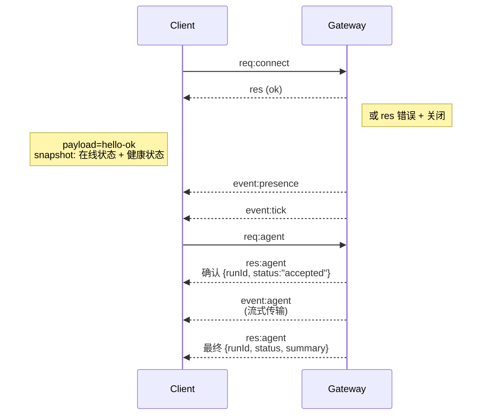

## 概览

- 一个长期运行的 **Gateway** 负责所有消息接入面（通过
  Baileys 的 WhatsApp、通过 grammY 的 Telegram、Slack、Discord、Signal、iMessage、WebChat）。
- 控制平面客户端（macOS 应用、CLI、Web UI、自动化）通过 **WebSocket** 连接到
  Gateway，连接地址为配置的绑定主机（默认
  `127.0.0.1:18789`）。
- **节点**（macOS/iOS/Android/headless）也通过 **WebSocket** 连接，但
  声明 `role: node`，并带有明确的能力/命令。
- 每台主机只运行一个 Gateway；只有它会打开 WhatsApp 会话。
- **画布主机**由 Gateway 的 HTTP 服务器提供，路径为：
  - `/__openclaw__/canvas/`（代理可编辑的 HTML/CSS/JS）
  - `/__openclaw__/a2ui/`（A2UI 主机）

  它使用与 Gateway 相同的端口（默认 `18789`）。

## 组件与流程

### Gateway（守护进程）

- 维护 provider 连接。
- 暴露类型化的 WS API（请求、响应、服务端推送事件）。
- 根据 JSON Schema 验证入站帧。
- 发出诸如 `agent`、`chat`、`presence`、`health`、`heartbeat`、`cron` 的事件。

### 客户端（mac 应用 / CLI / web 管理）

- 每个客户端一个 WS 连接。
- 发送请求（`health`、`status`、`send`、`agent`、`system-presence`）。
- 订阅事件（`tick`、`agent`、`presence`、`shutdown`）。

### Nodes（macOS / iOS / Android / 无头环境）

- 以 `role: node` 连接到 **同一个 WS 服务器**。
- 在 `connect` 中提供设备身份；配对是 **基于设备的**（role `node`），并且
  许可存放在设备配对存储中。
- 暴露诸如 `canvas.*`、`camera.*`、`screen.record`、`location.get` 的命令。

Protocol details: [Gateway 协议](/gateway/protocol)

### WebChat

- 使用 Gateway WS API 获取聊天历史并发送消息的静态 UI。
- 在远程部署中，通过与其他客户端相同的 SSH/Tailscale 隧道连接。

## 连接生命周期（单个客户端）


```mermaid
sequenceDiagram
    participant Client
    participant Gateway

    Client->>Gateway: req:connect
    Gateway-->>Client: res (ok)
    Note right of Gateway: 或 res 错误 + 关闭
    Note left of Client: payload=hello-ok<br>snapshot: 在线状态 + 健康状态

    Gateway-->>Client: event:presence
    Gateway-->>Client: event:tick

    Client->>Gateway: req:agent
    Gateway-->>Client: res:agent<br>确认 {runId, status:"accepted"}
    Gateway-->>Client: event:agent<br>(流式传输)
    Gateway-->>Client: res:agent<br>最终 {runId, status, summary}
```

## 线路协议（摘要）

- 传输：WebSocket，文本帧内承载 JSON payload。
- 首帧**必须**是 `connect`。
- 完成握手后：
  - 请求：`{type:"req", id, method, params}` → `{type:"res", id, ok, payload|error}`
  - 事件：`{type:"event", event, payload, seq?, stateVersion?}`
- `hello-ok.features.methods` / `events` 是发现元数据，而不是
  每一个可调用 helper 路由的生成式导出。
- 共享密钥认证使用 `connect.params.auth.token` 或
  `connect.params.auth.password`，具体取决于配置的 gateway auth 模式。
- 带身份模式，例如 Tailscale Serve
  （`gateway.auth.allowTailscale: true`）或非 loopback 的
  `gateway.auth.mode: "trusted-proxy"`，会通过请求头而不是
  `connect.params.auth.*` 满足认证。
- 私有入口的 `gateway.auth.mode: "none"` 会完全禁用共享密钥认证；
  请勿在公开/不受信任的入口上启用该模式。
- 对会产生副作用的方法（`send`、`agent`）需要幂等键，以便安全重试；
  服务器会维护一个短生命周期的去重缓存。
- Nodes 必须在 `connect` 中包含 `role: "node"` 以及 caps/commands/permissions。

## 配对与本地信任

- 所有 WS 客户端（操作员 + 节点）在 `connect` 时都包含一个 **设备身份**。
- 新设备 ID 需要配对批准；Gateway 会为后续连接发放一个 **设备令牌**。
- 直接的本地回环连接可以自动批准，以保持同主机 UX 的流畅性。
- OpenClaw 还提供一条窄范围的后端/容器本地自连接路径，用于受信任的共享密钥辅助流程。
- Tailnet 和 LAN 连接，包括同主机 tailnet 绑定，仍然需要显式的配对批准。
- 所有连接都必须对 `connect.challenge` nonce 进行签名。签名载荷 `v3` 还会绑定 `platform` 和 `deviceFamily`；网关在重新连接时会固定已配对的元数据，并且在元数据变更时要求重新配对修复。
- **非本地** 连接仍然需要显式批准。
- Gateway 认证（`gateway.auth.*`）仍然适用于**所有**连接，无论本地还是远程。

详情：[Gateway protocol](/gateway/protocol)、[Pairing](/channels/pairing)、
[Security](/gateway/security)。

## 协议类型与代码生成

- TypeBox schemas 定义协议。
- JSON Schema 从这些 schemas 生成。
- Swift models 从 JSON Schema 生成。

## 远程访问

- 首选：Tailscale 或 VPN。
- 替代方案：SSH 隧道

  ```bash
  ssh -N -L 18789:127.0.0.1:18789 user@gateway-host
  ```

- 隧道中仍适用相同的握手 + 认证令牌。
- 远程部署中的 WS 可启用 TLS + 可选 pinning。

## 运行概览

- 启动：`openclaw gateway`（前台运行，日志输出到 stdout）。
- 健康检查：通过 WS 的 `health`（也会包含在 `hello-ok` 中）。
- 守护：使用 launchd/systemd 自动重启。

## 不变量

- 每台主机上仅有一个 Gateway 控制一个 Baileys 会话。
- 握手是强制的；任何非 JSON 或首帧非 connect 都会被硬关闭。
- 事件不会被重放；客户端在出现缺口时必须刷新。

## 相关内容

- [Agent Loop](/concepts/agent-loop) — 详细的 agent 执行周期
- [Gateway Protocol](/gateway/protocol) — WebSocket 协议契约
- [Queue](/concepts/queue) — 命令队列与并发
- [Security](/gateway/security) — 信任模型与加固
