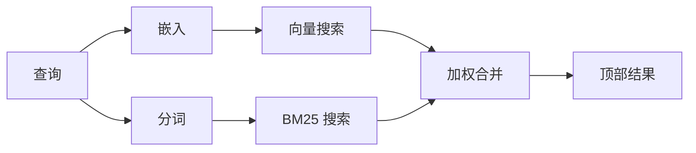

`memory_search` 会从你的记忆文件中查找相关笔记，即使措辞与原文不同也能找到。它的工作方式是将记忆索引为小块，并使用嵌入、关键词，或两者结合进行搜索。

## 快速开始

默认情况下，Memory search 使用 OpenAI 嵌入。若要使用其他嵌入后端，请显式设置提供方：

```json5
{
  agents: {
    defaults: {
      memorySearch: {
        provider: "openai", // 或 "gemini"、"local"、"ollama"、"openai-compatible" 等。
      },
    },
  },
}
```

对于带有 memory 专用提供方的多端点配置，`provider` 也可以是自定义的 `models.providers.<id>` 条目，例如 `ollama-5080`，前提是该提供方设置了 `api: "ollama"` 或其他 memory 嵌入适配器所有者。

对于没有 API key 的本地嵌入，请设置 `provider: "local"`。源代码检出
可能仍需要原生构建审批：`pnpm approve-builds` 然后
`pnpm rebuild node-llama-cpp`。

某些与 OpenAI 兼容的嵌入端点需要不对称标签，例如用于搜索的 `input_type: "query"`，以及用于已索引块的 `input_type: "document"` 或 `"passage"`。请通过 `memorySearch.queryInputType` 和 `memorySearch.documentInputType` 进行配置；参见 [Memory 配置参考](/reference/memory-config#provider-specific-config)。

## 支持的提供方

| Provider          | ID                  | Needs API key | Notes                         |
| ----------------- | ------------------- | ------------- | ----------------------------- |
| Bedrock           | `bedrock`           | No            | Uses AWS credential chain     |
| DeepInfra         | `deepinfra`         | Yes           | Default: `BAAI/bge-m3`        |
| Gemini            | `gemini`            | Yes           | Supports image/audio indexing |
| GitHub Copilot    | `github-copilot`    | No            | Uses Copilot subscription     |
| Local             | `local`             | No            | GGUF model, ~0.6 GB download  |
| Mistral           | `mistral`           | Yes           |                               |
| Ollama            | `ollama`            | No            | Local/self-hosted             |
| OpenAI            | `openai`            | Yes           | Default                       |
| OpenAI-compatible | `openai-compatible` | Usually       | Generic `/v1/embeddings`      |
| Voyage            | `voyage`            | Yes           |                               |

## 搜索如何工作

OpenClaw 会并行运行两条检索路径，并合并结果：



- **向量搜索** 会找到语义相近的笔记（“gateway host” 可以匹配 “运行 OpenClaw 的机器”）。
- **BM25 关键词搜索** 会找到精确匹配项（ID、错误字符串、配置键）。

如果只有一条路径可用，另一条就会单独运行。刻意的仅 FTS 模式（`provider: "none"`）以及自动/默认提供方选择，在嵌入不可用时仍可使用词法排序。

显式的非本地嵌入提供方有所不同。如果你将 `memorySearch.provider` 设置为一个具体的远程提供方，而该提供方在运行时不可用，`memory_search` 会将记忆报告为不可用，而不是静默退回到仅 FTS 结果。这样可以让配置损坏的语义提供方保持可见。若要有意进行仅 FTS 的召回，请设置 `provider: "none"`；或者修复提供方/认证配置以恢复语义排序。

## 提升搜索质量

当你有大量笔记历史时，两个可选功能会有所帮助：

### 时间衰减

旧笔记会逐渐失去排名权重，因此最近的信息会优先显示。默认半衰期为 30 天时，上个月的笔记得分会降至原始权重的 50%。像 `MEMORY.md` 这样的常青文件不会衰减。

<Tip>
如果你的代理有数月的每日笔记，而且过时信息总是排在最新上下文之前，请启用时间衰减。
</Tip>

### MMR（多样性）

减少重复结果。如果有五条笔记都提到了同一个路由器配置，MMR 会确保顶部结果覆盖不同主题，而不是重复。

<Tip>
如果 `memory_search` 总是从不同的每日笔记中返回几乎重复的片段，请启用 MMR。
</Tip>

### 同时启用两者

```json5
{
  agents: {
    defaults: {
      memorySearch: {
        query: {
          hybrid: {
            mmr: { enabled: true },
            temporalDecay: { enabled: true },
          },
        },
      },
    },
  },
}
```

## 多模态记忆

使用 Gemini Embedding 2，你可以将图像和音频文件与 Markdown 一起索引。搜索查询仍然是文本，但它们可以匹配视觉和音频内容。有关设置，请参见 [Memory 配置参考](/reference/memory-config)。

## 会话记忆搜索

你可以选择性地索引会话转录内容，这样 `memory_search` 就能回忆更早的对话。该功能通过 `memorySearch.experimental.sessionMemory` 开启。详情请参见 [配置参考](/reference/memory-config)。

## 故障排查

**没有结果？** 运行 `openclaw memory status` 检查索引。如果为空，运行 `openclaw memory index --force`。

**只有关键词匹配？** 你的嵌入提供方可能尚未配置。检查 `openclaw memory status --deep`。

**本地嵌入超时？** 默认情况下，`ollama`、`lmstudio` 和 `local` 使用更长的内联批处理超时时间。如果主机只是较慢，请设置 `agents.defaults.memorySearch.sync.embeddingBatchTimeoutSeconds` 然后重新运行 `openclaw memory index --force`。

**CJK 文本找不到？** 使用 `openclaw memory index --force` 重建 FTS 索引。

## 延伸阅读

- [Active Memory](/concepts/active-memory) -- 用于交互式聊天会话的子代理记忆
- [Memory](/concepts/memory) -- 文件布局、后端、工具
- [Memory configuration reference](/reference/memory-config) -- 所有配置选项

## 相关内容

- [Memory overview](/concepts/memory)
- [Active memory](/concepts/active-memory)
- [Builtin memory engine](/concepts/memory-builtin)
