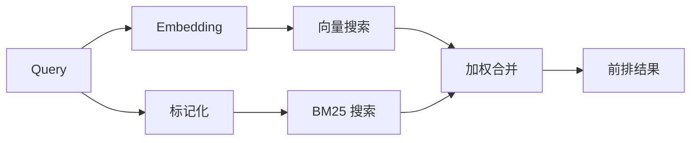

`memory_search` 会从你的 memory 文件中查找相关笔记，即使措辞与原文不同也是如此。它会将 memory 分块为较小的片段，并使用嵌入、关键词或两者进行搜索。

## 快速开始

OpenClaw 默认使用 OpenAI embeddings。要使用其他提供商，请显式设置它：

```json5
{
  memory: {
    search: {
      provider: "openai", // 或 "gemini"、"voyage"、"mistral"、"bedrock"、"local"、"ollama"、"lmstudio"、"github-copilot"、"openai-compatible"
    },
  },
}
```

`provider` 也可以引用自定义的 `models.providers.<id>` 条目（例如
`ollama-5080`），前提是该条目将 `api` 设置为 `"ollama"`，或设置为另一个带有内存嵌入适配器的 provider id。

对于没有 API key 的本地 embeddings，请安装官方的 llama.cpp provider
插件并设置 `provider: "local"`：

```bash
openclaw plugins install @openclaw/llama-cpp-provider
```

源码检出仍然需要本地构建审批：`pnpm approve-builds`，然后执行
`pnpm rebuild node-llama-cpp`。

某些与 OpenAI 兼容的 embedding 端点需要不对称的 `input_type`
标签，例如搜索使用 `"query"`，而索引块使用 `"document"`/`"passage"`。
请使用 `queryInputType` 和 `documentInputType` 来设置它们；请参阅
[内存配置参考](/reference/memory-config#provider-specific-config)。

## 支持的提供方

| 提供方              | ID                  | 需要 API key | 备注                              |
| ------------------- | ------------------- | ------------ | --------------------------------- |
| Bedrock             | `bedrock`           | 否           | 使用 AWS 凭证链                   |
| DeepInfra           | `deepinfra`         | 是           | 默认模型 `BAAI/bge-m3`            |
| Gemini              | `gemini`             | 是           | 支持图片/音频索引                  |
| GitHub Copilot      | `github-copilot`     | 否           | 使用你的 Copilot 订阅              |
| 本地                | `local`             | 否           | GGUF 模型，约 0.6 GB 自动下载      |
| LM Studio           | `lmstudio`          | 否           | 本地/自托管服务器                  |
| Mistral             | `mistral`           | 是           |                                   |
| Ollama              | `ollama`            | 否           | 本地/自托管服务器                  |
| OpenAI              | `openai`            | 是           | 默认                               |
| OpenAI 兼容         | `openai-compatible`  | 通常需要      | 通用 `/v1/embeddings` 端点         |
| Voyage              | `voyage`            | 是           |                                   |

## 搜索如何工作

OpenClaw 会并行运行两条检索路径，并合并结果：



- **向量搜索** 匹配相似含义（“gateway host” 匹配 “the
  machine running OpenClaw”）。
- **BM25 关键词搜索** 匹配精确术语（ID、错误字符串、配置
  键）。
- **文件名搜索** 将路径与笔记正文分开索引。完整的精确路径、基名以及文件名词干的排名高于部分路径匹配，而摘要和正文关键词分数仍然来自笔记内容。

如果只有一条路径可用，另一条将单独运行。

内置引擎随后应用确定性的排序：

```text
hybrid relevance × recency decay × importance multiplier
```

重要性只在条目被写入时评估一次，而写入该条目的记忆工作流中已经有模型参与。如果缺少重要性，则视为中性，因此现有索引会保留其之前的相关性信号。带日期的日记笔记会按照 30 天半衰期衰减；像 `MEMORY.md` 和 `USER.md` 这样的整理文件则始终有效。这沿用了 [Generative Agents (arXiv:2304.03442)](https://arxiv.org/abs/2304.03442) 中相关性、时效性和重要性的结果，但没有增加一次查询时的模型调用。

## 确定性触发词召回

在符合条件的交互轮次中，内置引擎还会将传入消息与存储在已索引条目中的短触发短语进行比较。强匹配可以在回复前向隐藏上下文中添加最多三条精简条目。预过滤使用现有的关键词和向量检索路径，不会运行召回模型。

自动注入的范围刻意比 `memory_search` 更窄：只有已提升、受信任的条目才符合条件。在可用索引来源信息之前，这意味着仅来自根目录 `MEMORY.md` 和 `USER.md` 的条目。日记、导入的转录文本以及会话转录文本仍可通过显式记忆工具或 Active Memory 升级来访问，但绝不会自动注入。

**仅 FTS 模式。** 将 `provider: "none"` 设为值即可有意禁用嵌入，并仅使用关键词搜索。将 `provider` 留空或设为 `"auto"` 时，如果未配置嵌入认证，也会在不报错的情况下回退到仅关键词排序；当 `provider: "local"`（GGUF/llama.cpp 提供方）失败时也是如此。

**显式提供方不可用。** 如果你显式指定了其他任何提供方（例如 `openai`、`ollama`、`gemini`），并且它在请求时变得不可用（认证错误、网络故障），`memory_search` 会报告记忆不可用，而不是静默降级为仅 FTS 结果。这样可以让已损坏的已配置提供方保持可见。若要有意进行仅 FTS 的召回，请设置 `provider: "none"`；或者修复提供方/认证配置以恢复语义排名。

## 提升搜索质量

两个可选功能有助于处理大量笔记历史。

### 新近度衰减

旧笔记会逐渐失去排名权重，因此较新的信息会优先显示。
在默认的 30 天半衰期下，来自上个月的笔记得分为其原始权重的 50%。
`MEMORY.md` 和 `memory/` 下其他未标注日期的文件会长期保留，不会衰减；只有带日期的 `memory/YYYY-MM-DD.md` 文件会衰减。

### MMR（多样性）

减少重复结果。如果有五条笔记都提到了同一个路由器配置，MMR 会确保顶部结果覆盖不同主题，而不是重复出现。

<Tip>
如果 `memory_search` 不断从不同的每日笔记中返回几乎重复的片段，就启用这个功能。
</Tip>

## 多模态记忆

使用 `gemini-embedding-2-preview`，你可以将图像和音频与
Markdown 一起建立索引。这仅适用于 `memory.search.extraPaths` 下的文件；默认
记忆根目录（`MEMORY.md`、`memory/*.md`）仍然仅支持 Markdown。搜索查询
仍然是文本，但它们也会与视觉和音频内容进行匹配。有关
设置，请参阅 [记忆配置参考](/reference/memory-config#multimodal-memory-gemini)。

## 会话记忆搜索

如需从会话转录中进行精确的全文回忆，请使用 [`sessions_search`](/concepts/session-search)
，然后再通过 `sessions_history` 打开结果。会话记忆搜索仍然是语义化的、
实验性的补充功能。

也可以选择索引会话转录，以便 `memory_search` 回忆更早的
对话。这是可选功能：设置 `experimental.sessionMemory: true` 并将
`"sessions"` 添加到 `sources` 中（默认的 `sources` 为 `["memory"]`）。

会话命中遵循 `tools.sessions.visibility`：默认的 `"tree"` 会公开
当前会话、它派生出的会话，以及通过环境组感知被监视的同一代理组会话。
在 `session.dmScope: "main"` 下，多用户 DM 设置会共享该主会话，因此路由到那里
的用户可以回忆其所监视组中的内容。若要实现 DM 隔离，请为每个对等方
使用单独的 `dmScope`，或者将 visibility 设为 `"self"` 以退出环境式被监视会话读取。
其他无关的同一代理会话仍然需要 `"agent"` 级可见性。

使用 QMD 后端时，还需要设置 `memory.qmd.sessions.enabled: true`，这样
转录内容才会导出到 QMD 集合；仅设置 `experimental.sessionMemory`
和 `sources` 并不会将转录内容导出到 QMD。参见
[配置参考](/reference/memory-config#session-memory-search-experimental)。

## 故障排查

**没有结果？** 运行 `openclaw memory status` 检查索引。如果为空，运行 `openclaw memory index --force`。

**只有关键词匹配？** 你的嵌入提供方可能尚未配置。检查 `openclaw memory status --deep`。

**本地嵌入超时？** `ollama`、`lmstudio` 和 `local` 使用更长的
提供方拥有的批处理截止时间。检查提供方健康状态并重新运行
`openclaw memory index --force`。

**找不到 CJK 文本？** 使用 `openclaw memory index --force` 重建 FTS 索引。

## 相关内容

- [内存概述](/concepts/memory)
- [活动内存](/concepts/active-memory)
- [内置内存引擎](/concepts/memory-builtin)
- [内存配置参考](/reference/memory-config)
