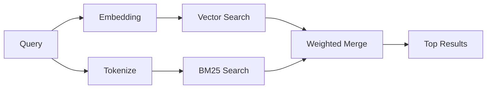

`memory_search` 会从你的记忆文件中找到相关笔记，即使措辞与原文不同也能匹配。它通过将记忆索引为小块，并使用嵌入、关键词或二者结合进行搜索来工作。

## 快速开始

如果你已经配置了 GitHub Copilot 订阅，或 OpenAI、Gemini、Voyage、Mistral 的 API key，记忆搜索会自动工作。若要显式指定 provider：

```json5
{
  agents: {
    defaults: {
      memorySearch: {
        provider: "openai", // 或 "gemini", "local", "ollama" 等
      },
    },
  },
}
```

对于无需 API 密钥的本地嵌入，使用 `provider: "local"`（需要 node-llama-cpp）。

一些 OpenAI 兼容的嵌入端点需要非对称标签，例如搜索使用 `input_type: "query"`，而索引块使用 `input_type: "document"` 或 `"passage"`。
请使用 `memorySearch.queryInputType` 和 `memorySearch.documentInputType` 进行配置；请参阅 [记忆配置参考](/reference/memory-config#provider-specific-config)。

## 支持的提供商

| 提供商 | ID | 需要 API key | 备注 |
| ------ | -- | ------------ | ---- |
| Bedrock | `bedrock` | 否 | 当 AWS 凭证链可解析时自动检测 |
| Gemini | `gemini` | 是 | 支持图像/音频索引 |
| GitHub Copilot | `github-copilot` | 否 | 自动检测，使用 Copilot 订阅 |
| Local | `local` | 否 | GGUF 模型，约 0.6 GB 下载 |
| Mistral | `mistral` | 是 | 自动检测 |
| Ollama | `ollama` | 否 | 本地模式，需显式设置 |
| OpenAI | `openai` | 是 | 自动检测，速度快 |
| Voyage | `voyage` | 是 | 自动检测 |

## 搜索工作原理

OpenClaw 并行运行两个检索路径并合并结果：



- **向量搜索** 找到含义相似的笔记（"网关主机" 匹配 "运行 OpenClaw 的机器"）。
- **BM25 关键词搜索** 找到精确匹配（ID、错误字符串、配置键）。

如果只有一条路径可用（无嵌入或无 FTS），另一条单独运行。

当嵌入不可用时，OpenClaw 仍然对全文搜索（FTS）结果使用词汇排名，而不是仅回退到原始的精确匹配排序。这种降级模式会提升具有更强查询词覆盖率和相关文件路径的块，即使没有 `sqlite-vec` 或嵌入提供商，也能保持召回有用。

## 提高搜索质量

当你拥有大量笔记历史时，两个可选功能会有帮助：

### 时间衰减

旧笔记逐渐失去排名权重，以便最近的信息优先显示。默认半衰期为 30 天，上个月的笔记得分为其原始权重的 50%。像 `MEMORY.md` 这样的常绿文件永远不会衰减。

<Tip>
如果你的代理有数月的每日笔记且过时信息不断排名高于最近上下文，请启用时间衰减。
</Tip>

### MMR（多样性）

减少冗余结果。如果五篇笔记都提到相同的路由器配置，MMR 确保顶部结果涵盖不同主题而不是重复。

<Tip>
如果 `memory_search` 不断返回来自不同每日笔记的近似重复片段，请启用 MMR。
</Tip>

### 同时启用

```json5
{
  agents: {
    defaults: {
      memorySearch: {
        query: {
          hybrid: {
            mmr: { enabled: true },
            temporalDecay: { enabled: true },
          },
        },
      },
    },
  },
}
```

## 多模态记忆

使用 Gemini Embedding 2，你可以将图像和音频文件与 Markdown 一起索引。搜索查询保持为文本，但它们会与视觉和音频内容匹配。请参阅 [记忆配置参考](/reference/memory-config) 了解设置。

## 会话记忆搜索

你可以选择索引会话转录，以便 `memory_search` 可以回忆早期的对话。这是通过 `memorySearch.experimental.sessionMemory` 选择的。请参阅 [配置参考](/reference/memory-config) 了解详情。

## 故障排除

**没有结果？** 运行 `openclaw memory status` 检查索引。如果为空，运行 `openclaw memory index --force`。

**只有关键词匹配？** 你的嵌入提供商可能未配置。检查 `openclaw memory status --deep`。

**找不到 CJK 文本？** 使用 `openclaw memory index --force` 重建 FTS 索引。

## 进一步阅读

- [Active Memory](/concepts/active-memory) -- 交互式聊天会话的子代理记忆
- [Memory](/concepts/memory) -- 文件布局、后端、工具
- [Memory configuration reference](/reference/memory-config) -- 所有配置选项

## Related

- [Memory overview](/concepts/memory)
- [Active memory](/concepts/active-memory)
- [Builtin memory engine](/concepts/memory-builtin)
