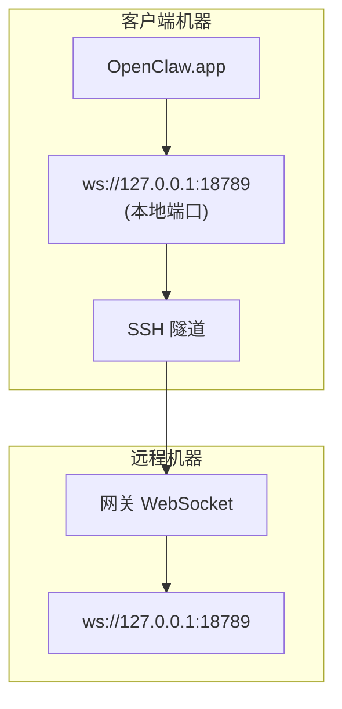

# 使用远程网关运行 OpenClaw.app

OpenClaw.app 使用 SSH 隧道连接到远程网关。本指南将指导你如何设置。

## 概述



## 快速设置

### 步骤 1：添加 SSH 配置

编辑 `~/.ssh/config` 并添加：

```ssh
Host remote-gateway
    HostName <REMOTE_IP>          # 例如，172.27.187.184
    User <REMOTE_USER>            # 例如，jefferson
    LocalForward 18789 127.0.0.1:18789
    IdentityFile ~/.ssh/id_rsa
```

将 `<REMOTE_IP>` 和 `<REMOTE_USER>` 替换为你的实际值。

### 步骤 2：复制 SSH 密钥

将你的公钥复制到远程机器（仅需输入密码一次）：

```bash
ssh-copy-id -i ~/.ssh/id_rsa <REMOTE_USER>@<REMOTE_IP>
```

### 步骤 3：设置网关令牌

```bash
launchctl setenv OPENCLAW_GATEWAY_TOKEN "<your-token>"
```

### 步骤 4：启动 SSH 隧道

```bash
ssh -N remote-gateway &
```

### 步骤 5：重新启动 OpenClaw.app

```bash
# 退出 OpenClaw.app (⌘Q)，然后重新打开：
open /path/to/OpenClaw.app
```

此时应用将通过 SSH 隧道连接到远程网关。

---

## 登录时自动启动隧道

要在登录时自动启动 SSH 隧道，请创建一个 Launch Agent。

### 创建 PLIST 文件

保存为 `~/Library/LaunchAgents/ai.openclaw.ssh-tunnel.plist`：

```xml
<?xml version="1.0" encoding="UTF-8"?>
<!DOCTYPE plist PUBLIC "-//Apple//DTD PLIST 1.0//EN" "http://www.apple.com/DTDs/PropertyList-1.0.dtd">
<plist version="1.0">
<dict>
    <key>Label</key>
    <string>ai.openclaw.ssh-tunnel</string>
    <key>ProgramArguments</key>
    <array>
        <string>/usr/bin/ssh</string>
        <string>-N</string>
        <string>remote-gateway</string>
    </array>
    <key>KeepAlive</key>
    <true/>
    <key>RunAtLoad</key>
    <true/>
</dict>
</plist>
```

### 加载 Launch Agent

```bash
launchctl bootstrap gui/$UID ~/Library/LaunchAgents/ai.openclaw.ssh-tunnel.plist
```

隧道将会：

- 在你登录时自动启动
- 崩溃时自动重启
- 在后台保持运行

遗留说明：如果存在旧的 `com.openclaw.ssh-tunnel` LaunchAgent，请将其移除。

---

## 故障排除

**检查隧道是否运行：**

```bash
ps aux | grep "ssh -N remote-gateway" | grep -v grep
lsof -i :18789
```

**重启隧道：**

```bash
launchctl kickstart -k gui/$UID/ai.openclaw.ssh-tunnel
```

**停止隧道：**

```bash
launchctl bootout gui/$UID/ai.openclaw.ssh-tunnel
```

---

## 工作原理

| 组件                             | 功能说明                             |
| -------------------------------- | ---------------------------------- |
| `LocalForward 18789 127.0.0.1:18789` | 将本地端口 18789 转发到远程端口 18789 |
| `ssh -N`                        | 建立不执行远程命令的 SSH 连接（只做端口转发） |
| `KeepAlive`                     | 隧道崩溃时自动重启                   |
| `RunAtLoad`                     | 启动 Agent 时自动启动隧道             |

OpenClaw.app 连接其客户端机器上的 `ws://127.0.0.1:18789`。SSH 隧道将该连接转发到远程机器上运行网关的 18789 端口。
