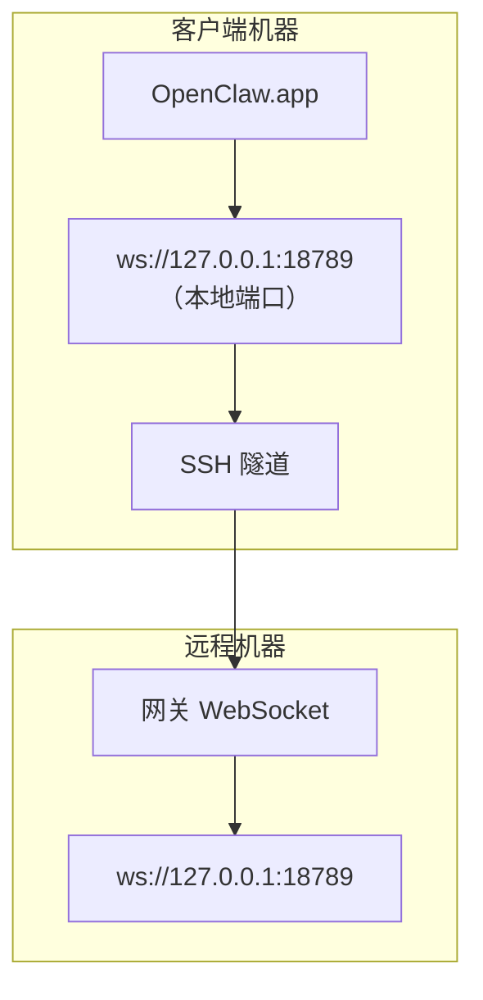

<Note>
此内容现已迁移至 [远程访问](/gateway/remote#macos-persistent-ssh-tunnel-via-launchagent)。当前指南请使用该页面；此页面保留为重定向目标。
</Note>

# 使用远程网关运行 OpenClaw.app

OpenClaw.app 通过 SSH 隧道连接到远程网关：SSH `LocalForward` 将本地端口映射到远程主机上的网关 WebSocket 端口。

```mermaid
flowchart TB
    subgraph Client["客户端机器"]
        direction TB
        A["OpenClaw.app"]
        B["ws://127.0.0.1:18789\n（本地端口）"]
        T["SSH 隧道"]

        A --> B
        B --> T
    end
    subgraph Remote["远程机器"]
        direction TB
        C["网关 WebSocket"]
        D["ws://127.0.0.1:18789"]

        C --> D
    end
    T --> C
```

## 设置

1. 添加一个 SSH 配置项，使用 `LocalForward 18789 127.0.0.1:18789`（完整配置块请参见 [远程访问](/gateway/remote#macos-persistent-ssh-tunnel-via-launchagent)）。
2. 使用 `ssh-copy-id` 将你的 SSH 密钥复制到远程主机。
3. 通过 `openclaw config set gateway.remote.token "<your-token>"` 设置 `gateway.remote.token`（或 `gateway.remote.password`）。
4. 启动隧道：`ssh -N remote-gateway &`。
5. 退出并重新打开 OpenClaw.app。

如果你需要一个能够在重启后继续存在并自动重新连接的隧道，请改用 [远程访问](/gateway/remote#macos-persistent-ssh-tunnel-via-launchagent) 页面上的 LaunchAgent 设置，而不是手动使用 `ssh -N`。

## 工作原理

| 组件                                 | 它的作用                                                     |
| ------------------------------------ | ------------------------------------------------------------ |
| `LocalForward 18789 127.0.0.1:18789` | 将本地端口 18789 转发到远程端口 18789                         |
| `ssh -N`                             | 不执行远程命令的 SSH（仅端口转发）                             |
| `KeepAlive`                          | 如果隧道崩溃，则自动重启隧道（LaunchAgent）                   |
| `RunAtLoad`                          | 当 LaunchAgent 加载时启动隧道（LaunchAgent）                   |

OpenClaw.app 在客户端连接到 `ws://127.0.0.1:18789`。该隧道会将这个连接转发到运行 Gateway 的远程主机上的 18789 端口。

## 相关内容

- [远程访问](/gateway/remote)
- [Tailscale](/gateway/tailscale)
