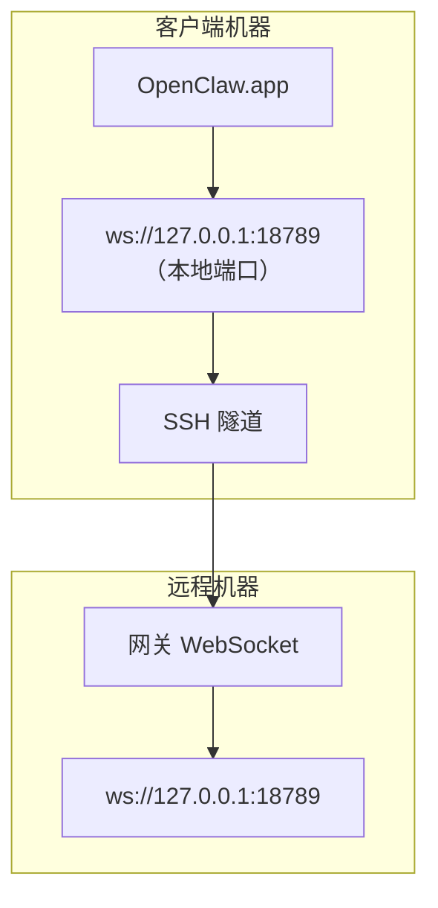

> 此内容已合并到 [远程访问](/gateway/remote#macos-persistent-ssh-tunnel-via-launchagent)。当前指南请参见该页面。

# 使用远程网关运行 OpenClaw.app

OpenClaw.app 使用 SSH 隧道连接到远程网关。本指南将向你展示如何进行设置。

## 概览


```mermaid
flowchart TB
    subgraph Client["客户端机器"]
        direction TB
        A["OpenClaw.app"]
        B["ws://127.0.0.1:18789\n（本地端口）"]
        T["SSH 隧道"]

        A --> B
        B --> T
    end
    subgraph Remote["远程机器"]
        direction TB
        C["网关 WebSocket"]
        D["ws://127.0.0.1:18789"]

        C --> D
    end
    T --> C
```

## 快速设置

### 第 1 步：添加 SSH 配置

编辑 `~/.ssh/config` 并添加：

```ssh
Host remote-gateway
    HostName <REMOTE_IP>          # 例如：172.27.187.184
    User <REMOTE_USER>            # 例如：jefferson
    LocalForward 18789 127.0.0.1:18789
    IdentityFile ~/.ssh/id_rsa
```

将 `<REMOTE_IP>` 和 `<REMOTE_USER>` 替换为你的值。

### 第 2 步：复制 SSH 密钥

将你的公钥复制到远程机器（输入一次密码）：

```bash
ssh-copy-id -i ~/.ssh/id_rsa <REMOTE_USER>@<REMOTE_IP>
```

### 第 3 步：配置远程网关认证

```bash
openclaw config set gateway.remote.token "<your-token>"
```

如果你的远程网关使用密码认证，请改用 `gateway.remote.password`。
`OPENCLAW_GATEWAY_TOKEN` 仍可作为 shell 级覆盖项使用，但持久化的
远程客户端配置是 `gateway.remote.token` / `gateway.remote.password`。

### 第 4 步：启动 SSH 隧道

```bash
ssh -N remote-gateway &
```

### 第 5 步：重启 OpenClaw.app

```bash
# 退出 OpenClaw.app（⌘Q），然后重新打开：
open /path/to/OpenClaw.app
```

现在应用将通过 SSH 隧道连接到远程网关。

---

## 登录时自动启动隧道

要让 SSH 隧道在你登录时自动启动，请创建一个 Launch Agent。

### 创建 PLIST 文件

将其保存为 `~/Library/LaunchAgents/ai.openclaw.ssh-tunnel.plist`：

```xml
<?xml version="1.0" encoding="UTF-8"?>
<!DOCTYPE plist PUBLIC "-//Apple//DTD PLIST 1.0//EN" "http://www.apple.com/DTDs/PropertyList-1.0.dtd">
<plist version="1.0">
<dict>
    <key>Label</key>
    <string>ai.openclaw.ssh-tunnel</string>
    <key>ProgramArguments</key>
    <array>
        <string>/usr/bin/ssh</string>
        <string>-N</string>
        <string>remote-gateway</string>
    </array>
    <key>KeepAlive</key>
    <true/>
    <key>RunAtLoad</key>
    <true/>
</dict>
</plist>
```

### 加载 Launch Agent

```bash
launchctl bootstrap gui/$UID ~/Library/LaunchAgents/ai.openclaw.ssh-tunnel.plist
```

现在隧道将会：

- 在你登录时自动启动
- 在崩溃时重启
- 在后台持续运行

旧版说明：如果存在任何遗留的 `com.openclaw.ssh-tunnel` LaunchAgent，请将其移除。

---

## 故障排除

**检查隧道是否正在运行：**

```bash
ps aux | grep "ssh -N remote-gateway" | grep -v grep
lsof -i :18789
```

**重启隧道：**

```bash
launchctl kickstart -k gui/$UID/ai.openclaw.ssh-tunnel
```

**停止隧道：**

```bash
launchctl bootout gui/$UID/ai.openclaw.ssh-tunnel
```

---

## 工作原理

| 组件                                 | 作用                                                         |
| ------------------------------------ | ------------------------------------------------------------ |
| `LocalForward 18789 127.0.0.1:18789` | 将本地端口 18789 转发到远程端口 18789                         |
| `ssh -N`                             | 不执行远程命令的 SSH（仅进行端口转发）                        |
| `KeepAlive`                          | 如果隧道崩溃，则自动重启                                     |
| `RunAtLoad`                          | 在 agent 加载时启动隧道                                      |

OpenClaw.app 会连接到你客户端机器上的 `ws://127.0.0.1:18789`。SSH 隧道会将该连接转发到运行网关的远程机器上的 18789 端口。

## 相关内容

- [远程访问](/gateway/remote)
- [Tailscale](/gateway/tailscale)
