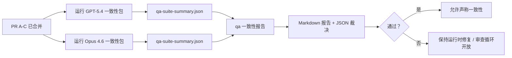

本说明解释了如何将 GPT-5.4 / Codex 一致性计划作为四个合并单元来审查，而不会丢失原始的六契约架构。

## 合并单元

### PR A：严格代理执行

负责：

- `executionContract`
- GPT-5 优先的同一轮次跟进
- `update_plan` 作为非终端进度跟踪
- 明确的阻塞状态，而非仅计划的静默停止

不负责：

- auth/runtime 失败分类
- 权限真实性
- 重放/继续重新设计
- 一致性基准测试

### PR B：运行时真实性

负责：

- Codex OAuth 范围正确性
- 类型化 provider/runtime 失败分类
- 真实的 `/elevated full` 可用性及阻塞原因

不负责：

- 工具 schema 规范化
- 重放/存活状态
- 基准测试门禁

### PR C：执行正确性

负责：

- provider 拥有的 OpenAI/Codex 工具兼容性
- 无参数严格 schema 处理
- replay-invalid 状态暴露
- 暂停、阻塞和废弃的长任务状态可见性

不负责：

- 自选继续
- provider hooks 之外的通用 Codex 方言行为
- 基准测试门禁

### PR D：一致性测试框架

负责：

- 第一波 GPT-5.4 vs Opus 4.6 场景包
- 一致性文档
- 一致性报告和发布门禁机制

不负责：

- QA-lab 之外的运行时行为变更
- 测试框架内部的 auth/proxy/DNS 模拟

## 映射回原始六个契约

| 原始契约                                 | 合并单元 |
| ---------------------------------------- | ---------- |
| Provider 传输/auth 正确性                | PR B       |
| 工具契约/schema 兼容性                   | PR C       |
| 同一轮次执行                             | PR A       |
| 权限真实性                               | PR B       |
| 重放/继续/存活正确性                     | PR C       |
| 基准测试/发布门禁                        | PR D       |

## 审查顺序

1. PR A
2. PR B
3. PR C
4. PR D

PR D 是证明层。它不应成为运行时正确性 PR 延迟的原因。

## 审查要点

### PR A

- GPT-5 运行表现为执行或失败关闭，而非停在评论阶段
- `update_plan` 不再单独看起来像进度
- 行为保持 GPT-5 优先且 embedded-Pi 范围内

### PR B

- auth/proxy/runtime 失败不再归并为通用的“模型失败”处理
- `/elevated full` 仅在实际可用时才描述为可用
- 阻塞原因对模型和用户面向的运行时均可见

### PR C

- 严格 OpenAI/Codex 工具注册行为可预测
- 无参数工具不会失败严格 schema 检查
- 重放和压缩结果保留真实的存活状态

### PR D

- 场景包可理解且可复现
- 包包含可变的重放安全通道，不仅是只读流
- 报告可供人类和自动化读取
- 一致性主张有证据支持，而非轶事

PR D 的预期产物：

- 针对每次模型运行的 `qa-suite-report.md` / `qa-suite-summary.json`
- 包含聚合和场景级比较的 `qa-agentic-parity-report.md`
- 包含机器可读裁决的 `qa-agentic-parity-summary.json`

## 发布门禁

在以下情况之前，不要声称 GPT-5.4 相对于 Opus 4.6 具有一致性或优越性：

- PR A、PR B 和 PR C 已合并
- PR D 干净地运行第一波一致性包
- 运行时真实性回归套件保持绿色（通过）
- 一致性报告显示无假成功案例且停止行为无回归

一致性测试框架并非唯一的证据来源。在审查中保持这种划分明确：

- PR D 负责基于场景的 GPT-5.4 vs Opus 4.6 比较
- PR B 确定性套件仍负责 auth/proxy/DNS 和全访问真实性证据

## 目标到证据映射

| 完成门禁项                               | 主要负责人 | 审查产物                                                          |
| ---------------------------------------- | ------------- | ------------------------------------------------------------------- |
| 无仅计划停滞                             | PR A          | strict-agentic 运行时测试和 `approval-turn-tool-followthrough`      |
| 无假进度或假工具完成                     | PR A + PR D   | 一致性假成功计数加场景级报告详情                                    |
| 无错误 `/elevated full` 指导             | PR B          | 确定性运行时真实性套件                                              |
| 重放/存活失败保持明确                    | PR C + PR D   | lifecycle/replay 套件加 `compaction-retry-mutating-tool`            |
| GPT-5.4 匹配或优于 Opus 4.6              | PR D          | `qa-agentic-parity-report.md` 和 `qa-agentic-parity-summary.json`   |

## 审查者简写：之前 vs 之后

| 之前用户可见问题                                 | 之后审查信号                                                                            |
| ----------------------------------------------------------- | --------------------------------------------------------------------------------------- |
| GPT-5.4 在规划后停止                                         | PR A 显示执行或阻塞行为，而不是仅评论完成                                           |
| 严格 OpenAI/Codex schema 下工具使用显得脆弱                 | PR C 保持工具注册和无参数调用的可预测性                                              |
| `/elevated full` 提示有时具有误导性                         | PR B 将指导与实际运行时能力和阻塞原因绑定                                             |
| 长任务可能消失在重放/压缩歧义中                             | PR C 发出明确的暂停、阻塞、废弃和 replay-invalid 状态                                  |
| 一致性主张依赖轶事                                           | PR D 生成报告和 JSON 裁决，并对两个模型使用相同的场景覆盖                               |

## 相关

- [GPT-5.4 / Codex 代理一致性](/help/gpt54-codex-agentic-parity)
