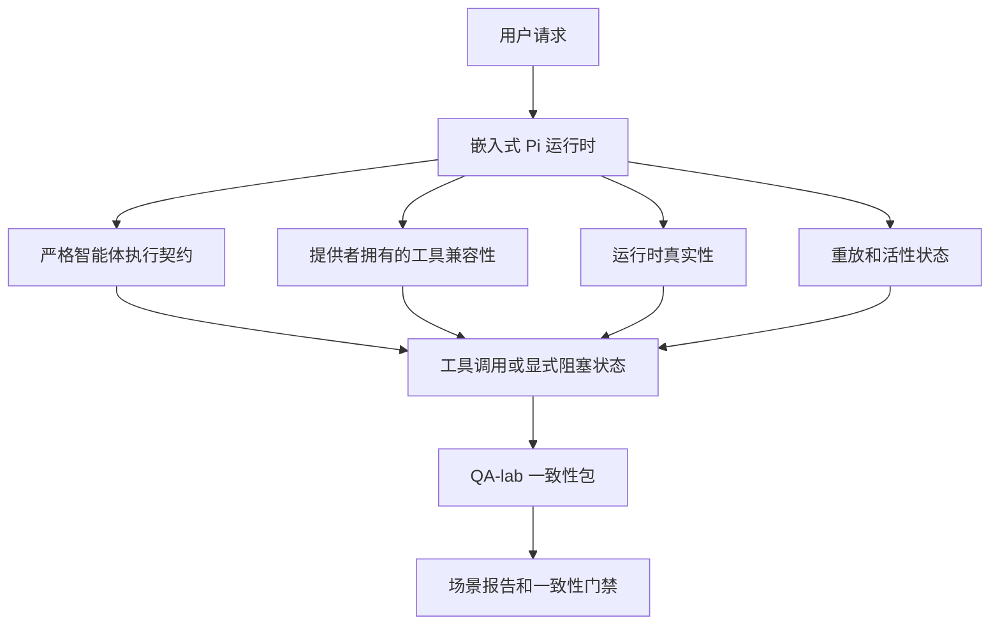
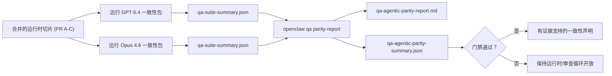

# OpenClaw 中的 GPT-5.4 / Codex 智能体一致性

OpenClaw 已经能与使用工具的前沿模型很好地配合，但 GPT-5.4 和 Codex 风格的模型在少数实际方面仍然表现不佳：

- 它们可能在规划后就停止，而不是执行工作
- 它们可能错误地使用严格的 OpenAI/Codex 工具 schema
- 即使在完全访问不可能时，它们也可能请求 `/elevated full`
- 它们可能在重放或压缩期间丢失长期任务状态
- 针对 Claude Opus 4.6 的一致性声明基于轶事而不是可重复的场景

此一致性程序通过四个可审查的切片修复了这些差距。

## 变更内容

### PR A：严格智能体执行

此切片为嵌入式 Pi GPT-5 运行添加了可选的 `strict-agentic` 执行契约。

启用后，OpenClaw 不再接受仅计划的回合作为“足够好”的完成。如果模型只说它打算做什么而没有实际使用工具或取得进展，OpenClaw 会使用 act-now 引导重试，然后以显式的阻塞状态失败关闭，而不是静默结束任务。

这在以下方面最能改善 GPT-5.4 体验：

- 简短的“好的，去做”后续
- 第一步显而易见的代码任务
- `update_plan` 应作为进度跟踪而不是填充文本的流程

### PR B：运行时真实性

此切片使 OpenClaw 在两件事上说真话：

- 提供者/运行时调用失败的原因
- `/elevated full` 是否实际可用

这意味着 GPT-5.4 获得更好的运行时信号，用于缺失范围、认证刷新失败、HTML 403 认证失败、代理问题、DNS 或超时失败以及被阻塞的完全访问模式。模型不太可能幻觉错误的补救措施或继续请求运行时无法提供的权限模式。

### PR C：执行正确性

此切片改进了两种正确性：

- 提供者拥有的 OpenAI/Codex 工具 schema 兼容性
- 重放和长期任务活性表面化

工具兼容性工作减少了严格 OpenAI/Codex 工具注册的 schema 摩擦，特别是围绕无参数工具和严格对象根期望。重放/活性工作使长期任务更可观测，因此暂停、阻塞和废弃状态是可见的，而不是消失到通用失败文本中。

### PR D：一致性 harness

此切片添加了第一波 QA-lab 一致性包，以便 GPT-5.4 和 Opus 4.6 可以通过相同的场景进行练习并使用共享证据进行比较。

一致性包是证明层。它本身不改变运行时行为。

拥有两个 `qa-suite-summary.json` 工件后，使用以下命令生成发布门禁比较：

```bash
pnpm openclaw qa parity-report \
  --repo-root . \
  --candidate-summary .artifacts/qa-e2e/gpt54/qa-suite-summary.json \
  --baseline-summary .artifacts/qa-e2e/opus46/qa-suite-summary.json \
  --output-dir .artifacts/qa-e2e/parity
```

该命令写入：

- 人类可读的 Markdown 报告
- 机器可读的 JSON 裁决
- 显式的 `pass` / `fail` 门禁结果

## 为什么这实际上改善了 GPT-5.4

在此工作之前，OpenClaw 上的 GPT-5.4 在真实编码会话中可能感觉不如 Opus 具有智能体性，因为运行时容忍了对 GPT-5 风格模型特别有害的行为：

- 仅评论的回合
- 工具周围的 schema 摩擦
- 模糊的权限反馈
- 静默的重放或压缩破坏

目标不是让 GPT-5.4 模仿 Opus。目标是给 GPT-5.4 一个运行时契约，奖励真正的进展，提供更清晰的工具和权限语义，并将失败模式转化为显式的机器和人类可读状态。

这将用户体验从：

- “模型有一个好计划但停止了”

转变为：

- “模型要么采取了行动，要么 OpenClaw 展示了它无法执行的确切原因”

## GPT-5.4 用户的之前与之后

| 此程序之前                                                                                     | PR A-D 之后                                                                              |
| ---------------------------------------------------------------------------------------------- | ---------------------------------------------------------------------------------------- |
| GPT-5.4 可能在合理计划后停止而不采取下一个工具步骤                                             | PR A 将“仅计划”转变为“立即行动或表面化阻塞状态”                                          |
| 严格工具 schema 可能以令人困惑的方式拒绝无参数或 OpenAI/Codex 形状的工具                       | PR C 使提供者拥有的工具注册和调用更可预测                                                |
| 在被阻塞的运行时中，`/elevated full` 指导可能模糊或错误                                        | PR B 为 GPT-5.4 和用户提供真实的运行时和权限提示                                         |
| 重放或压缩失败可能感觉像任务静默消失                                                           | PR C 显式表面化暂停、阻塞、废弃和重放无效结果                                            |
| "GPT-5.4 感觉比 Opus 差”主要是轶事                                                             | PR D 将其转变为相同的场景包、相同的指标和硬性的通过/失败门禁                             |

## 架构



## 发布流程



## 场景包

第一波一致性包目前涵盖五个场景：

### `approval-turn-tool-followthrough`

检查模型在简短批准后是否不会停在“我会做的”。它应在同一回合中采取第一个具体行动。

### `model-switch-tool-continuity`

检查工具使用工作是否在模型/运行时切换边界保持连贯，而不是重置为评论或丢失执行上下文。

### `source-docs-discovery-report`

检查模型是否可以阅读源代码和文档，综合发现，并以智能体方式继续任务，而不是产生薄弱的总结并过早停止。

### `image-understanding-attachment`

检查涉及附件的混合模式任务是否保持可操作，而不是崩溃为模糊的叙述。

### `compaction-retry-mutating-tool`

检查具有真实变更写入的任务是否保持重放不安全性的显式，而不是在运行压缩、重试或在压力下丢失回复状态时看起来静默安全。

## 场景矩阵

| 场景                               | 测试内容                          | 良好的 GPT-5.4 行为                                                            | 失败信号                                                                       |
| ---------------------------------- | --------------------------------- | ------------------------------------------------------------------------------ | ------------------------------------------------------------------------------ |
| `approval-turn-tool-followthrough` | 计划后的简短批准回合              | 立即开始第一个具体工具行动，而不是重述意图                                     | 仅计划后续，无工具活动，或无真实阻塞器的阻塞回合                               |
| `model-switch-tool-continuity`     | 工具使用下的运行时/模型切换       | 保留任务上下文并继续连贯行动                                                   | 重置为评论，丢失工具上下文，或切换后停止                                       |
| `source-docs-discovery-report`     | 源代码阅读 + 综合 + 行动          | 找到源代码，使用工具，并产生有用报告而不停滞                                   | 薄弱总结，缺失工具工作，或不完整回合停止                                       |
| `image-understanding-attachment`   | 附件驱动的智能体工作              | 解释附件，将其连接到工具，并继续任务                                           | 模糊叙述，忽略附件，或无具体下一步行动                                         |
| `compaction-retry-mutating-tool`   | 压缩压力下的变更工作              | 执行真实写入并在副作用后保持重放不安全性显式                                   | 发生变更写入但暗示重放安全，缺失或矛盾                                         |

## 发布门禁

只有当合并的运行时同时通过一致性包和运行时真实性回归测试时，GPT-5.4 才能被视为处于一致性或更好。

必需结果：

- 当下一个工具行动清晰时，无仅计划停滞
- 无无真实执行的虚假完成
- 无错误的 `/elevated full` 指导
- 无静默重放或压缩废弃
- 至少与商定的 Opus 4.6 基线一样强的一致性包指标

对于第一波 harness，门禁比较：

- 完成率
- 意外停止率
- 有效工具调用率
- 虚假成功计数

一致性证据故意分为两层：

- PR D 通过 QA-lab 证明相同场景的 GPT-5.4 与 Opus 4.6 行为
- PR B 确定性套件证明 harness 之外的认证、代理、DNS 和 `/elevated full` 真实性

## 目标到证据矩阵

| 完成门禁项                                             | 拥有者 PR   | 证据来源                                                         | 通过信号                                                                             |
| ------------------------------------------------------ | ----------- | ---------------------------------------------------------------- | ------------------------------------------------------------------------------------ |
| GPT-5.4 不再在规划后停滞                               | PR A        | `approval-turn-tool-followthrough` 加上 PR A 运行时套件          | 批准回合触发真实工作或显式阻塞状态                                                   |
| GPT-5.4 不再伪造进展或伪造工具完成                     | PR A + PR D | 一致性报告场景结果和虚假成功计数                                 | 无可疑通过结果且无仅评论完成                                                         |
| GPT-5.4 不再给出错误的 `/elevated full` 指导           | PR B        | 确定性真实性套件                                                 | 阻塞原因和完全访问提示保持运行时准确                                                 |
| 重放/活性失败保持显式                                  | PR C + PR D | PR C 生命周期/重放套件加上 `compaction-retry-mutating-tool`      | 变更工作保持重放不安全性显式而不是静默消失                                           |
| GPT-5.4 在商定指标上匹配或击败 Opus 4.6                | PR D        | `qa-agentic-parity-report.md` 和 `qa-agentic-parity-summary.json` | 相同场景覆盖且在完成、停止行为或有效工具使用上无回归                                 |

## 如何解读一致性判定结果

使用 `qa-agentic-parity-summary.json` 中的判定结果作为第一波一致性包最终的可机器读取决策。

- `pass` 表示 GPT-5.4 覆盖了与 Opus 4.6 相同的场景，并且在商定的聚合指标上没有回退。
- `fail` 表示至少触发了一个硬门限：完成度较弱、意外停止情况更糟、有效工具使用较弱、任何虚假成功案例，或场景覆盖不匹配。
- "shared/base CI issue" 本身并不是一致性结果。如果 PR D 之外的 CI 噪声阻止了运行，判定应等待干净的合并运行时执行，而不是从分支期间的日志中推断。
- Auth、proxy、DNS 和 `/elevated full` 的真实性仍然来自 PR B 的确定性套件，因此最终发布声明需要两者兼备：通过的 PR D 一致性判定和绿色的 PR B 真实性覆盖。

## 谁应该启用 `strict-agentic`

在以下情况下使用 `strict-agentic`：

- 当下一步很明显时，期望代理立即采取行动
- GPT-5.4 或 Codex 系列模型是主要运行时
- 你更喜欢明确的阻塞状态，而不是“有帮助的”仅回顾回复

在以下情况下保留默认契约：

- 你希望保留现有的更宽松行为
- 你没有使用 GPT-5 系列模型
- 你测试的是提示词，而不是运行时强制执行

## 相关

- [GPT-5.4 / Codex 一致性维护者说明](/help/gpt54-codex-agentic-parity-maintainers)
