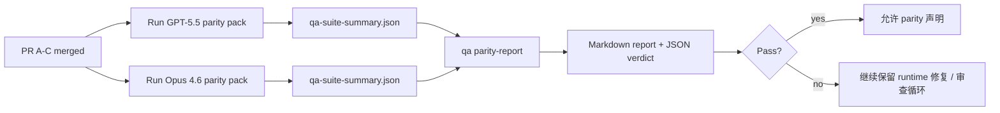

本文说明如何在不丢失原始六合同架构的前提下，将 GPT-5.5 / Codex parity 计划作为四个合并单元进行审查。

## 合并单元

### PR A：严格的 agentic 执行

负责：

- `executionContract`
- GPT-5 优先的同轮跟进
- 将 `update_plan` 作为非终止性的进度跟踪
- 显式的 blocked 状态，而不是仅靠 plan 的静默停止

不负责：

- auth/runtime 失败分类
- 权限真实性
- replay/continuation 重设计
- parity 基准测试

### PR B：运行时真实性

负责：

- Codex OAuth scope 的正确性
- 带类型的 provider/runtime 失败分类
- 真实的 `/elevated full` 可用性和 blocked 原因

不负责：

- 工具 schema 规范化
- replay/liveness 状态
- 基准门控

### PR C：执行正确性

负责：

- provider 拥有的 OpenAI/Codex 工具兼容性
- 无参数的严格 schema 处理
- replay-invalid 的暴露
- paused、blocked 和 abandoned 的长任务状态可见性

不负责：

- 自主选择的 continuation
- provider hooks 之外的一般性 Codex 方言行为
- 基准门控

### PR D：parity 运行器

负责：

- 第一波 GPT-5.5 vs Opus 4.6 场景包
- parity 文档
- parity 报告和发布门控机制

不负责：

- QA 实验室之外的运行时行为变更
- 运行器内的 auth/proxy/DNS 模拟

## 映射回原始六个合同

| 原始合同                                 | 合并单元 |
| ---------------------------------------- | -------- |
| Provider 传输/auth 正确性               | PR B     |
| 工具合同/schema 兼容性                  | PR C     |
| 同轮执行                                 | PR A     |
| 权限真实性                               | PR B     |
| Replay/continuation/liveness 正确性      | PR C     |
| 基准/发布门控                            | PR D     |

## 审查顺序

1. PR A
2. PR B
3. PR C
4. PR D

PR D 是证明层。它不应成为延迟运行时正确性 PR 的原因。

## 关注点

### PR A

- GPT-5 运行要么执行，要么安全失败，而不是停留在评论阶段
- `update_plan` 不再单独代表进度
- 行为保持 GPT-5 优先且处于 embedded-Pi 范围内

### PR B

- auth/proxy/runtime failures stop collapsing into generic "model failed" handling
- `/elevated full` is only described as available when it is actually available
- blocked reasons are visible to both the model and the user-facing runtime

### PR C

- 严格的 OpenAI/Codex 工具注册行为可预测
- 无参数工具不会在严格 schema 检查中失败
- replay 和 compaction 的结果保留真实的 liveness 状态

### PR D

- 场景包应当易懂且可复现
- 该包应包含一个可变更的 replay 安全通道，而不只是只读流程
- 报告应同时适合人类和自动化读取
- parity 声明应有证据支撑，而不是凭经验判断

PR D 的预期产物：

- 每次模型运行输出 `qa-suite-report.md` / `qa-suite-summary.json`
- `qa-agentic-parity-report.md`，包含汇总和场景级比较
- `qa-agentic-parity-summary.json`，包含机器可读的结论

## 发布门控

在以下条件满足之前，不要声称 GPT-5.5 与 Opus 4.6 parity 或优于 Opus 4.6：

- PR A、PR B 和 PR C 已合并
- PR D 已干净地运行第一波 parity 包
- 运行时真实性回归测试套件仍为绿色
- parity 报告未显示任何 fake-success 案例，也没有 stop 行为回归

parity 运行器不是唯一的证据来源。请在审查中明确区分这两部分：

- PR D 负责基于场景的 GPT-5.5 vs Opus 4.6 比较
- PR B 的确定性套件仍负责 auth/proxy/DNS 和 full-access 真实性证据

## 快速维护者合并流程

当你准备合并一个 parity PR，并希望采用可重复、低风险的流程时，使用此流程。

1. 在合并前确认证据门槛已满足：
   - 可复现的症状或失败测试
   - 在变更代码中已验证根因
   - 修复位于被影响的路径中
   - 回归测试或明确的手动验证说明
2. 合并前进行分流/标记：
   - 如果 PR 不应落地，应用任何 `r:*` 自动关闭标签
   - 保持待合并候选没有未解决的阻塞线程
3. 在受影响的表面上本地验证：
   - `pnpm check:changed`
   - 当测试发生变化或修复信心依赖测试覆盖时，运行 `pnpm test:changed`
4. 使用标准维护者流程（`/landpr` 流程）合并，然后验证：
   - 关联 issue 的自动关闭行为
   - `main` 上的 CI 和合并后状态
5. 合并后，搜索相关的开放 PR/issue 重复项，并且只使用规范引用进行关闭。

如果证据门槛中的任何一项缺失，请请求修改，而不是合并。

## 目标到证据映射

| 完成门槛项                           | 主要负责人 | 审查产物                                                               |
| ------------------------------------ | ----------- | ---------------------------------------------------------------------- |
| 不再出现仅靠 plan 的停滞            | PR A        | strict-agentic 运行时测试和 `approval-turn-tool-followthrough`         |
| 不再出现假进度或假工具完成          | PR A + PR D  | parity fake-success 计数以及场景级报告细节                            |
| 不再出现错误的 `/elevated full` 指引 | PR B        | 确定性的 runtime-truthfulness 套件                                      |
| Replay/liveness 失败保持显式        | PR C + PR D  | 生命周期/replay 套件以及 `compaction-retry-mutating-tool`            |
| GPT-5.5 与 Opus 4.6 相当或更优      | PR D        | `qa-agentic-parity-report.md` 和 `qa-agentic-parity-summary.json`     |

## 审查者速记：变更前 vs 变更后

| 变更前用户可见问题                                | 变更后审查信号                                                                            |
| ------------------------------------------------- | ----------------------------------------------------------------------------------------- |
| GPT-5.5 在规划后就停住了                           | PR A 显示的是 act-or-block 行为，而不是仅靠评论完成                                      |
| 在严格的 OpenAI/Codex schema 下工具使用很脆弱     | PR C 让工具注册和无参数调用保持可预测                                                   |
| `/elevated full` 的提示有时会误导                 | PR B 将指引与实际运行时能力和 blocked 原因绑定                                           |
| 长任务可能在 replay/compaction 歧义中消失        | PR C 发出明确的 paused、blocked、abandoned 和 replay-invalid 状态                       |
| parity 声明只是道听途说                           | PR D 产出报告加 JSON 结论，并且两种模型拥有相同的场景覆盖                                |

## 相关

- [GPT-5.5 / Codex agentic parity](/help/gpt55-codex-agentic-parity)
