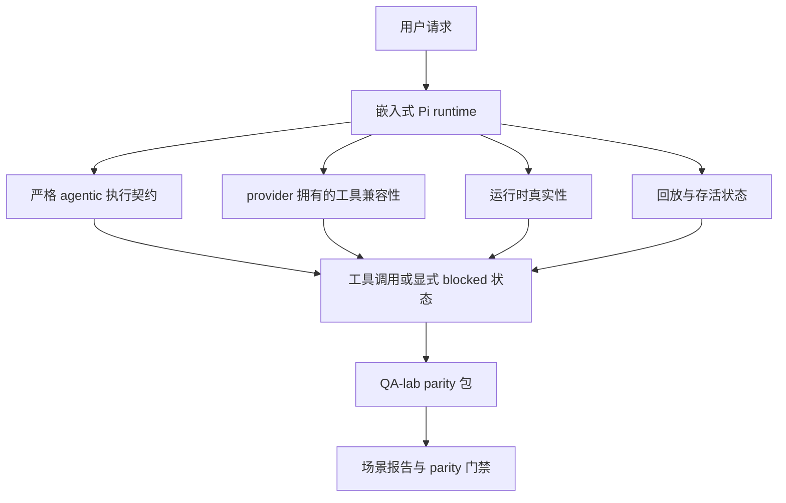
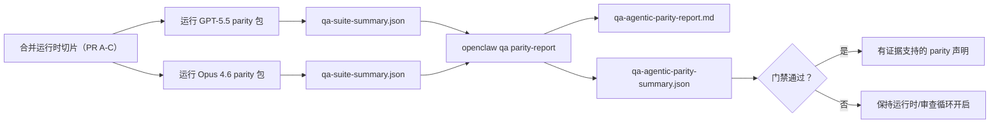

OpenClaw 已经能很好地与使用工具的前沿模型配合，但 GPT-5.5 和 Codex 风格模型在一些实际方面仍表现不佳：

- 它们可能在规划之后就停止，而不是继续完成工作
- 它们可能错误地使用严格的 OpenAI/Codex 工具 schema
- 它们可能在实际无法获得完全访问权限时仍然请求 `/elevated full`
- 它们可能在回放或压缩过程中丢失长任务状态
- 与 Claude Opus 4.6 的 parity 声称基于轶事，而不是可重复场景

这个 parity 项目通过四个可审查的切片修复了这些缺口。

## 发生了什么变化

### PR A：严格 agentic 执行

这个切片为嵌入式 Pi GPT-5 运行增加了一个可选的 `strict-agentic` 执行契约。

启用后，OpenClaw 不再把“只做计划”的轮次当作“足够好”的完成。如果模型只是说出打算做什么，却没有真正使用工具或取得进展，OpenClaw 会用 act-now 引导重试，然后以显式的 blocked 状态失败关闭，而不是悄悄结束任务。

这对 GPT-5.5 的提升最明显，尤其是在以下场景中：

- 简短的“好，去做吧”跟进
- 代码任务中第一步显而易见的情况
- `update_plan` 应该用于进度跟踪而不是填充文本的流程

### PR B：运行时真实性

这个切片让 OpenClaw 对两件事讲实话：

- provider/runtime 调用为什么失败
- `/elevated full` 是否真的可用

这意味着 GPT-5.5 能获得更好的运行时信号，识别缺少 scope、auth 刷新失败、HTML 403 认证失败、代理问题、DNS 或超时失败，以及被阻止的完全访问模式。模型更不容易编造错误的修复方案，或持续请求运行时无法提供的权限模式。

### PR C：执行正确性

这个切片改进了两类正确性：

- provider 拥有的 OpenAI/Codex 工具 schema 兼容性
- 回放和长任务存活状态的呈现

工具兼容性工作减少了严格 OpenAI/Codex 工具注册中的 schema 摩擦，尤其是在无参数工具和严格 object-root 期望方面。回放/存活状态工作让长时间运行的任务更可观察，因此暂停、blocked 和 abandoned 状态会被显式显示出来，而不是消失在通用失败文本里。

### PR D：parity harness

这个切片增加了第一波 QA-lab parity 包，使 GPT-5.5 和 Opus 4.6 可以通过相同场景执行，并使用共享证据进行比较。

parity 包是证据层。它本身不会改变运行时行为。

在你拥有两个 `qa-suite-summary.json` 产物之后，使用以下命令生成发布门禁对比：

```bash
pnpm openclaw qa parity-report \
  --repo-root . \
  --candidate-summary .artifacts/qa-e2e/gpt55/qa-suite-summary.json \
  --baseline-summary .artifacts/qa-e2e/opus46/qa-suite-summary.json \
  --output-dir .artifacts/qa-e2e/parity
```

该命令会写出：

- 一份人类可读的 Markdown 报告
- 一份机器可读的 JSON 裁决
- 一个明确的 `pass` / `fail` 门禁结果

## 这为什么能在实践中改善 GPT-5.5

在这项工作之前，OpenClaw 上的 GPT-5.5 在真实编码会话中可能感觉不如 Opus 那么 agentic，因为运行时容忍了对 GPT-5 风格模型尤其有害的行为：

- 只评论不行动的轮次
- 工具相关的 schema 摩擦
- 模糊的权限反馈
- 静默的回放或压缩故障

目标不是让 GPT-5.5 模仿 Opus。目标是给 GPT-5.5 一个运行时契约：奖励真正的进展，提供更清晰的工具和权限语义，并把失败模式转化为显式的机器可读和人类可读状态。

这会把用户体验从：

- "the model had a good plan but stopped"

变成：

- "the model either acted, or OpenClaw surfaced the exact reason it could not"

## GPT-5.5 用户的前后对比

| Before this program                                                                            | After PR A-D                                                                             |
| ---------------------------------------------------------------------------------------------- | ---------------------------------------------------------------------------------------- |
| GPT-5.5 could stop after a reasonable plan without taking the next tool step                   | PR A turns "plan only" into "act now or surface a blocked state"                         |
| Strict tool schemas could reject parameter-free or OpenAI/Codex-shaped tools in confusing ways | PR C makes provider-owned tool registration and invocation more predictable              |
| `/elevated full` guidance could be vague or wrong in blocked runtimes                          | PR B gives GPT-5.5 and the user truthful runtime and permission hints                    |
| Replay or compaction failures could feel like the task silently disappeared                    | PR C surfaces paused, blocked, abandoned, and replay-invalid outcomes explicitly         |
| "GPT-5.5 feels worse than Opus" was mostly anecdotal                                           | PR D turns that into the same scenario pack, the same metrics, and a hard pass/fail gate |

## 架构



## 发布流程



## 场景包

第一波 parity 包目前涵盖五个场景：

### `approval-turn-tool-followthrough`

检查模型在简短批准后不会停留在“我会去做”上。它应该在同一轮中采取第一个具体动作。

### `model-switch-tool-continuity`

检查使用工具的工作在模型/运行时切换边界上仍然保持连贯，而不是重置为评论或丢失执行上下文。

### `source-docs-discovery-report`

检查模型是否能够阅读源码和文档、综合发现，并继续以 agentic 方式完成任务，而不是只生成一个薄弱摘要后过早停止。

### `image-understanding-attachment`

检查涉及附件的混合模式任务是否仍然具有可操作性，而不会退化成含糊叙述。

### `compaction-retry-mutating-tool`

检查带有真实变更写入的任务在回放不安全性上是否保持显式，而不是在运行压缩、重试或在压力下丢失回复状态时，悄悄看起来像是回放安全的。

## 场景矩阵

| 场景                               | 测试内容                               | 良好的 GPT-5.5 行为                                                       | 失败信号                                                                      |
| ---------------------------------- | -------------------------------------- | ------------------------------------------------------------------------- | ----------------------------------------------------------------------------- |
| `approval-turn-tool-followthrough` | 简短批准后的计划轮次                   | 立即开始第一个具体工具动作，而不是重复意图                                 | 只做计划性的后续回复、没有工具活动，或在没有真实阻塞的情况下停轮              |
| `model-switch-tool-continuity`     | 工具使用过程中的运行时/模型切换         | 保持任务上下文并持续连贯地执行                                             | 切换后重置为评论、丢失工具上下文，或切换后停止                               |
| `source-docs-discovery-report`     | 源码阅读 + 综合 + 行动                  | 找到来源、使用工具，并生成有用报告而不失速                                 | 薄弱摘要、缺少工具工作，或不完整轮次停止                                     |
| `image-understanding-attachment`   | 由附件驱动的 agentic 工作               | 解释附件、将其与工具关联起来，并继续任务                                   | 含糊叙述、忽略附件，或没有具体的下一步动作                                   |
| `compaction-retry-mutating-tool`   | 压缩压力下的变更写入工作                | 执行真实写入，并在副作用之后保持回放不安全性显式                          | 已发生变更写入，但回放安全性被暗示、缺失或自相矛盾                           |

## 发布门禁

只有当合并后的运行时同时通过 parity 包和运行时真实性回归测试时，GPT-5.5 才能被视为达到 parity 或更好。

必需结果：

- 当下一步工具动作明确时，不得只停留在计划上
- 不得在没有真实执行的情况下伪装完成
- 不得提供错误的 `/elevated full` 指引
- 不得静默放弃回放或压缩
- parity 包指标至少要与约定的 Opus 4.6 基线一样强

对于第一波 harness，门禁比较的是：

- 完成率
- 非预期停止率
- 有效工具调用率
- 虚假成功计数

parity 证据刻意分成两层：

- PR D 用 QA-lab 证明 GPT-5.5 vs Opus 4.6 在相同场景下的行为
- PR B 的确定性测试证明在 harness 之外的 auth、proxy、DNS 和 `/elevated full` 真实性

## 目标-证据矩阵

| 完成门槛项                                               | 负责 PR      | 证据来源                                                           | 通过信号                                                                              |
| -------------------------------------------------------- | ------------ | ------------------------------------------------------------------ | ---------------------------------------------------------------------------------------- |
| GPT-5.5 不再在规划后停滞                                   | PR A         | `approval-turn-tool-followthrough` 以及 PR A 运行时套件            | approval turn 会触发真实工作，或明确的 blocked 状态                                      |
| GPT-5.5 不再伪造进度或伪造工具完成                         | PR A + PR D  | parity report 场景结果和 fake-success 计数                         | 没有可疑的通过结果，也没有仅靠评论就完成的情况                                            |
| GPT-5.5 不再给出错误的 `/elevated full` 指引               | PR B         | 确定性的真实性测试套件                                               | blocked 原因和 full-access 提示保持运行时准确                                              |
| 重放/存活性失败保持显式                                    | PR C + PR D  | PR C 生命周期/重放套件以及 `compaction-retry-mutating-tool`        | 会变异工作的 replay-unsafety 仍然保持显式，而不是悄然消失                                |
| GPT-5.5 在约定指标上与 Opus 4.6 持平或更好                 | PR D         | `qa-agentic-parity-report.md` 和 `qa-agentic-parity-summary.json`   | 场景覆盖相同，并且在完成、停止行为或有效工具使用方面没有回归                               |

## 如何阅读 parity 裁决

将 `qa-agentic-parity-summary.json` 中的裁决作为第一波 parity 包的最终机器可读决定。

- `pass` 表示 GPT-5.5 覆盖了与 Opus 4.6 相同的场景，并且没有在约定的聚合指标上回归。
- `fail` 表示至少触发了一个硬门槛：更弱的完成率、更差的非预期停止率、更弱的有效工具使用、任何虚假成功案例，或场景覆盖不匹配。
- “共享/基础 CI 问题”本身不算 parity 结果。如果 PR D 之外的 CI 噪声阻塞了运行，裁决应等待干净的合并后运行，而不是根据分支时期日志推断。
- auth、proxy、DNS 和 `/elevated full` 的真实性仍然来自 PR B 的确定性套件，因此最终发布声明需要两者都满足：通过的 PR D parity 裁决，以及绿色的 PR B 真实性覆盖。

## 谁应该启用 `strict-agentic`

在以下情况下使用 `strict-agentic`：

- 当下一步显而易见时，agent 预期应立即行动
- GPT-5.5 或 Codex 家族模型是主要运行时
- 你更倾向于显式的 blocked 状态，而不是“有帮助的”仅复述回复

在以下情况下保留默认契约：

- 你想要现有的、更宽松的行为
- 你没有使用 GPT-5 家族模型
- 你测试的是提示词，而不是运行时强制执行

## 相关内容

- [GPT-5.5 / Codex parity 维护者说明](/help/gpt55-codex-agentic-parity-maintainers)
