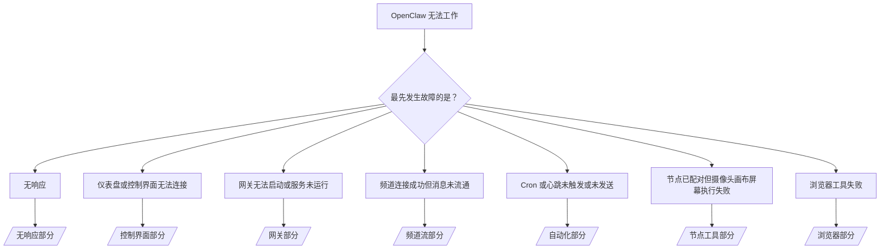

# 故障排查

如果您只有 2 分钟，请使用此页面作为分诊前门。

## 前 60 秒

按顺序运行以下命令：

```bash
openclaw status
openclaw status --all
openclaw gateway probe
openclaw gateway status
openclaw doctor
openclaw channels status --probe
openclaw logs --follow
```

良好输出一览：

- `openclaw status` → 显示配置好的频道且无明显的认证错误。
- `openclaw status --all` → 完整报告存在且可分享。
- `openclaw gateway probe` → 预期的网关目标可达（`Reachable: yes`）。`RPC: limited - missing scope: operator.read` 是降级诊断，不是连接失败。
- `openclaw gateway status` → `Runtime: running` 和 `RPC probe: ok`。
- `openclaw doctor` → 无阻塞的配置/服务错误。
- `openclaw channels status --probe` → 频道报告为 `connected` 或 `ready`。
- `openclaw logs --follow` → 稳定活动，无重复致命错误。

## Anthropic 长上下文 429

如果看到：
`HTTP 429: rate_limit_error: Extra usage is required for long context requests`，
请访问 [/gateway/troubleshooting#anthropic-429-extra-usage-required-for-long-context](/gateway/troubleshooting#anthropic-429-extra-usage-required-for-long-context)。

## 插件安装失败，提示缺少 openclaw 扩展

若安装失败并提示 `package.json missing openclaw.extensions`，说明插件包使用了 OpenClaw 已不再接受的旧格式。

插件包修复步骤：

1. 将 `openclaw.extensions` 添加到 `package.json`。
2. 将入口指向构建后的运行时文件（通常为 `./dist/index.js`）。
3. 重新发布插件并再次运行 `openclaw plugins install <package>`。

示例：

```json
{
  "name": "@openclaw/my-plugin",
  "version": "1.2.3",
  "openclaw": {
    "extensions": ["./dist/index.js"]
  }
}
```

参考：[插件架构](/plugins/architecture)

## 决策树



<AccordionGroup>
  <Accordion title="无响应">
    ```bash
    openclaw status
    openclaw gateway status
    openclaw channels status --probe
    openclaw pairing list --channel <channel> [--account <id>]
    openclaw logs --follow
    ```

    良好输出表现为：

    - `Runtime: running`
    - `RPC probe: ok`
    - 在 `channels status --probe` 中频道显示 connected/ready
    - 发送者显示已批准（或私信策略开放/白名单）

    常见日志特征：

    - `drop guild message (mention required` → Discord 中提及限制阻止了消息。
    - `pairing request` → 发送者未批准，等待私信配对批准。
    - 频道日志中出现 `blocked` / `allowlist` → 发送者、房间或组被过滤。

    深入页面：

    - [/gateway/troubleshooting#no-replies](/gateway/troubleshooting#no-replies)
    - [/channels/troubleshooting](/channels/troubleshooting)
    - [/channels/pairing](/channels/pairing)

  </Accordion>

  <Accordion title="仪表盘或控制界面无法连接">
    ```bash
    openclaw status
    openclaw gateway status
    openclaw logs --follow
    openclaw doctor
    openclaw channels status --probe
    ```

    良好输出表现为：

    - 在 `openclaw gateway status` 中显示 `Dashboard: http://...`
    - `RPC probe: ok`
    - 日志中无认证循环

    常见日志特征：

    - `device identity required` → HTTP/非安全环境无法完成设备认证。
    - `AUTH_TOKEN_MISMATCH` 并带有重试提示（`canRetryWithDeviceToken=true`）→ 可能会自动进行一次受信任设备令牌的重试。
    - 重复出现 `unauthorized`，即使已重试 → 令牌/密码错误、认证模式不匹配，或配对设备令牌已过期。
    - `gateway connect failed:` → UI 正在连接错误的 URL/端口，或网关无法访问。

    深入页面：

    - [/gateway/troubleshooting#dashboard-control-ui-connectivity](/gateway/troubleshooting#dashboard-control-ui-connectivity)
    - [/web/control-ui](/web/control-ui)
    - [/gateway/authentication](/gateway/authentication)

  </Accordion>

  <Accordion title="网关无法启动或服务已安装但未运行">
    ```bash
    openclaw status
    openclaw gateway status
    openclaw logs --follow
    openclaw doctor
    openclaw channels status --probe
    ```

    良好输出表现为：

    - `Service: ... (loaded)`
    - `Runtime: running`
    - `RPC probe: ok`

    常见日志特征：

    - `Gateway start blocked: set gateway.mode=local` → 网关模式未设置或为远程。
    - `refusing to bind gateway ... without auth` → 非回环地址绑定缺少令牌/密码。
    - `another gateway instance is already listening` 或 `EADDRINUSE` → 端口已被占用。

    深入页面：

    - [/gateway/troubleshooting#gateway-service-not-running](/gateway/troubleshooting#gateway-service-not-running)
    - [/gateway/background-process](/gateway/background-process)
    - [/gateway/configuration](/gateway/configuration)

  </Accordion>

  <Accordion title="频道连接成功但消息未流通">
    ```bash
    openclaw status
    openclaw gateway status
    openclaw logs --follow
    openclaw doctor
    openclaw channels status --probe
    ```

    良好输出表现为：

    - 频道传输已连接。
    - 配对/白名单检查通过。
    - 在需要时检测到提及。

    常见日志特征：

    - `mention required` → 群组提及限制阻止了消息处理。
    - `pairing` / `pending` → 私信发送者尚未批准。
    - `not_in_channel`、`missing_scope`、`Forbidden`、`401/403` → 频道权限令牌问题。

    深入页面：

    - [/gateway/troubleshooting#channel-connected-messages-not-flowing](/gateway/troubleshooting#channel-connected-messages-not-flowing)
    - [/channels/troubleshooting](/channels/troubleshooting)

  </Accordion>

  <Accordion title="Cron 或心跳未触发或未发送">
    ```bash
    openclaw status
    openclaw gateway status
    openclaw cron status
    openclaw cron list
    openclaw cron runs --id <jobId> --limit 20
    openclaw logs --follow
    ```

    良好输出表现为：

    - `cron.status` 显示启用且有下次唤醒时间。
    - `cron runs` 显示最近有 `ok` 条目。
    - 心跳启用且未处于非活跃时间段。

    常见日志特征：

    - `cron: scheduler disabled; jobs will not run automatically` → cron 被禁用。
    - `heartbeat skipped` 并带有 `reason=quiet-hours` → 处于配置的非活跃时间。
    - `requests-in-flight` → 主线路忙，心跳唤醒被延迟。
    - `unknown accountId` → 心跳目标账号不存在。

    深入页面：

    - [/gateway/troubleshooting#cron-and-heartbeat-delivery](/gateway/troubleshooting#cron-and-heartbeat-delivery)
    - [/automation/troubleshooting](/automation/troubleshooting)
    - [/gateway/heartbeat](/gateway/heartbeat)

  </Accordion>

  <Accordion title="节点已配对但工具执行摄像头画布屏幕失败">
    ```bash
    openclaw status
    openclaw gateway status
    openclaw nodes status
    openclaw nodes describe --node <idOrNameOrIp>
    openclaw logs --follow
    ```

    良好输出表现为：

    - 节点列表显示已连接且配对，角色为 `node`。
    - 存在您调用的命令相关能力。
    - 工具权限状态为已授予。

    常见日志特征：

    - `NODE_BACKGROUND_UNAVAILABLE` → 将节点应用切换到前台。
    - `*_PERMISSION_REQUIRED` → 操作系统权限被拒绝或缺失。
    - `SYSTEM_RUN_DENIED: approval required` → 执行审批等待中。
    - `SYSTEM_RUN_DENIED: allowlist miss` → 命令未在执行白名单内。

    深入页面：

    - [/gateway/troubleshooting#node-paired-tool-fails](/gateway/troubleshooting#node-paired-tool-fails)
    - [/nodes/troubleshooting](/nodes/troubleshooting)
    - [/tools/exec-approvals](/tools/exec-approvals)

  </Accordion>

  <Accordion title="浏览器工具失败">
    ```bash
    openclaw status
    openclaw gateway status
    openclaw browser status
    openclaw logs --follow
    openclaw doctor
    ```

    良好输出表现为：

    - 浏览器状态显示 `running: true` 和选定的浏览器/配置。
    - `openclaw` 启动，或用户能看到本地 Chrome 标签页。

    常见日志特征：

    - `Failed to start Chrome CDP on port` → 本地浏览器启动失败。
    - `browser.executablePath not found` → 配置的二进制路径错误。
    - `No Chrome tabs found for profile="user"` → Chrome MCP 附加配置没有打开的本地 Chrome 标签页。
    - `Browser attachOnly is enabled ... not reachable` → 附加专用配置没有活跃的 CDP 目标。

    深入页面：

    - [/gateway/troubleshooting#browser-tool-fails](/gateway/troubleshooting#browser-tool-fails)
    - [/tools/browser-linux-troubleshooting](/tools/browser-linux-troubleshooting)
    - [/tools/browser-wsl2-windows-remote-cdp-troubleshooting](/tools/browser-wsl2-windows-remote-cdp-troubleshooting)

  </Accordion>
</AccordionGroup>
