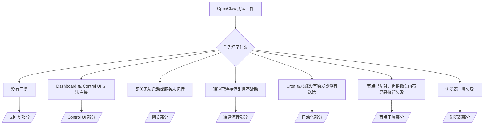

如果你只有 2 分钟，就把这个页面当作分诊入口。

## 前 60 秒

按顺序运行下面这个精确梯子：

```bash
openclaw status
openclaw status --all
openclaw gateway probe
openclaw gateway status
openclaw doctor
openclaw channels status --probe
openclaw logs --follow
```

一行内的良好输出：

- `openclaw status` → 显示已配置的通道，没有明显的认证错误。
- `openclaw status --all` → 生成完整报告，并且可分享。
- `openclaw gateway probe` → 预期的网关目标可达（`Reachable: yes`）。`Capability: ...` 告诉你探测能够证明的认证级别，而 `Read probe: limited - missing scope: operator.read` 表示诊断能力降级，不是连接失败。
- `openclaw gateway status` → `Runtime: running`、`Connectivity probe: ok`，以及一行合理的 `Capability: ...`。如果你还需要读权限范围的 RPC 证明，请使用 `--require-rpc`。
- `openclaw doctor` → 没有阻塞性的配置/服务错误。
- `openclaw channels status --probe` → 可达的网关会返回每个账户的实时传输状态，以及诸如 `works` 或 `audit ok` 之类的探测/审计结果；如果网关不可达，该命令会回退为仅配置摘要。
- `openclaw logs --follow` → 活动稳定，没有重复出现的致命错误。

## Anthropic 长上下文 429

如果你看到：
`HTTP 429: rate_limit_error: Extra usage is required for long context requests`,
请前往 [/gateway/troubleshooting#anthropic-429-extra-usage-required-for-long-context](/gateway/troubleshooting#anthropic-429-extra-usage-required-for-long-context)。

## 本地 OpenAI 兼容后端直接可用，但在 OpenClaw 中失败

如果你的本地或自托管 `/v1` 后端能响应较小的直接
`/v1/chat/completions` 探测，但在 `openclaw infer model run` 或正常的
agent 轮次中失败：

1. 如果错误提到 `messages[].content` 期望的是字符串，请设置
   `models.providers.<provider>.models[].compat.requiresStringContent: true`。
2. 如果后端仍然只在 OpenClaw agent 轮次中失败，请设置
   `models.providers.<provider>.models[].compat.supportsTools: false` 并重试。
3. 如果很小的直接调用仍然可用，但更大的 OpenClaw 提示词会让后端崩溃，请将剩余问题视为上游模型/服务器限制，并继续查看深层运行手册：
   [/gateway/troubleshooting#local-openai-compatible-backend-passes-direct-probes-but-agent-runs-fail](/gateway/troubleshooting#local-openai-compatible-backend-passes-direct-probes-but-agent-runs-fail)

## 插件安装失败，缺少 openclaw 扩展

如果安装失败并提示 `package.json missing openclaw.extensions`，说明该插件包
使用的是 OpenClaw 不再接受的旧结构。

在插件包中修复：

1. 将 `openclaw.extensions` 添加到 `package.json`。
2. 将条目指向已构建的运行时文件（通常是 `./dist/index.js`）。
3. 重新发布插件，然后再次运行 `openclaw plugins install <package>`。

示例：

```json
{
  "name": "@openclaw/my-plugin",
  "version": "1.2.3",
  "openclaw": {
    "extensions": ["./dist/index.js"]
  }
}
```

参考：[插件架构](/plugins/architecture)

## 插件存在但因可疑所有权被阻止

如果 `openclaw doctor`、安装或启动警告显示：

```text
blocked plugin candidate: suspicious ownership (... uid=1000, expected uid=0 or root)
plugin present but blocked
```

则插件文件的 Unix 所有者与加载它们的进程不同。不要删除插件配置。请修复文件所有权，或者让 OpenClaw 以拥有状态目录的同一用户运行。

Docker 安装通常以 `node`（uid `1000`）运行。对于默认 Docker 设置，请修复主机绑定挂载：

```bash
sudo chown -R 1000:1000 /path/to/openclaw-config /path/to/openclaw-workspace
openclaw doctor --fix
```

如果你有意以 root 运行 OpenClaw，请改为将托管的插件根目录修复为 root 所有：

```bash
sudo chown -R root:root /path/to/openclaw-config/npm
openclaw doctor --fix
```

更深入的文档：

- [插件路径所有权](/tools/plugin#blocked-plugin-path-ownership)
- [Docker 权限](/install/docker#permissions-and-eacces)

## 决策树


```mermaid
flowchart TD
  A[OpenClaw 无法工作] --> B{首先坏了什么}
  B --> C[没有回复]
  B --> D[Dashboard 或 Control UI 无法连接]
  B --> E[网关无法启动或服务未运行]
  B --> F[通道已连接但消息不流动]
  B --> G[Cron 或心跳没有触发或没有送达]
  B --> H[节点已配对，但摄像头画布屏幕执行失败]
  B --> I[浏览器工具失败]

  C --> C1[/无回复部分/]
  D --> D1[/Control UI 部分/]
  E --> E1[/网关部分/]
  F --> F1[/通道流转部分/]
  G --> G1[/自动化部分/]
  H --> H1[/节点工具部分/]
  I --> I1[/浏览器部分/]
```

<AccordionGroup>
  <Accordion title="没有回复">
    ```bash
    openclaw status
    openclaw gateway status
    openclaw channels status --probe
    openclaw pairing list --channel <channel> [--account <id>]
    openclaw logs --follow
    ```

    良好输出看起来像：

    - `Runtime: running`
    - `Connectivity probe: ok`
    - `Capability: read-only`、`write-capable` 或 `admin-capable`
    - 你的通道显示传输已连接，并且在支持的情况下，`channels status --probe` 中会出现 `works` 或 `audit ok`
    - 发送者显示已获批准（或 DM 策略是开放/允许名单）

    常见日志特征：

    - `drop guild message (mention required` → Discord 中提及门控阻止了消息。
    - `pairing request` → 发送者尚未获批准，正在等待 DM 配对审批。
    - 通道日志中的 `blocked` / `allowlist` → 发送者、房间或群组被过滤。

    深层页面：

    - [/gateway/troubleshooting#no-replies](/gateway/troubleshooting#no-replies)
    - [/channels/troubleshooting](/channels/troubleshooting)
    - [/channels/pairing](/channels/pairing)

  </Accordion>

  <Accordion title="Dashboard 或 Control UI 无法连接">
    ```bash
    openclaw status
    openclaw gateway status
    openclaw logs --follow
    openclaw doctor
    openclaw channels status --probe
    ```

    良好输出看起来像：

    - `openclaw gateway status` 中显示 `Dashboard: http://...`
    - `Connectivity probe: ok`
    - `Capability: read-only`、`write-capable` 或 `admin-capable`
    - 日志中没有认证循环

    常见日志特征：

    - `device identity required` → HTTP/非安全上下文无法完成设备认证。
    - `origin not allowed` → 浏览器 `Origin` 不被 Control UI 网关目标允许。
    - `AUTH_TOKEN_MISMATCH` 且带有重试提示（`canRetryWithDeviceToken=true`）→ 可能会自动进行一次受信任的设备令牌重试。
    - 该缓存令牌重试会重用与已配对设备令牌一起存储的缓存作用域集合。显式 `deviceToken` / 显式 `scopes` 调用者则会保留其请求的作用域集合。
    - 在异步 Tailscale Serve Control UI 路径上，对同一 `{scope, ip}` 的失败尝试会在限流器记录失败之前被串行化，因此第二个并发的错误重试可能已经显示 `retry later`。
    - 来自 localhost 浏览器来源的 `too many failed authentication attempts (retry later)` → 来自同一 `Origin` 的重复失败会被临时锁定；另一个 localhost 来源会使用单独的桶。
    - 在该重试之后仍重复出现 `unauthorized` → 令牌/密码错误、认证模式不匹配，或已过期的已配对设备令牌。
    - `gateway connect failed:` → UI 指向了错误的 URL/端口，或网关不可达。

    深层页面：

    - [/gateway/troubleshooting#dashboard-control-ui-connectivity](/gateway/troubleshooting#dashboard-control-ui-connectivity)
    - [/web/control-ui](/web/control-ui)
    - [/gateway/authentication](/gateway/authentication)

  </Accordion>

  <Accordion title="网关无法启动，或服务已安装但未运行">
    ```bash
    openclaw status
    openclaw gateway status
    openclaw logs --follow
    openclaw doctor
    openclaw channels status --probe
    ```

    良好输出看起来像：

    - `Service: ... (loaded)`
    - `Runtime: running`
    - `Connectivity probe: ok`
    - `Capability: read-only`、`write-capable` 或 `admin-capable`

    常见日志特征：

    - `Gateway start blocked: set gateway.mode=local` 或 `existing config is missing gateway.mode` → 网关模式是远程，或者配置文件缺少本地模式标记并且应当被修复。
    - `refusing to bind gateway ... without auth` → 非回环绑定缺少有效的网关认证路径（令牌/密码，或已配置的可信代理）。
    - `another gateway instance is already listening` 或 `EADDRINUSE` → 端口已被占用。

    深层页面：

    - [/gateway/troubleshooting#gateway-service-not-running](/gateway/troubleshooting#gateway-service-not-running)
    - [/gateway/background-process](/gateway/background-process)
    - [/gateway/configuration](/gateway/configuration)

  </Accordion>

  <Accordion title="通道已连接但消息不流动">
    ```bash
    openclaw status
    openclaw gateway status
    openclaw logs --follow
    openclaw doctor
    openclaw channels status --probe
    ```

    良好输出看起来像：

    - 通道传输已连接。
    - 配对/允许名单检查通过。
    - 在需要时可以检测到提及。

    常见日志特征：

    - `mention required` → 群组提及门控阻止了处理。
    - `pairing` / `pending` → DM 发送者尚未获批准。
    - `not_in_channel`、`missing_scope`、`Forbidden`、`401/403` → 通道权限令牌问题。

    深层页面：

    - [/gateway/troubleshooting#channel-connected-messages-not-flowing](/gateway/troubleshooting#channel-connected-messages-not-flowing)
    - [/channels/troubleshooting](/channels/troubleshooting)

  </Accordion>

  <Accordion title="Cron 或心跳没有触发或没有送达">
    ```bash
    openclaw status
    openclaw gateway status
    openclaw cron status
    openclaw cron list
    openclaw cron runs --id <jobId> --limit 20
    openclaw logs --follow
    ```

    良好输出看起来像：

    - `cron.status` 显示已启用，并且有下一次唤醒时间。
    - `cron runs` 显示最近的 `ok` 条目。
    - 心跳已启用，并且不在活跃时段之外。

    常见日志特征：

    - `cron: scheduler disabled; jobs will not run automatically` → cron 已禁用。
    - `heartbeat skipped` 且 `reason=quiet-hours` → 处于配置的活跃时段之外。
    - `heartbeat skipped` 且 `reason=empty-heartbeat-file` → `HEARTBEAT.md` 存在，但只包含空白/仅标题的脚手架内容。
    - `heartbeat skipped` 且 `reason=no-tasks-due` → `HEARTBEAT.md` 的任务模式已启用，但目前没有任何任务间隔到期。
    - `heartbeat skipped` 且 `reason=alerts-disabled` → 所有心跳可见性都被禁用（`showOk`、`showAlerts` 和 `useIndicator` 都关闭）。
    - `requests-in-flight` → 主通道繁忙；心跳唤醒被延后。
    - `unknown accountId` → 心跳投递目标账户不存在。

    深层页面：

    - [/gateway/troubleshooting#cron-and-heartbeat-delivery](/gateway/troubleshooting#cron-and-heartbeat-delivery)
    - [/automation/cron-jobs#troubleshooting](/automation/cron-jobs#troubleshooting)
    - [/gateway/heartbeat](/gateway/heartbeat)

  </Accordion>

  <Accordion title="节点已配对，但工具在摄像头画布屏幕执行时失败">
    ```bash
    openclaw status
    openclaw gateway status
    openclaw nodes status
    openclaw nodes describe --node <idOrNameOrIp>
    openclaw logs --follow
    ```

    良好输出看起来像：

    - 节点被列为已连接，并且已为 `node` 角色配对。
    - 你正在调用的命令有对应的能力。
    - 该工具的权限状态已授予。

    常见日志特征：

    - `NODE_BACKGROUND_UNAVAILABLE` → 将节点应用切回前台。
    - `*_PERMISSION_REQUIRED` → 操作系统权限被拒绝或缺失。
    - `SYSTEM_RUN_DENIED: approval required` → 执行审批正在等待中。
    - `SYSTEM_RUN_DENIED: allowlist miss` → 命令不在执行允许名单中。

    深层页面：

    - [/gateway/troubleshooting#node-paired-tool-fails](/gateway/troubleshooting#node-paired-tool-fails)
    - [/nodes/troubleshooting](/nodes/troubleshooting)
    - [/tools/exec-approvals](/tools/exec-approvals)

  </Accordion>

  <Accordion title="Exec 突然要求审批">
    ```bash
    openclaw config get tools.exec.host
    openclaw config get tools.exec.security
    openclaw config get tools.exec.ask
    openclaw gateway restart
    ```

    发生了什么变化：

    - 如果 `tools.exec.host` 未设置，默认值是 `auto`。
    - `host=auto` 在沙箱运行时处于活动状态时会解析为 `sandbox`，否则解析为 `gateway`。
    - `host=auto` 只负责路由；无提示的 “YOLO” 行为来自 `security=full` 加上 gateway/node 上的 `ask=off`。
    - 在 `gateway` 和 `node` 上，未设置的 `tools.exec.security` 默认值为 `full`。
    - 未设置的 `tools.exec.ask` 默认值为 `off`。
    - 结果：如果你看到审批提示，说明某些主机本地或按会话的策略已经把 exec 收紧到了当前默认值之外。

    恢复当前默认的无审批行为：

    ```bash
    openclaw config set tools.exec.host gateway
    openclaw config set tools.exec.security full
    openclaw config set tools.exec.ask off
    openclaw gateway restart
    ```

    更安全的替代方案：

    - 如果你只想要稳定的主机路由，只设置 `tools.exec.host=gateway`。
    - 如果你希望使用主机 exec，但仍想在允许名单缺失时进行审查，请使用 `security=allowlist` 并配合 `ask=on-miss`。
    - 如果你希望 `host=auto` 重新解析为 `sandbox`，请启用沙箱模式。

    常见日志特征：

    - `Approval required.` → 命令正在等待 `/approve ...`。
    - `SYSTEM_RUN_DENIED: approval required` → 节点主机 exec 审批正在等待中。
    - `exec host=sandbox requires a sandbox runtime for this session` → 隐式/显式选择了沙箱，但沙箱模式已关闭。

    深层页面：

    - [/tools/exec](/tools/exec)
    - [/tools/exec-approvals](/tools/exec-approvals)
    - [/gateway/security#what-the-audit-checks-high-level](/gateway/security#what-the-audit-checks-high-level)

  </Accordion>

  <Accordion title="浏览器工具失败">
    ```bash
    openclaw status
    openclaw gateway status
    openclaw browser status
    openclaw logs --follow
    openclaw doctor
    ```

    良好输出看起来像：

    - 浏览器状态显示 `running: true`，并且有一个选定的浏览器/配置文件。
    - `openclaw` 启动了，或者 `user` 可以看到本地 Chrome 标签页。

    常见日志特征：

    - `unknown command "browser"` 或 `unknown command 'browser'` → `plugins.allow` 已设置，但不包含 `browser`。
    - `Failed to start Chrome CDP on port` → 本地浏览器启动失败。
    - `browser.executablePath not found` → 配置的二进制路径错误。
    - `browser.cdpUrl must be http(s) or ws(s)` → 配置的 CDP URL 使用了不受支持的协议。
    - `browser.cdpUrl has invalid port` → 配置的 CDP URL 端口错误或超出范围。
    - `No Chrome tabs found for profile="user"` → Chrome MCP 附加配置文件没有打开的本地 Chrome 标签页。
    - `Remote CDP for profile "<name>" is not reachable` → 从此主机无法访问所配置的远程 CDP 端点。
    - `Browser attachOnly is enabled ... not reachable` 或 `Browser attachOnly is enabled and CDP websocket ... is not reachable` → 仅附加配置文件没有可用的 CDP 目标。
    - 仅附加或远程 CDP 配置文件上的旧视口 / 深色模式 / 区域设置 / 离线覆盖 → 运行 `openclaw browser stop --browser-profile <name>`，在不重启网关的情况下关闭当前控制会话并释放仿真状态。

    深层页面：

    - [/gateway/troubleshooting#browser-tool-fails](/gateway/troubleshooting#browser-tool-fails)
    - [/tools/browser#missing-browser-command-or-tool](/tools/browser#missing-browser-command-or-tool)
    - [/tools/browser-linux-troubleshooting](/tools/browser-linux-troubleshooting)
    - [/tools/browser-wsl2-windows-remote-cdp-troubleshooting](/tools/browser-wsl2-windows-remote-cdp-troubleshooting)

  </Accordion>

</AccordionGroup>

## 相关

- [FAQ](/help/faq) — 常见问题
- [网关故障排除](/gateway/troubleshooting) — 网关特定问题
- [Doctor](/gateway/doctor) — 自动健康检查和修复
- [通道故障排除](/channels/troubleshooting) — 通道连接问题
- [自动化故障排除](/automation/cron-jobs#troubleshooting) — cron 和 heartbeat 问题
