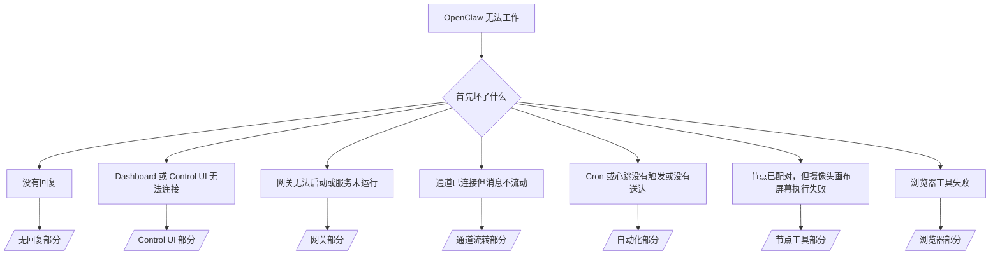

分诊入口。2 分钟内得出诊断，然后跳转到深入页面。

## 前 60 秒

按顺序运行这个梯子：

```bash
openclaw status
openclaw status --all
openclaw gateway probe
openclaw gateway status
openclaw doctor
openclaw channels status --probe
openclaw logs --follow
```

良好的输出，每行一条：

- `openclaw status` 显示已配置的通道，没有认证错误。
- `openclaw status --all` 生成完整、可共享的报告。
- `openclaw gateway probe` 显示 `Reachable: yes`。`Capability: ...` 是探测证明的认证级别；`Read probe: limited - missing scope:operator.read` 表示诊断能力受限，不是连接失败。
- `openclaw gateway status` 显示 `Runtime: running`、`Connectivity probe: ok`，以及合理的 `Capability: ...`。添加 `--require-rpc` 还会要求读权限 RPC 证明。
- `openclaw doctor` 报告没有阻塞性的配置/服务错误。
- `openclaw channels status --probe` 在网关可达时返回按账户划分的实时传输状态（`works` / `audit ok`）；在不可达时回退为仅配置摘要。
- `openclaw logs --follow` 显示稳定活动，没有重复出现的致命错误。

## Assistant 感觉受限或缺少工具

检查有效的工具配置：

```bash
openclaw status
openclaw status --all
openclaw doctor
```

常见原因：

- `tools.profile: "minimal"` 只允许 `session_status`。
- `tools.profile: "messaging"` 范围很窄，仅适用于仅聊天的代理。
- `tools.profile: "coding"` 是新本地配置的默认值（仓库、文件、
  shell 和运行时工作）。
- `tools.profile: "full"` 会移除配置文件限制；仅限受信任的、
  由操作员控制的代理使用。
- 按代理配置的 `agents.list[].tools` 会为某个代理覆盖或扩展根配置文件。

更改配置文件，重启或重新加载 Gateway，然后使用
`openclaw status --all` 重新检查。完整的配置文件/分组表：[工具配置文件](/gateway/config-tools#tool-profiles)。

## Anthropic 长上下文 429

`HTTP 429: rate_limit_error: Extra usage is required for long context requests`
→ [Anthropic 429 需要额外使用量以支持长上下文](/gateway/troubleshooting#anthropic-429-extra-usage-required-for-long-context)。

## 本地 OpenAI 兼容后端直接可用，但在 OpenClaw 中失败

你的本地/自托管 `/v1` 后端可以直接响应 `/v1/chat/completions`
探测请求，但在 `openclaw infer model run` 或普通 agent 轮次中失败：

1. 错误提示 `messages[].content` 需要字符串：将
   `models.providers.<provider>.models[].compat.requiresStringContent: true`。
2. 仍然只在 OpenClaw agent 轮次中失败：设置
   `models.providers.<provider>.models[].compat.supportsTools: false` 并重试。
3. 小的直接调用可以工作，但更大的 OpenClaw 提示会让后端崩溃：这
   是上游模型/服务器限制，不是 OpenClaw 的 bug。继续阅读
   [本地 OpenAI 兼容后端通过直接探测但 agent 运行失败](/gateway/troubleshooting#local-openai-compatible-backend-passes-direct-probes-but-agent-runs-fail)。

## 插件安装失败，缺少 openclaw 扩展

`package.json missing openclaw.extensions` 表示插件包使用了
OpenClaw 不再接受的结构。

在插件包中修复：

1. 将 `openclaw.extensions` 添加到 `package.json`，指向已构建的运行时
   文件（通常是 `./dist/index.js`）。
2. 重新发布，然后再次运行 `openclaw plugins install <package>`。

```json
{
  "name": "@openclaw/my-plugin",
  "version": "1.2.3",
  "openclaw": {
    "extensions": ["./dist/index.js"]
  }
}
```

参考：[插件架构](/plugins/architecture)

## 安装策略阻止插件安装或更新

更新完成了，但插件已过时、被禁用，或者显示 `blocked by install
policy`、`install policy failed closed`，或 `Disabled "<plugin>" after plugin
update failure`：检查 `security.installPolicy`。

安装策略会在插件安装和更新时运行。`@openclaw/*` 插件版本通常会随着 OpenClaw 发布而变化，因此 OpenClaw 更新后，在更新同步期间可能需要匹配的插件更新。

除非你也维护相应的升级规则，否则避免使用以下策略形状：

- 将 OpenClaw 自有插件冻结到某一个精确的旧版本（例如，仅
  `@openclaw/*@2026.5.3`）。
- 仅按来源类型进行阻止（每个 npm、network，或 `request.mode:
  "update"` 请求）。
- 将策略命令视为可选：当启用 `security.installPolicy` 时，缺失、缓慢、不可读或被权限阻止的策略可执行文件会以失败关闭的方式处理。
- 在未检查请求的 `openclawVersion` 与插件候选元数据的情况下批准版本。

优先使用允许受信任的 `@openclaw/*` 更新、且与当前宿主兼容的规则，而不是永久锁定到某个发布版本。如果你默认阻止 npm，请为你使用的插件 id 添加一个窄范围例外，并将同样的信任规则同时应用于 `request.mode: "update"` 和安装。

恢复：

```bash
openclaw doctor --deep
openclaw plugins update --all
openclaw status --all
```

如果策略是有意设得很严格，请在受信任的升级窗口放宽它，重新运行 `openclaw plugins update --all`，然后再恢复更严格的规则。如果更新失败导致某个插件被禁用，请在重新启用前先检查：

```bash
openclaw plugins inspect <plugin-id> --runtime --json
openclaw plugins enable <plugin-id>
```

参考：[操作员安装策略](/tools/skills-config#operator-install-policy-securityinstallpolicy)

## 插件存在但被可疑所有权阻止

`openclaw doctor`、setup 或启动警告显示：

```text
blocked plugin candidate: suspicious ownership (... uid=1000, expected uid=0 or root)
plugin present but blocked
```

插件文件的所有者与加载它们的进程不是同一个 Unix 用户。不要删除插件配置；请修复文件所有权，或使用拥有状态目录的用户运行 OpenClaw。

Docker 安装以 `node`（uid `1000`）运行。修复宿主机绑定挂载：

```bash
sudo chown -R 1000:1000 /path/to/openclaw-config /path/to/openclaw-workspace
openclaw doctor --fix
```

如果你有意以 root 身份运行 OpenClaw，则改为修复受管理的插件根目录：

```bash
sudo chown -R root:root /path/to/openclaw-config/npm
openclaw doctor --fix
```

更详细的文档：[Blocked plugin path ownership](/tools/plugin#blocked-plugin-path-ownership)、[Docker: Permissions and EACCES](/install/docker#shell-helpers-optional)

## 决策树


```mermaid
flowchart TD
  A[OpenClaw 无法工作] --> B{首先坏了什么}
  B --> C[没有回复]
  B --> D[Dashboard 或 Control UI 无法连接]
  B --> E[网关无法启动或服务未运行]
  B --> F[通道已连接但消息不流动]
  B --> G[Cron 或心跳没有触发或没有送达]
  B --> H[节点已配对，但摄像头画布屏幕执行失败]
  B --> I[浏览器工具失败]

  C --> C1[/无回复部分/]
  D --> D1[/Control UI 部分/]
  E --> E1[/网关部分/]
  F --> F1[/通道流转部分/]
  G --> G1[/自动化部分/]
  H --> H1[/节点工具部分/]
  I --> I1[/浏览器部分/]
```

<AccordionGroup>
  <Accordion title="没有回复">
    ```bash
    openclaw status
    openclaw gateway status
    openclaw channels status --probe
    openclaw pairing list --channel <channel> [--account <id>]
    openclaw logs --follow
    ```

    良好输出：

    - `Runtime: running`
    - `Connectivity probe: ok`
    - `Capability: read-only`、`write-capable` 或 `admin-capable`
    - 通道显示传输已连接，并且在支持的情况下，在 `channels status --probe` 中显示 `works` 或
      `audit ok`
    - 发送者已获批准（或 DM 策略为开放/白名单）

    日志特征：

    - `drop guild message (mention required` → Discord 提及门控阻止了消息。
    - `pairing request` → 发送者未获批准，正在等待 DM 配对审批。
    - `blocked` / `allowlist` in channel logs → 发送者、房间或群组被过滤。

    深入页面：[无回复](/gateway/troubleshooting#no-replies)，[通道故障排查](/channels/troubleshooting)，[配对](/channels/pairing)

  </Accordion>

  <Accordion title="Dashboard 或 Control UI 无法连接">
    ```bash
    openclaw status
    openclaw gateway status
    openclaw logs --follow
    openclaw doctor
    openclaw channels status --probe
    ```

    良好输出：

    - `Dashboard: http://...` 显示在 `openclaw gateway status` 中
    - `Connectivity probe: ok`
    - `Capability: read-only`、`write-capable` 或 `admin-capable`
    - 日志中没有认证循环

    日志特征：

    - `device identity required` → HTTP/非安全上下文无法完成设备认证。
    - `origin not allowed` → 浏览器 `Origin` 不被允许用于 Control UI 网关目标。
    - `AUTH_TOKEN_MISMATCH` with `canRetryWithDeviceToken=true` → 可能会自动进行一次受信任的设备令牌重试，重试时复用已配对令牌的缓存作用域。
    - 之后重复出现 `unauthorized` → 令牌/密码错误、认证模式不匹配，或已过期的已配对设备令牌。
    - `too many failed authentication attempts (retry later)` → 来自该浏览器 `Origin` 的重复失败会被临时锁定；其他 localhost origins 使用独立桶。关于 Tailscale Serve 并发重试的细节，请参见 [Dashboard/Control UI connectivity](/gateway/troubleshooting#dashboard-control-ui-connectivity)。
    - `gateway connect failed:` → UI 目标指向了错误的 URL/端口，或网关不可达。

    深入页面：[Dashboard/Control UI connectivity](/gateway/troubleshooting#dashboard-control-ui-connectivity)，[Control UI](/web/control-ui)，[Authentication](/gateway/authentication)

  </Accordion>

  <Accordion title="网关无法启动，或服务已安装但未运行">
    ```bash
    openclaw status
    openclaw gateway status
    openclaw logs --follow
    openclaw doctor
    openclaw channels status --probe
    ```

    良好输出：

    - `Service: ... (loaded)`
    - `Runtime: running`
    - `Connectivity probe: ok`
    - `Capability: read-only`、`write-capable` 或 `admin-capable`

    日志特征：

    - `Gateway start blocked: set gateway.mode=local` or `existing config is missing gateway.mode` → 网关模式是 remote，或配置缺少 local-mode 标记，需要修复。
    - `refusing to bind gateway ... without auth` → 在没有有效认证路径（令牌/密码，或已配置的 trusted-proxy）的情况下进行非回环绑定。
    - `another gateway instance is already listening` or `EADDRINUSE` → 端口已被占用。

    深入页面：[网关服务未运行](/gateway/troubleshooting#gateway-service-not-running)，[后台进程](/gateway/background-process)，[配置](/gateway/configuration)

  </Accordion>

  <Accordion title="通道已连接但消息不流动">
    ```bash
    openclaw status
    openclaw gateway status
    openclaw logs --follow
    openclaw doctor
    openclaw channels status --probe
    ```

    良好输出：

    - 通道传输已连接。
    - 配对/白名单检查通过。
    - 在需要时已检测到提及。

    日志特征：

    - `mention required` → 群组提及门控阻止了处理。
    - `pairing` / `pending` → DM 发送者尚未获批准。
    - `not_in_channel`、`missing_scope`、`Forbidden`、`401/403` → 通道权限令牌问题。

    深入页面：[通道已连接，但消息不流动](/gateway/troubleshooting#channel-connected-messages-not-flowing)，[通道故障排查](/channels/troubleshooting)

  </Accordion>

  <Accordion title="Cron 或心跳没有触发或没有送达">
    ```bash
    openclaw status
    openclaw gateway status
    openclaw cron status
    openclaw cron list
    openclaw cron runs --id <jobId> --limit 20
    openclaw logs --follow
    ```

    良好输出：

    - `cron status` 显示调度器已启用，并有下一次唤醒。
    - `cron runs` 显示最近的 `ok` 条目。
    - Heartbeat 已启用且处于活动时段内。

    日志特征：

    - `cron: scheduler disabled; jobs will not run automatically` → cron 被禁用。
    - `heartbeat skipped` reason `quiet-hours` → 超出配置的活动时段。
    - `heartbeat skipped` reason `empty-heartbeat-file` → `HEARTBEAT.md` 存在，但只包含空白、注释、标题、代码块或空检查清单脚手架内容。
    - `heartbeat skipped` reason `no-tasks-due` → 任务模式已激活，但还没有到达任何任务间隔。
    - `heartbeat skipped` reason `alerts-disabled` → `showOk`、`showAlerts` 和 `useIndicator` 都关闭了。
    - `requests-in-flight` → 主通道忙；heartbeat 唤醒被延后。
    - `unknown accountId` → heartbeat 投递目标账户不存在。

    深入页面：[Cron 和 heartbeat 投递](/gateway/troubleshooting#cron-and-heartbeat-delivery)，[计划任务：故障排查](/automation/cron-jobs#troubleshooting)，[Heartbeat](/gateway/heartbeat)

  </Accordion>

  <Accordion title="节点已配对，但工具在摄像头画布屏幕执行时失败">
    ```bash
    openclaw status
    openclaw gateway status
    openclaw nodes status
    openclaw nodes describe --node <idOrNameOrIp>
    openclaw logs --follow
    ```

    良好输出：

    - 节点列为已连接，并已按 `node` 角色配对。
    - 你正在调用的命令具备相应能力。
    - 该工具的权限状态已授予。

    日志特征：

    - `NODE_BACKGROUND_UNAVAILABLE` → 将节点应用切换到前台。
    - `*_PERMISSION_REQUIRED` → 操作系统权限被拒绝/缺失。
    - `SYSTEM_RUN_DENIED: approval required` → exec 审批正在等待中。
    - `SYSTEM_RUN_DENIED: allowlist miss` → 命令不在 exec 白名单中。

    深入页面：[节点已配对，但工具失败](/gateway/troubleshooting#node-paired-tool-fails)，[节点故障排查](/nodes/troubleshooting)，[Exec 审批](/tools/exec-approvals)

  </Accordion>

  <Accordion title="Exec 突然要求审批">
    ```bash
    openclaw config get tools.exec.host
    openclaw config get tools.exec.security
    openclaw config get tools.exec.ask
    openclaw gateway restart
    ```

    发生了什么变化：

    - 未设置的 `tools.exec.host` 默认为 `auto`；当沙箱运行时环境处于激活状态时，它会解析为 `sandbox`，否则为 `gateway`。
    - `host=auto` 只负责路由；无提示行为来自 `gateway/node` 上的 `security=full` 加 `ask=off`。
    - 未设置的 `tools.exec.security` 在 `gateway`/`node` 上默认为 `full`。
    - 未设置的 `tools.exec.ask` 默认为 `off`。
    - 如果你现在看到审批，说明某个宿主机本地或按会话的策略把 exec 收紧到了这些默认值之外。

    恢复当前的无审批默认值：

    ```bash
    openclaw config set tools.exec.host gateway
    openclaw config set tools.exec.security full
    openclaw config set tools.exec.ask off
    openclaw gateway restart
    ```

    更安全的替代方案：

    - 仅设置 `tools.exec.host=gateway`，以获得稳定的宿主路由。
    - 使用 `security=allowlist` 并配合 `ask=on-miss`，在白名单未命中时对宿主 exec 进行审查。
    - 启用沙箱模式，使 `host=auto` 重新解析回 `sandbox`。

    日志特征：

    - `Approval required.` → 命令正在等待 `/approve ...`。
    - `SYSTEM_RUN_DENIED: approval required` → 节点主机 exec 审批正在等待中。
    - `exec host=sandbox requires a sandbox runtime for this session` → 隐式/显式选择了沙箱，但沙箱模式已关闭。

    深入页面：[Exec](/tools/exec)，[Exec 审批](/tools/exec-approvals)，[安全性：审计检查内容](/gateway/security#what-the-audit-checks-high-level)

  </Accordion>

  <Accordion title="浏览器工具失败">
    ```bash
    openclaw status
    openclaw gateway status
    openclaw browser status
    openclaw logs --follow
    openclaw doctor
    ```

    良好输出：

    - Browser status 显示 `running: true` 以及已选定的浏览器/配置文件。
    - `openclaw` 配置文件启动成功，或 `user` 配置文件能看到本地 Chrome 标签页。

    日志特征：

    - `unknown command "browser"` → `plugins.allow` 已设置且排除了 `browser`。
    - `Failed to start Chrome CDP on port` → 本地浏览器启动失败。
    - `browser.executablePath not found` → 配置的二进制路径错误。
    - `browser.cdpUrl must be http(s) or ws(s)` → 配置的 CDP URL 使用了不支持的协议。
    - `browser.cdpUrl has invalid port` → 配置的 CDP URL 端口无效或超出范围。
    - `No Chrome tabs found for profile="user"` → Chrome MCP attach 配置文件没有打开的本地 Chrome 标签页。
    - `Remote CDP for profile "<name>" is not reachable` → 从此主机无法访问配置的远程 CDP 端点。
    - `Browser attachOnly is enabled ... not reachable` → attach-only 配置文件没有可用的 live CDP 目标。
    - attach-only 或远程 CDP 配置文件上遗留的视口/深色模式/语言环境/离线覆盖 → 运行 `openclaw browser stop --browser-profile <name>` 以关闭控制会话，并在不重启网关的情况下释放模拟状态。

    深入页面：[浏览器工具失败](/gateway/troubleshooting#browser-tool-fails)，[缺少浏览器命令或工具](/tools/browser#missing-browser-command-or-tool)，[Browser: Linux troubleshooting](/tools/browser-linux-troubleshooting)，[Browser: WSL2/Windows remote CDP troubleshooting](/tools/browser-wsl2-windows-remote-cdp-troubleshooting)

  </Accordion>

</AccordionGroup>

## 相关

- [FAQ](/help/faq) — 常见问题
- [Gateway Troubleshooting](/gateway/troubleshooting) — 网关特定问题
- [Doctor](/gateway/doctor) — 自动化健康检查和修复
- [Channel Troubleshooting](/channels/troubleshooting) — 通道连接问题
- [Scheduled tasks: Troubleshooting](/automation/cron-jobs#troubleshooting) — cron 和 heartbeat 问题
