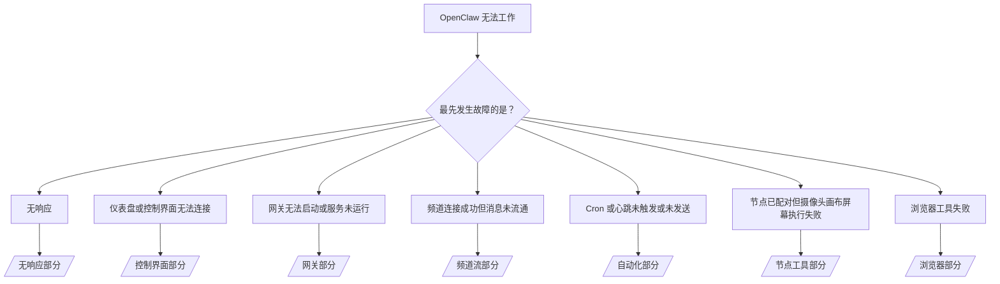

如果您只有 2 分钟，请将此页面作为分诊入口。

## 前 60 秒

按顺序运行以下命令：

```bash
openclaw status
openclaw status --all
openclaw gateway probe
openclaw gateway status
openclaw doctor
openclaw channels status --probe
openclaw logs --follow
```

良好输出一览：

- `openclaw status` → 显示已配置的频道且没有明显的认证错误。
- `openclaw status --all` → 提供完整报告并且可共享。
- `openclaw gateway probe` → 预期的网关目标可达（`Reachable: yes`）。`Capability: ...` 会告诉您该探测能证明的认证级别，而 `Read probe: limited - missing scope: operator.read` 表示诊断降级，而不是连接失败。
- `openclaw gateway status` → `Runtime: running`、`Connectivity probe: ok`，以及合理的 `Capability: ...` 行。如果您还需要读范围的 RPC 证明，请使用 `--require-rpc`。
- `openclaw doctor` → 没有阻塞性的配置/服务错误。
- `openclaw channels status --probe` → 可达的网关会返回按账户的实时传输状态以及诸如 `works` 或 `audit ok` 的探测/审计结果；如果网关不可达，该命令会回退为仅配置摘要。
- `openclaw logs --follow` → 持续有活动，没有重复的致命错误。

## Anthropic 长上下文 429

如果看到：
`HTTP 429: rate_limit_error: Extra usage is required for long context requests`，
请访问 [/gateway/troubleshooting#anthropic-429-extra-usage-required-for-long-context](/gateway/troubleshooting#anthropic-429-extra-usage-required-for-long-context)。

## 本地 OpenAI 兼容后端直接工作但在 OpenClaw 中失败

如果您的本地或自托管 `/v1` 后端能响应小的直接 `/v1/chat/completions` 探测，但在 `openclaw infer model run` 或正常代理回合中失败：

1. 如果错误提到 `messages[].content` 需要字符串，请设置 `models.providers.<provider>.models[].compat.requiresStringContent: true`。
2. 如果后端仍然仅在 OpenClaw 代理回合中失败，请设置 `models.providers.<provider>.models[].compat.supportsTools: false` 并重试。
3. 如果微小的直接调用仍然有效，但更大的 OpenClaw 提示导致后端崩溃，请将剩余问题视为上游模型/服务器限制，并继续查看深度运行手册：
   [/gateway/troubleshooting#local-openai-compatible-backend-passes-direct-probes-but-agent-runs-fail](/gateway/troubleshooting#local-openai-compatible-backend-passes-direct-probes-but-agent-runs-fail)

## 插件安装失败，缺少 openclaw 扩展

若安装失败并提示 `package.json missing openclaw.extensions`，说明插件包使用了 OpenClaw 已不再接受的旧格式。

插件包修复步骤：

1. 将 `openclaw.extensions` 添加到 `package.json`。
2. 将入口指向构建后的运行时文件（通常为 `./dist/index.js`）。
3. 重新发布插件并再次运行 `openclaw plugins install <package>`。

示例：

```json
{
  "name": "@openclaw/my-plugin",
  "version": "1.2.3",
  "openclaw": {
    "extensions": ["./dist/index.js"]
  }
}
```

参考：[插件架构](/plugins/architecture)

## 决策树


```mermaid
flowchart TD
  A[OpenClaw 无法工作] --> B{最先发生故障的是？}
  B --> C[无响应]
  B --> D[仪表盘或控制界面无法连接]
  B --> E[网关无法启动或服务未运行]
  B --> F[频道连接成功但消息未流通]
  B --> G[Cron 或心跳未触发或未发送]
  B --> H[节点已配对但摄像头画布屏幕执行失败]
  B --> I[浏览器工具失败]

  C --> C1[/无响应部分/]
  D --> D1[/控制界面部分/]
  E --> E1[/网关部分/]
  F --> F1[/频道流部分/]
  G --> G1[/自动化部分/]
  H --> H1[/节点工具部分/]
  I --> I1[/浏览器部分/]
```

<AccordionGroup>
  <Accordion title="无响应">
    ```bash
    openclaw status
    openclaw gateway status
    openclaw channels status --probe
    openclaw pairing list --channel <channel> [--account <id>]
    openclaw logs --follow
    ```

    良好输出表现为：

    - `Runtime: running`
    - `Connectivity probe: ok`
    - `Capability: read-only`, `write-capable`, or `admin-capable`
    - 您的频道显示传输已连接，并且在支持时，`channels status --probe` 中显示 `works` 或 `audit ok`
    - 发送者显示已批准（或 DM 策略为开放/允许列表）

    常见日志特征：

    - `drop guild message (mention required` → Discord 中的提及限制阻止了消息。
    - `pairing request` → 发送者未批准，正在等待私信配对批准。
    - 频道日志中出现 `blocked` / `allowlist` → 发送者、房间或组被过滤。

    深入页面：

    - [/gateway/troubleshooting#no-replies](/gateway/troubleshooting#no-replies)
    - [/channels/troubleshooting](/channels/troubleshooting)
    - [/channels/pairing](/channels/pairing)

  </Accordion>

  <Accordion title="仪表盘或控制界面无法连接">
    ```bash
    openclaw status
    openclaw gateway status
    openclaw logs --follow
    openclaw doctor
    openclaw channels status --probe
    ```

    良好输出表现为：

    - `openclaw gateway status` 中显示 `Dashboard: http://...`
    - `Connectivity probe: ok`
    - `Capability: read-only`, `write-capable`, or `admin-capable`
    - 日志中没有认证循环

    常见日志特征：

    - `device identity required` → HTTP/非安全上下文无法完成设备认证。
    - `origin not allowed` → 浏览器 `Origin` 不被允许用于控制界面网关目标。
    - 带有重试提示（`canRetryWithDeviceToken=true`）的 `AUTH_TOKEN_MISMATCH` → 可能会自动发生一次受信设备令牌重试。
    - 该缓存令牌重试会重复使用与配对设备令牌一起存储的缓存范围集。显式 `deviceToken` / 显式 `scopes` 调用者保留其请求的范围集。
    - 在异步 Tailscale Serve 控制界面路径上，相同 `{scope, ip}` 的失败尝试在限制器记录失败之前会被序列化，因此第二个并发错误重试可能已经显示 `retry later`。
    - 来自 localhost 浏览器起源的 `too many failed authentication attempts (retry later)` → 来自同一 `Origin` 的重复失败会被临时锁定；另一个 localhost 起源使用单独的桶。
    - 该重试后的重复 `unauthorized` → 错误的令牌/密码、认证模式不匹配，或过期的配对设备令牌。
    - `gateway connect failed:` → UI 目标 URL/端口错误或网关不可访问。

    深入页面：

    - [/gateway/troubleshooting#dashboard-control-ui-connectivity](/gateway/troubleshooting#dashboard-control-ui-connectivity)
    - [/web/control-ui](/web/control-ui)
    - [/gateway/authentication](/gateway/authentication)

  </Accordion>

  <Accordion title="网关无法启动或服务已安装但未运行">
    ```bash
    openclaw status
    openclaw gateway status
    openclaw logs --follow
    openclaw doctor
    openclaw channels status --probe
    ```

    良好输出表现为：

    - `Service: ... (loaded)`
    - `Runtime: running`
    - `Connectivity probe: ok`
    - `Capability: read-only`, `write-capable`, or `admin-capable`

    常见日志特征：

    - `Gateway start blocked: set gateway.mode=local` 或 `existing config is missing gateway.mode` → 网关模式是远程的，或者配置文件缺少本地模式标记，应修复。
    - `refusing to bind gateway ... without auth` → 非环回绑定没有有效的网关认证路径（令牌/密码，或配置的受信代理）。
    - `another gateway instance is already listening` 或 `EADDRINUSE` → 端口已被占用。

    深入页面：

    - [/gateway/troubleshooting#gateway-service-not-running](/gateway/troubleshooting#gateway-service-not-running)
    - [/gateway/background-process](/gateway/background-process)
    - [/gateway/configuration](/gateway/configuration)

  </Accordion>

  <Accordion title="频道连接成功但消息未流通">
    ```bash
    openclaw status
    openclaw gateway status
    openclaw logs --follow
    openclaw doctor
    openclaw channels status --probe
    ```

    良好输出表现为：

    - 频道传输已连接。
    - 配对/白名单检查通过。
    - 在需要时检测到提及。

    常见日志特征：

    - `mention required` → 群组提及限制阻止了消息处理。
    - `pairing` / `pending` → 私信发送者尚未批准。
    - `not_in_channel`、`missing_scope`、`Forbidden`、`401/403` → 频道权限令牌问题。

    深入页面：

    - [/gateway/troubleshooting#channel-connected-messages-not-flowing](/gateway/troubleshooting#channel-connected-messages-not-flowing)
    - [/channels/troubleshooting](/channels/troubleshooting)

  </Accordion>

  <Accordion title="Cron 或心跳未触发或未发送">
    ```bash
    openclaw status
    openclaw gateway status
    openclaw cron status
    openclaw cron list
    openclaw cron runs --id <jobId> --limit 20
    openclaw logs --follow
    ```

    良好输出表现为：

    - `cron.status` 显示启用且有下次唤醒时间。
    - `cron runs` 显示最近有 `ok` 条目。
    - 心跳已启用且未处于非活跃时间段。

    常见日志特征：

    - `cron: scheduler disabled; jobs will not run automatically` → cron 已禁用。
    - `heartbeat skipped` with `reason=quiet-hours` → 在配置的活动时间之外。
    - `heartbeat skipped` with `reason=empty-heartbeat-file` → `HEARTBEAT.md` 存在但仅包含空白/仅标题的框架。
    - `heartbeat skipped` with `reason=no-tasks-due` → `HEARTBEAT.md` 任务模式已激活，但没有任何任务间隔到期。
    - `heartbeat skipped` with `reason=alerts-disabled` → 所有心跳可见性已禁用（`showOk`、`showAlerts` 和 `useIndicator` 均为 off）。
    - `requests-in-flight` → 主通道繁忙；心跳唤醒已延迟。
    - `unknown accountId` → 心跳交付目标账户不存在。

    深入页面：

    - [/gateway/troubleshooting#cron-and-heartbeat-delivery](/gateway/troubleshooting#cron-and-heartbeat-delivery)
    - [/automation/cron-jobs#troubleshooting](/automation/cron-jobs#troubleshooting)
    - [/gateway/heartbeat](/gateway/heartbeat)

  </Accordion>

  <Accordion title="节点已配对但工具执行摄像头画布屏幕失败">
    ```bash
    openclaw status
    openclaw gateway status
    openclaw nodes status
    openclaw nodes describe --node <idOrNameOrIp>
    openclaw logs --follow
    ```

    良好输出表现为：

    - 节点显示为已连接且已为 `node` 角色配对。
    - 您正在调用的命令具备相应能力。
    - 该工具的权限状态已授予。

    常见日志特征：

    - `NODE_BACKGROUND_UNAVAILABLE` → 将节点应用置于前台。
    - `*_PERMISSION_REQUIRED` → 操作系统权限被拒绝或缺失。
    - `SYSTEM_RUN_DENIED: approval required` → 正在等待执行批准。
    - `SYSTEM_RUN_DENIED: allowlist miss` → 命令不在执行允许列表中。

    深入页面：

    - [/gateway/troubleshooting#node-paired-tool-fails](/gateway/troubleshooting#node-paired-tool-fails)
    - [/nodes/troubleshooting](/nodes/troubleshooting)
    - [/tools/exec-approvals](/tools/exec-approvals)

  </Accordion>

  <Accordion title="Exec 突然要求批准">
    ```bash
    openclaw config get tools.exec.host
    openclaw config get tools.exec.security
    openclaw config get tools.exec.ask
    openclaw gateway restart
    ```

    发生了什么变化：

    - 如果 `tools.exec.host` 未设置，默认值为 `auto`。
    - `host=auto` 在沙盒运行时激活时解析为 `sandbox`，否则为 `gateway`。
    - `host=auto` 只负责路由；无提示的 “YOLO” 行为来自网关/节点上的 `security=full` 加 `ask=off`。
    - 在 `gateway` 和 `node` 上，未设置的 `tools.exec.security` 默认值为 `full`。
    - 未设置的 `tools.exec.ask` 默认值为 `off`。
    - 结果：如果您看到审批提示，说明某些主机本地或按会话策略已将 exec 权限收紧，不再使用当前默认值。

    恢复当前默认的无需批准行为：

    ```bash
    openclaw config set tools.exec.host gateway
    openclaw config set tools.exec.security full
    openclaw config set tools.exec.ask off
    openclaw gateway restart
    ```

    更安全的替代方案：

    - 如果您只想要稳定的主机路由，仅设置 `tools.exec.host=gateway`。
    - 如果您希望使用主机 exec，但仍希望在未命中允许列表时进行审查，请使用 `security=allowlist` 搭配 `ask=on-miss`。
    - 如果您希望 `host=auto` 重新解析为 `sandbox`，请启用沙盒模式。

    常见日志特征：

    - `Approval required.` → 命令正在等待 `/approve ...`。
    - `SYSTEM_RUN_DENIED: approval required` → 节点主机 exec 正在等待批准。
    - `exec host=sandbox requires a sandbox runtime for this session` → 隐式/显式选择了沙盒，但沙盒模式已关闭。

    深入页面：

    - [/tools/exec](/tools/exec)
    - [/tools/exec-approvals](/tools/exec-approvals)
    - [/gateway/security#what-the-audit-checks-high-level](/gateway/security#what-the-audit-checks-high-level)

  </Accordion>

  <Accordion title="浏览器工具失败">
    ```bash
    openclaw status
    openclaw gateway status
    openclaw browser status
    openclaw logs --follow
    openclaw doctor
    ```

    良好输出表现为：

    - 浏览器状态显示 `running: true` 以及已选择的浏览器/配置文件。
    - `openclaw` 已启动，或者 `user` 可以看到本地 Chrome 标签页。

    常见日志特征：

    - `unknown command "browser"` 或 `unknown command 'browser'` → `plugins.allow` 已设置，但不包含 `browser`。
    - `Failed to start Chrome CDP on port` → 本地浏览器启动失败。
    - `browser.executablePath not found` → 配置的二进制路径错误。
    - `browser.cdpUrl must be http(s) or ws(s)` → 配置的 CDP URL 使用了不受支持的协议。
    - `browser.cdpUrl has invalid port` → 配置的 CDP URL 端口无效或超出范围。
    - `No Chrome tabs found for profile="user"` → Chrome MCP 附加配置文件没有打开的本地 Chrome 标签页。
    - `Remote CDP for profile "<name>" is not reachable` → 配置的远程 CDP 端点从此主机无法访问。
    - `Browser attachOnly is enabled ... not reachable` 或 `Browser attachOnly is enabled and CDP websocket ... is not reachable` → 仅附加配置文件没有可用的 CDP 目标。
    - 附加式或远程 CDP 配置文件上存在过时的视口/深色模式/区域设置/离线覆盖 → 运行 `openclaw browser stop --browser-profile <name>` 以关闭当前控制会话，并释放仿真状态，而无需重启网关。

    深入页面：

    - [/gateway/troubleshooting#browser-tool-fails](/gateway/troubleshooting#browser-tool-fails)
    - [/tools/browser#missing-browser-command-or-tool](/tools/browser#missing-browser-command-or-tool)
    - [/tools/browser-linux-troubleshooting](/tools/browser-linux-troubleshooting)
    - [/tools/browser-wsl2-windows-remote-cdp-troubleshooting](/tools/browser-wsl2-windows-remote-cdp-troubleshooting)

  </Accordion>

</AccordionGroup>

## 相关内容

- [常见问题](/help/faq) — 常见问题
- [网关故障排除](/gateway/troubleshooting) — 网关特定问题
- [诊断工具](/gateway/doctor) — 自动健康检查与修复
- [通道故障排除](/channels/troubleshooting) — 通道连接问题
- [自动化故障排除](/automation/cron-jobs#troubleshooting) — cron 和心跳问题
