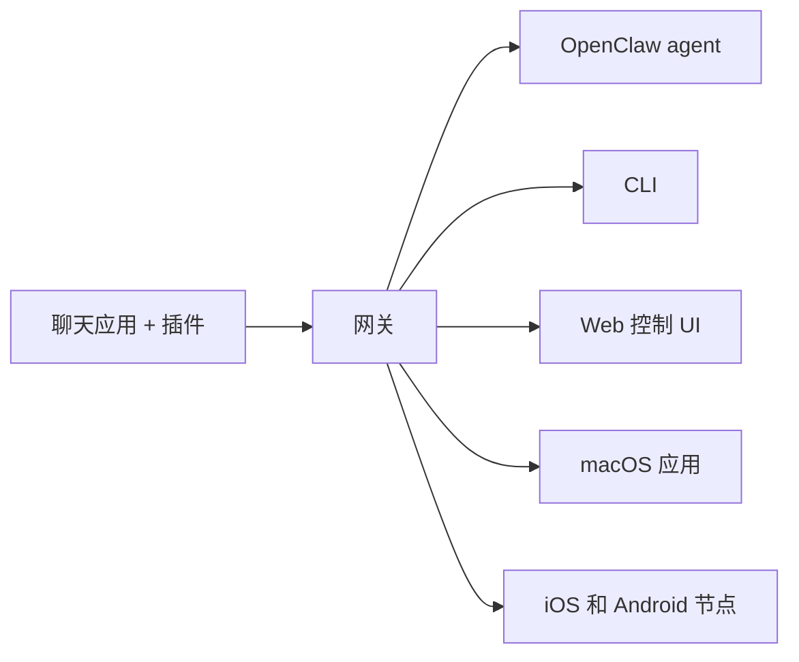

# OpenClaw 🦞

<p align="center">
    
    
</p>

> _"EXFOLIATE! EXFOLIATE!"_ — 一只太空龙虾，大概吧

<p align="center">
  <strong>适用于跨 Discord、Google Chat、iMessage、Matrix、Microsoft Teams、Signal、Slack、Telegram、WhatsApp、Zalo 等平台的任何操作系统 AI 代理网关。</strong><br />
  发一条消息，就能从你的口袋里收到代理回复。通过频道插件、WebChat 和移动节点运行一个 Gateway。
</p>

<Columns>
  <Card title="开始使用" href="/start/getting-started" icon="rocket">
    安装 OpenClaw，并在几分钟内启动网关。
  </Card>
  <Card title="运行引导" href="/start/wizard" icon="sparkles">
    使用 `openclaw onboard` 和配对流程进行引导式设置。
  </Card>
  <Card title="打开控制 UI" href="/web/control-ui" icon="layout-dashboard">
    启动浏览器仪表板，用于聊天、配置和会话。
  </Card>
</Columns>

## 什么是 OpenClaw？

OpenClaw 是一个**自托管网关**，可通过频道插件将你最喜欢的聊天应用——Discord、Google Chat、iMessage、Matrix、Microsoft Teams、Signal、Slack、Telegram、WhatsApp、Zalo 等更多应用——连接到 AI 编码代理。你只需在自己的机器（或服务器）上运行一个 Gateway 进程，它就会成为你的消息应用与一个始终可用的 AI 助手之间的桥梁。

**它适合谁？** 适合希望拥有一个可以随时发消息的个人 AI 助手的开发者和高级用户——而且不必放弃对数据的控制，也不依赖托管服务。

**它有何不同？**

- **自托管**：在你的硬件上运行，按你的规则办
- **多频道**：一个 Gateway 可同时为所有已配置的频道插件提供服务
- **面向代理**：为支持工具使用、会话、记忆和多代理路由的编码代理而构建
- **开源**：MIT 许可，社区驱动

**你需要什么？** Node 24（推荐），或 Node 22 LTS（`22.19+`）以保证兼容性、来自你所选提供商的 API 密钥，以及 5 分钟。为获得最佳质量和安全性，请使用可用的最强最新一代模型。

## 它是如何工作的


```mermaid
flowchart LR
  A["聊天应用 + 插件"] --> B["网关"]
  B --> C["OpenClaw agent"]
  B --> D["CLI"]
  B --> E["Web 控制 UI"]
  B --> F["macOS 应用"]
  B --> G["iOS 和 Android 节点"]
```

网关是会话、路由和通道连接的唯一事实来源。

## 核心能力

<Columns>
  <Card title="多通道网关" icon="network" href="/channels">
    使用单个网关进程即可支持 Discord、iMessage、Signal、Slack、Telegram、WhatsApp、WebChat 等。
  </Card>
  <Card title="插件通道" icon="plug" href="/tools/plugin">
    通道插件可添加 Matrix、Nostr、Twitch、Zalo 等；官方插件可按需安装。
  </Card>
  <Card title="多代理路由" icon="route" href="/concepts/multi-agent">
    为每个代理、工作区或发送者隔离会话。
  </Card>
  <Card title="媒体支持" icon="image" href="/nodes/images">
    发送和接收图像、音频和文档。
  </Card>
  <Card title="Web 控制 UI" icon="monitor" href="/web/control-ui">
    用于聊天、配置、会话和节点的浏览器仪表板。
  </Card>
  <Card title="移动节点" icon="smartphone" href="/nodes">
    配对 iOS 和 Android 节点，以支持 Canvas、摄像头和语音启用的工作流。
  </Card>
</Columns>

## 快速开始

<Steps>
  <Step title="安装 OpenClaw">
    ```bash
    npm install -g openclaw@latest
    ```
  </Step>
  <Step title="完成引导并安装服务">
    ```bash
    openclaw onboard --install-daemon
    ```
  </Step>
  <Step title="聊天">
    在浏览器中打开控制 UI 并发送消息：

    ```bash
    openclaw dashboard
    ```

    或者连接一个通道（[Telegram](/channels/telegram) 是最快的），然后在手机上聊天。

  </Step>
</Steps>

需要完整的安装和开发设置？请参见 [Getting Started](/start/getting-started)。

## 仪表板

网关启动后，打开浏览器控制 UI。

- 本地默认地址：[http://127.0.0.1:18789/](http://127.0.0.1:18789/)
- 远程访问：[Web 界面](/web) 和 [Tailscale](/gateway/tailscale)

<p align="center">
  
</p>

## 配置（可选）

配置位于 `~/.openclaw/openclaw.json`。

- 如果你**什么都不做**，OpenClaw 会使用内置的 OpenClaw 代理运行时；私信会共享代理的主会话，而每个群聊都会获得自己的会话。
- 如果你想加强限制，可以从 `channels.whatsapp.allowFrom` 和（对于群组）提及规则开始。

示例：

```json5
{
  channels: {
    whatsapp: {
      allowFrom: ["+15555550123"],
      groups: { "*": { requireMention: true } },
    },
  },
  messages: { groupChat: { mentionPatterns: ["@openclaw"] } },
}
```

## 从这里开始

<Columns>
  <Card title="文档中心" href="/start/hubs" icon="book-open">
    按使用场景组织的全部文档和指南。
  </Card>
  <Card title="配置" href="/gateway/configuration" icon="settings">
    核心网关设置、令牌和提供商配置。
  </Card>
  <Card title="远程访问" href="/gateway/remote" icon="globe">
    SSH 和 tailnet 访问模式。
  </Card>
  <Card title="Channels" href="/channels/telegram" icon="message-square">
    针对 Discord、飞书、Microsoft Teams、Telegram、WhatsApp 等的频道专属设置。
  </Card>
  <Card title="节点" href="/nodes" icon="smartphone">
    带有配对、Canvas、摄像头和设备操作的 iOS 和 Android 节点。
  </Card>
  <Card title="帮助" href="/help" icon="life-buoy">
    常见修复和故障排查入口。
  </Card>
</Columns>

## 了解更多

<Columns>
  <Card title="完整功能列表" href="/concepts/features" icon="list">
    完整的通道、路由和媒体能力。
  </Card>
  <Card title="多代理路由" href="/concepts/multi-agent" icon="route">
    工作区隔离和按代理划分的会话。
  </Card>
  <Card title="安全性" href="/gateway/security" icon="shield">
    令牌、允许列表和安全控制。
  </Card>
  <Card title="故障排查" href="/gateway/troubleshooting" icon="wrench">
    网关诊断和常见错误。
  </Card>
  <Card title="关于与致谢" href="/reference/credits" icon="info">
    项目起源、贡献者和许可证。
  </Card>
</Columns>
