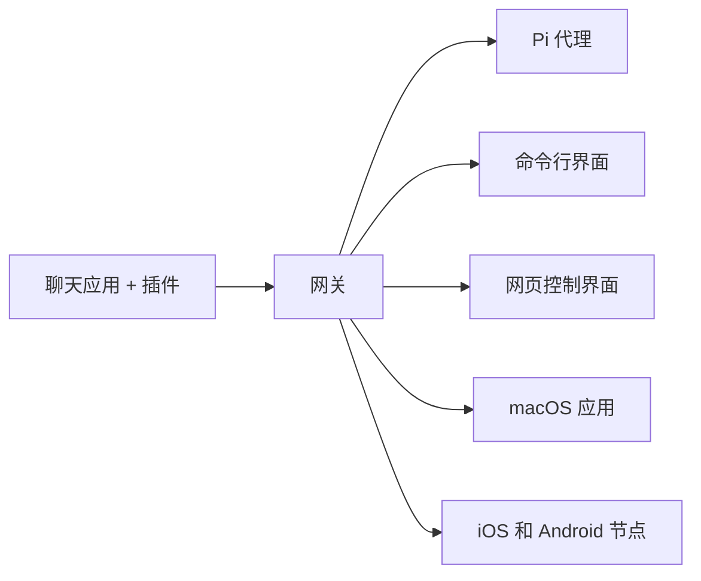

# OpenClaw 🦞

<p align="center">
    
    
</p>

> _“去角质！去角质！”_ — 一只太空龙虾，大概是这么说的

<p align="center">
  <strong>适用于 Discord、Google Chat、iMessage、Matrix、Microsoft Teams、Signal、Slack、Telegram、WhatsApp、Zalo 等平台的任意操作系统 AI 代理网关。</strong><br />
  发送消息，就能从你的口袋里获得代理响应。在内置渠道、捆绑的渠道插件、WebChat 和移动节点上运行一个网关。
</p>

<Columns>
  <Card title="快速开始" href="/start/getting-started" icon="rocket">
    安装 OpenClaw，几分钟内启动网关。
  </Card>
  <Card title="运行引导流程" href="/start/wizard" icon="sparkles">
    使用 `openclaw onboard` 和配对流程进行引导设置。
  </Card>
  <Card title="打开控制界面" href="/web/control-ui" icon="layout-dashboard">
    启动浏览器仪表盘，管理聊天、配置和会话。
  </Card>
</Columns>

## 什么是 OpenClaw？

OpenClaw 是一个**自托管网关**，可将你最喜欢的聊天应用和渠道界面——包括内置渠道以及捆绑或外部渠道插件，例如 Discord、Google Chat、iMessage、Matrix、Microsoft Teams、Signal、Slack、Telegram、WhatsApp、Zalo 等——连接到像 Pi 这样的 AI 编程代理。你可以在自己的机器（或服务器）上运行一个网关进程，它就会成为你的消息应用与始终可用的 AI 助手之间的桥梁。

**适合谁？** 开发者和高级用户，想拥有一个可以随时随地聊天的私人 AI 助手，同时不丢失数据控制权或依赖托管服务。

**有什么不同？**

- **自托管**：运行在你的硬件上，按你的规则来
- **多通道**：一个网关可同时服务内置渠道以及捆绑或外部渠道插件
- **原生代理**：专为带工具使用、会话、记忆和多代理路由的编程代理而构建
- **开源**：MIT 许可，社区驱动

**你需要什么？** Node 24（推荐），或为了兼容性使用 Node 22 LTS（`22.14+`），你所选提供商的 API 密钥，以及 5 分钟时间。为了获得最佳质量和安全性，请使用当前可用的最强最新一代模型。

## 工作原理


```mermaid
flowchart LR
  A["聊天应用 + 插件"] --> B["网关"]
  B --> C["Pi 代理"]
  B --> D["命令行界面"]
  B --> E["网页控制界面"]
  B --> F["macOS 应用"]
  B --> G["iOS 和 Android 节点"]
```

网关是会话、路由和渠道连接的唯一权威。

## 主要功能

<Columns>
  <Card title="Multi-channel gateway" icon="network" href="/channels">
    通过单个网关进程支持 Discord、iMessage、Signal、Slack、Telegram、WhatsApp、WebChat 等更多平台。
  </Card>
  <Card title="Plugin channels" icon="plug" href="/tools/plugin">
    捆绑插件在常规当前版本中添加 Matrix、Nostr、Twitch、Zalo 等更多平台。
  </Card>
  <Card title="Multi-agent routing" icon="route" href="/concepts/multi-agent">
    按代理、工作区或发送者隔离会话。
  </Card>
  <Card title="Media support" icon="image" href="/nodes/images">
    发送和接收图片、音频和文档。
  </Card>
  <Card title="Web Control UI" icon="monitor" href="/web/control-ui">
    用于聊天、配置、会话和节点的浏览器仪表盘。
  </Card>
  <Card title="Mobile nodes" icon="smartphone" href="/nodes">
    配对 iOS 和 Android 节点，用于画布、摄像头和语音启用工作流。
  </Card>
</Columns>

## 快速开始

<Steps>
  <Step title="安装 OpenClaw">
    ```bash
    npm install -g openclaw@latest
    ```
  </Step>
  <Step title="初始化并安装服务">
    ```bash
    openclaw onboard --install-daemon
    ```
  </Step>
  <Step title="开始聊天">
    在浏览器中打开控制界面并发送消息：

    ```bash
    openclaw dashboard
    ```

    或连接一个渠道（[Telegram](/channels/telegram) 最快）并从手机聊天。

  </Step>
</Steps>

需要完整的安装和开发设置？请参阅 [入门指南](/start/getting-started)。

## 仪表盘

网关启动后，打开浏览器的控制界面。

- 本地默认地址: [http://127.0.0.1:18789/](http://127.0.0.1:18789/)
- 远程访问: [网页端](/web) 和 [Tailscale](/gateway/tailscale)

<p align="center">
  
</p>

## 配置（可选）

配置文件位于 `~/.openclaw/openclaw.json`。

- 如果你**不做任何操作**，OpenClaw 会使用捆绑的 Pi 二进制文件，以 RPC 模式和按发送者区分的会话运行。
- 如果想严格控制访问，可从 `channels.whatsapp.allowFrom` 以及（群组的）提及规则开始配置。

示例：

```json5
{
  channels: {
    whatsapp: {
      allowFrom: ["+15555550123"],
      groups: { "*": { requireMention: true } },
    },
  },
  messages: { groupChat: { mentionPatterns: ["@openclaw"] } },
}
```

## 从这里开始

<Columns>
  <Card title="文档中心" href="/start/hubs" icon="book-open">
    按使用场景组织的所有文档和指南。
  </Card>
  <Card title="配置" href="/gateway/configuration" icon="settings">
    核心网关设置、令牌和提供商配置。
  </Card>
  <Card title="远程访问" href="/gateway/remote" icon="globe">
    SSH 和 tailnet 访问模式。
  </Card>
  <Card title="Channels" href="/channels/telegram" icon="message-square">
    针对 Feishu、Microsoft Teams、WhatsApp、Telegram、Discord 等的渠道特定设置。
  </Card>
  <Card title="节点" href="/nodes" icon="smartphone">
    iOS 和 Android 节点支持配对、画布、摄像头和设备操作。
  </Card>
  <Card title="帮助" href="/help" icon="life-buoy">
    常见解决方案和故障排查起点。
  </Card>
</Columns>

## 了解更多

<Columns>
  <Card title="完整功能列表" href="/concepts/features" icon="list">
    详细的渠道、路由和媒体能力。
  </Card>
  <Card title="多代理路由" href="/concepts/multi-agent" icon="route">
    工作区隔离和按代理区分的会话。
  </Card>
  <Card title="安全性" href="/gateway/security" icon="shield">
    令牌、白名单和安全控制。
  </Card>
  <Card title="故障排查" href="/gateway/troubleshooting" icon="wrench">
    网关诊断和常见错误。
  </Card>
  <Card title="关于与鸣谢" href="/reference/credits" icon="info">
    项目起源、贡献者和许可证信息。
  </Card>
</Columns>
