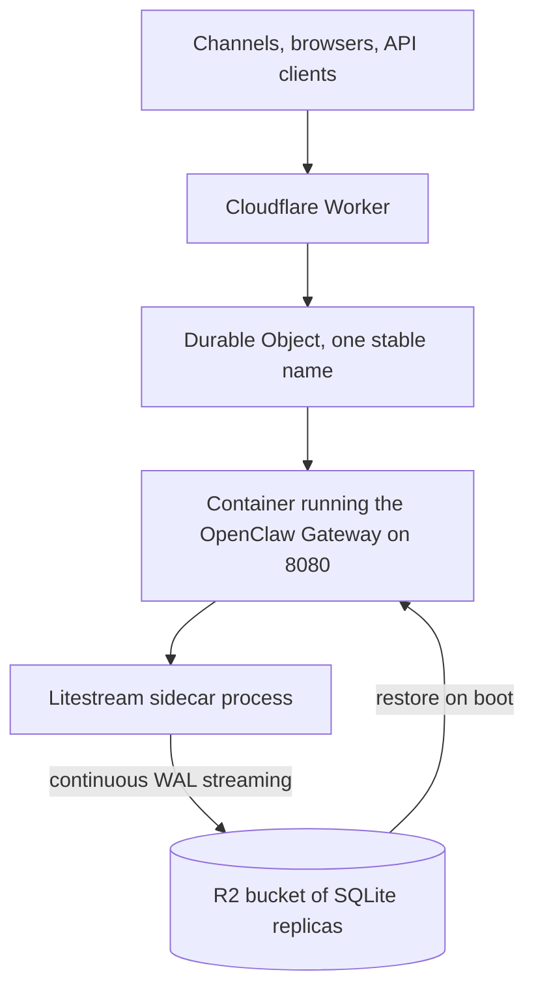

Run one OpenClaw installation behind a Cloudflare Worker and a named Durable Object, with the official OpenClaw image and Litestream replication to R2.

<Warning>
  This deployment target is experimental. Litestream protects SQLite databases, not the complete OpenClaw state directory. Read [Limits and recovery](#limits-and-recovery) before using production credentials.
</Warning>

## What you need

- A Cloudflare account with Workers, Containers, and R2 available
- Docker Buildx with `linux/amd64` support
- A public Docker Hub repository for the derived image
- Node.js and npm
- Provider and channel credentials for your OpenClaw setup

The template lives in [`scripts/cloudflare`](https://github.com/openclaw/openclaw/tree/main/scripts/cloudflare). It deploys a `standard-2` Container with `max_instances: 1`.

## How it works

The Worker forwards every HTTP and WebSocket request to one stable Durable Object name. That Durable Object owns one Container instance and is the single-writer fence around the Litestream replica. The Container exposes OpenClaw on port `8080`, and the Durable Object polls `/healthz` there before routing to it.



Litestream watches both SQLite roots:

- `/home/node/.openclaw/state/*.sqlite`
- `/home/node/.openclaw/agents/**/*.sqlite`

At boot, the entrypoint uses R2's S3 `ListObjectsV2` API as the restore manifest, rejects paths outside those roots, restores each discovered database, and only then starts the Gateway.

Measured on this template against a real R2 bucket: about 2.4 seconds from write to replica, and about 9 seconds to restore both databases into a fresh Container that reached a healthy Gateway roughly 13 seconds after start. Treat these as order-of-magnitude expectations, not guarantees.

## Deploy

<Steps>
  <Step title="Prepare the template">
    Clone OpenClaw and enter the template directory:

    ```bash
    git clone https://github.com/openclaw/openclaw.git
    cd openclaw/scripts/cloudflare
    npm install
    npx wrangler login
    npx wrangler whoami
    ```

    Confirm that Wrangler selected the intended Cloudflare account before creating resources.

  </Step>

  <Step title="Create R2 storage">
    Create the bucket:

    ```bash
    npx wrangler r2 bucket create openclaw-backups
    ```

    In the Cloudflare dashboard, create an R2 API token with object read/write access limited to that bucket. Keep the access key ID and secret access key out of the checkout.

    In `wrangler.jsonc`, replace `<account-id>` in the endpoint. If you use another bucket name, update both `LITESTREAM_BUCKET` and `r2_buckets[].bucket_name`.

    The R2 binding is for Worker-side access and documentation completeness. Litestream cannot use a Worker binding from inside the Container; it uses R2's S3 endpoint and credentials passed through Worker secrets.

  </Step>

  <Step title="Publish the Container image">
    Replace `<official-openclaw-image-digest>` in `Dockerfile` with an immutable digest from the official [`openclaw/openclaw`](https://hub.docker.com/r/openclaw/openclaw) Docker Hub repository.

    Build the derived image for Cloudflare's required architecture and push it to a public Docker Hub repository:

    ```bash
    docker buildx build \
      --platform linux/amd64 \
      --tag docker.io/<docker-hub-user>/openclaw-cloudflare:<version> \
      --push \
      .
    docker buildx imagetools inspect \
      docker.io/<docker-hub-user>/openclaw-cloudflare:<version>
    ```

    Replace the `containers[].image` placeholder in `wrangler.jsonc` with the resulting immutable `docker.io/...@sha256:...` reference. Cloudflare Containers can pull public Docker Hub images directly; GHCR is not a supported source for this template.

  </Step>

  <Step title="Deploy the Worker and Container">
    Compile the Worker and deploy it:

    ```bash
    npm run check
    npm run deploy
    ```

    The first deployment creates the Worker, the SQLite-backed Durable Object class, the Container application, and the R2 binding.

  </Step>

  <Step title="Set runtime secrets">
    Add the R2 and Gateway credentials through Wrangler's secret prompt:

    ```bash
    npx wrangler secret put LITESTREAM_ACCESS_KEY_ID
    npx wrangler secret put LITESTREAM_SECRET_ACCESS_KEY
    npx wrangler secret put OPENCLAW_GATEWAY_TOKEN
    ```

    Add provider and channel variables as needed. For example:

    ```bash
    npx wrangler secret put OPENAI_API_KEY
    npx wrangler secret put TELEGRAM_BOT_TOKEN
    ```

    `src/container.ts` passes an explicit allowlist of environment variables to the Container. Add another name there before using a different environment-backed credential.

  </Step>

  <Step title="Bootstrap OpenClaw">
    First boot needs one interactive session inside the Container. SSH access ships disabled; enable it temporarily by adding this to the container entry in `wrangler.jsonc`, then redeploy:

    ```jsonc
    "ssh": { "enabled": true }
    ```

    Open the deployed Worker URL once to start the instance. Then locate the application and instance IDs and connect:

    ```bash
    npx wrangler containers list
    npx wrangler containers instances <application-id> --json
    npx wrangler containers ssh <instance-id>
    ```

    SSH is wrangler-mediated and limited to accounts with container write access. After bootstrap you can remove the `ssh` block and redeploy; the restored state survives the replacement via Litestream.

    Inside the Container, run a SecretRef-based setup. This example uses OpenAI and Telegram:

    ```bash
    cd /app
    node openclaw.mjs onboard --non-interactive --accept-risk --skip-health \
      --mode local \
      --auth-choice openai-api-key \
      --secret-input-mode ref \
      --gateway-auth token \
      --gateway-token-ref-env OPENCLAW_GATEWAY_TOKEN \
      --skip-channels \
      --no-install-daemon
    node openclaw.mjs channels add --channel telegram --use-env
    node openclaw.mjs doctor --json
    ```

    Keep your exact bootstrap recipe in a private, reproducible runbook. A fresh Container disk does not retain the generated config.

  </Step>
</Steps>

## Verify the deployment

Run these checks after the first bootstrap, before you depend on this deployment.

Confirm the Gateway answers. `/healthz` reports that the listener is up. `/startupz` additionally reports that startup work finished while ignoring channel health, so it stays green when one channel account is broken; it is served only by images built from the release that added it:

```bash
curl -sS https://<worker-subdomain>.workers.dev/healthz
curl -sS -H "Authorization: Bearer $OPENCLAW_GATEWAY_TOKEN" \
  https://<worker-subdomain>.workers.dev/readyz
```

Confirm replication is actually reaching R2. Litestream writes keys under `replicas/state/<database>/<generation>/`, so list that prefix with any S3-compatible client using the same R2 credentials you gave Litestream. Wrangler cannot list object keys, only fetch them by exact path:

```bash
aws s3 ls "s3://openclaw-backups/replicas/" --recursive \
  --endpoint-url "https://<account-id>.r2.cloudflarestorage.com"
```

The Cloudflare dashboard's R2 object browser shows the same tree. An empty prefix after several minutes of activity means replication is not working; fix it before continuing.

Rehearse recovery before you need it. An untested restore path is not a backup:

1. Send one message so the Gateway writes a session row.
2. Wait about ten seconds for replication.
3. Delete the Container instance, or redeploy to force replacement.
4. Reopen the Worker URL and confirm the conversation still exists.

If step 4 loses data, stop and fix replication before connecting production channels.

## Cost and sizing

Containers require the Workers Paid plan. Memory and disk bill on the resources **provisioned** for the instance type for as long as the Container is awake; CPU bills on active use only.

The default `standard-2` instance provisions 1 vCPU, 6 GiB memory, and 12 GB disk. Running it always-on for a full month is therefore dominated by provisioned memory rather than by how busy the agent is. At the published rates, that is roughly 40 to 50 US dollars per month including the plan fee, mostly memory, before egress.

This matters for the lifecycle decision below:

- **Socket channels keep the Container awake**, so they pay the always-on rate. A small always-on virtual machine is often cheaper. Choose Cloudflare here for its operational model, colocation with other Cloudflare services, or the R2 durability path, not to save money.
- **Webhook-only installations sleep**, and a sleeping Container bills nothing. That is where this target is genuinely inexpensive.

Verify current rates on [Cloudflare's Containers pricing page](https://developers.cloudflare.com/containers/pricing/) before committing; these figures are estimates from the published rate card and change independently of OpenClaw.

## Observability

Stream Worker and Container logs while reproducing an issue:

```bash
npx wrangler tail
npx wrangler containers list
npx wrangler containers instances <application-id> --json
```

Gateway logs stay inside the Container. Reach them over the temporary SSH session described in the bootstrap step, or forward them to your own collector. The Container filesystem is ephemeral, so treat in-Container logs as debugging output rather than as a durable record.

## Choose the lifecycle mode

`OPENCLAW_WEBHOOK_ONLY` defaults to `false`, which keeps the Container running through idle periods. Keep this default for channels that maintain sockets or long-lived processes, including:

- Discord
- Slack Socket Mode
- WhatsApp

Set `OPENCLAW_WEBHOOK_ONLY` to `true` only when every enabled channel receives traffic through HTTP webhooks. In that mode, the Container stops after ten idle minutes and cold-starts on the next request.

<Warning>
  Scale-to-zero starts with a fresh disk. Enable it only when an external process can reapply your declarative bootstrap. Litestream restores SQLite but cannot recreate `openclaw.json`, credential files, installed plugins, or workspaces.
</Warning>

## Limits and recovery

- **Single writer:** every request resolves the same Durable Object name, and Cloudflare runs one live Durable Object instance for that name. Do not increase `max_instances` or introduce alternate routing around this fence. A brief old/new Container overlap during a platform replacement or rollout is an accepted experimental tradeoff.
- **Recovery point:** the one-second Litestream sync interval normally produces a seconds-scale RPO. It is not synchronous replication, and abrupt termination can lose writes that have not reached R2.
- **Ephemeral disk:** every sleep, replacement, or host restart starts from the image plus the restored SQLite databases. Use [full OpenClaw archives](/install/backups#full-archives) for config, credential files, plugin files, and workspaces.
- **Rollback:** older database bytes are time travel. Ratcheting channel credentials, especially WhatsApp, can desynchronize; approvals and delivery/dedupe state also roll back. Relink affected channels and review pending approvals before resuming. See [Restore](/install/backups#restore).
- **WebSockets:** Worker and Container proxying supports WebSockets. Cloudflare limits each received WebSocket message to 32 MiB.
- **Egress:** outbound requests use shared Cloudflare IP space. This target does not provide a fixed egress address.
- **Provider boundary:** this is a deployment template, not an OpenClaw `cloudWorkers` provider. Its operator SSH access does not implement that provider's SSH execution contract.

## Update

Build a new derived image from a new immutable official OpenClaw digest, push it, update the derived digest in `wrangler.jsonc`, and deploy:

```bash
npm run check
npm run deploy
```

Test updates and rollbacks against a separate R2 bucket first. Preserve current state before activating older bytes.

## Troubleshooting

**Worker returns 5xx and the Container never becomes ready** -- Cloudflare only runs `linux/amd64` images pulled from a public registry. Rebuild with `--platform linux/amd64`, confirm the derived Docker Hub repository is public, and confirm `containers[].image` uses the pushed digest rather than a moving tag.

**Deployment succeeds but every request times out** -- The Container helper waits for `GET /healthz`. Check that the Gateway inside the Container listens on port `8080` and that no bootstrap step changed the port.

**A probe passes but the Gateway is not actually serving** -- The Control UI answers unknown paths with a catch-all `200`, so probing a route your image does not serve looks permanently healthy. Verify the response body is JSON, not HTML, before trusting a probe.

**Litestream logs authentication or signature errors** -- Litestream needs R2 S3 API credentials, which are not the same as a Cloudflare API token. Create an R2 API token and use its access key ID and secret access key, and confirm `LITESTREAM_ENDPOINT` contains your account ID.

**First boot logs no databases to restore** -- Expected on an empty bucket. The entrypoint treats an empty replica listing as a fresh installation and starts the Gateway normally.

**`/readyz` returns 503 while `/startupz` returns 200** -- Working as designed. Startup finished, and a configured channel account is unhealthy. Inspect channel status rather than restarting the Container; see [Health checks](/gateway/health#http-probes).

**`wrangler containers ssh` is rejected** -- SSH ships disabled. Add `"ssh": { "enabled": true }` to the container entry, redeploy, then connect.

**Configuration disappeared after a sleep or a redeploy** -- Litestream restores SQLite databases only. `openclaw.json`, credential files, installed plugin files, and workspaces live on the ephemeral disk. Reapply your bootstrap runbook, or keep the installation always-on and take [full archives](/install/backups#full-archives).

**Channel sessions break after a restore** -- Restoring older bytes rolls back ratcheting credentials. Relink the affected channel and review pending approvals; see [Limits and recovery](#limits-and-recovery).

**WebSocket connections close on large payloads** -- Cloudflare closes received WebSocket messages larger than 32 MiB. Reduce attachment sizes or transfer them out of band.

## Related

- [Backups](/install/backups)
- [Docker](/install/docker)
- [Gateway security](/gateway/security)
- [Secrets management](/gateway/secrets)
