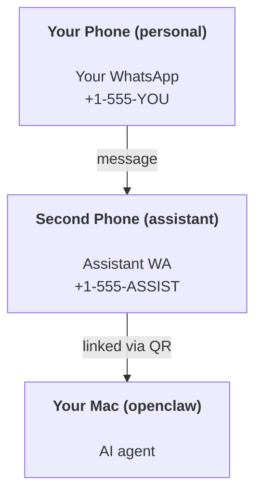

# 使用 OpenClaw 构建个人助理

OpenClaw is a self-hosted gateway that connects WhatsApp, Telegram, Discord, iMessage, and more to AI agents. This guide covers the "personal assistant" setup: a dedicated WhatsApp number that behaves like your always-on AI assistant.

## ⚠️ 安全第一

你将使代理具备：

- run commands on your machine (depending on your tool policy)
- read/write files in your workspace
- send messages back out via WhatsApp/Telegram/Discord/Mattermost (plugin)

初期务必谨慎：

- 始终设置 `channels.whatsapp.allowFrom`（切勿在个人 Mac 上运行开放给所有人的服务）。
- 使用专用的 WhatsApp 号码作为助理。
- 心跳默认每 30 分钟发送一次。在完全信任设置前，请通过设置 `agents.defaults.heartbeat.every: "0m"` 禁用心跳。

## 前置条件

- 已安装并完成 OpenClaw 入职——若未完成，请参见[快速开始](/start/getting-started)
- 第二个电话号码（SIM/eSIM/预付费）用于助理

## 推荐的两手机设置

你的目标应是：



如果将你的个人 WhatsApp 链接到 OpenClaw，那么你收到的每条消息都会被当作“代理输入”，这通常不是你想要的。

## 5 分钟快速开始

1. 配对 WhatsApp Web（会显示二维码；使用助理手机扫描）：

```bash
openclaw channels login
```

2. 启动网关（保持运行）：

```bash
openclaw gateway --port 18789
```

3. 在 `~/.openclaw/openclaw.json` 内放置最小配置：

```json5
{
  channels: { whatsapp: { allowFrom: ["+15555550123"] } },
}
```

现在用你的允许列表中的电话号码给助理号码发送消息。

入职完成后，我们会自动打开仪表盘并打印一条干净（无令牌）的链接。如果提示验证，请将 `gateway.auth.token` 中的令牌粘贴到控制界面设置。以后再次打开：`openclaw dashboard`。

## 给代理指定工作区 (AGENTS)

OpenClaw 从其工作目录读取操作指令和“记忆”。

默认情况下，OpenClaw 使用 `~/.openclaw/workspace` 作为代理工作区，并会自动创建此目录及初始文件（`AGENTS.md`、`SOUL.md`、`TOOLS.md`、`IDENTITY.md`、`USER.md`、`HEARTBEAT.md`），在安装/首次运行代理时创建。仅当工作区全新时会创建 `BOOTSTRAP.md`（删除后不会再自动生成）。`MEMORY.md` 可选（不自动生成）；存在时会在正常会话中加载。子代理会话只注入 `AGENTS.md` 和 `TOOLS.md`。

提示：将此文件夹当作 OpenClaw 的“记忆”，并将其初始化为 git 仓库（最好是私有的），这样你的 `AGENTS.md` 及记忆文件都能备份。如果已安装 git，崭新的工作区会自动初始化。

```bash
openclaw setup
```

完整工作区布局及备份指南见：[代理工作区](/concepts/agent-workspace)  
记忆工作流程见：[记忆](/concepts/memory)

可选：通过设置 `agents.defaults.workspace` 选择不同工作区（支持 `~`）：

```json5
{
  agent: {
    workspace: "~/.openclaw/workspace",
  },
}
```

如果你已经从仓库自行部署工作区文件，可以完全禁用引导文件创建：

```json5
{
  agent: {
    skipBootstrap: true,
  },
}
```

## The config that turns it into "an assistant"

OpenClaw 默认提供良好的助理设置，但通常需要调整：

- `SOUL.md` 内的人格/指令
- 思考默认值（如需要）
- 心跳设置（建立信任后）

示例：

```json5
{
  logging: { level: "info" },
  agent: {
    model: "anthropic/claude-opus-4-6",
    workspace: "~/.openclaw/workspace",
    thinkingDefault: "high",
    timeoutSeconds: 1800,
    // 从 0 开始；以后启用。
    heartbeat: { every: "0m" },
  },
  channels: {
    whatsapp: {
      allowFrom: ["+15555550123"],
      groups: {
        "*": { requireMention: true },
      },
    },
  },
  routing: {
    groupChat: {
      mentionPatterns: ["@openclaw", "openclaw"],
    },
  },
  session: {
    scope: "per-sender",
    resetTriggers: ["/new", "/reset"],
    reset: {
      mode: "daily",
      atHour: 4,
      idleMinutes: 10080,
    },
  },
}
```

## 会话与记忆

- 会话文件：`~/.openclaw/agents/<agentId>/sessions/{{SessionId}}.jsonl`
- 会话元数据（Token 使用情况、最后路由等）：`~/.openclaw/agents/<agentId>/sessions/sessions.json`（旧版为：`~/.openclaw/sessions/sessions.json`）
- `/new` 或 `/reset` 会为该聊天启动新的会话（可通过 `resetTriggers` 配置）。单独发送会让代理回复简短问候以确认会话重置。
- `/compact [instructions]` 会压缩会话上下文，并报告剩余上下文额度。

## 心跳（主动模式）

默认情况下，OpenClaw 每 30 分钟运行一次心跳，提示为：  
`如果存在 HEARTBEAT.md（工作区上下文），请读取。严格执行其内容。不要推断或重复之前聊天中的旧任务。如果无事项需处理，请回复 HEARTBEAT_OK。`  
将 `agents.defaults.heartbeat.every` 设置为 `"0m"` 以禁用。

- 如果 `HEARTBEAT.md` 存在但内容实际为空（仅空行和 Markdown 标题如 `# 标题`），OpenClaw 会跳过心跳以节省 API 调用。
- 文件不存在时，心跳仍会执行，由模型决定下一步处理。
- 若代理回复 `HEARTBEAT_OK`（可带简短补充，见 `agents.defaults.heartbeat.ackMaxChars`），OpenClaw 会抑制该次心跳的外发消息。
- 默认允许心跳消息投递到类似私聊的 `user:<id>` 目标。设置 `agents.defaults.heartbeat.directPolicy: "block"` 可禁止直发目标投递，但保持心跳运行。
- 心跳执行完整代理交互，因此间隔越短，消耗的 token 越多。

示例配置：

```json5
{
  agent: {
    heartbeat: { every: "30m" },
  },
}
```

## 多媒体收发

入站附件（图片/音频/文档）可以通过模板呈现到你的命令中：

- `{{MediaPath}}`（本地临时文件路径）
- `{{MediaUrl}}`（伪 URL）
- `{{Transcript}}`（如启用音频转录）

代理发出的附件：单独一行包含 `MEDIA:<路径或URL>`（无空格）。示例：

```
这是截图。
MEDIA:https://example.com/screenshot.png
```

OpenClaw 会提取这些附件并与文本一起发送。

For local paths, the default allowlist is intentionally narrow: the OpenClaw temp
root, the media cache, agent workspace paths, and sandbox-generated files. If you
need broader local-file attachment roots, configure an explicit channel/plugin
allowlist instead of relying on arbitrary host paths.

## Operations checklist

```bash
openclaw status          # 本地状态（凭证，会话，排队事件）
openclaw status --all    # 完整诊断（只读，可粘贴）
openclaw status --deep   # 增加网关健康探测（Telegram + Discord）
openclaw health --json   # 网关健康快照（WebSocket）
```

日志存放于 `/tmp/openclaw/`（默认文件名格式：`openclaw-YYYY-MM-DD.log`）。

## 后续步骤

- Web 聊天：[WebChat](/web/webchat)
- 网关运维：[网关运行手册](/gateway)
- 定时任务与唤醒：[Cron 任务](/automation/cron-jobs)
- macOS 菜单栏助手：[OpenClaw macOS 应用](/platforms/macos)
- iOS 节点应用：[iOS 应用](/platforms/ios)
- 安卓节点应用：[Android 应用](/platforms/android)
- Windows 状态：[Windows (WSL2)](/platforms/windows)
- Linux 状态：[Linux 应用](/platforms/linux)
- 安全：[安全](/gateway/security)
