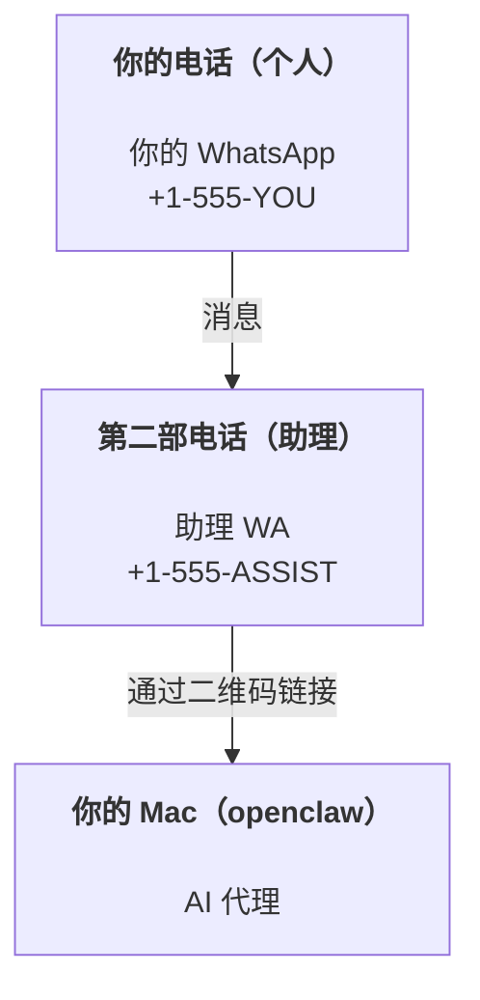

# 使用 OpenClaw 构建个人助理

OpenClaw 是一个自托管网关，可将 Discord、Google Chat、iMessage、Matrix、Microsoft Teams、Signal、Slack、Telegram、WhatsApp、Zalo 等连接到 AI 代理。本指南涵盖“个人助理”设置：一个专用的 WhatsApp 号码，表现得像你始终在线的 AI 助理。

## ⚠️ 安全第一

你将使代理具备：

- 在你的机器上运行命令（取决于你的工具策略）
- 读取/写入你工作区中的文件
- 通过 WhatsApp/Telegram/Discord/Mattermost 以及其他捆绑渠道发送消息

初期务必谨慎：

- 始终设置 `channels.whatsapp.allowFrom`（切勿在个人 Mac 上运行开放给所有人的服务）。
- 使用专用的 WhatsApp 号码作为助理。
- 心跳默认每 30 分钟发送一次。在完全信任设置前，请通过设置 `agents.defaults.heartbeat.every: "0m"` 禁用心跳。

## 前置条件

- 已安装并完成 OpenClaw 入职——若未完成，请参见 [快速开始](/start/getting-started)
- 第二个电话号码（SIM/eSIM/预付费）用于助理

## 推荐的两手机设置

你的目标应是：


```mermaid
flowchart TB
    A["<b>你的电话（个人）<br></b><br>你的 WhatsApp<br>+1-555-YOU"] -- 消息 --> B["<b>第二部电话（助理）<br></b><br>助理 WA<br>+1-555-ASSIST"]
    B -- 通过二维码链接 --> C["<b>你的 Mac（openclaw）<br></b><br>AI 代理"]
```

如果将你的个人 WhatsApp 链接到 OpenClaw，那么你收到的每条消息都会被当作“代理输入”，这通常不是你想要的。

## 5 分钟快速开始

1. 配对 WhatsApp Web（会显示二维码；使用助理手机扫描）：

```bash
openclaw channels login
```

2. 启动网关（保持运行）：

```bash
openclaw gateway --port 18789
```

3. 在 `~/.openclaw/openclaw.json` 内放置最小配置：

```json5
{
  gateway: { mode: "local" },
  channels: { whatsapp: { allowFrom: ["+15555550123"] } },
}
```

现在用你的允许列表中的电话号码给助理号码发送消息。

入职完成后，OpenClaw 会自动打开仪表板并打印一个干净的（未令牌化的）链接。如果仪表板提示认证，请将配置的共享密钥粘贴到 Control UI 设置中。入职默认使用令牌（`gateway.auth.token`），但如果你将 `gateway.auth.mode` 切换为 `password`，密码认证也可以使用。稍后重新打开：`openclaw dashboard`。

## 给代理指定工作区 (AGENTS)

OpenClaw 从其工作目录读取操作指令和“记忆”。

默认情况下，OpenClaw 使用 `~/.openclaw/workspace` 作为代理工作区，并会自动创建此目录及初始文件（`AGENTS.md`、`SOUL.md`、`TOOLS.md`、`IDENTITY.md`、`USER.md`、`HEARTBEAT.md`），在安装/首次运行代理时创建。仅当工作区全新时会创建 `BOOTSTRAP.md`（删除后不会再自动生成）。`MEMORY.md` 可选（不自动生成）；存在时会在正常会话中加载。子代理会话只注入 `AGENTS.md` 和 `TOOLS.md`。

<Tip>
将此文件夹视为 OpenClaw 的记忆，并将其设为 git 仓库（最好是私有仓库），这样你的 `AGENTS.md` 和记忆文件就会得到备份。如果已安装 git，全新的工作区会自动初始化。
</Tip>

```bash
openclaw setup
```

完整工作区布局及备份指南见：[代理工作区](/concepts/agent-workspace)  
记忆工作流程见：[记忆](/concepts/memory)

可选：通过设置 `agents.defaults.workspace` 选择不同工作区（支持 `~`）：

```json5
{
  agents: {
    defaults: {
      workspace: "~/.openclaw/workspace",
    },
  },
}
```

如果你已经从仓库自行部署工作区文件，可以完全禁用引导文件创建：

```json5
{
  agents: {
    defaults: {
      skipBootstrap: true,
    },
  },
}
```

## 将其变为“助理”的配置

OpenClaw 默认提供良好的助理设置，但通常需要调整：

- [`SOUL.md`](/concepts/soul) 中的 persona/指令
- 思考默认值（如有需要）
- 心跳（在你信任它之后）

示例：

```json5
{
  logging: { level: "info" },
  agent: {
    model: "anthropic/claude-opus-4-6",
    workspace: "~/.openclaw/workspace",
    thinkingDefault: "high",
    timeoutSeconds: 1800,
    // 从 0 开始；以后启用。
    heartbeat: { every: "0m" },
  },
  channels: {
    whatsapp: {
      allowFrom: ["+15555550123"],
      groups: {
        "*": { requireMention: true },
      },
    },
  },
  routing: {
    groupChat: {
      mentionPatterns: ["@openclaw", "openclaw"],
    },
  },
  session: {
    scope: "per-sender",
    resetTriggers: ["/new", "/reset"],
    reset: {
      mode: "daily",
      atHour: 4,
      idleMinutes: 10080,
    },
  },
}
```

## 会话与记忆

- 会话文件：`~/.openclaw/agents/<agentId>/sessions/{{SessionId}}.jsonl`
- 会话元数据（Token 使用情况、最后路由等）：`~/.openclaw/agents/<agentId>/sessions/sessions.json`（旧版为：`~/.openclaw/sessions/sessions.json`）
- `/new` 或 `/reset` 会为该聊天启动新的会话（可通过 `resetTriggers` 配置）。单独发送会让代理回复简短问候以确认会话重置。
- `/compact [instructions]` 会压缩会话上下文，并报告剩余上下文额度。

## 心跳（主动模式）

默认情况下，OpenClaw 每 30 分钟运行一次心跳，提示为：  
`如果存在 HEARTBEAT.md（工作区上下文），请读取。严格执行其内容。不要推断或重复之前聊天中的旧任务。如果无事项需处理，请回复 HEARTBEAT_OK。`  
将 `agents.defaults.heartbeat.every` 设置为 `"0m"` 以禁用。

- 如果 `HEARTBEAT.md` 存在但内容实际为空（仅空行和 Markdown 标题如 `# 标题`），OpenClaw 会跳过心跳以节省 API 调用。
- 文件不存在时，心跳仍会执行，由模型决定下一步处理。
- 若代理回复 `HEARTBEAT_OK`（可带简短补充，见 `agents.defaults.heartbeat.ackMaxChars`），OpenClaw 会抑制该次心跳的外发消息。
- 默认允许心跳消息投递到类似私聊的 `user:<id>` 目标。设置 `agents.defaults.heartbeat.directPolicy: "block"` 可禁止直发目标投递，但保持心跳运行。
- 心跳执行完整代理交互，因此间隔越短，消耗的 token 越多。

示例配置：

```json5
{
  agent: {
    heartbeat: { every: "30m" },
  },
}
```

## 多媒体收发

入站附件（图片/音频/文档）可以通过模板呈现到你的命令中：

- `{{MediaPath}}`（本地临时文件路径）
- `{{MediaUrl}}`（伪 URL）
- `{{Transcript}}`（如启用音频转录）

代理发出的附件：单独一行包含 `MEDIA:<路径或 URL>`（无空格）。示例：

```
这是截图。
MEDIA:https://example.com/screenshot.png
```

OpenClaw 会提取这些附件并与文本一起发送。

本地路径行为遵循与代理相同的文件读取信任模型：

- 如果 `tools.fs.workspaceOnly` 为 `true`，出站 `MEDIA:` 本地路径仍限制在 OpenClaw 临时根目录、媒体缓存、代理工作区路径和沙盒生成的文件内。
- 如果 `tools.fs.workspaceOnly` 为 `false`，出站 `MEDIA:` 可以使用代理已获准读取的主机本地文件。
- 主机本地发送仍仅允许媒体和安全文档类型（图片、音频、视频、PDF 和 Office 文档）。纯文本和类似秘密的文件不被视为可发送的媒体。

这意味着当你的文件系统策略已允许读取时，工作区外生成的图片/文件现在可以发送，而不会重新开放任意主机文本附件泄露的风险。

## 操作清单

```bash
openclaw status          # 本地状态（凭据、会话、排队事件）
openclaw status --all    # 完整诊断（只读，可直接粘贴）
openclaw status --deep   # 在支持时向网关请求一次实时健康探测，并附带通道探测
openclaw health --json   # 网关健康快照（WS；默认可返回新的缓存快照）
```

日志存放于 `/tmp/openclaw/`（默认文件名格式：`openclaw-YYYY-MM-DD.log`）。

## 后续步骤

- WebChat: [WebChat](/web/webchat)
- Gateway ops: [Gateway runbook](/gateway)
- Cron + wakeups: [Cron jobs](/automation/cron-jobs)
- macOS menu bar companion: [OpenClaw macOS app](/platforms/macos)
- iOS node app: [iOS app](/platforms/ios)
- Android node app: [Android app](/platforms/android)
- Windows status: [Windows (WSL2)](/platforms/windows)
- Linux status: [Linux app](/platforms/linux)
- Security: [Security](/gateway/security)

## 相关内容

- [Getting started](/start/getting-started)
- [Setup](/start/setup)
- [Channels overview](/channels)
