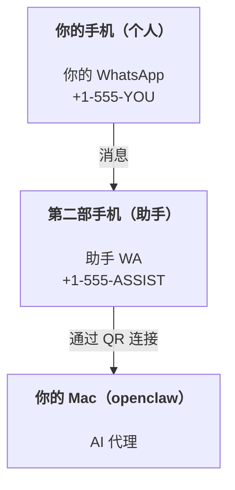

OpenClaw 是一个自托管网关，可将 Discord、Google Chat、iMessage、Matrix、Microsoft Teams、Signal、Slack、Telegram、WhatsApp、Zalo 以及更多服务连接到 AI 代理。本指南涵盖“个人助手”设置：一个专用的 WhatsApp 号码，像你始终在线的 AI 助手一样工作。

## 安全第一

为代理提供一个通道使其能够在你的机器上运行命令（取决于你的工具策略）、读写工作区中的文件，并通过任何已连接的通道发送消息。请从保守配置开始：

- 始终设置 `channels.whatsapp.allowFrom`（切勿在你的个人 Mac 上对全世界开放运行）。
- 为助手使用一个专用的 WhatsApp 号码。
- 心跳默认每 30 分钟一次。在你信任该设置之前，通过设置 `agents.defaults.heartbeat.every: "0m"` 来禁用它。

## 前提条件

- 已安装并完成 OpenClaw 配置 - 如果你还没做过，请参见 [Getting Started](/start/getting-started)
- 一个用于助手的第二个电话号码（SIM/eSIM/预付费）

## 双手机设置（推荐）

你需要这样配置：


```mermaid
flowchart TB
    A["<b>你的手机（个人）<br></b><br>你的 WhatsApp<br>+1-555-YOU"] -- 消息 --> B["<b>第二部手机（助手）<br></b><br>助手 WA<br>+1-555-ASSIST"]
    B -- 通过 QR 连接 --> C["<b>你的 Mac（openclaw）<br></b><br>AI 代理"]
```

如果你将你的个人 WhatsApp 链接到 OpenClaw，那么发给你的每一条消息都会变成“代理输入”。这通常不是你想要的。

## 5 分钟快速开始

1. 配对 WhatsApp Web（会显示二维码；用助手手机扫描）：

```bash
openclaw channels login
```

2. 启动 Gateway（保持运行）：

```bash
openclaw gateway --port 18789
```

3. 在 `~/.openclaw/openclaw.json` 中放入一个最小配置：

```json5
{
  gateway: { mode: "local" },
  channels: { whatsapp: { allowFrom: ["+15555550123"] } },
}
```

现在，从你的允许名单中的手机向助手号码发送消息即可。

当初始化完成后，OpenClaw 会自动打开仪表盘，并打印一个干净的（未加 token 的）链接。如果仪表盘提示进行身份验证，请将已配置的共享密钥粘贴到 Control UI 设置中。初始化默认使用 token（`gateway.auth.token`），但如果你将 `gateway.auth.mode` 切换为 `password`，也可以使用密码验证。稍后重新打开：`openclaw dashboard`。

## 为代理提供工作区（AGENTS）

OpenClaw 会从其工作区目录中读取操作说明和“记忆”。

默认情况下，OpenClaw 使用 `~/.openclaw/workspace` 作为代理工作区，并会在入门流程或首次代理运行时自动创建它（以及初始的 `AGENTS.md`、`SOUL.md`、`TOOLS.md`、`IDENTITY.md`、`USER.md`、`HEARTBEAT.md`）。`BOOTSTRAP.md` 只会在全新的工作区中创建一次，删除后不会再自动回来。`MEMORY.md` 是可选的，且不会自动创建；当它存在时，会在普通会话中加载。子代理会话只会注入 `AGENTS.md` 和 `TOOLS.md`。

<Tip>
把这个文件夹当作 OpenClaw 的记忆，并将其作为一个 git 仓库（最好是私有仓库），这样你的 `AGENTS.md` 和记忆文件就能得到备份。如果已安装 git，全新的工作区会自动执行 `git init`。
</Tip>

要在不运行完整入门向导的情况下创建工作区和配置文件夹：

```bash
openclaw setup --baseline
```

（直接运行 `openclaw setup` 是 `openclaw onboard` 的别名，会执行完整的交互式向导。）

完整的工作区布局 + 备份指南：[Agent workspace](/concepts/agent-workspace)
记忆工作流：[Memory](/concepts/memory)

可选：使用 `agents.defaults.workspace` 选择不同的工作区（支持 `~`）。

```json5
{
  agents: {
    defaults: {
      workspace: "~/.openclaw/workspace",
    },
  },
}
```

如果你已经从仓库中提供了自己的工作区文件，也可以完全禁用引导文件创建：

```json5
{
  agents: {
    defaults: {
      skipBootstrap: true,
    },
  },
}
```

## 将其变成“助手”的配置

OpenClaw 默认提供了适合助手的配置，但你通常还需要调整：

- [`SOUL.md`](/concepts/soul) 中的人设/指令
- 思考默认值（如果需要）
- 心跳（等你信任之后再开启）

示例：

```json5
{
  logging: { level: "info" },
  agents: {
    defaults: {
      model: { primary: "anthropic/claude-opus-4-8" },
      workspace: "~/.openclaw/workspace",
      thinkingDefault: "high",
      timeoutSeconds: 1800,
      // 从 0 开始；稍后再启用。
      heartbeat: { every: "0m" },
    },
    list: [
      {
        id: "main",
        default: true,
        groupChat: {
          mentionPatterns: ["@openclaw", "openclaw"],
        },
      },
    ],
  },
  channels: {
    whatsapp: {
      allowFrom: ["+15555550123"],
      groups: {
        "*": { requireMention: true },
      },
    },
  },
  session: {
    scope: "per-sender",
    resetTriggers: ["/new", "/reset"],
    reset: {
      mode: "daily",
      atHour: 4,
      idleMinutes: 10080,
    },
  },
}
```

## 会话与记忆

- 会话行、转录行以及元数据（token 使用量、最后路由等）：`~/.openclaw/agents/<agentId>/agent/openclaw-agent.sqlite`
- 旧版/归档的转录产物：`~/.openclaw/agents/<agentId>/sessions/`
- 旧版行迁移来源：`~/.openclaw/agents/<agentId>/sessions/sessions.json`
- `/new` 或 `/reset` 会为该聊天开启一个全新的会话（可通过 `session.resetTriggers` 配置）。如果单独发送，OpenClaw 会确认重置，而不会调用模型。
- `/compact [instructions]` 会压缩会话上下文并报告剩余的上下文预算。

## 心跳（主动模式）

默认情况下，OpenClaw 每 30 分钟运行一次心跳，提示词为：
`如果存在 HEARTBEAT.md，请读取它（工作区上下文）。严格遵守其中内容。不要从之前的聊天中推断或重复旧任务。如果没有需要关注的内容，请回复 HEARTBEAT_OK。`
将 `agents.defaults.heartbeat.every: "0m"` 可将其禁用。

- 如果 `HEARTBEAT.md` 存在但实际上是空的（只有空行、Markdown/HTML 注释、Markdown 标题如 `# 标题`、fence 标记，或空的 checklist 模板），OpenClaw 会跳过心跳运行以节省 API 调用。
- 如果该文件缺失，心跳仍会运行，由模型自行决定如何处理。
- 如果代理回复 `HEARTBEAT_OK`（可附带少量填充；参见 `agents.defaults.heartbeat.ackMaxChars`），OpenClaw 会抑制该次心跳的外发投递。
- 默认情况下，允许向 DM 风格的 `user:<id>` 目标投递心跳。将 `agents.defaults.heartbeat.directPolicy: "block"` 可在保持心跳运行的同时禁止直接目标投递。
- 心跳会运行完整的代理轮次——间隔越短，消耗的 token 越多。

```json5
{
  agents: {
    defaults: {
      heartbeat: { every: "30m" },
    },
  },
}
```

## 收发媒体

传入附件（图片/音频/文档）可以通过模板暴露到你的命令中：

- `{{MediaPath}}`（本地临时文件路径）
- `{{MediaUrl}}`（伪 URL）
- `{{Transcript}}`（如果启用了音频转录）

代理发出的外发附件会在消息工具或回复负载中使用结构化媒体字段，例如 `media`、`mediaUrl`、`mediaUrls`、`path` 或 `filePath`。消息工具参数示例：

```json
{
  "message": "这是截图。",
  "mediaUrl": "https://example.com/screenshot.png"
}
```

OpenClaw 会把结构化媒体与文本一起发送。为了兼容性，旧式的最终助手回复仍可能被规范化，但工具输出、浏览器输出、流式块和消息操作不会将文本解析为附件命令。

本地路径行为遵循与代理相同的文件读取信任模型：

- 如果 `tools.fs.workspaceOnly` 为 `true`，外发的本地媒体路径将限制在 OpenClaw 临时根目录、媒体缓存、代理工作区路径以及沙盒生成的文件内。
- 如果 `tools.fs.workspaceOnly` 为 `false`，外发的本地媒体可以使用代理已经被允许读取的主机本地文件。
- 本地路径可以是绝对路径、相对工作区路径，或使用 `~/` 的主目录相对路径。
- 主机本地发送仍只允许媒体和安全文档类型（图片、音频、视频、PDF、Office 文档，以及经过验证的文本文档，如 Markdown/MD、TXT、JSON、YAML 和 YML）。这是对现有主机读取信任边界的扩展，不是秘密扫描器：如果代理可以读取某个主机本地的 `secret.txt` 或 `config.json`，并且其扩展名与内容验证匹配，那么它就可以附加该文件。

将敏感文件保留在代理可读文件系统之外，或者将 `tools.fs.workspaceOnly` 保持为 `true`，以便更严格地限制本地路径发送。

## 运维检查清单

```bash
openclaw status          # 本地状态（凭据、会话、排队事件）
openclaw status --all    # 完整诊断（只读，可直接粘贴）
openclaw status --deep   # 探测通道（WhatsApp Web + Telegram + Discord + Slack + Signal）
openclaw health --json   # 通过 WS 连接获取网关健康快照
```

日志位于 `/tmp/openclaw/` 下（默认：`openclaw-YYYY-MM-DD.log`）。

## 下一步

- WebChat: [WebChat](/web/webchat)
- Gateway 运维: [Gateway runbook](/gateway)
- Cron + 唤醒: [Cron jobs](/automation/cron-jobs)
- macOS 菜单栏伴侣： [OpenClaw macOS app](/platforms/macos)
- iOS 节点应用: [iOS app](/platforms/ios)
- Android 节点应用: [Android app](/platforms/android)
- Windows Hub: [Windows](/platforms/windows)
- Linux 状态: [Linux app](/platforms/linux)
- 安全: [Security](/gateway/security)

## 相关

- [入门指南](/start/getting-started)
- [设置](/start/setup)
- [频道概览](/channels)
