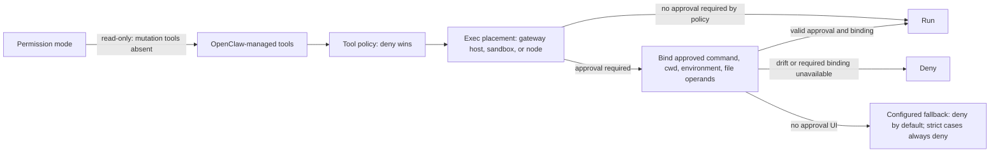

Deterministic enforcement is not unique to OpenClaw — Claude Code, Codex, and Goose all gate approvals in code. Structural tool gating in a multi-channel assistant, rather than a terminal, is rarer: [permission modes](/gateway/permission-modes) shape which tools exist at all. For OpenClaw-managed tools, a `read-only` session omits `edit`, `write`, and `apply_patch`, and its exec tool resolves to a deny policy at the call boundary. Native harnesses can retain their own tool surface and apply native permission controls separately ([Codex runtime policy](/plugins/codex-harness-runtime)). `full` requires `operator.admin`, and scopes are derived from request parameters before dispatch ([operator scopes](/gateway/operator-scopes)), so a method with a privileged parameter still needs the privileged scope.

Three controls govern separate decisions ([sandbox vs. tool policy vs. elevated](/gateway/sandbox-vs-tool-policy-vs-elevated)). The sandbox decides where tools run. Tool policy decides which tools exist; deny always wins. Routine policy-filter diagnostics name the configured layer and matched deny entries at debug level; the [durable audit ledger](/gateway/audit) records blocked outcomes separately, without the matched rule. `tools.elevated` is an exec-only escape hatch that cannot override a deny.

[Exec approvals](/tools/exec-approvals) bind an approved run to its canonical command, cwd, environment hash, and content-hashed file operands, and deny on any drift after approval. Supported pipelines and command chains can use enforced execution plans. Shell forms or interpreter invocations for which OpenClaw cannot establish the required execution and file bindings are refused. When no approval UI is reachable, the answer is deny by default, and strict cases (inline eval, heredocs) cannot be softened by any fallback setting.

Tool policy filters by name, not side effects: allowing `exec` while denying `write` does not make shell commands read-only. As documented, restricting side effects is the sandbox's responsibility.
