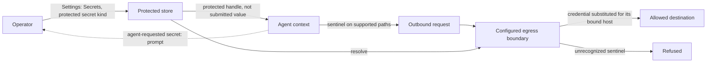

Every supported credential field takes a [SecretRef](/gateway/secrets): `env`, `file`, `exec` (this is how 1Password, Vault, Bitwarden, and sops plug in), or the shared store. Retryable resolution failures for mapped, isolatable owners let the Gateway start degraded. The exact owner (one provider, one channel account, one plugin route) is marked unavailable, requests to it fail with a typed error, nothing falls back to a different credential, and [`doctor`](/cli/doctor) and `status` name every degraded owner with a redacted reason. Gateway ingress-auth failures, unknown ownership, and invalid secret configuration still prevent startup.

Model-provider credentials use sentinels on supported egress paths: the real value is substituted at the egress boundary, and an unrecognized sentinel-shaped value is refused rather than forwarded. An operator can supply a credential without exposing its value to the agent by choosing the protected **secret** kind under **Settings → Secrets** in the [Control UI](/web/control-ui). Protected values are omitted from agent-facing reads; a separate admin-scoped resolve exists for operators. Agent-readable environment entries are a different kind. The opt-in [egress proxy](/gateway/secrets) substitutes protected sentinels only for their bound destination hosts. Exfiltrating the encrypted sentinel alone does not reveal the underlying credential outside the Gateway process, but this does not protect other private context or prevent misuse of an authorized service. A permitted service can also reflect credentials back to the agent, so destination trust and host isolation still matter. An [agent-requested secret](/tools/secrets) prompt uses the same protected store without putting the submitted value in the conversation.

Hermes supports environment- and vault-backed credentials, [context-local secret resolution for multiplexed profiles](https://github.com/NousResearch/hermes-agent/blob/6defe7eb6c462bb784d1f27f5afe7ca4b627fc70/agent/secret_scope.py), and an optional [iron-proxy integration](https://github.com/NousResearch/hermes-agent/blob/6defe7eb6c462bb784d1f27f5afe7ca4b627fc70/website/docs/user-guide/egress/iron-proxy.md) that supplies Docker tools with opaque provider tokens while a host-side proxy injects credentials. These are real protections with different custody and bypass limits; neither project's proxy is a substitute for process and network isolation. In OpenClaw, [`secrets audit`](/cli/secrets) finds plaintext at rest and `secrets configure --apply` moves supported fields behind refs. Workspace `.env` files cannot override provider keys or `OPENCLAW_*` runtime controls.

OpenClaw provides agent-requested credentials as an integrated Gateway flow: the operator submits the value through a protected surface and the agent receives a reusable handle. This is not a unique pattern. MCP supports [out-of-band URL elicitation for sensitive data](https://modelcontextprotocol.io/specification/2025-11-25/client/elicitation#url-mode-elicitation-for-sensitive-data), including credentials stored by a server for later use; it forbids requesting secrets through form-mode elicitation. Hermes also supports operator-configured vault resolution. These mechanisms differ in integration and custody, not in whether a credential can ever stay out of model context.

The store itself is `0600`-permission SQLite, not an HSM, and the docs direct operators with stronger custody requirements to external vaults. A SecretRef removes inline credentials from the referring configuration; storage exposure depends on the selected provider. It does not stop a host-exec agent from reading files. Restricting file access is the sandbox's responsibility.
