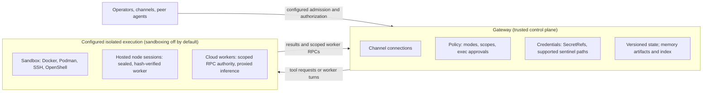

The Gateway owns channel connections, config, credentials, and the [control-plane API](/gateway/protocol). It binds to loopback by default and refuses non-loopback binds without a working auth path ([architecture](/concepts/architecture), [network model](/network)).

[`tools.exec.host`](/tools/exec) resolves to the gateway host, a [sandbox](/gateway/sandboxing), or a paired [node](/nodes). While a sandbox runtime is active, per-call escapes to the host are rejected. An explicit `host=sandbox` with no runtime configured fails instead of silently running on the host. The backends are Docker and Podman, SSH, and [OpenShell](/gateway/openshell). The default Docker and Podman profile has no network, a read-only root, all capabilities dropped, and a non-root user. OpenShell installs as a plugin and registers through the same backend contract as Docker. If you run OpenShell already, OpenClaw uses its sandboxes. It does not need to be wrapped in one.

Sandbox bind mounts are validated twice, once on the normalized path and again after resolving through the deepest existing ancestor, so symlink-based bypass attempts fail closed. The deny-list of credential and system paths cannot be disabled — the `dangerouslyAllowExternalBindSources` override relaxes only the allowed-roots check.

This separation also applies across machines. A paired [node](/nodes) that hosts sessions receives a sealed worker artifact. OpenClaw verifies that artifact's content hash at three points: download, manifest, and every reuse. The node installs no packages and runs no lifecycle scripts. It can also put each hosted session in its own container, enforced by node-local config the Gateway's launch request cannot express.

With [Cloud workers](/gateway/cloud-workers), a session's coding work runs on a throwaway cloud machine. That machine connects back to the Gateway with a closed, dispatcher-enforced RPC method allowlist. It gets per-dispatch minted credentials, stored hashed at rest with a ten-minute TTL, and holds no standing model, GitHub, or cloud credential. Inference is proxied through the Gateway. The [durable transcript](/concepts/session) lives only on the Gateway. The worker sees a bounded per-turn context window and does not persist a local transcript copy.

A remote tool backend also changes what sandboxed code can reach. Hermes can move terminal, file, and Python `execute_code` work to a configured backend while its parent process handles tool RPCs ([execution source](https://github.com/NousResearch/hermes-agent/blob/6defe7eb6c462bb784d1f27f5afe7ca4b627fc70/tools/code_execution_tool.py#L1078)). OpenClaw's cloud-worker design additionally gives worker turns a Gateway-owned lifecycle, scoped RPC authority, proxied inference, and Gateway-owned durable transcripts. In either design, reachable credentials and services depend on the enabled tools, mounts, network policy, and backend configuration.

**Sandboxing is off by default.** Out of the box, OpenClaw is a personal assistant for one trusted operator, and exec runs on the gateway host without prompts. The enterprise posture requires explicit configuration, verifiable with two commands: [`openclaw sandbox explain`](/gateway/sandbox-vs-tool-policy-vs-elevated) prints the effective execution posture, and [`openclaw security audit`](/gateway/security/audit-checks) flags drift with stable check IDs you can alarm on.
