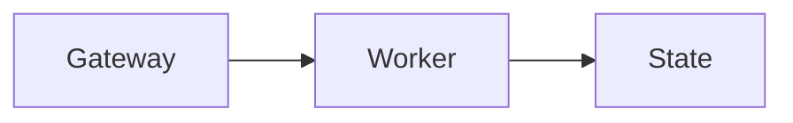

The Control UI is a small **Vite + Lit** single-page app served by the Gateway:

- default: `http://<host>:18789/`
- optional prefix: set `gateway.controlUi.basePath` (e.g. `/openclaw`)

`gateway.controlUi.enabled` hot-applies. Disable it to stop serving dashboard
pages and assets while bots and existing Gateway connections keep running.
Re-enable it to resume serving; missing assets are prepared in the background.
Changing the serving base path or asset root still requires a Gateway restart.

For unmatched HTTP paths, the app-shell fallback respects the request's `Accept` header. An explicit HTML rejection such as `text/html;q=0, */*` overrides the broader wildcard, so the request reaches the startup `503` or final `404` response. Headerless and wildcard-only requests retain the browser navigation fallback.

It speaks **directly to the Gateway WebSocket** on the same port.

Closed Terminal, Browser, Desktop, and Home/Ask OpenClaw panels initialize when you open them rather than during initial navigation. Panels saved as open still restore after a reload.

While you watch a running session, the Gateway shows the model's latest safe preamble immediately as the session headline. When a utility model is available, it can replace that headline with a richer compact status digest after enough activity accumulates. Chat carries the result in a **session rail**: its compact pill shows the live digest, while the expanded rail shows the assessment, plan progress, pull requests, elapsed time, and a read-only Side chat thread. The rail can expand once when a run becomes stuck or needs input, and done or failed runs keep a frozen “finished” time based on the final digest. On wide chat panes the expanded rail docks as a 400 px right column; on narrower and mobile layouts it remains an overlay.

Side chat answers questions about the selected session and its project without entering or interrupting the main agent run. On the first question, the Gateway lazily loads a bounded visible snapshot of the selected session before starting the utility model. If history is temporarily unavailable, the question stays visible with **Retry** instead of being treated as an empty session. Side chat uses read-only access to the target session's history/search and agent workspace. Its bounded thread is held in Gateway memory, is restored when you switch sessions in the Control UI, and is cleared by the rail's trash button, a session reset, Gateway restart, or idle expiry. It never enters `chat.history`, and private reference context is not stored as operator dialogue. Open it with Shift-Command-S on Apple platforms or Ctrl-Shift-S elsewhere, or type `/btw <question>` or `/side <question>` in the main Control UI composer to open the rail and ask there; other clients keep their existing BTW behavior.

Highlighting text in a chat message offers **Ask in side chat**, which opens the rail with a quoted draft ready to edit.

The headline owns that run's sidebar subtitle instead of heuristic live activity. It is shared with the official iOS and Android session lists. A final done or failed digest remains visible while the session is unread, then the row returns to its normal work subtitle.

Session observation is enabled by default. Safe preamble headlines do not require a utility model; the utility model only owns richer assessments and terminal summaries. In **Settings > Appearance > Sidebar**, you can turn observation off gateway-wide, inspect the resolved small model and its provenance, or choose automatic routing, disable utility tasks, or select an explicit `agents.defaults.utilityModel`. The equivalent config controls are `gateway.controlUi.sessionObserver: false` and `agents.defaults.utilityModel: ""`.

## Environment identity

When you run several Gateways, set `gateway.controlUi.environment` to distinguish their browser tabs and windows:

```json5
{
  gateway: {
    controlUi: {
      environment: { label: "edge", color: "amber" },
    },
  },
}
```

The environment adds a 2 px top stripe, an agent-avatar ring, label pills in the sidebar and narrow topbar, a browser-title suffix, and a matching favicon. The label is trimmed and must contain 1–24 characters. Available colors are `teal`, `amber`, `purple`, `coral`, `pink`, `blue`, `green`, `red`, and `gray`. The label and color are intentionally visible before sign-in; leave `environment` unset to keep the standard appearance unchanged.

## Community invitation

The sidebar shows a Discord community invitation by default. Its first appearance waits until sidebar interaction finishes, so it does not move session controls while you use them. Its close button dismisses it for the current browser origin. To hide the invitation for everyone using a Control UI deployment, run this on the Gateway serving that UI:

```bash
openclaw config set gateway.controlUi.communityInvite false
```

After the Gateway applies the change, reload the browser page or reconnect to pick it up. The setting belongs to the Gateway serving the UI, including when that UI connects to a different remote Gateway. Setting it to `false` hides the card even in new browser profiles. Re-enabling it with `true` preserves existing browser-local dismissals.

## New session names

In **New session**, pausing typing for one second prepares a session name in the
background using only the selected agent's utility model. Preparation sends unsent
draft text to that provider before submission. It starts after at least 12 characters
and sends at most the first 1,000 characters; it does not send attachments.

Preparation is disabled in incognito and for slash commands. Edits replace stale
prepared names, and only one request runs at a time. A missing or failed utility model
does not fall back to the primary model or prevent you from starting the session.

An explicit personal account selection waits for account confirmation before
preparing a title. A utility model on the same provider uses that account unless
the utility model specifies its own auth profile. Changing the model or account
discards the old suggestion; neither action changes your saved account default.
With **Automatic**, title preparation uses the agent's utility-model auth, which
can differ from the personal default selected when the actual chat starts.

**Start session** uses a matching prepared name if it is ready. Otherwise, normal
initial naming runs after submission; Start never waits for the speculative call.
This is creation-only: later messages do not regenerate an existing session's
name. Explicit worktree names are preserved, and typing never creates a worktree
or runs setup.

## Quick open (local)

If the Gateway is running on the same computer, open [http://127.0.0.1:18789/](http://127.0.0.1:18789/) (or [http://localhost:18789/](http://localhost:18789/)).

If the page fails to load, start the Gateway first: `openclaw gateway`.

<Note>
On native Windows LAN binds, Windows Firewall or organization-managed Group Policy can still block the advertised LAN URL even when `127.0.0.1` works on the Gateway host. Run `openclaw gateway status --deep` on the Windows host; it reports likely-blocked ports, profile mismatches, and local firewall rules that policy may ignore.
</Note>

Auth is supplied during the WebSocket handshake via:

- `connect.params.auth.token`
- `connect.params.auth.password`
- Tailscale Serve identity headers when `gateway.auth.allowTailscale: true`
- trusted-proxy identity headers when `gateway.auth.mode: "trusted-proxy"`

Gateway auth runs before device pairing. A direct loopback connection does not bypass token or password auth. The dashboard settings panel keeps a token for the current browser tab session and selected gateway URL; passwords are not persisted. After pairing, the browser can use its stored per-device token on later connections.

Onboarding usually configures a gateway token for shared-secret auth. If the Gateway starts in token mode without a configured token, it generates an ephemeral runtime token for that process instead. The runtime token is not written to config, so it cannot be recovered and a loopback browser without that token is rejected. Run `openclaw doctor --generate-gateway-token`, restart the Gateway, then run `openclaw gateway auth-token --show` in an interactive terminal and paste the output into Control UI settings. Password auth works instead when `gateway.auth.mode` is `"password"`.

## Device pairing (first connection)

After gateway auth succeeds, connecting from a new browser or device usually requires a **one-time pairing approval**, shown as `disconnected (1008): pairing required`. On the Gateway host, `openclaw dashboard` is the preferred owner path: it opens a short-lived, single-use pairing link and leaves that exact signed browser with a durable administrator credential. Opening a fresh link in the same browser also repairs a previously limited credential; another browser profile cannot inherit or replay the grant.

<Steps>
  <Step title="List pending requests">
    ```bash
    openclaw devices list
    ```
  </Step>
  <Step title="Approve by request ID">
    ```bash
    openclaw devices approve <requestId>
    ```
  </Step>
</Steps>

If the browser retries pairing with changed auth details (role/scopes/public key), the previous pending request is superseded and a new `requestId` is created; re-run `openclaw devices list` before approving.

Switching an already-paired browser from read access to write/admin access through ordinary stored or shared credentials is treated as an approval upgrade, not a silent reconnect: OpenClaw keeps the old approval active, blocks the broader reconnect, and asks you to approve the new scope set explicitly. The narrow exception is a fresh owner handoff issued on the Gateway host by `openclaw dashboard` or graphical onboarding; it can upgrade only the same signed browser that redeems that one-time handoff.

When the connected Control UI reports limited access, open **Inbox > System > Limited access**, then click **Request admin**. On mobile, open the sidebar to reach Inbox. The browser files the pending device scope-upgrade request over its existing connection; approve it with `openclaw devices` on the Gateway host or from **Devices** in another admin-capable browser that also has `operator.pairing`. Keep the requesting tab connected while approval completes so it can receive and store the freshly rotated device token before reconnecting. **Retry** reattaches to the pending request. **Cancel** stops the local wait but does not reject the device request; if you cancel or disconnect before approval, use the normal pairing repair path on the next connection.

Once approved, the device is remembered and won't require re-approval unless you revoke it with `openclaw devices revoke --device <id> --role <role>`. See [Devices CLI](/cli/devices) for token rotation, revocation, and the Paperclip / `openclaw_gateway` first-run approval flow.

If the Gateway denies the upgrade because it exceeds your assigned operator role, the access details show the administrator-change guidance without **Retry**. An administrator must change the role before the request can succeed; device approval cannot override that ceiling. **Retry** remains available for pending, rejected, or expired approval requests and retryable failures. **Cancel** clears the local request state so you can make a new request after the underlying problem is resolved.

<Note>
- Direct local Control UI connections from a loopback TCP peer (`127.0.0.1` or `::1`, typically reached as `localhost`) with no forwarded/proxy headers can auto-approve device pairing only after gateway auth succeeds and the browser presents device identity. In token/password mode, the first connection still needs the configured shared secret; this auto-approval is not a token bypass.
- Direct loopback needs no shared secret only when `gateway.auth.mode: "none"` is explicitly configured. That disables gateway auth and is not the recommended Control UI setup. Tailscale Serve and trusted-proxy modes can avoid a pasted shared secret only when their respective identity checks succeed.
- Tailscale Serve can skip the pairing round trip for Control UI operator sessions when `gateway.auth.allowTailscale: true`, Tailscale identity verifies, and the browser presents its device identity. Device-less browsers and node-role connections still follow the normal device checks.
- Direct Tailnet binds and LAN browser connects still require explicit approval. Browser profiles without device identity cannot use loopback auto-approval.
- Each browser profile generates a unique device ID, so switching browsers or clearing browser data requires re-pairing.
- Private windows and browser profiles that discard site data on exit, including Firefox Never remember history, also discard the stored device identity and per-device token. They will appear as a new browser after each restart; use a persistent browser profile to stay paired, and remove stale entries with `openclaw devices remove <deviceId>` when the paired-device list grows.

</Note>

## Pair a mobile device

An already paired administrator can create the iOS/Android connection QR without opening a terminal:

<Steps>
  <Step title="Open mobile pairing">
    Select **Devices**, then click **Pair device** in the **Devices** card.
  </Step>
  <Step title="Connect the phone">
    In the OpenClaw mobile app, open **Settings** → **Gateway** and scan the QR code. You can copy and paste the setup code instead.
  </Step>
  <Step title="Confirm the connection">
    The official iOS/Android app connects automatically. If **Pending approval** shows a request, review its role and scopes before approving it.
  </Step>
</Steps>

Creating a setup code requires `operator.admin`; the button is disabled for sessions without it. A setup code contains a short-lived bootstrap credential, so treat the QR and copied code like a password while they are valid. For remote pairing, the Gateway must resolve to `wss://` (for example, through Tailscale Serve/Funnel); plain `ws://` is limited to loopback and private LAN addresses. See [Pairing](/channels/pairing#pair-from-the-control-ui-recommended) for the full security and fallback details.

## New-session preferences and recents

For connections with a durable user profile, the Gateway stores each agent's latest folder, worktree, model, and thinking choices. The new-session picker also shows recent projects and folders derived only from sessions created by that profile. These conveniences follow the person across browsers; they do not grant access to a project or path.

On the first identified connection, the Control UI uploads existing browser-local new-session preferences only when the Gateway has no such preferences yet. Later changes write to the Gateway first and then update the browser mirror. Connections without a durable identity continue using browser-local preferences and the loaded session roster for recents.

When a remote project session starts before its repository finishes cloning, chat shows workspace preparation progress. If preparation fails, opening or reloading chat restores the session's failure summary. Correct the reported problem, then send a new message in the same session to retry preparation.

Accepted browser messages, including initial prompts waiting for workspace
preparation and follow-ups during a run, remain visible as normal message bubbles
until their own turn starts, without an additional receipt notice. Inputs accepted through `sessions_send` or the
Gateway `agent` method use the same display. They are stored separately from the active model transcript. If
cancellation or a Gateway restart interrupts that wait,
the message stays readable with its recorded disposition and is never resent
automatically. Copy it into the composer to start a new attempt. **Show earlier
messages** pages through messages that are still waiting or were stopped before
processing; **Show latest messages** returns to the newest page. A long message
uses the normal full-message reader without becoming a transcript reply, fork,
or rewind target.

Browser drafts and unsent messages remain in the local queue. Once the Gateway
accepts an ordinary browser message, it owns the approved input in durable
custody. Collect mode consumes the accepted sources with their combined
transcript entry. Acceptance does not imply that a transcript row already
exists; the accepted input replaces its local pending copy and later becomes
one canonical message, including its attachments.

## Personal identity

Authenticated people have a durable Gateway profile with a display name, avatar, linked emails, and optional verified GitHub identity. Open **Settings → Profile → Identity** to update the editable fields. The profile follows the authenticated person across browsers; clearing browser site data does not delete it.

Profile photos load through authenticated Gateway routes in the online roster, person cards, and chat. Paired browsers use their approved read scopes. When the Mac app connects through an SSH tunnel to a trusted-proxy Gateway, image requests can use the connection's saved password if its paired credential is rejected. Credentials stay in request headers; profiles without an available image show initials.

On a single-user Gateway, unidentified operators share one durable owner profile across devices, including device-token reconnects. Its unset display name is seeded from the Gateway host account's full name, never its login name; saved names are never overwritten. Without a full name, the sidebar shows **Owner**. With `gateway.roles` configured, only token/password connections receive this owner profile; other unidentified connections see an explanation in Identity instead of editing controls. The owner profile has no email and grants no additional permissions.

On macOS, the owner's avatar defaults to the Gateway host account's user picture when no OpenClaw avatar is saved. This uses the Mac running the Gateway, including when you connect from another device. A saved avatar always takes priority. OpenClaw reads the picture locally and serves a resized copy through the authenticated avatar route; other people's profiles never inherit it. Restart the Gateway to pick up a changed macOS picture. If the picture cannot be read, initials remain visible.

**Settings → Profile → Connected accounts** shows the selected **Gateway**, saved **Person**, and **Scope: Personal**. Choose **Add account**, then a provider and sign-in method from the Gateway's catalog. Browser/device sign-in, protected credential inputs, progress, and cancellation use one guided flow. These are the same personal accounts managed by `openclaw models accounts login`, not the machine-local system/agent credentials managed by `models auth`. Account controls follow the Gateway-assigned profile, including the shared owner profile on a single-user Gateway. If the connection has no profile, the section explains the missing identity and offers **Connection settings** without showing provider credential inputs. Shared Gateway tokens and device pairing alone do not distinguish people on a multi-user Gateway. See [Per-person model accounts](/concepts/multi-user#per-person-model-accounts).

GitHub-backed sign-in through Cloudflare Access or Tailscale Serve fills the read-only **GitHub account** row with the verified public avatar and account link without replacing a custom OpenClaw avatar. **Git co-author credit** is a separate toggle, on by default for verified accounts, that controls future commits from shared sessions. See [User model](/concepts/user-model#gateway-profile-and-github-credit) for verification, retry, account-change, noreply privacy, and eligibility rules.

**Settings → Profile → GitHub connections** separately shows **My GitHub** and **System GitHub**. Identified people, including read-scoped operators, can connect and disconnect only their own account; administrators can also change the shared System account. Connecting defaults to **For me** for identified users and never changes their sign-in identity, co-author preference, or shared execution defaults. Personal credentials support explicit Gateway-brokered **Publish PR** actions, not ordinary agent shell commands. See [GitHub connections](/concepts/user-model#github-connections).

Set an agent's display name, emoji, and avatar under **Agent settings → Overview → Identity**. The identity is stored with that agent and is shared by Control UI clients.

## Runtime config endpoint

The Control UI fetches its runtime settings from `/control-ui-config.json`, resolved relative to the gateway's Control UI base path (for example `/__openclaw__/control-ui-config.json` under base path `/__openclaw__/`). That endpoint is gated by gateway HTTP auth: unauthenticated browsers cannot fetch it, and a successful fetch requires a valid gateway token/password or trusted-proxy identity. Tailscale header auth applies to the Control UI WebSocket, not this HTTP endpoint.

Local agent avatars use [authenticated avatar URLs](#avatar-route-auth) in this response rather than inline image bytes, keeping bootstrap JSON small. Configured data URLs, remote URLs, emoji, and RPC avatar representations are unchanged.

## Gateway host status

Open **Settings → Connection** to see the **Gateway Host** card with the Gateway machine, LAN address, operating system, runtime, uptime, CPU load, memory, and space for each mounted local disk. The card refreshes every 10 seconds while visible through the `system.info` Gateway RPC, which requires the `operator.read` scope. If mounted-disk discovery is unavailable, the card retains the state-directory disk reading when available. Connections without the required scope omit the card.

## Language support

The Control UI localizes itself on first load based on your browser locale. To override it later, open **Settings → Appearance → Language**.

- Supported locales: `en`, `ar`, `de`, `es`, `fa`, `fr`, `hi`, `id`, `it`, `ja-JP`, `ko`, `nl`, `pl`, `pt-BR`, `ru`, `th`, `tr`, `uk`, `vi`, `zh-CN`, `zh-TW`
- Non-English translations are lazy-loaded in the browser.
- The selected locale is saved in browser storage and reused on future visits.
- Missing translation keys fall back to English.

Docs translations are generated for the same non-English locale set, but the docs site's built-in Mintlify language picker only lists locale codes Mintlify accepts. Thai (`th`) and Persian (`fa`) docs are still generated in the publish repo; they may not appear in that picker until Mintlify supports those codes.

## Appearance themes

The Appearance panel has the built-in Claw, Knot, Dash, Absolutely, Tide, Beacon, Phosphor, CRT, Manuscript, Rosé, and Miami themes (Claw is default), plus one browser-local tweakcn import slot. Each theme ships its own self-hosted typeface, loaded only when selected or previewed: Claw uses Instrument Sans, Knot uses Geist, Dash pairs DM Sans with Fraunces for chat prose, Absolutely pairs Space Grotesk with Lora for chat prose, Tide uses IBM Plex Sans, Rosé uses DM Sans, and Miami uses Space Grotesk. Beacon targets WCAG AAA (7:1) contrast with the Atkinson Hyperlegible Next typeface for low vision, bright sunlight, projectors, and low-quality panels. Phosphor and CRT set the entire surface, chat prose included, in JetBrains Mono — Phosphor as green-on-glass, CRT as a white-on-black console with squared corners. Manuscript is the one light-first theme: parchment and iron-gall ink with a lapis accent, set entirely in the Lora serif, with a candlelit dark mode. To import a theme, open the [tweakcn editor](https://tweakcn.com/editor/theme), choose or create a theme, click **Share**, and paste the copied link into Appearance. The importer also accepts `https://tweakcn.com/r/themes/<id>` registry URLs, editor URLs like `https://tweakcn.com/editor/theme?theme=amethyst-haze`, relative `/themes/<id>` paths, raw theme IDs, and default theme names such as `amethyst-haze`.

Imported themes are stored only in the current browser profile; they are not written to gateway config and do not sync across devices. Replacing the imported theme updates the one local slot; clearing it switches back to Claw if the imported theme was active.

The mounted UI keeps a live display-preference snapshot for its connected Gateway. Local changes and same-Gateway browser-tab edits update open composers without a reload. Selecting a different Gateway in another tab does not retarget the current tab. Credentials remain owned by the connection, separate from this display snapshot.

Choose an **Accent color** preset or custom color in Appearance to override the active theme's accent. For an authenticated Gateway profile, the accent precedence is the profile's `ui.accent` preference, the gateway-wide `ui.prefs.accent` setting, the operator-configured `ui.seamColor`, and finally the active theme's default. **Restore default** clears only that profile's preference, leaving the gateway-wide settings unchanged. Connections without an authenticated profile keep the existing gateway-wide preference behavior.

The **Typography** block lets you choose an **Interface** face and a separate **Chat prose** face. **Theme default** for Interface and **Match interface** for Chat prose restore the theme’s typography; Dash and Absolutely keep their own serif chat defaults. **System** uses the system sans-serif stack without loading a webfont. Code keeps its monospace stack. Opening either picker loads the self-hosted specimens on demand; startup loads only the active faces. Font overrides follow an authenticated Gateway profile, with a browser-local mirror for instant boot. Without a profile, they stay in that browser and are never written to `openclaw.json`.

Appearance also has a Text size setting. It applies to chat text, composer text, tool cards, and chat sidebars, and keeps text inputs at least 16px so mobile Safari does not auto-zoom on focus.

When your connection is bound to an authenticated Gateway profile, theme, theme mode, and accent color are saved to that profile instead of the gateway config. They follow you across devices without changing anyone else's appearance, override gateway-wide `ui.prefs` values, and update your connected clients live. Connections without an authenticated profile continue syncing these preferences through the gateway config exactly as before. Language and chat display preferences remain gateway-config preferences for every connection. Each browser keeps a local mirror for instant boot, and text size remains browser-local. An explicitly read-only connection applies preference changes only in that browser. Changes made while offline remain queued until a later connection can write their applicable preferences; on a read-only reconnect, they continue to behave as browser-local preferences. See [Configuration reference](/gateway/configuration-reference#ui).

## OpenClaw system care

Open **Settings → Ask OpenClaw** to talk to the system setup and repair agent. To open it alongside your current page, click **Home** in the sidebar footer and select the **Ask OpenClaw** tab, or use the **Ask OpenClaw** command-palette action. The full page and dockable panel share one machine-wide conversation whose durable history lives on the Gateway. Closing the UI never cancels a turn; reopening Ask OpenClaw shows the completed conversation. The panel docks on the right or bottom, remembers its placement and size in the browser profile, and hides itself while the full page is open.

If no AI provider is configured, Ask OpenClaw offers **Connect an AI provider**. If a configured runtime fails to start or verify, the conversation stays visible with the actual error and **Retry**. Sending stays disabled until verification succeeds. Retry checks the runtime without resending your earlier message or clearing your draft.

Each chat message carries the Control UI page you are currently viewing as an untrusted ambient hint, so requests like "configure this channel" or "why is this page empty?" resolve against the page you are looking at.

Guided channel setup, workspace skills setup, web-search provider setup, and local Gateway setup run as hosted wizards inside the chat. Wizard questions stay in the conversation, secret steps mask input in the browser, and successful config-backed flows are audited and re-validated. If a chosen web-search provider needs a plugin install and that install fails, setup stops and reports the failure instead of pretending the provider is configured.

For Gateway setup, say `configure gateway` to choose the port, bind address, token or password auth, and Tailscale exposure. Before the first question, the web surface warns that applying the saved settings requires a restart that may disconnect the chat or require a new Control UI sign-in. The wizard changes config only; say `restart gateway` when you are ready to apply it. It manages only a local Gateway, so remote mode changes stay in `openclaw onboard` or `openclaw configure`.

Say `import memory` to copy detected local memory into the existing default agent workspace. This flow does not change config or import credentials or skills, needs no Gateway restart, and distinguishes confirmed imports, nothing to import, provider failures, and failures where some files may already have been copied. Finish onboarding first if the default workspace does not exist. See [Import assistant memory](#import-assistant-memory) for the broader page that can target another agent or replace existing imports, and [`openclaw setup`](/cli/openclaw) for the operation and approval contract.

Outside onboarding, this page can show at most one dismissible event chip per visit. It stays silent for routine Gateway traffic and reacts only to health snapshots that report a disabled configuration reloader, a configured channel disconnect/degradation, a failed channel probe, or unavailable channel credentials. A newer event replaces the pending chip only when it is more severe; dismissing or using the chip silences event prompts for that visit. Clicking the chip sends its diagnosis question as a real `openclaw.chat` message, so the transcript records the request and OpenClaw performs the diagnosis. Onboarding never shows these event chips.

## Home dock

Use the **Home** button in the sidebar footer to open the selected agent's main conversation alongside your current page. Home and Ask OpenClaw share the dock. When the same Home conversation is already open as the page, the dock stays hidden rather than showing it twice.

Home can include a bounded, quoted work-context reference with your message. That reference belongs to the page's agent and session, not merely the Home conversation receiving it, and stays current when session titles or visible files change. It is reference data, not permission to access another conversation; you can remove it before sending.

## Manage plugins

Open **Plugins** in the sidebar, or use `/settings/plugins` relative to the
configured Control UI base path, to browse and manage plugins without leaving
the Control UI. For example, a base path of `/openclaw` uses
`/openclaw/settings/plugins`. The page is always available, even when every
optional plugin is disabled.

Plugins is a hub with four tabs: **Installed** and **Discover** manage plugin
code at `/settings/plugins`, **Skills** hosts the per-agent skill manager at
`/skills`, and **Workshop** hosts Skill Workshop proposal review at
`/skills/workshop`. Each tab keeps its own URL, and the sidebar shows the
single Plugins entry for all of them.

The **Installed** tab shows the full local inventory grouped by category, with
overview counts. Each row opens a detail view; its overflow (`…`) menu enables
or disables the plugin and offers **Remove** for externally installed plugins.
It also lists configured [MCP servers](/cli/mcp) and supports adding, disabling,
and removing them inline. The same server controls live on **Settings → MCP**.
The **Discover** tab is the store: featured plugins included with OpenClaw,
official external plugins, and one-click MCP connectors for popular services.
Typing in the search box queries
[ClawHub](https://clawhub.ai/plugins) inline and appends a **From ClawHub**
section with download counts and source-verification badges. Deep links can
target the store directly with `/settings/plugins/discover`.

The **Skills** tab keeps the skill status report, enable/disable toggles, API
key entry, and inline ClawHub skill search, scoped to the selected agent. The
**Workshop** tab keeps the Skill Workshop board and Today review flow for
[skill proposals](/tools/skill-workshop). **Find skill ideas** reviews a bounded
window of substantial sessions from newest to oldest and leaves any results as
pending proposals. The panel shows cumulative coverage; **Scan earlier work**
continues from the persisted cursor, then becomes **Scan new work** after older
history is exhausted. Manual history review works while autonomous self-learning
is disabled and uses the selected agent's configured model.

Included plugins are already present on the Gateway and show **Enable** or
**Disable** instead of **Install**. For example, Workboard is included with
OpenClaw but disabled by default, so its action is **Enable**. Bundled plugins
cannot be removed, only disabled.

Reading the catalog and searching ClawHub require `operator.read`. Installing,
enabling, disabling, or removing a plugin and changing MCP servers require
`operator.admin`; those actions stay disabled for read-only operators.

ClawHub installs run through the Gateway and keep the same trust, integrity,
and plugin-install policy checks as other Gateway-mediated installs. Installing
or removing plugin code requires a Gateway restart. Enabling or disabling an
installed plugin can apply without a restart when the plugin and current
Gateway runtime support it; otherwise the UI reports that a restart is
required. OAuth-backed MCP connectors need a one-time
`openclaw mcp login <name>` from the CLI after they are added.

The page intentionally focuses on inventory, discovery, install, enablement,
and removal. Use [`openclaw plugins`](/cli/plugins) for arbitrary npm, git, or
local-path sources, updates, and advanced plugin configuration.

## Apps and extensions

Open **Apps** from the sidebar **More** menu, the command palette, or the
sidebar agent menu (**Get the apps**), or use `/apps` relative to the
configured Control UI base path. The page collects install links for every
OpenClaw companion surface: the [iOS](/platforms/ios) and
[Android](/platforms/android) apps, the Apple Watch and Wear OS companions
bundled with them, the [macOS](/platforms/macos), [Windows](/platforms/windows),
and [Linux](/platforms/linux) desktop apps, the
[Chrome extension](/tools/chrome-extension), the in-app Plugins hub with
[ClawHub](https://clawhub.ai), and the Discord community and docs.

## Sidebar navigation

The sidebar organizes everything around the agent. The identity row at the top is the active agent; below it, the **Pages** section starts with **Home** — the agent's rolling main session, badged with its unread or running state — followed by the pinned destinations (**Automations** and **Plugins** by default). The customize control on the Pages header opens a menu with every other destination, including **Usage** and plugin-provided tabs, plus **Edit pinned items**; right-clicking the navigation area opens the pin editor directly. The session list below splits into zones: **Other** for the agent's ungrouped chat sessions (the main session stays behind Home; sessions it spawned appear here as top-level threads, and named threads show without a type prefix), **Groups** for group and room conversations, and **Coding** for sessions bound to a managed worktree or exec node (rows show a `repo ⎇ branch` line plus the node host), ACP-backed harness sessions, and the Codex/Claude CLI catalogs. The **Other** heading is omitted when it is the only section. Coding starts collapsed on first run and remembers your choice; its collapsed header keeps the true count and shows a running indicator while contained sessions work. Custom groups (the session `category`) and **Pinned** rows sit above Other, and assigning a session to a custom group always wins over the automatic zone classification. The global **Sessions** toolbar holds the filter and sort control (Created, Last updated, or Owners when the loaded session roster contains multiple owners), **Group by** — **Custom groups** (the default zone layout above), **Project** to bucket sessions by their repo or workspace checkout (sessions without one keep their zones), **Person** to bucket by owner when the loaded roster has several, or **None** for a single flat list with no zone headers — a persisted **Status** filter for Active, Archived, or All, and the **+** that opens the New session page. The Owners sort mode orders owner groups by name and keeps Created order within each group. On multi-user gateways the same menu adds an **Owners** filter: **All owners**, one specific person or agent, or **Involving me** — sessions you own plus sessions you have prompted, evaluated by the Gateway against the full participant history (see [Multi-user mode](/concepts/multi-user#finding-sessions-by-owner)). Archived rows stay inline, dimmed with an archive glyph; they do not contribute unread or attention state and stay outside lineage promotion. Opening a session moves the selection highlight without reordering rows. Parent sessions with recent child runs show a disclosure and child count; expand it to inspect nested child sessions, live or terminal status, and runtime without leaving the sidebar. Selecting a child opens its chat and automatically reveals its ancestor path. Child rows stay outside root grouping, pinning, dragging, multi-select, and pagination; collapsed zones do not consume the visible page budget. Sessions with new activity since they were last read show an unread dot, and opening one marks it read. Accepted work immediately shows an activity ring. It spins during startup and execution, pauses with **Queued** only during a scheduler-confirmed concurrency-slot wait, and resumes when a slot is granted. With reduced motion enabled, the ring stays still. A session holding composer text you typed but never sent shows a pencil badge until the draft is sent or cleared; the active session hides it because its composer is already in view. An agent can also publish a short expiring status line and optionally request attention with a curated amber icon; that declaration clears when you open the session, send the next message, clear it explicitly, or its TTL expires. Cloud-worker lifecycle states use a globe badge; local and reclaimed sessions omit a placement badge because local execution is the default. Each root session row has a [session menu](/web/control-ui#session-menu), opened with its kebab button or right-click; touch layouts keep the direct pin and menu controls visible. The chat header composes the same single-session management actions with its pane-specific **Panels**, **Layout**, and **View** actions. Cmd/Ctrl-click opens a session in a new browser tab. Alt/Option-click toggles root rows into a multi-select and Shift-click extends it across the visible order; opening the menu on a selected row then offers batch actions (Mark N as unread/read, Move N to group, Archive N, Delete N) that apply to every selected session, with a single confirmation for batch delete. Drag a root session onto **Pinned** to pin it, or onto a custom group to move it. Custom group headers can be collapsed, expanded, or dragged to reorder them; group names, order, and New Session defaults live in the gateway (`sessions.groups.*`), so they follow you across browsers, while collapsed state stays in the browser profile. Each custom group header has a **+** that opens the normal New Session page and assigns the created session to that group. **New session defaults** in the group menu sets its working directory and Local or Worktree preference; the page prefills those values but leaves them editable. Leaving the directory empty uses the selected agent's workspace. The menu also has Rename group, New group, and Delete group; renaming or deleting a group updates every member session server-side, including archived ones, and deleting a group keeps its sessions and moves them back to Other.

Session previews are hidden by default for compact, single-line rows. Enable **Show message preview** in the **Sessions** filter menu to restore routine status text and message previews. The browser remembers your choice. Errors and requests for attention remain visible with previews off.

Enable **Hide empty groups** in the same menu to hide custom groups with no sessions in the current sidebar view. It is off by default, and the browser remembers your choice. Collapsed groups with sessions stay visible. Hidden groups keep their membership and order and remain available in **Move to group**; turn the setting off to use their headers as drag targets again.

**Mark as unread** creates a reminder that remains unread while the current chat stays open, including while a run streams or completes. Leave and reopen the session, or choose **Mark as read**, to clear it.

**Delete** removes the confirmed selection from loaded session lists immediately and leaves any deleted conversation that is open. The Gateway finishes deletion in the background, safely stopping and reclaiming an attached cloud worker first. If deletion fails, the affected session can reappear with an error; other successful deletions and any navigation you made in the meantime are preserved. Browser drafts are retired only after deletion is confirmed, not while the request is pending.

**Rename** in the sidebar, chat header, and Sessions page targets the session you started editing. If that session is deleted and recreated at the same key before you save, the edit is rejected instead of renaming the replacement. Reopen Rename on the current session to try again. Resetting the conversation keeps the same session identity and does not invalidate the edit.

**New group** from the sidebar, chat header, or Sessions page keeps the original session selection while the dialog is open and the group is being saved. A deleted or replaced session is not moved; an error is shown and the new group remains available. For a sidebar multi-selection, sessions that still exist can move even if another target fails. Paging a selected session out of the visible list does not cancel its move.

### Session menu

The menu groups routine actions first: **Pin/Unpin**, **Rename**, **Mark as unread/read**, and **Archive/Unarchive**. **Delete** stays separate at the bottom.

- **Icon & color** opens one picker with color swatches, an icon grid, and **Reset to default**. It stays open while you change both; the sidebar reflects your changes.
- **Move to group** includes **New group** and **Remove from group**. Multi-user gateways also offer **Assign to** ([session ownership](/concepts/multi-user#assigning-an-owner)).
- **Fork conversation** creates a separate conversation; while a run is active, it forks from the last completed message.
- **Copy** offers a session link, conversation text as Markdown, and the session ID. The link requires normal Gateway authentication and session access; copying it does not grant access. Markdown loads the available conversation history, not just the messages currently visible. Both copied Markdown and `/export` downloads retain the conversation's sender labels, so messages from different participants remain distinguishable.
- **Open in** offers a new browser tab or window. Desktop chat also offers **Split right** and **Split below**. Eligible local workspaces expose native editor destinations, and the chat header includes **Continue in terminal** in this submenu.

### Session placement

A selected session running on a worker shows a quiet **Runs on Cloud** chip in the chat header. Connections with `operator.write` can choose **Move session…** to continue on the Gateway or an eligible paired device, and can use **Stop cloud worker…** through the write-scoped `sessions.reclaim` lifecycle. Moving to a configured cloud profile requires `operator.admin`. Cloud rows are filtered against all execution modes advertised by each profile: the same bundled Crabbox profile is selectable for OpenClaw `worker-turn` and Codex `remote-exec`, while a genuinely single-mode profile stays disabled for the other runtime. Profiles with multiple machine classes show a machine picker; choosing the default omits an override, while choosing a different class on the current profile resizes the session. The confirmation explains that an active turn is interrupted and never replayed; OpenClaw reconciles the workspace before activating the destination. While the durable operation is in progress, the chip shows **Moving to…**. If recovery is blocked, the chip exposes the bounded error after reconnect so the action never fails silently.

During the initial handoff, the chat placement menu and stop confirmation use the selected destination: **Stop device worker…** for explicit or automatic paired-device placement, **Stop cloud worker…** for a cloud profile, or neutral **Stop worker…** when the target is unknown; all use `sessions.reclaim`. A destination retained for retry after a failed startup does not label a later restart.

### Session icons

Choose **Icon & color** from a single session's context menu to give its sidebar row one persistent emoji or monochrome icon. The picker includes common emoji and six named icons: `braces`, `book`, `monitor`, `bot`, `kanban`, and `coins`. Choose **Custom emoji…** to enter any single emoji; on macOS, press Control-Command-Space to open the system emoji picker, or press Windows-period on Windows. The `sessions` agent tool can set the same `icon` field. An empty value removes it. This decoration replaces the owner avatar in the leading glyph slot, but temporary attention state always takes precedence so an operator request cannot be hidden.

## Session colors

Choose **Icon & color** from a session menu and select a color swatch to add a narrow color stripe to its sidebar row and a matching dot beside the chat title. Pick one of eight colors, or choose **Default** to clear only the color. **Reset to default** clears both the icon and color. The colors match Claude Code’s `/color` names, so imported Claude Code sessions keep the same color. Imported catalog rows show their color without offering color editing.

## New session page

New session **+** controls are links: click to open the draft in the current browser tab, Command-click (macOS) or Ctrl-click (Windows/Linux) to open another tab, or right-click for the browser's **Open Link in New Tab/Window** menu. Middle-click works too. The smaller plus controls on group and catalog sections preserve their target in the new tab; your current conversation stays open.

The **+** in the sidebar's **Sessions** toolbar opens a full-page draft at `/new`: nothing is created until you send the first message. A unified **Place** picker chooses a Gateway project or folder and an execution destination. Connections with `operator.write` can choose **Gateway · local**, **Auto** (least-busy device), or any paired device returned by `environments.list`; administrators additionally see configured cloud profiles and **Connect a machine…**. A cloud profile is selectable when its advertised execution modes include the selected runtime, so one Crabbox **Cloud · profile** row supports both OpenClaw and Codex. Automatic selection chooses the eligible host with the most available worker slots, breaking ties by device ID; runtimes that do not consume worker slots use device ID order. Device eligibility remains authoritative to the environment catalog and the selected runtime: OpenClaw `worker-turn` requires an available current session host with valid worker capacity and at least one free slot; Codex `remote-exec` requires its currently invocable, explicitly authorized exec-server command and consumes no worker slot. When that command is unavailable, the picker distinguishes a node that did not declare it, a declaration that awaits pairing approval, and a declaration blocked by Gateway command policy. Offline known hosts, connected non-hosts, incompatible or saturated hosts, hosts missing required capabilities, outdated hosts, and unavailable hosts remain visible with a reason and next step.

The folder defaults to the agent workspace. Write-scoped connections can browse, restore recent Gateway folders, and start sessions anywhere inside a configured agent workspace; another absolute Gateway path requires `operator.admin` but can run directly without being a Git checkout. Local placement keeps the optional **Worktree** control with a base-branch picker backed by `worktrees.branches` (no fetch) and an optional worktree name (the branch becomes `openclaw/<name>`). Choosing either a device or cloud profile forces a managed worktree from the selected Gateway source.

### Start a native coding CLI

The **+** beside **Codex** or **Claude Code** opens a native CLI draft, not an
OpenClaw Chat. Choose the machine and folder, optionally enter a first prompt,
and press **Start in terminal** or Enter (or your configured submit shortcut).
The terminal opens with keyboard focus. The CLI uses that
machine's native account, model, and configuration; OpenClaw does not translate
model or authentication settings or automatically adopt the native session.
Native draft text is not sent to OpenClaw for automatic title preparation.
Ordinary **New Chat** and explicit catalog continuation remain separate flows.

Native starts require `operator.admin`, `gateway.cliAgents.enabled`,
an enabled catalog plugin, and its installed CLI. Terminals are on by default;
`gateway.terminal.enabled: false` blocks native starts.
No matching OpenClaw model route is required. The host picker lists only local
CLI sources and connected nodes with the exact fresh-start command currently
invocable. Resume-only nodes are not eligible. After installing a CLI or approving
a node capability change, reconnect the node and refresh the host picker.

On the Gateway, the folder/worktree controls still provision the selected managed
worktree before launching. On a node, enter an existing absolute directory on
that node; create a worktree there first if needed. Native starts do not use
OpenClaw worker placement, cloud/Auto selection, attachment submission, model
controls, or Incognito. Add files and change native CLI settings in the terminal.
A missing directory, disabled capability, or disconnected host produces an error;
OpenClaw never starts a Chat or substitutes another host or home directory.

### OpenClaw Chat workspace startup

On a normal foreground OpenClaw Chat send, the submitted text and attachments appear immediately with a **Starting** indicator while the Gateway creates or adopts the session. This is a pending submission, not a Gateway acknowledgment. If creation is rejected, your prompt and attachments remain available to correct and retry. Once creation succeeds, the UI opens the session's chat.

The project picker refreshes after sign-in and reconnects. Gateway reconnects and Git verification retries preserve your edited base branch and worktree name. Choosing another folder or project clears those repository-specific details.

For local worktree sessions, sending the first message opens the admitted session before naming, checkout, and setup finish. The chat shows the submitted message and preparation stages. A generated title is saved as soon as naming completes, independently of checkout and setup. Setup failures remain visible in that session; send a retry there after correcting the problem. The retry reuses the saved title. If naming itself fails, another attempt uses the original first prompt, including text attachments. Stopping during setup cancels preparation without starting the agent. Steering an active run keeps its progress visible, and delayed history cannot replace a newer startup stage or restore startup labels after activity begins.

For a remote target, the Control UI creates the managed-worktree session with an empty initial message and no `execNode`, dispatches it by exact `deviceId`, `autoDevice: true`, or `profileId` (plus an optional cloud machine class), waits for active placement, and then sends the first message and attachments with the same idempotency key used by recovery. Explicit and automatic device dispatch require `operator.write`; cloud profile dispatch requires `operator.admin`. The composer footer chooses the new session's model and reasoning level.

Model and **Effort** are separate adjacent composer controls in chat and New session, on desktop and mobile. The model picker never contains Effort or Fast-mode controls. Long model labels ellipsize to leave room for the other controls; the full name remains in the picker, accessible label, and tooltip. Mobile Effort uses a gauge whose needle reflects the current level, with a lightning badge when Fast mode is active. In chat, Fast mode stays in the Effort menu, or appears as the adjacent control when reasoning is unavailable. Models with neither available control omit it.

When you switch sessions, the composer keeps the session's known model name visible while refreshing the model options available for that session. If the model is not yet known, the control shows a loading placeholder. Locked chats also show the selected model, or **Session model** when it is not known. The lock prevents model selection changes; it does not indicate that a native runtime owns the model.

Once the session is created, chat opens immediately. Remote startup uses the same transcript progress indicator and elapsed timer as GitHub workspace preparation, showing provisioning, workspace preparation, startup, and first-message delivery as they happen. The composer stays disabled until the first message is accepted; normal startup is not an error. Startup failures remain visible in the session, with **Retry** when recovery is available.

If startup recovery cannot load after a page reload, the session keeps the loading error and **Retry** available across session switches. Switching sessions does not restart recovery or reset its elapsed time. The saved first message continues holding later input until recovery loads and confirms its delivery state. While this page is responsive and unsaved starts await the recovery code, automatic in-app reloads are blocked and **Retry** is replaced by a warning. This includes Incognito starts and paused starts whose recovery could not be saved. Reload controls elsewhere in the app explain the same restriction. Choose **Discard unsaved starts and reload** to resume saved starts and discard the unsaved starts. The same action is available in the warning shown by other blocked Reload controls. This protection is limited to the open, responsive page; closing it or browser-managed navigation can still discard unsaved input. Incognito input is never saved to browser storage.

If remote startup fails before the first message is sent, chat retains the submitted text, attachments, selected destination, and a bounded error in the same browser tab and Gateway credential scope. Reloading shows the paused submission without provisioning another worker. **Retry** uses the already-created session and the original profile and machine class, device, or Auto selection; it waits for active placement before sending. The session keeps its model and reasoning settings, including any later changes you make in that session. This tab-local startup recovery uses the tab's existing session-storage lifetime, separately from the ordinary browser draft limits below. Incognito startup recovery remains in memory only. A disconnect hides the retained content until the same credential scope is verified again, but does not release its first-turn hold: later input stays in the composer instead of entering the ordinary offline queue. Sessions without an unresolved initial turn keep normal offline queuing.

If the Gateway explicitly rejects the first send, **Retry** creates a new send attempt on that same session and destination. If delivery is uncertain, **Check delivery** looks for the original user message or an exact Gateway receipt showing that the input was retained or consumed. It never resends the prompt, provisions a worker, or treats missing history as proof that delivery failed. A matching receipt clears the browser startup hold without implying that the run has finished. Retained inputs keep their Gateway-owned status, including interrupted or cancelled inputs, without another optimistic message. Without a receipt, the prompt and attachments remain accessible and normal sending stays disabled. Inspect the conversation, or copy the retained prompt if you choose to start a separate attempt. This recovery does not promise exactly-once delivery across Gateway restarts. If browser storage rejects a recovery update, keep the current page open to preserve its in-memory input.

When an interrupted remote-placement draft needs deletion, cleanup reclaims the placement by session key, archives it with its expected session identity, then uses the write-scoped archived-only delete contract. Cleanup errors remain visible. Restoring paused or unconfirmed recovery does not itself request deletion.

Unsent text and staged attachments can be recovered only in the same browser profile and Gateway credential scope; they are never stored on the Gateway or synced across devices. The browser keeps the 20 most recently edited draft scopes per Gateway credential scope for up to seven days, with at most 25 MiB of attachment data per draft, but it can evict browser storage sooner. A successful send or New Session creation, explicit attachment removal, or confirmed session deletion retires the corresponding browser draft. If cleanup fails after deletion, clear site data for the Control UI origin to remove it. Clearing site data also removes every other browser draft. If a draft's attachments exceed the cap, the current tab keeps them and shows the existing storage warning, but only the text is restart-recoverable. OpenClaw **Incognito** drafts are never durable. In a private browser window, IndexedDB availability and lifetime are controlled by the browser and stored data is normally cleared when the private session ends. The **Incognito** toggle in the new-session page's top-right control rail retires that browser draft and creates a web-only thread whose session entry, transcript, and compaction state stay in memory until the Gateway restarts; OpenClaw also skips its automatic memory flush. The agent keeps its normal tools, so an explicit save request or tool-driven file write can still persist data. The model provider still processes messages, and content-free audit metadata is still recorded. Remote-placement starts persist their model and reasoning choices before dispatching the session to its worker.

**Projects.** The Place picker lists configured agent workspaces and repositories recorded with `projects.register`. Read-only connections receive project names and IDs; checkout paths and origin URLs are included only at `operator.write`. An admin can browse to a Git checkout and choose **Register as project**; write-only operators see a hint directing them to that flow. Choosing a project sends its ID through `sessions.create`, so it can run directly or supply the source for optional Worktree isolation without submitting a raw path. If an agent workspace was moved or removed, update that agent's configured workspace path. If a recorded checkout was moved or removed, re-register it before starting another session there.

**Projects from GitHub.** Search the same picker or paste a GitHub HTTPS or `git@github.com` repository URL to clone it into the Gateway-managed projects area and select it. Public repository search and cloning work anonymously. For affiliated and private repositories, prefer the explicit `gateway.controlUi.github.token` SecretRef so this service access has a clear runtime owner. When it is omitted, the Gateway still uses its shipped `GH_TOKEN` then `GITHUB_TOKEN` fallback from the shared process environment. When it is explicit, its exact environment or store name is excluded from agent execution without clearing unrelated native GitHub CLI variables. Search requires `operator.read`, cloning requires `operator.write`, and deleting a Gateway-managed cloned checkout requires `operator.admin`. Clone deletion refuses while a live session or managed worktree still references the checkout. SecretRef ownership is not an OS-user security boundary; use a sandbox, dedicated host, or dedicated OS user when same-account processes are not trusted.

Use the Effort menu to choose Fast Mode before creating a session. New Session persists that choice before the first local or remote turn starts.

For agent GitHub CLI identity and Git author setup, see [`tools.github`](/gateway/config-tools#tools-github).

On multi-user gateways, only admin-scope connections can create or view incognito threads, and other sessions cannot reach them through agent session tools or transcript search. Incognito protects against storage and other gateway-mediated users, not against the gateway owner or process operator, who can always observe live sessions.

**Browse folders** opens the Place picker's inline Gateway directory browser through `fs.listDir`. Write-scope browsing starts at the configured agent workspace and cannot navigate above it; realpath checks also reject symlinks that escape the workspace. Admin connections can browse arbitrary Gateway paths. Recent places restore only Gateway folders the current connection can submit; New Session does not browse or remember node filesystem paths. Local submission can call `sessions.create` with the first message in the same round-trip. Remote submission uses the create, dispatch, then send sequence described above. If the Gateway creates the session but rejects that first send, the chat preserves the prompt and error across reloads; **Retry** sends it through the already-created session instead of creating another one.

## Settings

Inside **Settings**, the dedicated sidebar includes **Ask OpenClaw** and starts with a **Search settings** field for quickly finding settings sections.

On desktop web, the expanded sidebar header places the agent identity beside the sidebar collapse toggle (⌘B), command-palette search button (⌘K), and new-session button. Clicking the identity opens the agent menu; **Home** opens the main session. When something needs action — failed or overdue cron jobs, expiring or expired model auth — compact attention chips appear above the sidebar footer and click through to the owning page. The identity shows the agent's avatar (identity image or emoji), name, optional environment pill, and unread dot; active-run status appears on the owning session row instead of beneath the agent name. Its agent-scoped menu contains the inline agent switcher (multi-agent setups), **New agent**, "What can this agent do?", and **Agent settings**. Rosters above ten agents get a filter field and list pinned agents first; pin or unpin agents from the Agents settings page, with the pinned set stored in the browser profile. Choosing an agent scopes Chat plus Usage, Automations, Tasks, Workboard, and Sessions to that agent. Each scoped page exposes an **Agent** control with **All agents** as an escape; this widens the shared page scope without changing the concrete chat agent, while direct session links still open their target. The Agents settings page keeps its own [URL selection](/web/urls#route-table) and does not follow the shared page scope. The footer is one full-width identity card that remains available offline and shows **Reconnecting…** beneath the last-known account name. It opens the app/account menu, whose profile identity header is followed by **Settings**, **Usage**, mobile pairing, **Get the apps**, **Help** (help, Discord, Docs, and the changelog), an offline retry action when needed, the version/build chip, and the color-mode toggle. The build chip opens the About page. When the gateway runs from a source checkout on a branch other than `main`, the footer also shows that branch name in red so a non-release gateway is obvious at a glance (release installs never show it). Shift-Command-Comma on Apple platforms or Ctrl-Shift-Comma elsewhere opens **Settings** without overriding the browser's plain Command-Comma shortcut. Collapsing the sidebar (⌘B) hides it entirely for a full-width workspace; the top-left content cluster then provides expand, search, and new-session controls — mirroring what the macOS app hosts natively in its titlebar. The sidebar is the only navigation chrome on desktop, with no top bar. Narrow viewports swap the sidebar for a slide-over drawer behind a compact header row holding the drawer toggle, brand, and command-palette search; on phones, Chat absorbs that navigation row into its title bar, with the menu and search controls beside the session title. In the macOS app the separate header row folds the titlebar clearance into a single compact strip beside the window controls, while the sidebar header retains the agent identity and right-aligned new-session button. Navigation uses regular browser history, so the browser's back/forward buttons traverse it; the macOS app adds a native sidebar toggle next to the window controls plus trackpad swipe gestures, with back/forward buttons at the sidebar's right edge while it is expanded and native search (command palette) and new-session buttons while it is collapsed.

The bottom-left account footer, including the Settings sidebar, shows **Suspending…** while the Gateway prepares or drains work and **Suspended** once suspension is ready, even while connected. The indicator clears when the Gateway reopens work admission; offline/reconnect and restart status take precedence.

Sidebar visibility belongs to the current tab and is not remembered across tabs, windows, or reloads; the sidebar's width is still remembered. A chat session opened in a new browser tab from the sidebar starts with the sidebar collapsed; direct links and bookmarks keep it visible. Press ⌘B to reveal it.

Pending approvals also contribute an attention chip above the sidebar footer;
select it to open the owning Approvals page.

When an approval appears inline in a different session, **Approval requested by session**
uses the requesting session's loaded title, not the open conversation's title. If that
metadata is unavailable, the normal session-name fallback remains until it loads.
This label does not change which request the approval buttons resolve.

### This Mac (macOS app)

Inside the [macOS app](/platforms/macos), Settings includes a **This Mac** group
for settings on that Mac. **This Mac** (`/settings/device`) contains app behavior,
device capabilities, browser login import and cookie sync, and developer tools.
**Permissions** (`/settings/device/permissions`) shows macOS permission status
and actions, location preferences, and active computer presence.

**Talk** adds a **This Mac** section for Voice Wake, push-to-talk, sounds,
microphone, and languages. **Updates** adds the app version, automatic update
preference, and **Check for Updates**. These device settings appear only inside
the Mac app; ordinary browsers keep the Gateway settings. Talk trigger words
are Gateway settings and remain available in every browser.

## What it can do (today)

<AccordionGroup>
  <Accordion title="Chat and Talk">
    - Chat with the model via Gateway WS (`chat.history`, `chat.send`, `chat.abort`, `chat.inject`). Archived sessions keep the composer disabled and show a banner with an **Unarchive** action before the conversation can continue.
    - Chat history opens with up to 800 recent messages. Session prefetches and history refreshes use the same window. Scrolling back requests up to 1,000 older messages per page and prefetches the next page to reduce loading pauses. Per-message text caps and the Gateway response-size limit still apply, so pages can contain fewer messages.
    - A previous run's error banner clears when Chat adopts a new run or history confirms a newer successful run. Retiring the banner does not erase recorded diagnostics. A late error from the same run can remain visible beside its delivered answer; reconnecting or refreshing metadata alone does not establish recovery.
    - A saved assistant answer replaces its live stream without waiting for the run to finish. Refreshing history or reconnecting while that reply finishes does not add another copy of the saved answer. Later streamed continuations remain visible. Remote workspace reconciliation can keep the working indicator and Stop control active after the answer appears; a later reconciliation failure remains visible beside the answer.
    - Scroll up to read earlier messages without following incoming output. Sending a message, submitting a transcript command such as `/help`, or using the down-arrow button returns to the latest message, including when the composer or progress card resizes. Scrolling manually interrupts that movement or a restored scroll position; keys handled by text fields or media controls do not. Messages continue to reserve their space as full text, images, and tool output load.
    - Links to `github.com` in chat messages — yours and the agent's — carry a small GitHub mark before their text, whether the message wrote a bare URL, a `[#3434](…)` shorthand, or any other label. The mark is drawn from the bundled icon set, never fetched from the network, and is decorative only: it is skipped for image-only links such as badges, never appears inside code spans or code blocks, is not read by screen readers, and is not part of copied text.
    - Hovering or keyboard-focusing a public GitHub issue or pull request link shows its state, title, author, recent activity, comments, and change statistics. The connected Gateway fetches and caches public metadata without changing the link target, including when the UI uses a remote Gateway. The card's title and repository reference open the exact link you hovered or focused, including comment fragments and query parameters, even when another link to the same item has already filled the cache. Previews use the selected agent's configured GitHub identity, inheriting the system identity when there is no agent override. Without a managed identity, they retain the explicit Control UI GitHub credential, then the shared Gateway process-environment fallback; public previews still work anonymously without credentials. Configured managed identities fail visibly instead of switching accounts, and authenticated previews remain restricted to public repositories. Failures show a short explanation below **GitHub preview unavailable**, including rate-limit retry timing when GitHub supplies it.
    - Talk through browser realtime sessions. OpenAI supports browser WebRTC and Gateway-relayed provider WebSockets, Google Live uses a constrained one-use browser token over WebSocket, and backend-only realtime voice plugins use Gateway relay. Video-capable browser sessions can choose a device-local camera in Settings or flip cameras from the live preview; the browser captures JPEG frames for the realtime provider without streaming camera video through the Gateway. Client-owned provider sessions start with `talk.client.create`; Gateway relay sessions start with `talk.session.create`. The relay keeps provider credentials on the Gateway while the browser streams microphone PCM through `talk.session.appendAudio`, forwards provider delegations or `openclaw_agent_consult` tool calls through Gateway policy and the larger configured OpenClaw model, and routes active-run voice steering through `talk.client.steer` or `talk.session.steer`. Browser WebRTC GPT-Live delegates on the Gateway-owned sideband, but each delegation has the same spoken-confirmation gate and browser-owned `talk.client.steer` lifecycle; a newer spoken task can also supersede the running delegation. Gateway-relayed GPT-Live uses the normal relay consult and steering path. Configure the realtime provider, model, and speaker voice on **Settings → Talk**, whose pickers come from `talk.catalog` and show whether the selection is ready to use.
    - Stream tool calls and live tool output cards in Chat (agent events). Tool activity renders as kind-aware rows: shell commands show the syntax-highlighted command with terminal-style output; supported edit and write calls show bounded inline diffs with source syntax highlighting, line numbers when available, and `+added -removed` stats; and consecutive calls collapse into a summary such as "Ran 13 commands, read 6 files, edited 9 files". While a run is live, the newest running call names the group header. Expand a row to inspect its remaining arguments and raw output.
    - Tool activity counts distinct calls, not start/update/result events, repeated history or live projections, or Gateway observation RPCs. Nested calls count independently, even when their names and arguments match. File summaries count distinct file paths; expand the activity to see each call.
    - Optional AI purpose titles for complex tool calls (long shell commands, argument-heavy plugin tools), enabled with `gateway.controlUi.toolTitles: true` (default off). Titles come from the batched `chat.toolTitles` method through standard utility-model routing — an explicit `utilityModel` (operator-chosen provider, like other utility tasks), else the session provider's declared small-model default — and cache gateway-side per agent. When the opt-in is off or no cheap model is usable, rows keep their deterministic labels and no model call happens.
    - Start or dismiss ephemeral model-suggested follow-up tasks; accepted suggestions open a fresh managed-worktree session with the proposed prompt.
    - Activity tab with browser-local, redaction-first summaries of live tool activity from existing `session.tool` / tool event delivery.

  </Accordion>
  <Accordion title="Channels, sessions, memory">
    - Channels: built-in plus bundled/external plugin channels status, QR login, and per-channel config (`channels.status`, `web.login.*`, `config.patch`).
    - Channel probe refreshes keep the previous snapshot visible while slow provider checks finish, and label partial snapshots when a probe or audit exceeds its UI budget.
    - Threads (a workspace page at `/sessions`, with a **Worktrees** tab alongside it): list configured-agent sessions by default, pin frequent sessions, rename them, archive or restore sessions, fall back from stale unconfigured agent session keys, and apply per-session model/thinking/fast/verbose/trace/reasoning overrides (`sessions.list`, `sessions.patch`). A three-way **Active / Archived / All** filter controls both this page and the sidebar; All dims archived rows and labels them explicitly. Archived sessions keep their transcripts and remain shelved until explicitly unarchived or deleted. Sessions archived automatically at the active-session cap can also be deleted automatically when the session store exceeds its disk budget; manually archived and legacy sessions stay protected. Rows show an unread dot for active sessions with activity since they were last read, with mark-unread/mark-read actions (`sessions.patch { unread }`), and a Fork action that branches the transcript into a new session (`sessions.create { parentSessionKey, fork: true }`). Overview tiles above the table summarize the loaded roster (session count, live runs, unread sessions, total tokens, and archived count when available), each row carries a kind glyph with a live-run dot, status renders as a plain dot plus label, and the Tokens column shows a context-window usage meter when the session reports token and context sizes. Row management actions live in a per-row menu (kebab button or right-click) mirroring the sidebar's session menu, and the row drawer carries the agent runtime and run duration alongside the other session details.
    - Native Claude and Codex sidebar catalogs stream one host at a time, then reconcile after node connectivity changes, on page focus, and at most every 30 seconds while visible. Catalog changes trigger a faster follow-up pass, so sessions created in the native tools appear without reloading the Control UI. Claude Desktop rows also retain their local custom-group label when present; OpenClaw reads that mapping from Desktop's local store and never writes it.
    - Session grouping: a Group by control organizes the sessions table into sections by custom groups, channel, kind, agent, or date. Custom groups persist per session via `sessions.patch` (`category`), so sessions started from message channels (Discord, Telegram, WhatsApp, ...) can be categorized too; assign groups by dragging rows onto a section, or with the per-row group selector, and create groups with the New group action.
    - Memory (a tab on the Agents page, scoped to the selected agent): dreaming status, enable/disable toggle, and Dream Diary reader (`doctor.memory.status`, `doctor.memory.dreamDiary`, `config.patch`). When the `memory-wiki` plugin is enabled, the Diary view adds **Imported Insights** and **Memory Wiki** sub-tabs that browse imported source chats and the compiled wiki — clustered synthesis, entity, and concept pages plus annotated sources and reports, with claims, open questions, contradictions, and inline page previews (`wiki.importInsights`, `wiki.overview`, `wiki.get`).
    - Import Memory (`/memory-import`, reached from the Agents page's Memory tab): preview and copy local Claude Code auto-memory, Codex consolidated memory, or Hermes memory files into the selected agent workspace (`migrations.memory.plan`, `migrations.memory.apply`).
    - Onboarding memory offer: when the Control UI opens in [onboarding mode](/web/urls#other-special-documents-and-startup-modes), a one-page dialog offers to import detected memories with the same plan/apply flow; skipping leaves the settings page as the later entry point.

  </Accordion>
  <Accordion title="Cron, tasks, plugins, skills, devices, exec approvals">
    - Automations (cron jobs): stat cards (automation count, failing count, scheduler state, next wake) above an Automations/Run history tab switch; the Automations tab lists jobs in a filterable table (All/Active/Paused, search, schedule and last-run filters, per-row action menu) with starter suggestions below, and the Run history tab shows recent runs across all automations (`cron.*`).
    - Tasks: live active and recent background task ledger with linked sessions and cancellation (`tasks.*`). Chat's Background tasks rail groups running and finished work; selecting a rail row opens that task's live status and transcript or prompt/output inspector in the detail sidebar.
    - Plugins: browse the installed inventory and curated store, search ClawHub, install and remove plugin code, and enable or disable installed plugins (`plugins.*`); MCP server rows edit `mcp.servers` through the config methods.
    - Skills: status, enable/disable, install, API key updates (`skills.*`).
    - Devices: one inventory joins paired device records, the node catalog, and live presence (`device.pair.list`, `node.list`, `system-presence`). The Gateway host is pinned first; paired clients show connection status, roles, tokens, capabilities, and commands. Duplicate pairings collapse into an expandable group, and **Clean up N stale** bulk-removes admin-confirmed offline duplicates that were auto-approved (silent local, trusted-CIDR, or SSH-verified) or predate approval provenance. Paired rows have an **Actions** menu to copy its device ID, remove its pairing (`node.pair.remove`, `device.pair.remove`), or approve/reject a pending node re-approval (`node.pair.approve`/`reject`). Device pairing requests retain their visible **Approve** and **Reject** buttons (`device.pair.*`), and mobile setup codes can be created from the same card. **Details** groups device identity, IP, scopes, token rotation/revocation, and commands into labeled facts.
      Resource meters show Gateway host load, memory, disk, and uptime from `system.info`, and node meters appear when the node reports `hostStats`. Offline nodes with a retained snapshot show muted last-known meters with the snapshot age. The connected page refreshes host stats every 60 seconds and alongside quiet node reloads; node stats also refresh on `node.hostStats` events. Capability chips explain each capability on hover. **Desktop** opens that machine in a standalone desktop window (the docked Desktop panel stays hidden on Settings routes) and appears only when the Gateway reports an available desktop environment. For a node, enable `desktop.host.enabled: true` in its config, add `desktop.stream` to `gateway.nodes.commands.allow`, and restart the node. Gateway command-policy changes hot-apply under the default reload mode. The node reconnects with a pending reapproval for the new command, which you approve from the row’s **Actions** menu or with `openclaw nodes approve <requestId>`. A dashed Desktop chip explains this setup when only the command is advertised.

    - Exec approvals: edit gateway or node allowlists and ask policy for `exec host=gateway/node` (`exec.approvals.*`).

  </Accordion>
  <Accordion title="Config">
    - View/edit `~/.openclaw/openclaw.json` (`config.get`, `config.set`).
    - Settings navigation starts with Ask OpenClaw, Profile, Appearance, and Notifications up top; Connections (Connection, Channels, Communications, Talk, Devices); Agents & Tools (Agents, Labs, Models, MCP, Memory, Automation); Privacy & Security (Security, Secrets, Approvals); and System (Infrastructure, Advanced, Debug, Logs, About). Language leads the Appearance page, model defaults live on Models, and Gateway host details live on Connection.
    - Privacy & Security: curated rows for gateway auth, exec policy, browser enablement, tool profile, device auth, and mobile pairing, above the schema-backed `security`/`approvals` sections.
    - Secrets (`/settings/secrets`) manages team-scoped secret and environment entries through `secrets.store.*`. Environment values remain visible, secret values are never returned after saving, Bulk Add accepts quoted multiline dotenv values, and mutation actions are hidden when the connected Gateway does not advertise them.
    - Approvals includes newest-first, 30-day history for resolved exec, plugin, and system-agent requests. Filter by kind or page through older rows to review the decision, reason, source session, and resolver attribution recorded by the Gateway.
    - Labs exposes shipped experimental switches. Code Mode defaults off; turning it on writes `tools.codeMode.enabled: "auto"`, which engages only for models marked as preferred Code Mode performers. Swarm defaults on; turn it off to write `tools.swarm.enabled: false`. Swarm does not enable Code Mode or grant tools denied by policy. Code Mode and Swarm changes save immediately and apply to future runs without restarting; unshipped experiments do not appear or write speculative config keys.
    - Notifications: browser web-push status, subscribe/unsubscribe, and a test send.
    - Advanced: every config section without a curated home, plus the raw JSON5 editor (previously the General page's Advanced mode).
    - **Advanced → Setup** is collapsed by default. Expand it to edit discovery access and app recommendation consent or inspect read-only setup history. Internal bookkeeping fields are absent from the form; the raw JSON5 editor remains unchanged.
    - In **Advanced → Communication → Channels**, use **Channel settings** to show one messaging channel at a time, including custom channel plugins. **Other** groups shared channel defaults and model overrides. Switching groups does not change the saved configuration.
    - Model Setup (`/settings/model-setup`) is a subpage of Model Providers, launched from its header. Detection runs on the page without holding navigation open: **Back to app** remains available while checks finish, and returning to setup starts a fresh check. Activation waits for the Gateway to apply the verified configuration; if it cannot apply it in place, setup shows that a restart is required. Verification stays unavailable until the saved configuration is active and pending restart work has finished, including after reconnecting or reopening the page. Setup keeps your selected model and displays the Gateway's reason; after the restart, use **Try again** or **Verify & use selected model** if the page has not continued automatically.
    - Agents: a settings page (**Settings → Agents**, `/settings/agents`) with an **Agent defaults** row for the shared template plus per-agent tabs (Overview, Files, Tools, Skills, Channels, Automations, Memory). The Overview tab edits the agent's identity — display name, emoji, and an avatar image that is downscaled and size-bounded in the browser before `agents.update`. Saving stores configured identity fields and mirrors them to the workspace `IDENTITY.md`; configured values take precedence over manual edits to the same file fields. The Tools tab shows the effective GitHub execution account and keeps per-agent overrides under advanced admin settings, with device authorization and one-use PAT setup. Common personal and System connections live on Profile.
    - Profile: a settings page with the default agent's identity, the authenticated person's editable profile and verified sign-in identity, separate Git co-author consent, and My GitHub/System GitHub connections. **Usage statistics** opens the usage view rather than loading all usage statistics into Profile.
    - MCP has a dedicated settings page with server rows (transport, enablement, OAuth/filter/parallel summaries), direct add/enable/disable/remove controls, common operator commands, and the scoped `mcp` config editor. The Plugins page remains the home for one-click connectors and discovery.
    - Model Providers: a settings page listing every configured model provider with its brand icon, auth state (`models.authStatus`), model availability (`models.list`), live plan/quota/billing data where the provider reports it (`usage.status`), and local session spend for the last 30 days (`sessions.usage`). The initial page reuses the Gateway's prepared model catalog. **Refresh** explicitly discovers the live provider catalog, then re-reads credential state and provider usage; discovery failures stay visible without discarding the last successful model list. If the Gateway is preparing model authentication, the page shows an unavailable-status warning rather than treating it as a lost connection or a sign-out. Use **Refresh** after setup finishes; auth-status diagnostics do not block chat bootstrap.
    - When the catalog reports results for individual auth profiles, one ready profile takes precedence over a rejected or unavailable sibling. Provider-wide catalog failures remain visible on the provider card.
    - Connection: a settings page (under **Connections**) owning the dashboard's own gateway link — WebSocket URL, gateway token, password, and default session key — plus the latest handshake snapshot (status, uptime, tick interval, last channels refresh). The offline login gate handles the disconnected case; this page edits the connection while connected.
    - Apply and restart with validation (`config.apply`), then wake the last active session.
    - Writes include a base-hash guard to prevent clobbering concurrent edits.
    - Writes (`config.set`/`config.apply`/`config.patch`) preflight active SecretRef resolution for refs in the submitted config payload; unresolved active submitted refs are rejected before write.
    - Form saves discard stale redacted placeholders that cannot be restored from the saved config, while preserving redacted values that still map to saved secrets.
    - Sensitive string fields that are empty or contain only whitespace remain editable after reloading. Concrete secrets stay masked; entries containing stored secrets cannot be renamed in the form.
    - Schema and form rendering come from `config.schema` / `config.schema.lookup`, including field `title`/`description`, matched UI hints, immediate child summaries, docs metadata on nested object/wildcard/array/composition nodes, plus plugin and channel schemas when available. Raw JSON editor is available only when the snapshot has a safe raw round-trip; otherwise Control UI forces Form mode.
    - Raw JSON editor "Reset to saved" preserves the raw-authored shape (formatting, comments, `$include` layout) instead of re-rendering a flattened snapshot, so external edits survive a reset when the snapshot can safely round-trip.
    - Structured SecretRef object values render read-only in form text inputs, to prevent accidental object-to-string corruption.

  </Accordion>
  <Accordion title="Usage">
    - Session-derived token and estimated-cost analysis stays separate from provider billing.
    - Filter sessions with the provider, model, channel, or tool menus, or type case-insensitive `key:value` terms. Values within one category match as alternatives. Toggling a menu option preserves the other filters and their quoted text.
    - Selecting days narrows token and cost totals to those days within the active session filters. Daily charts and exports retain that session scope. Provider/model/tool queries select matching sessions, including all usage within each matched session; hour filters select sessions active in those hours.
    - Select **Local** or **UTC** for hourly charts and peak error hours. Historical hour labels stay tied to the selected time zone, including when you view them across a daylight-saving transition.
    - Provider cards call `usage.status` and show live plan names, quota windows, balances, spend, and budgets reported by configured provider plugins.
    - A provider usage failure does not block the session/cost dashboard; unavailable provider cards show their own error state.
    - Incomplete session/cost totals stay readable while the visible, focused page checks for updates. Automatic checks are bounded; if they pause, select **Refresh** to check again.
    - The overview loads session summaries first. Full system-prompt breakdowns load when you select a session; the `has:context` filter still works before opening details.

  </Accordion>
  <Accordion title="Debug, logs, update">
    - Debug: status/health/models snapshots, event log, manual RPC calls, and a System busyness overlay with live CPU, memory, event-loop delay, and per-disk free-space graphs (`status`, `health`, `models.list`, `system.info`). Connection also shows each mounted local storage volume separately, labeled by its mount path. Disk snapshots refresh every ten seconds; memory-backed filesystems and hidden macOS system volumes are excluded.
    - Lane tables omit disabled, empty lanes, including `hook-dispatch` when HTTP hooks are off. Disabled lanes remain visible while work is running or queued.
    - The event log includes Control UI refresh/RPC timings, slow chat/config render timings, and browser responsiveness entries for long animation frames or long tasks when the browser exposes those PerformanceObserver entry types.
    - Logs: live tail of gateway file logs with filter/export (`logs.tail`).
    - Update: run a package/git update plus restart (`update.run`) with a restart report, then poll `update.status` after reconnect to verify the running gateway version.

  </Accordion>
  <Accordion title="Automations panel notes">
    - Selecting a row opens a full-page detail view with an Active/Paused switch and Run now in the header (run-if-due, clone, and remove in its menu); the Settings tab edits the automation inline (prompt, details, frequency, advanced overrides) and the Run history tab shows that automation's runs.
    - Cloning an agent task retains its stored tool allowlist, model fallback list, lightweight-context setting, and external-content setting, including empty lists and explicit `false` values. Fields you change in the copy's form take precedence. The new task is authorized by the current operator; captured execution grants are not copied.
    - Both Run history views show a recorded delivery-suppression reason alongside the delivery status when available. Intentional suppression remains separate from delivery errors; the history does not infer a reason from a successful run.
    - Starter automations under the table prefill the create form with an editable prompt and schedule.
    - New isolated tasks default to internal-only delivery. Select announce explicitly to send a summary to a channel.
    - Channel/target fields appear when announce is selected; provide an explicit destination when the channel requires one.
    - Webhook mode uses `delivery.mode = "webhook"` with `delivery.to` set to a valid HTTP(S) webhook URL.
    - For main-session tasks, webhook and none delivery modes are available.
    - Advanced edit controls include delete-after-run, clear agent override, cron exact/stagger options, agent model/thinking overrides, and best-effort delivery toggles.
    - Saved interval labels retain millisecond precision: a 90-second interval displays as `Every 1m 30s`. Repeat and stagger inputs accept decimal amounts that resolve to whole milliseconds; editing a cron expression preserves its stagger window.
    - Form validation is inline with field-level errors; invalid values disable the save button until fixed.
    - Set `cron.webhookToken` to send a dedicated bearer token; if omitted, the webhook is sent without an auth header.
    - `cron.webhook` is a retired legacy fallback rejected by current config validation. Run `openclaw doctor --fix` to migrate stored jobs that still use `notify: true` to explicit per-job webhook or completion delivery and remove the old key.

  </Accordion>
</AccordionGroup>

## Custom plugin UI

**Settings → Labs → Custom plugin UI** enables native pages, widgets, actions,
and view replacements from user-installed plugins. It defaults to off and
writes `gateway.controlUi.experimental.customPlugins`. Restart the Gateway and
reload connected browser tabs after changing it.

Only enable it for plugin authors you trust: native UI runs in the Control UI
origin with the signed-in operator's Gateway authority. Native UI from enabled
bundled plugins, including Workboard, remains available with the lab off.
Backend plugin APIs, ordinary plugin loading, sandboxed dashboard widgets, and
MCP Apps are unaffected. All plugin APIs are experimental; see
[Feature plugins](/plugins/feature-plugins) for authoring and the trust model.

Authenticated native UI requires HTTPS or a browser-trusted loopback URL.
On non-local plain HTTP, plugin pages explain how to open a supported URL;
dashboard pairing and backend plugin operations remain available.

## Import assistant memory

Open **Settings** → **Import Memory** to bring local Codex, Claude Code, or Hermes memory
into an OpenClaw agent. The Gateway discovers supported local memory on its own
host, so a remote Control UI imports from the Gateway computer rather than the
browser computer.

1. Choose the destination agent.
2. Review the detected source collections and Markdown filenames. File contents
   are not sent in the plan response or displayed in the page.
3. Select the collections to import and confirm. Apply rebuilds the plan before
   writing so stale selections fail safely.
4. If files already exist, enable **Replace existing imports**, refresh the
   preview, and confirm the replacement.

Codex imports only its consolidated `MEMORY.md` and `memory_summary.md`. Claude
Code imports Markdown from project auto-memory directories and a configured
`autoMemoryDirectory`; it does not import sessions, settings, instructions, or
credentials through this page. Files are copied below `memory/imports/` in the
selected workspace, where the active memory plugin can index them. Sources are
never changed.

For a narrower conversational path, open **Settings → Ask OpenClaw** and say
`import memory`. The chat wizard copies only new detected memory into the
existing default agent workspace; it does not choose another destination agent
or replace conflicts. It reports each source's confirmed copy count and warns
when a failure may have happened after a partial copy. Use the dedicated Import
Memory page when you need destination selection, a file preview, or replacement.

Planning and applying require `operator.admin`. Every apply creates a verified
OpenClaw backup when state exists, writes a redacted migration report, and keeps
item-level backups before replacing existing destination files. See
[Memory overview](/concepts/memory#import-from-coding-assistants) for paths and
recall behavior.

## MCP page

The dedicated MCP page is an operator view for OpenClaw-managed MCP servers under `mcp.servers`. It does not start MCP transports by itself; use it to inspect and edit saved config, then use `openclaw mcp doctor --probe` when you need live server proof.

Typical workflow:

1. Open **MCP** from the sidebar.
2. Check the summary cards for total, enabled, OAuth, and filtered server counts.
3. Review each server row for transport, enablement, auth, filters, timeouts, and command hints.
4. Add, enable, disable, or remove servers directly on the MCP page. Choose Streamable HTTP, SSE, or stdio explicitly; stdio command lines accept quoted arguments such as paths with spaces. Use the **Plugins** page for one-click connectors and discovery.
5. Edit the scoped `mcp` config section for advanced server fields such as environment variables, working directories, headers, TLS/mTLS paths, OAuth metadata, tool filters, and Codex projection metadata.
6. Use **Save** for a config write, or **Save & Publish** when the running Gateway should apply the changed config.
7. Run `openclaw mcp status --verbose`, `openclaw mcp doctor --probe`, or `openclaw mcp reload` from a terminal for static diagnostics, live proof, or cached-runtime disposal.

The page redacts credential-bearing URL-like values before rendering and quotes server names in command snippets so copied commands still work with spaces or shell metacharacters. Full CLI and config reference: [MCP](/cli/mcp).

## Activity tab

The Activity tab lives in **Settings › System**, next to Logs and Debug. It has two tabs plus a deep-link inspector:

- **Sessions** shows recent session activity grouped by day, with search, time, and people filters. Active rows offer **Inspect run** when the Gateway has recorded a run reference.
- **Live activity** is the existing ephemeral browser-local observer for tool activity. It is derived from the same Gateway `session.tool` and tool event stream that powers Chat tool cards. It does not add another Gateway event family, endpoint, durable activity store, metrics feed, or external observer stream.
- **Run inspector** is deep-link only and reads the Gateway's durable, immutable `audit.run.inspect` safe-only projection. The RPC contains required `decisionDisplays` and never a raw `decisions` field. Use **Inspect run** on an active session or the run ID link in Live activity, or open `/activity?view=run&run=<percent-encoded-run-id>` directly. Reloading or revisiting the link queries the Gateway again; it never reconstructs identity from Live activity.

The Sessions view owns its query independently of the sidebar. Its people filter uses the Gateway's full visible-session associations before pagination, not the four-avatar participant preview. `sessions.list` accepts `involvingProfileId` and `includePeople`; the response reports the canonical selected profile ID, bounded people counts, and `peopleIncomplete`. Only Gateway profiles appear as people. Remote, agent, and unresolved identities cannot acquire profile names or links through an equal raw ID. Counts and dates describe associated sessions, not a person's last input; recorded participation, verified creation, and assigned responsibility remain distinct from permission to see a session. Old profile links follow profile merges. A limit notice identifies incomplete participant history or truncated results.

The Sessions view batches bursts of session-change events into a refresh. Event-driven refreshes pause while the browser tab is hidden and catch up once when you return. Changing filters or retrying a failed request still loads immediately.

Live activity entries keep only sanitized summaries and redacted, truncated output previews. Tool argument values are not stored in Activity state; the UI shows that arguments are hidden and records only the argument field count. The in-memory list follows the current browser tab, survives navigation within the Control UI, and resets on page reload, session switch, Gateway switch, or **Clear**.

The Run inspector shows the retained trust domain, ingress, invoker, represented subject, sponsor, agent definition and principal, runtime instance, applicable grants, assurance evidence, lineage, and a bounded decision-receipt list. Every fact has a text evidence state. **Absent** means the owning boundary explicitly recorded no value; **unattributed** means a supported path had no usable invoker; **unknown** means expected evidence is missing or unreadable; and **unsupported** means the path has no Phase 0 evidence contract. Color is supplemental only.

Select a receipt to see the Gateway's bounded safe-display projection: structural action and outcome fields, evidence limits, and verified display provenance. Fixed core summaries and next steps appear only when the Gateway knows the producer contract from the owning call path. Generic or otherwise unverified receipts show a structural `unknown` classification and omit their summary, remediation, and self-asserted owner metadata. Activity consumes the safe result directly: it performs no UI-side inference, post-receive stripping, or raw-receipt fallback. **Enforced** means the recorded owner changed the outcome after validating the exact context, execution, and run tuple. **Attribution only** records what happened without claiming authorization. **Unsupported** means that observation has no Phase 0 enforcement contract. The inspector displays these states as text badges as well as color and never infers a reason from another field.

Receipt requests are limited to 50 records. **Load more receipts** follows the Gateway's opaque cursor and keeps earlier pages visible. A later-page error does not discard receipts already shown. Each receipt link adds `receipt=<opaque-display-selector>` and, for a later page, `decision=<opaque-cursor>` to the selected run or execution URL. The Gateway-owned selector chooses the projected display row without exposing the stored receipt identifier in the URL or as page text. Reloading that link requests the same bounded page and selects the same projected row. An expired or invalid page cursor is an explicit inspection error; choose **Restart inspection** to keep the selected run or execution and restart from the first page.

Approval and message-delivery links use the `approval-decision:` and `message-decision:` selector namespaces. The owner query mints each selector from its row metadata in the same snapshot as the displayed receipt; private receipt, resolution, and event identifiers never become URL parameters.

Run inspection requires `operator.read` and a Gateway that advertises `audit.run.inspect`. Execution identity collection is off by default; enable `logging.audit.executionIdentity`, restart the Gateway, and record a new run when you need this evidence. Retained contexts are limited to 30 days and 100,000 rows. A known run can therefore report unavailable or expired identity evidence, and a run reference can be ambiguous when it correlates more than one execution. The UI does not guess between executions: choose a returned candidate to navigate to `/activity?view=run&execution=<percent-encoded-execution-id>` and query that exact execution.

The audit ledger is best-effort operational evidence, not a lossless compliance archive. A missing or expired record does not prove that a run or action did not occur. The inspector never displays prompt or message text, command bodies, arguments, file paths, credentials, environment values, raw source identifiers, or arbitrary plugin data. See [Audit history](/gateway/audit) for collection, privacy, retention, and CLI inspection details.

## Meetings page

Open **Meetings** from the sidebar's Pages menu to read durable meeting notes
across the Gateway. The page lists up to 200 recent captures, grouped by local
day with newest meetings first. Rows show the title, provider, start time,
duration or **In progress** state, participants, utterance count, and a short
overview when notes are available. Captures with zero utterances remain in the
list with muted styling and **No speech captured** instead of an overview.
Use **Refresh** to reload the list.

Select a meeting to read its notes. When recorded, **Notes: model** or
**Notes: heuristic** identifies the summary source. The canonical notes include
the speaker-labeled **Transcript** at the end, after decisions, action items,
and risks. A meeting can appear before it has notes, including while capture
is active.

Meetings reads the same shared SQLite records as `openclaw transcripts`, through
the read-only `transcripts.list` and `transcripts.get` RPCs. Both require
`operator.read` within one trusted Gateway domain; the page is not restricted to
the selected agent's captures. It does not start capture or regenerate notes.
Discord voice and the Google Meet, Microsoft Teams, and Zoom meeting plugins
populate this store. See [Transcripts CLI](/cli/transcripts) for capture setup,
agent reads, and exports.

## Operator terminal

The operator terminal is enabled by default; set `gateway.terminal.enabled: false` to opt out. The terminal requires an `operator.admin` connection and opens a host PTY in the active agent workspace. New tabs follow the currently selected chat agent.

Enablement changes hot-apply without restarting the Gateway. Disabling closes
attached, detached, and conversation-owned terminals and cancels pending opens.
Re-enabling allows fresh sessions; closed sessions do not return. Reload the
Control UI page to pick up the updated content security policy.

<Warning>
The terminal is an unconfined host shell and inherits the Gateway process environment. Disable it with `gateway.terminal.enabled: false` on deployments where admin operators should not get a host shell. OpenClaw refuses terminal sessions for agents with `sandbox.mode: "all"`; changing an active agent to that mode closes its existing and in-flight terminal sessions.
</Warning>

Use **Ctrl + backtick** to toggle the **Terminal** tab in the selected Chat pane's unified side panel. You can also open **Terminal** from the panel's **+** menu. The shared panel docks right or bottom, resizes with the browser viewport, can expand over the Chat pane, and keeps multiple shell tabs. Opening a Codex or Claude Code session from the catalog selects **Terminal** and expands the panel. See [Gateway configuration](/gateway/configuration-reference#gateway) for `gateway.terminal.enabled` and the optional `gateway.terminal.shell` override.

The unified panel also hosts **Browser**, **Files**, **Tasks**, **Review**, **Side chat**, and capability-dependent **Desktop** and **Discussion** tabs. Its open or minimized state, active tab, tab order, width, dock, and expanded state are stored per session in the current browser profile, so switching sessions restores each session's own working layout. Drag tabs to reorder them, close a tab without closing the other tools, or use the panel close button to minimize the whole panel.

Owner-authorized, unsandboxed agents can use the `terminal` tool to list, read, resize, or close terminals an operator already opened from the same Chat session's Terminal panel. Agents cannot open shells, and access remains exact-session scoped: an agent cannot inspect or control standalone operator terminals or terminals belonging to another session. Terminal input follows the effective session and host-exec permission policy: **Full access** (`full`, or YOLO) sends it immediately; **Guarded** (`guarded`) and **Workspace** (`workspace`, including accept-only or Guardian-reviewed flows) require an explicit, one-time approval for that exact input; **Read only** (`read-only`) or `tools.exec.mode: "deny"` forbids input entirely. Approving one input never grants unrestricted access to the terminal.

Drag one or more files onto the active terminal, or use the paperclip button to choose files. OpenClaw stages each file on the machine that owns the PTY and pastes shell-quoted absolute paths at the cursor; it never presses Enter or executes the input. A compact batch indicator shows the current file and completed count. Cancel stops the remaining batch without pasting paths; a failed transfer stays visible so you can retry from that file without re-uploading completed files. Images, PDFs, archives, and other file types are accepted up to 16 MiB per file. Staged files use a private system-temporary directory on POSIX hosts (directory mode `0700`, file mode `0600`) or a directory under the user-profile ACL boundary on Windows, plus a 24-hour cleanup timer, so move or copy anything you need to keep.

Path insertion supports PowerShell, `cmd.exe`, and recognized POSIX shells (`sh`, Bash, Dash, Ash, Ksh, Zsh, and Fish), including Git Bash on Windows. Other shell overrides are refused because their quoting rules cannot be inferred safely; run the Gateway inside WSL for a native WSL terminal and Linux upload paths. `cmd.exe` paths containing `%` or `!` are also refused because that shell expands those characters even inside double quotes.

Codex and Claude Code sessions discovered in the sessions sidebar can open in their native CLI inside the same terminal panel. In **Settings › Chat**, set **Open Codex/Claude threads in** to **Terminal** to make a normal row click open `codex resume` or `claude --resume`; the default remains the read-only OpenClaw viewer. A row's right-click or kebab menu always offers both choices, and the viewer header includes **Open in terminal** when that session is eligible.

Eligibility is per session and per host. Gateway-local sessions start the provider-owned resume command on the Gateway host. Paired-node sessions start an allowlisted provider command on the owning node and relay only that PTY's output, input, and resize events; this does not expose a general node shell or accept browser-supplied commands. File uploads use the separate, size-bounded `terminal.upload` node command and remain bound to the already-open terminal session. Approve the node pairing upgrade when that command first appears. Nodes that do not advertise the matching terminal-resume command, including embedded worker bridges without duplex streaming, keep the viewer available and show terminal opening as unavailable; older nodes can still run a terminal but cannot receive dragged files.

Standalone operator sessions, including the terminal focus presentation, are connection-owned. A page reload, laptop sleep, or network blip detaches one on the Gateway instead of killing it, and the same browser tab reattaches on reconnect with recent output replayed. Detached connection-owned sessions are killed after `gateway.terminal.detachedSessionTimeoutSeconds` (default 300 seconds; `0` restores kill-on-disconnect). Attaching one of these sessions remains tmux-style take-over.

Conversation-owned sessions opened from a Chat session's Terminal panel are not bound to a browser connection. `terminal.attach` adds each browser as a viewer without taking ownership, and closing an established viewer tab detaches only that browser. Conversation-owned PTYs remain until the exact-session agent closes them, their shell exits, the session is archived, policy disables them, or the Gateway shuts down. `terminal.list` marks each entry as connection- or agent-owned.

All Gateway terminal PTYs are process-local. A Gateway restart ends them; the
PTY sessions and their scrollback are not recovered after the new process starts.

The terminal is also available as a [focus presentation](/web/urls#focus-presentation-routes). The iOS and Android apps embed this page in their Terminal screens, reusing the stored gateway credentials; availability follows the same `gateway.terminal.enabled` and `operator.admin` gate, and the page shows a notice when the connected Gateway does not offer the terminal. Focus presentation removes the application chrome; it does not invoke browser fullscreen.

## Browser panel

The Control UI ships a **Browser** tab in the unified Chat side panel that renders the Gateway-controlled browser (the same one agents drive through the [browser tool](/tools/browser-control)) in any regular web browser - no native webview required. It appears in the panel's **+** menu when the connected Gateway advertises `browser.request` to an `operator.admin` connection; the globe action in **Files** toggles it. Choosing **Browser** again while its panel tab is already open creates another remote browser tab. The panel shows a live page snapshot with tabs, an editable URL bar, back/forward/reload, and open-in-your-browser, and forwards clicks, wheel scrolling, and basic typing to the remote page. The remote page follows the shared panel: opening it, resizing it, or switching tabs resizes the remote browser viewport to the panel's available space, so the snapshot fills the panel instead of rendering at whatever size an agent last used.

Enable **Open links in Control UI browser** under **Settings → Infrastructure → Browser** to route external HTTP(S) links into new tabs in this panel. The browser-local preference is off by default and appears only while the panel is available; it applies in regular browser-hosted and app-hosted Control UI. Same-origin links, links marked for download, Shift/Alt clicks, file/editor links, email and phone links, right-click actions, and explicit open-in-your-browser actions keep their existing behavior.

Each tab keeps one stable identity across in-place navigation and target replacement, so its selected state, keyboard focus, URL, page snapshot, and browser actions stay aligned even when the Gateway returns tabs in a different order.

Two capture modes package page context for the agent:

- **Annotate (pencil)**: draw freehand markup over the page. **Send to chat** composites the strokes into the screenshot and adds one structured annotation card to the active chat composer. The card keeps its generated page and region context with the image instead of inserting it into your editable draft.
- **Inspect (pointer)**: hover to see the element under the cursor (selector, accessible name, role, size); click to add those details and a highlighted screenshot through the same card flow. Removing an annotation card removes only that image and its generated context, preserves your draft and other attachments, and offers a short-lived **Undo**. Inspect, wheel scrolling, and back/forward need `browser.evaluateEnabled` (on by default).

One composer accepts up to four browser annotation cards and 8,000 total characters of generated annotation context. When it reaches either limit, the browser panel keeps the current capture so you can remove a card and retry; Undo also preserves the limit instead of evicting another card.

Staged images, files, pasted images, large pasted text, browser annotations, and mixed attachment packages stay with their composer and session across route changes, split-pane remounts, hard reloads, and application restarts. The browser-local retention, scope, and disposal rules described under [New session page](#new-session-page) also apply to existing-session composers. If attachments exceed the durable cap, the current tab keeps them and shows the storage warning; the text remains restart-recoverable, but those attachments do not. If the browser refuses storage entirely, the current tab keeps the live composer and shows the same warning, but that draft cannot be recovered after restart.

When this preference is off, the macOS app keeps its native link-browser sidebar for links clicked in the dashboard. The browser panel works there too, and is the way to annotate pages on every other platform.

## Composer capability menu

Select **+** beside the chat composer to open attachments and session capabilities in one menu:

- **Skills** enables or disables individual skills for this session.
- **Connectors** enables or disables configured MCP servers for this session. A **session** tag marks values that differ from the inherited configuration. **Browse connectors** opens the Plugins page on **Discover**.
- **Web search** enables or disables managed web search plus native OpenAI and Codex search for this session.
- **Manage plugins** opens the Plugins page.

These controls are sparse session overrides, like the model and thinking settings in the chat header. A capability with no override inherits the current agent or global configuration, and OpenClaw applies the resolved values when the next run materializes its tools and skills. The **N session overrides** pill in the composer footer reopens the menu; select its clear action to remove all capability overrides in one click.

In **Connectors**, administrators can select **Add MCP server…** and choose a scope. **This session** saves the server definition globally but disabled by default, then enables it only for the current session. **Everywhere** saves the definition enabled globally. Transport, authentication, and other server-definition fields are always global. Session policy can override server enablement and deny individual tools through **Tool access**.

**Tool access** lists a connector's tools once a run has discovered them. Before that, it explains why the list is empty rather than reporting zero tools: a newly added server has not connected yet, a connected server has not finished listing its tools, or the runtime catalog predates a config change. Sessions that run on the Codex harness keep their MCP connections inside Codex, so their tools do not appear here.

Capability toggles stay disabled until the Gateway, session, and runtime config are loaded, and read-only operators cannot change them. Adding a server requires administrator access. See [Connect MCP servers](/tools/mcp) for the Settings, CLI, and config paths.

## Chat behavior

Session dashboards and the Background tasks rail follow the selected conversation's agent, including when multiple agents each use a `global` session. Split panes keep their owners separate; panes showing the same agent and conversation share dashboard updates.

Automatic session titles describe the topic or intended task in your first message.
They are generated separately from the agent's work, so a title is not a completion
status or a report of tool access. Existing titles and manual names are left
unchanged; click a title to rename it.

Chat error banners, including cloud runner failures, show short messages in full. Use **Copy error** beside **Details** in the header to copy the complete diagnostic received by the UI, even while collapsed. **Details** appears only when the complete diagnostic adds information beyond the preview, such as additional lines or text shortened for the preview; repeated lines and whitespace-only differences do not add details. Open it to read and select the complete diagnostic. The disclosure works with Enter or Space; the expanded text wraps long lines and can be scrolled with the keyboard. Copying does not open or close the details, and neither copying nor expanding an error retries the failed operation. Retry and other recovery actions remain separate from the disclosure.

<AccordionGroup>
  <Accordion title="Send and history semantics">
    - `chat.send` is **non-blocking**: it acknowledges admission with `{ runId, status: "started" }` and the response streams via `chat` events. An optional `messageSeq` identifies an already committed transcript position; it is omitted when input remains only in accepted custody. Trusted Control UI clients may also receive optional ACK timing metadata for local diagnostics.
    - Chat uploads accept images plus non-video files. Images keep the native image path; other files are stored as managed media and shown in history as attachment links. Before sending, use **Remove attachment** at the corner of a staged attachment; the control supports touch and keyboard input in both Chat and New Session.
    - Re-sending with the same `idempotencyKey` returns `{ status: "in_flight" }` while running, and `{ status: "ok" }` after completion.
    - `chat.history` responses are size-bounded for UI safety. When transcript entries are too large, Gateway may truncate long text fields, omit heavy metadata blocks, and replace oversized messages with a placeholder (`[chat.history omitted: message too large]`).
    - When a visible assistant message was truncated in `chat.history`, the Control UI automatically fetches the full display-normalized transcript entry through `chat.message.get` by `sessionKey`, active `agentId` when needed, and transcript `messageId`. The preview remains visible while the entry loads; recovered text replaces it inline.
    - Assistant/generated images are persisted as managed media references. New clients resolve their stable artifact ids through authenticated `artifacts.download` and receive short-lived, exact-resource media URLs, so reloads do not depend on raw base64 payloads or reusable credentials in image URLs. The chat uses bounded thumbnails and provides Open, Download, and Copy actions for the full image.
    - When rendering `chat.history`, the Control UI strips display-only inline directive tags from visible assistant text (for example `[[reply_to_*]]` and `[[audio_as_voice]]`), plain-text tool-call XML payloads (including `<tool_call>...</tool_call>`, `<function_call>...</function_call>`, `<tool_calls>...</tool_calls>`, `<function_calls>...</function_calls>`, and truncated tool-call blocks), and leaked ASCII/full-width model control tokens. It omits assistant entries whose whole visible text is only the exact silent token `NO_REPLY` / `no_reply` or the heartbeat acknowledgement token `HEARTBEAT_OK`.
    - During an active send and the final history refresh, the chat view keeps local optimistic user/assistant messages visible if `chat.history` briefly returns an older snapshot; the canonical transcript replaces those local messages once the Gateway history catches up. Pending sends in shared sessions remain a single bubble while incremental history catches up, even when another participant's reply arrives first. Saved commentary also replaces its matching live item when incremental history arrives after completion, cancellation, or failure, keeping the progress text in its original place.
    - Your pending prompt stays before its own saved assistant reply even when the reply arrives before history recovery finishes after reconnect; existing saved messages keep their transcript order.
    - Live `chat` events are delivery state, while `chat.history` is rebuilt from the durable session transcript. After tool-final events the Control UI reloads history and merges only a small optimistic tail; the transcript boundary is documented in [WebChat](/web/webchat). After an in-place `/clear` or `/reset`, fresh turns keep their user-before-reply order across live updates, incremental history catch-up, and reload.
    - `chat.inject` appends an assistant note to the session transcript and broadcasts a `chat` event for UI-only updates (no agent run, no channel delivery).
    - The sidebar lists every loaded active session by agent section and pinned/channel/work/custom/Chats buckets with a single New Session action that opens the draft dialog. Opening a visible row moves only the highlight. Sessions can be dropped onto Pinned to pin them, or onto a custom group or Chats to move them; custom groups are collapsible and drag-reorderable, group names and order sync through the gateway, and collapsed state stays in the browser. A new dashboard session asynchronously gets a concise generated title from its first non-command message; explicit names and authenticated sender identity remain separate, so account names are never used as generated titles. When New Session creates a worktree without an explicit worktree name, OpenClaw also uses the session label or generated title for its branch name, falling back to a readable crustacean-themed name. Set `agents.defaults.utilityModel` (or `agents.entries.*.utilityModel`) to route this separate model call to a lower-cost model; if that distinct model fails, title generation retries once with the primary model. Expanding another agent section browses that agent's sessions without leaving the open chat.
    - Thread search in the command palette (⌘K, or the search button in the top-left control cluster) follows a bounded number of matching pages across agents, searches active sessions, filters internal child/cron rows, and lists visible matches next to navigation commands. On the **Sessions** page at `/sessions`, the quick filter searches visible session metadata on the Gateway before pagination, including names, agent identity, model/runtime labels, run status, and goal text and usage. The selected agent (or **All agents**) and **Active / Archived / All** filters still apply. **Limit** sets the server page size (50 by default); **Load more sessions** appends the next matching page. Table sorting, grouping, overview counts, and **Rows per page** operate on the loaded rows, not a globally sorted result. **Search transcripts** searches message content separately and is not narrowed by the quick filter.
    - Each sidebar row keeps direct pin access plus a full context menu for unread state, rename, fork, grouping, archive, and delete. Cmd/Ctrl-click opens the session in a new browser tab. Multi-selected rows (Alt/Option-click, Shift-click for ranges) get a batch menu covering unread state, grouping, archive, and delete; batch Archive reports per-session failures while archiving eligible rows, whereas batch Delete keeps its separate idle-or-already-archived eligibility. Archive stays disabled for agent main sessions (including `global` in global scope) and the `unknown` sentinel. For any other session, including one with active work, the Gateway stops and fully drains that session's work before archiving it. The selected archived session stays open with an archived notice and **Unarchive** action; deleting the selected session switches Chat back to that agent's main session.
    - In the macOS app, the OpenClaw mark uses the otherwise-empty native titlebar strip next to the window controls instead of consuming a sidebar row.
    - On desktop widths, chat controls stay on one compact row and collapse while scrolling down the transcript; scrolling up, returning to the top, or reaching the bottom restores the controls.
    - The session header shows a small facepile beside the workspace chip when other people are viewing the same session; it lists up to four viewer avatars with an overflow count and disappears when you are alone. On multi-user gateways the header also carries the permanent session owner chip and a facepile of up to four participants who have prompted the session (owner excluded); sidebar rows compress the same information into a pair-stack — owner in front, one peeking participant or a +N count behind (see [Multi-user mode](/concepts/multi-user#reading-the-avatars)).
    - Consecutive duplicate text-only messages render as one bubble with a count badge. Messages that carry images, attachments, tool output, or canvas previews are left uncollapsed.
    - User-message bubbles carry transcript actions: a hover rewind button (confirm popover with a "Don't ask again" option) plus right-click **Rewind to here** and **Fork from here**. Rewind repoints the session to the state just before that message and returns its text to the composer for edit and resend (`sessions.rewind`, `operator.admin`); fork creates a new session from the active-path prefix before the message, opens it, and seeds its composer with the same text (`sessions.fork`, `operator.write`). Both actions disable with an explanatory tooltip while the agent is working, apply only to persisted user messages, and are rejected for sessions whose conversation is owned by an external agent harness. Rewind moves chat context only — files and other tool side effects are not reverted — and the pre-rewind transcript remains preserved in the append-only session store. When that store contains multiple transcript branches, the chat title bar shows a branch menu with each branch's latest message, message count, and recency; selecting an inactive branch switches the current session back to that preserved path (`sessions.branches.list`, `operator.read`; `sessions.branches.switch`, `operator.admin`). Branch switching is also unavailable while the agent is working, and selecting the already-active branch is a typed no-op error at the RPC boundary.
    - When a session's checkout sits on a non-default branch of a GitHub repository, the chat view pins pull request chips above the composer: PR number, repo, branch, diff counts, a CI pill, and draft/merged/closed state, each linking to the PR. The row shows at most two chips — live (open/draft) PRs first — and a "Show more" button reveals collapsed merged/closed history. The CI pill opens a small CI monitoring popover with passed/failed/running/skipped check counts and a link to the PR's checks page. Press Escape to close the active pane's CI popover. The Gateway polls only sessions visible in a connected Control UI and pushes changed snapshots through `controlUi.sessionPullRequests.changed`; it uses the explicit Control UI GitHub credential or the shared process-environment fallback for this read-only preview. When the GitHub API rate limit is hit, chips keep the last known status and show a warning that the status may be out of date; dismissing a chip hides it for that session in the current browser profile. Before any PR exists, the row shows the branch itself — repo, branch name, and the +/− size of the diff against the default-branch merge base (committed and uncommitted work). Open the compact account arrow beside **Publish PR** to inspect the publisher and account help. A single shared account is informational, with no redundant selector; multiple accounts can be chosen in the popover. **My GitHub** requires explicit selection even when it is the only available account; an agent override is labeled as an override, not System. The arrow appears only while publication is idle and account selection is unlocked, before a publication request or result. Pending status, retry actions, confirmation details, errors, and results stay inline. The Gateway-owned broker derives the repository and branch from session ownership, verifies the selected connection rather than using the preview credential, and returns the draft pull request URL or an actionable typed failure. Personal publication requires an idle, reconciled local worktree and current write access to the session. It never follows another participant's later turn or falls back to another account; unfinished personal publication needs same-owner confirmation after a Gateway restart. See [Publish with your account](/concepts/user-model#publish-with-your-account). The row hides itself while an open or draft PR exists; once the branch's PR is merged and the pushed tip still matches the merged head, the row disappears too. The branch row comes from local git, so it stays available while GitHub is rate limited and carries the same stale-status warning, since "no PR found" cannot be trusted until the limit resets.
    - The session diff panel shows what a session's checkout actually changed: the branch button in the workspace rail or chat title bar opens a dense per-file viewer with normalized added/deleted/modified counts, collapsible files, wrapping and unified/split layouts with source syntax highlighting, file copy/open/editor actions, and "N unmodified lines" markers between hunks. The footer switches between all changes, uncommitted work, and individual commits while showing how far the branch is ahead of its merge base; committed branches also provide a copyable local sync command. Diffs are computed server-side through the `sessions.diff` Gateway method (`operator.read` scope); binary and oversized files degrade to stats-only entries, and the button only appears when the connected Gateway advertises `sessions.diff`.
    - Every Chat pane has a title bar. Click the session title to rename it; the workspace chip copies the checkout path or branch and can reveal local Gateway workspaces in the host file manager. Remote and exec-node sessions keep copy actions but hide reveal.
    - The **Files** tab in each Chat pane's unified side panel lists thread files, project files, and artifacts. Reopen it with ⇧⌘B, the files toggle in the title bar, or the panel's **+** menu; the title-bar toggle carries a changed-file count badge.
    - File paths recognized in chat messages read as their basename with a small glyph for the file type in front — a Markdown page, a `package.json` manifest, a TypeScript source, a `.tsx` component, a config or data file, a shell script, and an image each get their own mark, and anything else falls back to a plain document. When two links in the same message share a basename, each keeps just enough of its trailing path to stay distinct. The full path stays on the link: it is what the tooltip shows, what opens in the file panel, and what the message's **Copy** action returns, since copy hands back the original Markdown. Labels you write yourself in a `[label](path)` link are never rewritten. The glyph is drawn from the bundled icon set, never fetched from the network, and is decorative only: it is not read by screen readers and is not part of copied text. Text that is not a recognizable path — anything carrying spaces, parentheses, a `#` fragment, or a `?` query — stays plain prose.
    - Clicking a file reference in chat, a file path in an expanded read/edit/write tool card, or a file row in **Files** opens the **Review** tab. UTF-8 text files use a CodeMirror-based code view with syntax highlighting, line numbers, jump-to-line, in-file search, copy actions, and an open-in-external-editor menu. AVIF, GIF, JPEG, PNG, and WebP images no larger than 256 KiB render inline; other binary files show metadata without lossy text decoding. When the Gateway advertises `sessions.files.set` to an `operator.admin` connection, the text panel adds an Edit mode with dirty tracking and Cmd/Ctrl-S save; unsaved drafts survive file, panel, and session navigation in the current browser tab until explicitly saved or discarded. Saves are compare-and-swap on a content hash returned by `sessions.files.get`: if the file changed on disk since it was loaded (for example because the agent kept working), the panel shows a conflict notice with Reload (take the latest content) and Overwrite (keep the local edit) actions. Writes go through the same fs-safe workspace guards as reads — path containment, symlink/hardlink rejection, and a 256 KiB UTF-8 cap — and only overwrite existing files; the editor never creates or deletes them. If the editor cannot load, use **Retry** or **View Raw Text**. A missing editor chunk after an update offers **Reload**, which waits for the Gateway to become reachable.
    - The **Tasks** tab lists the current agent's background tasks and subagents (`tasks.list` scoped by agent, kept live by `task` events): running work shows a live elapsed timer, tool-use count, the tool currently in use, and a stop control, while the collapsible finished section adds run durations. Selecting a task from either a task row or an inline subagent activity row opens its live status and transcript in **Review** without replacing the main conversation; tasks whose session is the current conversation show their prompt and output inspector there instead. Open **Tasks** with the title-bar activity toggle or the panel's **+** menu; the task snapshot loads eagerly, so the title-bar toggle carries a running-count badge without opening the tab first. The Tasks page remains the full cross-agent ledger.
    - Each task has a main view and a unified side panel. The task toolbar's **Swap** button exchanges the main view and active side-panel tab; its tooltip names both views, for example **Swap Chat and Dashboard**. Chat, Dashboard, Browser, Terminal, Files, and Review can all be main. Other side-panel tabs remain available. **Focus** in the main pane header gives that view the full task area; **Restore split** brings the side panel back. Swapping or focusing preserves live content and drafts. Closing the whole side panel hides it without changing the main view, and the browser remembers each task's arrangement.
    - The task toolbar's **Layout** menu positions the side panel left, right, or below the main area. It adapts to each pane's own width rather than the window, falls back to a bottom strip in a narrow pane or compact window, and hides its dock controls until the pane widens. Phone-sized viewports still open review content full-screen.
    - The chat header model and thinking pickers patch the active session immediately through `sessions.patch`; they are persistent session overrides, not one-turn-only send options.
    - Diff syntax highlighting uses each file's language and the current theme; unknown file types and oversized previews remain plain text. Inline and session diffs do not require the optional [Diffs plugin](/tools/diffs), which creates standalone viewer links and PNG/PDF attachments.
    - **Split view:** open it from the chat title bar (beside the thread diff, background tasks, and thread files toggles), then split the active pane right or down for as many panes as fit. Each pane has its own thread, transcript, composer, and tool stream.
    - Agents with the `screen` tool can request the same pane, sidebar, terminal, browser, focus, and navigation changes while a capable Control UI is connected. Protocol v1 applies the command to every connected capable Control UI; see [Screen](/tools/screen).
    - Drag a session from the sidebar into chat to open it in a pane. An animated drop preview glides between zones and labels the outcome — "Split" over the exact half a new pane will occupy, "Open here" over a whole pane — and drops also work from single-pane mode.
    - The active split pane drives the sidebar selection and URL. Its title bar adds split and close controls; dividers resize columns and stacked panes, and the browser stores the layout locally across reloads.
    - On narrow screens, split view keeps the layout but renders only the active pane, including its header with the close control.
    - If you send a message while a model picker change for the same session is still saving, the composer waits for that session patch before calling `chat.send` so the send uses the selected model.
    - On the New Session page, press **Cmd+Enter** on macOS or **Ctrl+Enter** elsewhere to create and start the draft in a background session without leaving the page. The selected local, cloud-profile, or paired-device placement is preserved. With the **Modifier+Enter** send preference, use **Cmd/Ctrl+Shift+Enter** for background start; Cmd/Ctrl+Enter remains ordinary submit. Explicit Draft visibility keeps its create-only behavior. A completion notice offers to open the new session.
    - Typing `/new` creates and switches to the same fresh dashboard session as New Chat, except when `session.dmScope: "main"` is configured and the current parent is the agent's main session; then it resets the main session in place. Typing `/reset` keeps the Gateway's explicit in-place reset for the current session.
    - The chat model picker requests the Gateway's configured model view. If `agents.defaults.modelPolicy.allow` is non-empty, that policy drives the picker, including `provider/*` entries that keep provider-scoped catalogs dynamic. Otherwise the picker shows configured entries plus providers with usable auth; aliases and settings under `agents.defaults.models` do not restrict it. The full catalog stays available through the debug `models.list` RPC with `view: "all"`.
    - **Account for this chat** in the model menu lets an identified person choose a saved account for the selected provider in Chat or **New Session**, even when **Automatic** has no eligible models. A New Session choice previews eligible models and is attached when the session is created; it does not change the personal new-chat default or saved model preference. See [Per-person model accounts](/concepts/multi-user#per-person-model-accounts).
    - Chat and New Session block sending when the Gateway reports missing provider credentials or a confirmed authentication failure. Missing credentials point to **Model Setup**; authentication failures ask you to review the credential or sign-in. An explicit account choice in New Session also waits for a successful preview confirming that account and an eligible model; pending or failed previews show why Start is blocked. Otherwise, temporary credential cooldowns and unknown model availability do not block sending or show an authentication banner; run errors remain visible in the transcript. Unavailable model choices stay disabled in the picker.
    - After a config change or a published credential update, connected Chat and New Session views re-read model readiness automatically; no page reload or picker action is needed. Chat also re-reads its session projection after a model or auth-profile selection changes. An existing missing-credential or authentication-failure block stays in place while that read is pending or fails, until replacement metadata changes it. Existing chats keep their session's selected auth profile; New Session readiness reflects its draft account choice when one is set. This refresh is event-driven, not a timed polling guarantee.
    - The chat composer usage ring follows the selected session and agent, including global sessions. Open it for the current context window, latest-run token counts, and the current provider's account, plan, and quota when reported. Subscription quota replaces dollar estimates; other sessions can show estimated total cost and the latest provider response's input/output/cache cost breakdown. Fresh usage switches to warning styling at high context pressure; stale token snapshots remain visible as approximate usage without that warning. During an agent switch, the previous agent's session row is not reused for the ring.

  </Accordion>
  <Accordion title="Talk mode (browser realtime)">
    Talk mode uses a registered realtime voice provider. Configure OpenAI with `talk.realtime.provider: "openai"`. GA `gpt-realtime-*` browser WebRTC uses Platform auth in this order: `talk.realtime.providers.openai.apiKey`, an `openai` API-key profile, then `OPENAI_API_KEY`. Native GPT-Live browser WebRTC and Gateway relay prefer a ChatGPT OAuth subscription profile and create calls through the Codex backend offer route; Platform API-key calls use `api.openai.com/v1/live` and require access to that API. Both keep the authenticated GPT-Live sideband on the Gateway. Gateway relay also keeps the WebRTC media peer server-side. GPT-Live has its own voice choices, shown by the model-aware Talk picker; GA Realtime voices do not apply. See [Talk mode](/nodes/talk) for setup and transport details. Configure Google with `talk.realtime.provider: "google"` plus `talk.realtime.providers.google.apiKey`. The browser never receives a standard provider API key or a ChatGPT OAuth token: Platform GA OpenAI receives an ephemeral Realtime client secret, native GPT-Live WebRTC receives a one-use Gateway reservation, and Google Live receives a one-use constrained Live API auth token for a browser WebSocket session. Gateway relay keeps provider credentials and vendor sockets server-side while browser audio moves through authenticated Gateway RPCs. Platform GA sessions use the Gateway's direct-tool prompt, while GPT-Live uses provider delegations. `talk.client.create` does not accept caller-provided instruction overrides.

    Persistent provider, model, voice, transport, reasoning effort, exact VAD threshold, silence duration, and prefix padding defaults live in **Settings → Communications → Talk**; changing them requires `operator.admin` access. Configuring Gateway relay forces the backend relay path; configuring WebRTC keeps the session client-owned and fails instead of silently falling back to relay if the provider cannot create a browser session.

    The Talk control itself is the microphone button in the composer toolbar. Its caret lists **System default** and every microphone exposed by the browser, including USB, Bluetooth, and virtual inputs. The selected device ID stays browser-local and is never sent to the Gateway; if that exact device disappears, Talk asks you to choose another input instead of silently recording from a different microphone. While Talk is live, the microphone button becomes a pill showing the live input-level meter; clicking it stops voice input, and hovering it reveals the stop glyph. Screen readers announce `Connecting voice input...`, `Listening...`, or `Asking OpenClaw...` while a realtime tool call is consulting the configured larger model through `talk.client.toolCall`. Stopping a running agent response stays a separate square **Stop** control next to the pill.

    **Video Talk** is available for OpenAI Platform Realtime WebRTC and Google Live browser sessions; GPT-Live is audio-only. Click the camera button, allow camera and microphone access, and confirm the local preview. OpenAI sends one bounded JPEG frame over its browser data channel when `describe_view` requests visual context. Google Live sends bounded JPEG frames directly from the browser to the provider at the supported maximum of one frame per second and answers `describe_view` function calls with the camera-stream state. Camera frames never pass through the Gateway. Stopping Talk closes the preview and releases both media tracks. See Google's [Live API capabilities](https://ai.google.dev/gemini-api/docs/live-api/capabilities#video) and [function-calling guide](https://ai.google.dev/gemini-api/docs/live-api/tools) for the provider wire contracts.

    Maintainer live smoke: `OPENAI_API_KEY=... GEMINI_API_KEY=... node --import tsx scripts/dev/realtime-talk-live-smoke.ts` verifies the OpenAI backend WebSocket bridge, a synthesized PCM24 speech-to-response audio roundtrip, OpenAI browser WebRTC SDP exchange, Google Live constrained-token browser setup with a JPEG frame and `describe_view` function roundtrip, and the Gateway relay browser adapter with fake microphone media. Pass `--openai-audio-cycles 3` for a short repeated OpenAI connect, talkback, and close soak. The command prints provider status only and does not log secrets.

  </Accordion>
  <Accordion title="Stop and abort">
    - Click **Stop**. Runs with an exact local run ID call `chat.abort`; when selected-session state reports active work but the Control UI has no local run ID, it calls `sessions.abort` instead. For non-global sessions, that selected-session path also discards queued follow-ups so they cannot restart work after the stop.
    - Exact-run Stop cancels that parent's associated sub-agents and Swarm collectors, including their descendants. Successful cancellation prevents selected queued children from starting while running siblings stop; it leaves unrelated parent turns and session-wide queues alone.
    - If Stop reports incomplete descendant cancellation, inspect **Tasks** and retry cancellation for the remaining children. Do not treat the parent's stopped state as confirmation that every child stopped or that runtime cleanup was instantaneous. See [Sub-agent stopping](/tools/subagents#stopping) for scope details.
    - While a run is active, normal follow-ups use the Gateway's effective `messages.queue` mode. `steer` injects into the running turn; other modes keep the browser's durable queued delivery. Steering rejection also falls back to that queue. Once the Gateway accepts input for an existing session, its database owns the approved input until it reaches the transcript. Collected messages are retired together with their combined transcript entry. Unconsumed input survives a Gateway restart as interrupted input requiring an explicit resend. Click **Steer** on a queued message to inject it manually. Text already streamed in an open chat stays before the steering message across history refreshes and reconnects; subsequent updates show only the continuation below it.
    - With **Settings → Appearance → Send shortcut** set to **Enter**, **Cmd/Ctrl+Enter** submits the opposite follow-up action while connected to an active run: queue when Enter steers, or steer when Enter queues (including inherited `collect` and `followup` modes). The send button tooltip shows both actions for the current follow-up setting. This affects only that message, not your saved preference. With the **Cmd/Ctrl+Enter** send shortcut selected, modified Enter remains the normal send action and plain Enter inserts a newline. Interrupt mode keeps its normal behavior.
    - Reorder the queue from the handle on the left of a queued message: drag it, or focus it and press the up and down arrow keys. The position is stored with the message, so it survives a reload and decides delivery order, not just what the list looks like. Rows already handed to a run — sending, steering, running a command, awaiting settings, or waiting on an uncertain delivery — hold their place and split the queue: a message moves only among the rows between two of them, so it can never reach the Gateway ahead of work already handed over.
    - Edit a queued message with the pencil on its row, or by double-clicking the row. The row becomes its own textarea and stays in place while the main composer remains independent, including any separate draft and attachments. Submit replaces the row in the same slot and preserves its attachments; Cancel or Escape discards the row-local draft and restores the queued message. A normal composer send remains a separate queued item even while a row edit is open. The queue behind an edited row waits rather than delivering a message you are still rewriting, so that row splits the queue for reordering the same way an in-flight row does. Queued slash commands keep the discard-and-retype flow.
    - **Settings → Appearance → Chat → Follow-ups while the agent is working** can override that server default for the current browser. The page marks an override explicitly and offers **Reset to server default**. `Steer into the active run` sends follow-ups immediately, while `Queue until the run ends` holds them until the run finishes.
    - Type `/stop` (or standalone abort phrases like `stop`, `stop action`, `stop run`, `stop openclaw`, `please stop`) to abort out-of-band.
    - `chat.abort` supports `{ sessionKey }` (no `runId`) to abort authorized active runs for that session without cascading to children. The Control UI uses the broader `sessions.abort` path when it has no local run ID.

  </Accordion>
  <Accordion title="Abort partial retention">
    - When a run is aborted, partial assistant text can still be shown in the UI.
    - Gateway persists aborted partial assistant text into transcript history when buffered output exists.
    - Persisted entries include abort metadata so transcript consumers can tell abort partials from normal completion output.

  </Accordion>
</AccordionGroup>

### Markdown tables

Markdown tables scroll horizontally within the conversation. **Copy table** copies
tab-separated cells, and **Expand table** opens a larger view. In Chat, workspace
file and session links work in either view, including Enter and Space keyboard
activation. Following a link closes the expanded view so you can use its destination.

The **Ask OpenClaw** panel supports table scrolling, copying, expansion, and web
links. Its session links open with a click or Enter. Space does not activate
those links, and workspace-file references do not open a preview.

### Mermaid diagrams

Use a `mermaid` fenced code block in chat. The Control UI renders it as a diagram
automatically:

````markdown

````

Open the **Diagram options** menu in the top-right corner to switch between the
diagram and source or choose **Expand diagram** for the image viewer with zoom.
The copy button appears on hover or keyboard focus and stays visible on touch
screens. It copies the original Mermaid text.
Diagram colors and fonts follow the current UI theme.

An unfinished streaming fence stays readable as code. Rendering starts when the
closing fence arrives or the response finishes. Invalid or overly complex
diagrams keep their source visible with an error; correct the syntax or simplify
the diagram. Diagram source cannot run scripts or click handlers, load external
images, or add custom CSS to the Control UI.

Renderer loading or timeout errors instead suggest reloading the dashboard and
checking proxy authentication. The renderer runs in an isolated frame, so its
`assets/mermaid.min-*.js` and `assets/frame-*.js` requests do not send `SameSite=Lax`
or `SameSite=Strict` cookies. Behind a cookie-authenticated reverse proxy, those
static asset URLs must be reachable without those cookies, including under any
configured `gateway.controlUi.basePath`. Check the browser Network panel for
blocked requests or redirects to a login page. Keep authentication on the
dashboard and Gateway APIs; any proxy exception should cover only these static
renderer assets. Reload after correcting the asset access rules.

## Connection loss and reconnect

Once a session is established, a dropped Gateway connection does not log you out. The dashboard
stays visible with a floating amber "Gateway connection lost — Reconnecting…" pill under the top
bar while the client retries automatically with backoff (800 ms up to 15 s). Live updates and
realtime/session actions pause until the connection returns; **Retry now** in the pill forces an
immediate attempt. Chat remains editable: ordinary text and attachment sends are kept in the
current tab's gateway/session-scoped browser storage, shown as waiting for reconnect, and sent
automatically when the Gateway returns. Live controls and slash commands remain unavailable while
offline, except that **Stop** can queue an exact local run ID for replay. A session-only stop
is not replayed because newer work may start in that session before the connection returns.

Queued attachments use binary Blobs in the browser's IndexedDB; the outbox keeps only delivery
metadata and payload references in session storage. Attachment bytes stay with the queued input;
the captured queue metadata owns its destination, even when configured main-session defaults change. All attachments
must be stored before the message is admitted, and all must be readable before sending. Failed admission leaves the draft
unsent. Missing or unreadable queued payloads leave a visible row with recovery guidance; the
browser never sends just the remaining attachments. Binary outbox storage requires browser
storage access. On plain HTTP, each page load uses a fresh payload owner because Web Locks are
unavailable; reloads and duplicated tabs copy payloads before sending and leave the old bounded
payload for browser-storage cleanup. Gateway attachment limits still apply.

The outbox retains up to 25 MiB of attachments per message and 250 MiB across this browser origin,
subject to the browser's own quota. Queued payloads have no age-based expiry. Delivery or discard
releases them; closing a tab or interrupting a tab copy or cleanup can leave orphaned payloads
within that bound. If capacity remains
full after sending or discarding your queues, save any needed drafts before clearing this site's
browser storage. That also clears browser-local drafts and sign-in state. Outbox queues belong to
the browser tab; they are distinct from restart-recoverable composer drafts. Incognito sessions
keep their existing tab-only inline outbox and its smaller browser storage limit; they never
store queued attachment Blobs in IndexedDB.

Duplicating a tab copies the same submission IDs. Once opened, the duplicate claims its own
payload copies and marks those submissions **Delivery unconfirmed**. Check the conversation
before retrying. A duplicate first opened after the source discarded or delivered a message may
instead report missing attachments. Independent tabs do not share newly authored outbox messages.

After connecting, chat waits for account-scoped recovery before accepting or sending ordinary
messages. During this brief check, submitted text and attachments stay in the composer. Offline
queues resume once recovery is ready, unless the session still owns an unresolved initial turn;
resolve that turn with its **Retry** or **Check delivery** action first.

If the connection drops before a send is acknowledged, reconnect checks the transcript and
the session's active or last run ID for delivery proof. A matching run confirms receipt even
before its transcript row appears. Without proof, an attempted message stays in the conversation
with an amber **Delivery unconfirmed** footer, **Retry**, and **Discard**. Check the conversation and retry only
if the message did not arrive. Discard removes the pending copy from this browser's outbox; it does not
undo or cancel work the Gateway already accepted. Later queued messages stay paused until the earlier
unconfirmed message is resolved or discarded, and the queue explains that blockage. Discarding the
earlier message lets the next queued message proceed when the session is ready. Unconfirmed local
commands keep their retry/discard queue controls.

Queued messages and drafts keep the conversation and agent selected when they were created.
Switching agents, opening a split pane, or reloading does not move them to another destination.
A literal `global` conversation keeps its captured agent; an agent's main conversation stays
separate unless the Gateway is configured with global session scope.

Older browser state may have combined several destinations into one bucket. The Control UI uses
metadata version 4 (`openclaw.control.chatComposer.v4:`), migrating version 1, 2, and 3 records
directly when their destination is still identifiable. It verifies the new metadata before
removing an older source, retaining complete sources when storage or recovery capacity blocks
migration. This metadata change does not change the IndexedDB schema or durable-draft keys. Ambiguous records appear under
**Saved messages need a destination** and remain unsent. Open the intended non-Incognito conversation with
an empty composer and queue, expand the notice, and choose **Restore here for review**. Confirm
the displayed conversation key and agent. Recovered queued messages stay paused: check for
previous delivery before using **Retry**. Recovered attachment drafts return to the composer
without sending. Reconnect, a replacement session, or enabling Incognito while confirmation is
open cancels the transfer; confirm again in the intended conversation. Older attachment drafts
whose destination is known stay cleared when that destination has a newer clear. Ambiguous saved
data remains available for review. Queued Blob references and original submission IDs survive
both automatic migration and explicit destination recovery. Credential-bound messages are shown
only under their original Gateway credential scope, including when an older bucket contains
messages from several scopes. Moving a message into or out of recovery does not delete its bytes;
cleanup follows verified delivery or discard and accounts for retained recovery messages too.
If the destination changes, a newer draft appears, or storage fails, recovery keeps the source
available rather than overwriting newer input. Do not clear browser site data
while you still have saved messages or attachment drafts to recover.

First opens and reloads show a small animated OpenClaw mark while the Gateway resolves the initial
connection, including when authentication comes from a trusted proxy or Tailscale instead of a
browser-stored credential. The login gate appears only after the initial connection fails or the
Gateway actively rejects authentication (bad token/password, missing trusted identity, revoked
pairing) — states that need your input rather than waiting.

## PWA install and web push

The Control UI ships a `manifest.webmanifest` and a service worker, so modern browsers can install it as a standalone PWA. Web Push lets the Gateway wake the installed PWA with notifications even when the tab or browser window is not open.

Inside the macOS app, the Notifications settings page shows the app's native notification permission instead of browser push because the app delivers notifications natively.

See [Notifications](/web/notifications) for the browser and macOS setup steps.

If the page shows **Protocol mismatch** right after an OpenClaw update, first reopen the dashboard with `openclaw dashboard` and hard-refresh. If it still fails, clear site data for the dashboard origin or test in a private browser window; an old tab or browser service-worker cache can keep running a pre-update Control UI bundle against the newer Gateway.

| Surface                                                                | What it does                                                                |
| ---------------------------------------------------------------------- | --------------------------------------------------------------------------- |
| `ui/public/manifest.webmanifest`                                       | PWA manifest. Browsers offer "Install app" once it is reachable.            |
| `ui/public/sw.js`                                                      | Service worker that handles `push` events and notification clicks.          |
| `state/openclaw.sqlite` → `config_machine_state` (`webPush.vapidKeys`) | Auto-generated VAPID keypair used to sign Web Push payloads.                |
| `state/openclaw.sqlite` → `web_push_subscriptions`                     | Persisted browser endpoints, keys, device/profile bindings, and timestamps. |

Upgrades from the retired `push/vapid-keys.json` and `push/web-push-subscriptions.json` stores are imported by `openclaw doctor --fix`. Stop the Gateway before running that repair so an older process cannot recreate retired state during import. Run the repair before using Web Push after an upgrade; registration, delivery, deletion, and key resolution refuse to proceed while either retired source or an interrupted Doctor claim remains. The Gateway runtime reads and writes SQLite only.

Override the VAPID keypair through env vars on the Gateway process when you want to pin keys (multi-host deployments, secrets rotation, or tests):

- `OPENCLAW_VAPID_PUBLIC_KEY`
- `OPENCLAW_VAPID_PRIVATE_KEY`
- `OPENCLAW_VAPID_SUBJECT` (defaults to `https://openclaw.ai`)

One service-worker registration scope has one browser push subscription and therefore one application-server key. If one installed PWA switches among multiple logical Gateways, configure the same public/private VAPID pair on every Gateway and set each Gateway's `gateway.publicOrigin`; otherwise registration fails closed with a VAPID-identity mismatch. Sharing the private VAPID key and browser endpoint creates one push-signing trust domain, so do this only among mutually trusted Gateways. PWAs installed from separate HTTPS origins or base-path scopes have separate registrations and do not need to share keys.

The Control UI uses these scope-gated Gateway methods to register and test browser subscriptions:

- `push.web.vapidPublicKey` fetches the active VAPID public key.
- `push.web.subscribe` registers an `endpoint` plus `keys.p256dh`/`keys.auth`; the Gateway binds it to the authenticated browser device and current user profile.
- `push.web.unsubscribe` removes a registered endpoint.
- `push.web.test` sends a test notification to registered browser subscriptions.

Pending exec and plugin approvals also trigger Web Push. Approval delivery is narrower than `push.web.test`: the Gateway targets only bound subscriptions whose paired device, current operator token, profile role, and approval visibility still authorize the request. Legacy unbound subscriptions stay test-only until the Control UI reconnects and reconciles them. Push payloads contain generic text and an authenticated `/approve/<approvalId>` link, not approval details.

<Note>
Web Push is independent of the iOS APNS relay path (see [Configuration](/gateway/configuration) for relay-backed push) and the `push.test` method, which targets native mobile pairing.
</Note>

## Hosted embeds

Assistant messages can render hosted web content inline with the `[embed ...]` shortcode. The iframe sandbox policy is controlled by `gateway.controlUi.embedSandbox`:

Widgets created by `show_widget` load through the authenticated Gateway connection in every sandbox mode, including while settings are loading. In `strict` mode, their content remains visible but scripted interactions are disabled.

The core [`show_widget`](/tools/show-widget) tool renders self-contained SVG or HTML directly from a tool call. The browser and supported native chat clients advertise the `inline-widgets` Gateway capability, and the resulting Canvas document remains available when chat history reloads. Channel plugins such as Discord Activities can register contextual presenters behind that same tool. Channel-originated runs without an eligible presenter or inline client do not receive it.

<Tabs>
  <Tab title="strict">
    Disables script execution inside hosted embeds.
  </Tab>
  <Tab title="scripts (default)">
    Allows interactive embeds while keeping origin isolation; usually enough for self-contained browser games/widgets.
  </Tab>
  <Tab title="trusted">
    Adds `allow-same-origin` on top of `allow-scripts` for same-site documents that intentionally need stronger privileges.
  </Tab>
</Tabs>

```json5
{
  gateway: {
    controlUi: {
      embedSandbox: "scripts",
    },
  },
}
```

<Warning>
Use `trusted` only when the embedded document genuinely needs same-origin behavior. For most agent-generated games and interactive canvases, `scripts` is the safer choice.
</Warning>

Absolute external `http(s)` embed URLs stay blocked by default. To let `[embed url="https://..."]` load third-party pages, set `gateway.controlUi.allowExternalEmbedUrls: true`.

## Chat transcript layout

The chat transcript uses a centered readable frame aligned with the composer. Assistant and tool output stay left-aligned while your own messages stay right-aligned inside that frame. In multi-user sessions (for example a group chat relayed from a channel plugin), messages from other attributed participants render left-aligned with the author's avatar, name, and a stable per-identity color, so only the signed-in viewer's messages read as "mine". When two or more attributed participants are present, assistant replies carry a small "Replying to name" marker naming the participant whose message triggered the turn. System entries such as local slash-command output render as centered notice rows without an avatar.

Images in your own messages appear above any accompanying text, without a surrounding bubble background. Hovering an image leaves that layout unchanged, and the text keeps its normal bubble color, including any per-identity tint.

Messages forwarded by `sessions_send` render as left-aligned speech bubbles with a source-session chip above the message. When avatars are shown, messages from a different known agent use that agent's avatar, or initials in a stable identity color if no avatar is available. Same-agent forwards and unknown senders keep the forward icon. Select the chip to open the source session; hover it to see session progress. Each source session has a stable bubble tint. Forwarded messages without a known source session show the source agent when available, or a generic forwarded-message label. The receiving agent's own replies remain flat text.

## Chat message width

Wide-monitor users can override the transcript width under **Settings → Chat →
Message width**. The preference stays in that browser's local storage. Supported
forms include plain lengths and percentages such as `960px` or `82%`, plus
constrained `min(...)`, `max(...)`, `clamp(...)`, `calc(...)`, and
`fit-content(...)` width expressions.

## Tailnet access (recommended)

Keep the Gateway on loopback and let Tailscale Serve proxy it with HTTPS:

```bash
openclaw gateway --tailscale serve
```

Open `https://<magicdns>/` (or your configured `gateway.controlUi.basePath`).

By default, Control UI/WebSocket Serve requests can authenticate via Tailscale identity headers (`tailscale-user-login`) when `gateway.auth.allowTailscale` is `true`. OpenClaw verifies the identity by resolving the `x-forwarded-for` address with `tailscale whois` and matching it to the header, and only accepts these on its dedicated managed-Tailscale listener with Tailscale's `x-forwarded-*` headers. For Control UI operator sessions with browser device identity, this verified Serve path also skips the device-pairing round trip; device-less browsers and node-role connections still follow the normal device checks. Set `gateway.auth.allowTailscale: false` if you want to require explicit shared-secret credentials even for Serve traffic, then use `gateway.auth.mode: "token"` or `"password"`.

For that async Serve identity path, failed auth attempts for the same client IP and auth scope are serialized before rate-limit writes. Concurrent bad retries from the same browser can therefore show `retry later` on the second request instead of two plain mismatches racing in parallel.

<Warning>
Tokenless Serve auth assumes the gateway host is trusted. If untrusted local code may run on that host, require token/password auth.
</Warning>

## Insecure HTTP

Opening the dashboard over plain HTTP (`http://<lan-ip>` or `http://<tailscale-ip>`) works: device identity is generated and signed with pure-JS Ed25519, so pairing does not depend on WebCrypto or a secure context. The signing key never leaves the browser, which makes it the one credential a plaintext transport cannot leak — unlike the shared token, which any on-path observer of an HTTP connection can read.

Plain HTTP remains a downgraded transport: an active attacker on the path can modify the page and capture anything in it. Prefer HTTPS wherever possible — Tailscale Serve gives you a real certificate with no configuration — and treat HTTP as a LAN-only convenience. Browsers also withhold secure-context features (for example passkeys) on HTTP, and Chrome's Local Network Access rules increasingly restrict plaintext local requests.

The supported device-less exception is successful operator Control UI auth
through `gateway.auth.mode: "trusted-proxy"`. There is no persistent config
switch that disables device identity.

**Recommended setup:** HTTPS via `https://<magicdns>/` (Tailscale Serve) or the UI locally at `http://127.0.0.1:18789/` (on the gateway host).

<AccordionGroup>
  <Accordion title="Trusted-proxy note">
    - Successful trusted-proxy auth can admit **operator** Control UI sessions without device identity.
    - This does **not** extend to node-role Control UI sessions.
    - A same-host loopback reverse proxy requires both loopback in `gateway.trustedProxies` and `gateway.auth.trustedProxy.allowLoopback: true`; see [Trusted proxy auth](/gateway/trusted-proxy-auth).

  </Accordion>
</AccordionGroup>

See [Tailscale](/gateway/tailscale) for HTTPS setup guidance.

## Content security policy

The Control UI ships a tight `img-src` policy: **same-origin** assets, `data:` URLs, locally generated `blob:` URLs, and the fixed GitHub avatar and Gravatar hosts are allowed. Other remote `http(s)` and protocol-relative image URLs are rejected by the browser and never issue network fetches.

In practice:

- Avatars and images served under relative paths (for example `/avatars/<id>`) still render, including authenticated avatar routes the UI fetches and converts into local `blob:` URLs.
- Inline `data:image/...` URLs still render.
- Local `blob:` URLs created by the Control UI still render.
- Verified GitHub account avatars render from `avatars.githubusercontent.com`; arbitrary avatar hosts remain blocked.
- GitHub link preview avatars are fetched by the Gateway from GitHub's fixed avatar host and returned as bounded `data:` URLs; the operator browser never contacts the remote avatar host.
- Link favicons are on by default. The authenticated Control UI requests them through the Gateway; the browser never contacts link destinations directly. The Gateway requests only each public hostname's HTTPS `/favicon.ico`, with strict DNS-pinned SSRF checks on the original URL and every redirect plus bounded time, bytes, concurrency, and image validation. Private, internal, and IP-literal destinations are rejected. This discloses linked hostnames and the Gateway's network address to those sites. Set `gateway.controlUi.automaticallyFetchFavicons: false` to prevent all favicon route requests and destination fetches.
- Animated PNG (APNG) icons are accepted as PNG images. Workspace icons and managed channel avatars retain their animation; remote plugin, catalog, and link icons use a resized PNG preview.
- Remote avatar URLs emitted by channel metadata are stripped at the Control UI's avatar helpers and replaced with the built-in logo/badge, so a compromised or malicious channel cannot force arbitrary remote image fetches from an operator browser.

The browser-side CSP restriction itself is always on and not configurable.

## Avatar route auth

When gateway auth is configured, the Control UI avatar endpoint requires the same gateway token as the rest of the API:

- `GET /avatar/<agentId>` returns the avatar image only to authenticated callers. `GET /avatar/<agentId>?meta=1` returns the avatar metadata under the same rule.
- Unauthenticated requests to either route are rejected (matching the sibling assistant-media route), so the avatar route cannot leak agent identity on hosts that are otherwise protected.
- The Control UI forwards the gateway token as a bearer header when fetching avatars, and uses authenticated blob URLs so the image still renders in dashboards.
- Bootstrap avatar URLs include an opaque `v` revision. Refreshed metadata uses a new URL after local-file replacement so the browser does not reuse the previous image. The revision is a cache key, not an access token.

If you disable gateway auth (not recommended on shared hosts), the avatar route also becomes unauthenticated, in line with the rest of the gateway.

## Assistant media route auth

When gateway auth is configured, assistant local-media previews use a two-step route:

- `GET /__openclaw__/assistant-media?meta=1&source=<path>` requires the normal Control UI operator auth; the browser sends the gateway token as a bearer header when checking availability.
- Successful metadata responses include a short-lived `mediaTicket` scoped to that exact source path.
- Browser-rendered image, audio, video, and document URLs use `mediaTicket=<ticket>` instead of the active gateway token or password. The ticket expires quickly and cannot authorize a different source.

This keeps media rendering compatible with browser-native media elements without putting reusable gateway credentials in visible media URLs.

Uploaded and local chat image previews rendered with native image elements keep an already-loaded image visible during temporary connection or metadata-renewal failures. Retention applies only to that mounted image; it does not extend its media ticket or authorize fresh reads. An explicit missing or access-denied response, or a change to the source, credentials, or access scope, clears the retained image.

Generated images under `/api/chat/media/outgoing/...` use the same capability
principle through `artifacts.download`. The authenticated WebSocket request
authorizes the transcript artifact and returns a short-lived URL. The HTTP media
route rechecks that the artifact still belongs to the transcript before serving
bytes. The previous shared-owner bearer path remains available for older Control
UI clients during the compatibility window.

## Approval links

Operator approval notifications can deep-link to a [standalone approval document](/web/urls#other-special-documents-and-startup-modes). The URL is stable for the lifetime of the approval and safe to forward between your own devices: it identifies the approval, never authorizes it.

- The approval namespace is reserved by the Gateway ahead of plugin HTTP routes for **all** HTTP methods, so a plugin route can never shadow or intercept an approval document.
- Opening an approval document requires the same gateway auth as the rest of the Control UI (token/password, Tailscale Serve identity, or trusted-proxy identity); credentials are never part of the approval URL.
- When Control UI serving is disabled, requests to the namespace return `404` instead of falling through to plugin handlers.
- Signing in on an approval document is ephemeral for that page: it does not overwrite the gateway selection or settings saved by the full Control UI in the same browser.

The Gateway serves static files from `dist/control-ui`:

```bash
pnpm ui:build
```

For bundled builds, the Gateway retains manifest-verified assets so already-open tabs can fetch older asset URLs after an update. The cache keeps at most three generations and 96 MiB total, preferring the current generation; older generations can be pruned sooner to meet the byte budget. Background startup preparation reuses verified inventories through publication and pruning instead of rereading unchanged retained assets at each step. Newly published assets are verified before reuse, including a concurrent publisher's winning copy. Configured `gateway.controlUi.root` builds do not use this cache.

Bundled public assets (themes, fonts, icons, and artwork) use `?v=<build-id>` URLs with a one-year immutable HTTP cache. The ID includes a digest of the public files, so rebuilding changed files at the same commit also changes their URLs. The Gateway snapshots this identity at startup; restart it after rebuilding an in-place installation. Unversioned requests, stale IDs, documents, `sw.js`, and custom `gateway.controlUi.root` installs keep `Cache-Control: no-cache`. The service worker keeps its network-first policy for public assets, allowing the browser's HTTP cache to satisfy matching versioned requests.

Non-index static assets use `Last-Modified` for conditional `GET` and `HEAD` requests. `If-None-Match` takes precedence over `If-Modified-Since`: `*` matches an existing asset, while other values receive the normal `200` response because static assets do not emit ETags. Date-only revalidation still returns `304` for unchanged assets. If no available content encoding is acceptable, the Gateway returns `406` before evaluating either condition.

Static asset URLs support percent-encoded filenames. Contained symlinks retain the requested asset's MIME type, and a symlinked `index.html` receives the same base-path and document preparation as other entry routes.

Optional absolute base (fixed asset URLs):

```bash
OPENCLAW_CONTROL_UI_BASE_PATH=/openclaw/ pnpm ui:build
```

Local development (separate dev server):

```bash
pnpm ui:dev
```

Then point the UI at your Gateway WS URL (e.g. `ws://127.0.0.1:18789`).

For a standalone preview with synthetic data, use:

```bash
pnpm dev:ui:mock -- --port 19321
```

Open the printed URL in a fresh Chromium profile or isolated browser context,
without existing service workers or operator credentials. Chat, presence, and
profile data are synthetic. Add `--fixture attachments` for media examples; the
printed board fixture URL is also available.

The mock preview selects its own origin for Gateway resources, including
avatars, before application startup. It supplies synthetic WebSocket responses
and confines native resource requests to the serving origin and local data/blob
fixtures, including frames, while preserving same-origin Vite HMR and terminal
WebAssembly. Unimplemented HTTP API routes return a local JSON 404; external
fetches are rejected with a standalone-mock diagnostic. New workers, Talk WebRTC,
popups, and external link/navigation actions are disabled in the mock app.
External iframe URL assignments are rejected before Chromium can speculatively
connect. Add a local fixture when a demo needs another response. Each invocation
owns a separate Vite cache and removes it on graceful shutdown, so concurrent
previews and attachment fixtures do not invalidate one another.

This is a trusted-fixture development boundary, not a sandbox for hostile HTML,
browser extensions, or an already-controlling service worker. Browser-level
navigation outside the app is outside its control. Production connection settings
and `pnpm ui:dev` behavior are unchanged; use that command when you intentionally
need a real Gateway or external integration.

## Blank Control UI page

If the browser loads a blank dashboard and DevTools shows no useful error, an extension or early content script may have prevented the JavaScript module app from evaluating. The static page includes a plain HTML recovery panel that appears when `<openclaw-app>` does not complete its first render after startup.

Use the panel's **Try again** action after changing the browser environment, or reload manually after these checks:

- Disable extensions that inject into all pages, especially extensions with `<all_urls>` content scripts.
- Try a private window, a clean browser profile, or another browser.
- Keep the Gateway running and verify the same dashboard URL after the browser change.

## Debugging/testing: dev server + remote Gateway

The Control UI is static files; the WebSocket target is configurable and can differ from the HTTP origin. This is handy when you want the Vite dev server locally but the Gateway runs elsewhere.

<Steps>
  <Step title="Start the UI dev server">
    ```bash
    pnpm ui:dev
    ```
  </Step>
  <Step title="Connect the remote Gateway">
    Follow the [remote Gateway URL handoff](/web/urls#remote-gateway-handoff)
    reference for the encoded Gateway URL and optional one-time credentials.
  </Step>
</Steps>

<AccordionGroup>
  <Accordion title="Origin security notes">
    - Public non-loopback Control UI deployments must set `gateway.controlUi.allowedOrigins` explicitly (full origins). Private same-origin LAN/Tailnet loads from loopback, RFC1918/link-local, `.local`, `.ts.net`, or Tailscale CGNAT hosts are accepted without enabling Host-header fallback.
    - Gateway startup may seed local origins such as `http://localhost:<port>` and `http://127.0.0.1:<port>` from the effective runtime bind and port, but remote browser origins still need explicit entries.
    - Do not use `gateway.controlUi.allowedOrigins: ["*"]` except for tightly controlled local testing; it means allow any browser origin, not "match whatever host I am using."
    - `gateway.controlUi.dangerouslyAllowHostHeaderOriginFallback=true` enables Host-header origin fallback mode, but it is a dangerous security mode.

  </Accordion>
</AccordionGroup>

```json5
{
  gateway: {
    controlUi: {
      allowedOrigins: ["http://localhost:5173"],
    },
  },
}
```

Remote access setup details: [Remote access](/gateway/remote).

## Related

- [Dashboard](/web/dashboard) — gateway dashboard
- [Health Checks](/gateway/health) — gateway health monitoring
- [TUI](/web/tui) — terminal user interface
- [WebChat](/web/webchat) — browser-based chat interface
