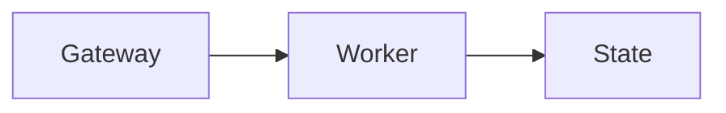

How the chat pane behaves: the session rail, the composer, and how the transcript renders.

## Session rail and side chat

While you watch a running session, the Gateway shows the model's latest safe preamble immediately as the session headline. When a utility model is available, it can replace that headline with a richer compact status digest after enough activity accumulates. Chat carries the result in a **session rail**: its compact pill shows the live digest, while the expanded rail shows the assessment, plan progress, pull requests, elapsed time, and a read-only Side chat thread. The rail can expand once when a run becomes stuck or needs input, and done or failed runs keep a frozen “finished” time based on the final digest. On wide chat panes the expanded rail docks as a 400 px right column; on narrower and mobile layouts it remains an overlay.

Side chat answers questions about the selected session and its project without entering or interrupting the main agent run. On the first question, the Gateway lazily loads a bounded visible snapshot of the selected session before starting the utility model. If history is temporarily unavailable, the question stays visible with **Retry** instead of being treated as an empty session. Side chat uses read-only access to the target session's history/search and agent workspace. Its bounded thread is held in Gateway memory, is restored when you switch sessions in the Control UI, and is cleared by the rail's trash button, a session reset or deletion, Gateway restart, or idle expiry. It never enters `chat.history`, and private reference context is not stored as operator dialogue. Open it with Shift-Command-S on Apple platforms or Ctrl-Shift-S elsewhere, or type `/btw` or `/side` in the main Control UI composer and press Enter to open the rail and focus its question box. Selecting `/btw` from the slash menu does the same. Add a question after either command to send it to Side chat; focus moves to its question box when the request finishes. Other clients keep their existing BTW behavior.

Opening Side chat, reopening its panel, or selecting its tab focuses the question box. If you focus another input or keep typing while Side chat loads or answers, that newer input keeps focus.

The Control UI keeps the latest 24 Side chat turns, including failed questions. Sending a follow-up keeps earlier failures in order; **Retry** resends that question in place. Failed questions stay in the current pane through a reconnect, but are not persisted across a page reload.

The question box wraps and grows like the main composer; Enter (or your configured send shortcut) asks the question, and Shift+Enter adds a line. Highlighting text in a chat message offers **Ask in side chat**, which opens the rail with a quoted draft ready to edit.

Highlight text and choose **Add to chat** to attach a comment to the main
composer. The optional comment field starts on one line, grows to five lines,
then scrolls internally. Confirm or press Enter to save; Shift+Enter adds a line.
Saving keeps your existing draft and does not send a message.

Saving leaves a small, filled comment marker beside the selected passage. Click
that marker, or the pencil in the comment count's hover preview, to reopen the
same editor beside it. **Save** or Enter saves changes; **Cancel** or Escape discards the edit; and the trash
button deletes the comment. Hover, keyboard-focus, or click the composer's comment
count to open its preview. Deleting one comment keeps the remaining list open;
Escape, a click outside, or moving the pointer away dismisses it. The count's
**Remove all comments** action clears pending comments in one click and returns
focus to the composer without showing a notification. Cleared comments cannot
be undone. The clear action appears on hover or keyboard focus and stays visible on touch.
Clearing pending comments preserves ordinary attachments, the message draft,
and comments already sent in the conversation.
Archiving another split pane leaves the current comment editor and keyboard focus in place.
Saved comments and their source markers follow the composer's existing draft and
queue recovery behavior. When you send, each comment is attached as a text file
containing the selection, comment, and source message reference; its draft marker is removed.
Hover, keyboard-focus, or tap the sent comment count to read its selection and
comment in a compact, scrollable preview. Sent comments remain read-only.
Press Escape or tap outside the preview to dismiss it.

The headline owns that run's sidebar subtitle instead of heuristic live activity. It is shared with the official iOS and Android session lists. A final done or failed digest remains visible while the session is unread, then the row returns to its normal work subtitle.

Session observation is enabled by default. Safe preamble headlines do not require a utility model; the utility model only owns richer assessments and terminal summaries. In **Settings > Appearance > Sidebar**, you can turn observation off gateway-wide, inspect the resolved small model and its provenance, or choose automatic routing, disable utility tasks, or select an explicit `agents.defaults.utilityModel`. The equivalent config controls are `gateway.controlUi.sessionObserver: false` and `agents.defaults.utilityModel: ""`.

## Session links in messages

Session links in messages open inside the Control UI. This includes `agent:` keys,
root-relative chat URLs, and URLs on the current origin or the Gateway's public origin
when its applied configuration is loaded. Hovering a link shows the session card
when the session is known locally. Unknown or ambiguous session references remain
navigable without a card; links to other origins keep normal browser behavior.
Document-relative hrefs are never session links; file references such as
`src/utils/foo.ts` and `qa-café/index.md` retain workspace file handling, including
Unicode names and percent-encoded Markdown link destinations. Explicit Markdown
file links also support spaces, emoji, and punctuation in filenames; for example,
`[Read notes](notes/caf%C3%A9%20note.md)` opens the workspace file. Bare CSV
filenames in authored links, such as `[Read inventory](inventory.csv)`, and code
spans also open the file preview. Plain-text and inline-code file detection stays
conservative to avoid turning prose into links.

While composing text with an input method in model search, Enter, Escape, and arrow keys stay with the input method. They do not select a model, clear the search, or move the highlighted model until composition finishes.

When authentication status is available, each provider heading in the chat model picker says how that provider is signed in: **API** for an API key (or an explicitly selected API-key account), the plan name for a provider with one subscription, and **Subscription** for a provider with several. With several subscriptions, the heading adds the email of an explicitly selected account when the Gateway supplies it, and the **Account** rows show each account's email; automatic selection shows no account identity. Hover a truncated heading to read the full text.

## Suggested tasks

Suggested task cards offer **Start in a new session** and **Start in a new
worktree**. Both start the task in the background and keep your current
conversation and draft open. The card disappears after the task starts; select
the new session in the sidebar when you want to follow its progress.
**Start in this session** runs the task in the current conversation.

Before starting a worktree, OpenClaw checks that the suggested folder is a Git
repository with a commit. If it is not, the card keeps the prompt and lets you
select a registered project or enter the correct repository path. Select
**Start in a new worktree** again to continue; no child session is started for
an invalid source folder.

## Composer capability menu

Select **+** beside the chat composer to open attachments and session capabilities in one menu:

- **Skills** enables or disables individual skills for this session.
- **Connectors** enables or disables configured MCP servers for this session. A **session** tag marks values that differ from the inherited configuration.
- **Web search** enables or disables managed web search plus native OpenAI and Codex search for this session.
- **Manage plugins** opens the Plugins page.

These controls are sparse session overrides, like the model and thinking settings in the chat header. A capability with no override inherits the current agent or global configuration, and OpenClaw applies the resolved values when the next run materializes its tools and skills. When overrides are set, open **+** and select **1 override** or **N overrides** at the bottom of the menu to clear all capability overrides for this session and return to inherited settings.

When `tools.web.search.enabled` is `false`, **Web search** stays off in Chat and New Session. The disabled control explains the global setting. If a session has an older enable override, selecting the control clears that override while search stays off. An explicit session disable remains saved.

Video files selected in Chat or New Session show a small local frame preview with a play badge beside the filename. The slot keeps its size while loading. If the browser cannot decode the video promptly, the play icon remains. Removing the attachment releases its preview; generating the preview does not upload the video.

In **Connectors**, administrators can select **Add MCP server…** and choose a scope. **This session** saves the server definition globally but disabled by default, then enables it only for the current session. **Everywhere** saves the definition enabled globally. Transport, authentication, and other server-definition fields are always global. Session policy can override server enablement and deny individual tools through **Tool access**.

**Tool access** lists a connector's tools once a run has discovered them. Before that, it explains why the list is empty rather than reporting zero tools: a newly added server has not connected yet, a connected server has not finished listing its tools, or the runtime catalog predates a config change. Sessions that run on the Codex harness keep their MCP connections inside Codex, so their tools do not appear here.

Capability toggles stay disabled until the Gateway, session, and runtime config are loaded, and read-only operators cannot change them. Adding a server requires administrator access. See [Connect MCP servers](/tools/mcp) for the Settings, CLI, and config paths.

## Emoji shortcodes

In Chat and New Session, type a colon followed by an emoji name, such as
`:smi`, to see a compact list above the shortcode. The list sizes to its matches
and stays inside the viewport. Use the up and down arrows
to choose a match, then press Enter or Tab to insert it. You can also click a
match. Escape dismisses the suggestions without changing your draft. Selecting
an emoji does not send the message.

Typing a recognized complete shortcode, such as `:smile:`, inserts its Unicode
emoji directly into your draft. Code spans and code blocks, URLs, escaped
shortcodes, and unknown names stay literal. Existing messages are not rewritten.
You can still paste emoji or use your operating system’s emoji keyboard; there
is no separate emoji picker in the composer.

## JSON in chat

Completed JSON objects and arrays in assistant messages and code fences share a
**Tree** view with expandable nested values and a **Raw** view of the original
source. **Copy** copies the source in either view, preserving duplicate keys,
large numbers, and escape sequences. Raw keeps the usual long-code preview,
reveal control, and word wrapping.

Unfinished streaming fences, invalid JSON, and JSON beyond the tree rendering
budget stay readable as source. User-message fences and passive previews remain
plain code without interactive controls.

## Chat behavior

When you send a message, the model picker keeps your selected model visible with
a small starting indicator until the Gateway confirms the model handling the turn.
If a fallback takes over, the label updates to that model without changing your
saved selection. A turn with no known selection still shows **Model pending**.

New Session shows the agent's known default model while the model catalog loads.
Model choices are cached in memory for the current connection, agent, session,
and account, so reopening a picker or returning to a draft can show them
immediately. Catalog and account changes invalidate these copies; reconnecting
loads current choices again. Reopening a picker after a reported cooldown expires
checks readiness again. A catalog refresh keeps existing controls visible,
and the Gateway still validates the model and account when starting a run.
Repeated changes while a model lookup is pending are collected into one
follow-up lookup for the latest choices.

Catalog refreshes update the open conversation's model and context facts without
reloading unrelated session lists. The shared session store applies lifecycle row snapshots to existing active
members locally. Membership or configuration changes and events without a row
snapshot refresh the affected lists through its paced event scheduler.

Chat refreshes its available commands after skill selections or session settings
change. Repeated changes share one pending refresh per conversation and connection;
if a read is already running, one follow-up read picks up the latest changes.
Older results cannot replace the current command list.

If a New Session model lookup does not finish within 30 seconds, the controls
show **Models unavailable**. Open the model picker to retry; your draft stays
in place. A retry waits for the earlier lookup to finish before starting more
work, and its 30-second deadline includes that wait. Reconnecting clears pending
lookups from the previous connection.

When you open an existing session, the conversation appears before supporting
panels and pull-request details load. You can start typing as soon as its identity
is resolved, while the transcript still shows its loading skeleton. The same
composer keeps your draft and focus when the conversation appears. You can send
ordinary messages and attachments while history loads: the message enters the
outbox immediately, leaving the composer ready for your next draft. The open
chat confirms its current session and conversation branch before delivery
continues automatically. Switching chats keeps queued messages tied to their
original conversation. If history fails to load, the queued message stays
available while you resolve the history error. Goals and other slash commands
wait for history; `/stop` and `/approve` remain available. The initial task progress
read reserves only its card slot; the transcript and composer stay available.

When you open a short chat link, identity prepared during the current connection
can make the composer ready sooner. The original link stays in place until the
session lookup confirms the same conversation and its current title.

Background refreshes for saved sidebar filters, groups, automation status, and the
Inbox wait until the conversation appears. Task lists, task suggestions, and the
progress card then refresh after the transcript paints. Opening a task panel,
changing a filter, or opening a group-targeted New Session remains immediate.

Panes share outbox recovery for the same conversation. Activity in another
conversation does not restart that recovery; reconnecting checks every saved outbox.

On wide desktop panes, a compact rail of horizontal marks sits in the transcript's left gutter. Hover for a short message preview, or click a mark to jump to that message. Tab focuses the rail; arrow keys move between marks, Enter or Space jumps, Home and End select the endpoints, and Escape dismisses the preview. At rest, all marks are identical 8 × 2px strokes at 12px spacing. They stay faint; marks for messages currently visible in the transcript light up together as you scroll. Hovering a mark grows it to 32px and lights only that mark in text color, with progressively shorter strokes across three neighbors on either side. The other marks keep their resting colors. Outside that hover range, widths stay fixed. An empty message preview shows “Preview unavailable.” Each visible user message has a mark, and assistant messages from the same run share one mark. Tool calls, results, and progress alone do not create marks. An assistant mark jumps to the first currently displayed response in its run and previews the latest displayed response. Its identity stays stable as streaming output becomes persisted history, and its current-position highlight follows later response content in the same run. The rail covers loaded history; messages without run identity retain their transcript grouping. Long rails scroll internally within 45% of the viewport height, with fades only at ends that hide more messages. Scrolling the transcript keeps the current mark visible; you can also scroll the rail to explore other messages. The rail stays hidden on mobile, in narrow or short panes, and when your saved message width leaves too little gutter space. A jump briefly tints the target message with a soft background, fading over 1.2 seconds without a border or ring. Reduced motion disables mark transitions and shows the target tint statically for one second.

Session dashboards and the Background tasks rail follow the selected conversation's agent, including when multiple agents each use a `global` session. Split panes keep their owners separate; panes showing the same agent and conversation share dashboard updates.

Automatic session titles describe the topic or intended task in your first message.
They are generated separately from the agent's work, so a title is not a completion
status or a report of tool access. Existing titles and manual names are left
unchanged; click a title to rename it.

Worktree creation waits up to 30 seconds for a title, then proceeds while naming
finishes in the background. A late title still updates the session without
renaming its existing Git branch. Concurrent naming requests share the same work;
if that request fails, a waiting dashboard request retries once. If both model
routes fail, the session uses a two-word crustacean-themed name.

Collapsed tool rows keep the tool label visible and truncate long summaries with an ellipsis. Tool and subagent activity rows use the same text size and weight. Inline subagent rows show only ongoing work: running, queued, or waiting. Running subagents show their title beside an animated indicator. Completed, failed, cancelled, and timed-out runs disappear immediately and remain available in the **Tasks** history. Subagent previews and their hover text flatten Markdown into a single plain-text line, including unfinished emphasis in live updates. Open the subagent details for a compact activity feed with formatted assistant text, grouped tool calls, and timestamps. Expand a tool row to inspect each command, path, or query. The panel shows current progress above the feed; finished tasks show their outcome and duration. **Show earlier** loads history without moving the entry you were reading. New activity follows the bottom only while you are already there.

Tool activity summaries count the operations inside a workflow rather than counting its wrapper again. Execution calls show the agent-provided purpose when available; titles describe intended work, while results determine success or failure. Recorded child calls appear under their operation instead of as separate peer rows. Expand the operation to inspect its children, then expand a child for its command, full output, and reported exit status. **Tool input** retains the wrapper's source and output. Collapsed operations include failures from their children, even when the wrapper or later calls succeed. Error messages and diagnostic paths stay inside the expandable tool details. Nested relationships use recorded call metadata from the same run and survive reloading; calls without an available, unambiguous parent stay separate. Untitled command previews flatten line breaks and truncate long commands; expanded details retain the original source.

A turn that fails before producing any reply leaves a durable notice in the thread. Failed and timed-out turns also show the available failure reason in the sidebar's compact summary and run-error tooltip, including while a session refresh is still catching up.

Chat error banners, including cloud runner failures, show short messages in full. Use **Copy error** beside **Details** in the header to copy the complete diagnostic received by the UI, even while collapsed. **Details** appears only when the complete diagnostic adds information beyond the preview, such as additional lines or text shortened for the preview; repeated lines and whitespace-only differences do not add details. Open it to read and select the complete diagnostic. The disclosure works with Enter or Space; the expanded text wraps long lines and can be scrolled with the keyboard. Copying does not open or close the details, and neither copying nor expanding an error retries the failed operation. Retry and other recovery actions remain separate from the disclosure.

When an active run compacts the conversation while your next message is being prepared, OpenClaw follows the verified continuation automatically, even if the earlier run finishes before preparation does. This keeps the original message and send identity without displaying a retry error.

Run-error banners offer **Refresh** to reload the conversation without resending a message or replacing your draft. If the conversation changes before a message can run and dispatch cannot verify a safe continuation, the banner explains that the message did not run and asks you to refresh before sending it again. The original diagnostic remains under **Details**. OpenClaw does not automatically redirect that message into a replacement conversation.

<AccordionGroup>
  <Accordion title="Send and history semantics">
    - `chat.send` is **non-blocking**: it acknowledges admission with `{ runId, status: "started" }` and the response streams via `chat` events. An optional `messageSeq` identifies an already committed transcript position; it is omitted when input remains only in accepted custody. Trusted Control UI clients may also receive optional ACK timing metadata for local diagnostics.
    - Chat uploads accept images plus non-video files. Images keep the native image path; other files are stored as managed media and shown in history as attachment links. Files appear in their final composer slots as soon as preparation starts, with a per-file progress fill and an in-place error icon if reading fails. Before sending, use **Remove attachment** at the corner of a staged attachment, including one still being prepared; the control supports touch and keyboard input in both Chat and New Session.
    - Opening a Markdown attachment (`.md`, `.markdown`, or a Markdown MIME type) in the side panel shows formatted headings, lists, tables, and code blocks. HTML attachments open a sandboxed page with a **Source** switch; other text attachments stay literal. HTML attachment previews accept up to 2 MiB of UTF-8 content; other text previews keep the 256 KiB limit. All retain the original download link; Markdown does not execute embedded HTML or automatically load remote images.
    - Staged attachments scroll horizontally when they no longer fit. Faded edges show where more attachments remain, including after adding files or resizing the composer.
    - Re-sending with the same `idempotencyKey` returns `{ status: "in_flight" }` while running, and `{ status: "ok" }` after completion.
    - `chat.history` responses are size-bounded for UI safety. When transcript entries are too large, Gateway may truncate long text fields, omit heavy metadata blocks, and replace oversized messages with a placeholder (`[chat.history omitted: message too large]`).
    - When a visible assistant message was truncated in `chat.history`, the Control UI automatically fetches the full display-normalized transcript entry through `chat.message.get` by `sessionKey`, active `agentId` when needed, and transcript `messageId`. The preview remains visible while the entry loads; recovered text replaces it inline.
    - Assistant/generated images are persisted as managed media references. New clients resolve their stable artifact ids through authenticated `artifacts.download` and receive short-lived, exact-resource media URLs, so reloads do not depend on raw base64 payloads or reusable credentials in image URLs. The chat uses bounded thumbnails and provides Open, Download, and Copy actions for the full image. These actions share the browser's bounded in-memory image cache, avoiding repeated full-image downloads while the image remains cached.
    - When rendering `chat.history`, the Control UI strips display-only inline directive tags from visible assistant text (for example `[[reply_to_*]]` and `[[audio_as_voice]]`), plain-text tool-call XML payloads (including `<tool_call>...</tool_call>`, `<function_call>...</function_call>`, `<tool_calls>...</tool_calls>`, `<function_calls>...</function_calls>`, and truncated tool-call blocks), and leaked ASCII/full-width model control tokens. It omits assistant entries whose whole visible text is only the exact silent token `NO_REPLY` / `no_reply` or the heartbeat acknowledgement token `HEARTBEAT_OK`.
    - During an active send and the final history refresh, the chat view keeps local optimistic user/assistant messages visible if `chat.history` briefly returns an older snapshot; the canonical transcript replaces those local messages once the Gateway history catches up. Pending sends in shared sessions remain a single bubble while incremental history catches up, even when another participant's reply arrives first. Saved commentary also replaces its matching live item when incremental history arrives after completion, cancellation, or failure, keeping the progress text in its original place.
    - Your pending prompt stays before its own saved assistant reply even when the reply arrives before history recovery finishes after reconnect; existing saved messages keep their transcript order.
    - Live `chat` events are delivery state, while `chat.history` is rebuilt from the durable session transcript. After tool-final events the Control UI reloads history and merges only a small optimistic tail; the transcript boundary is documented in [WebChat](/web/webchat). After an in-place `/clear` or `/reset`, fresh turns keep their user-before-reply order across live updates, incremental history catch-up, and reload.
    - `chat.inject` appends an assistant note to the session transcript and broadcasts a `chat` event for UI-only updates (no agent run, no channel delivery).
    - Root sessions and ordinary Home-linked dashboard sessions can be pinned. Spawned and nested-child sessions retain their sidebar nesting and reject pin requests. Subagent runs also reject pin requests and do not appear in sidebar navigation.
    - The sidebar lists every loaded active session by agent section and pinned/channel/work/custom/Chats buckets with a single New Session action that opens the draft dialog. Opening a visible row moves only the highlight. Sessions can be dropped onto Pinned to pin them, or onto a custom group or Chats to move them; custom groups are collapsible and drag-reorderable, group names and order sync through the gateway, and collapsed state stays in the browser. A new dashboard session asynchronously gets a concise generated title from its first non-command message; explicit names and authenticated sender identity remain separate, so account names are never used as generated titles. When New Session creates a worktree without an explicit worktree name, OpenClaw also uses the session label or generated title for its branch name, falling back to a readable crustacean-themed name. Set `agents.defaults.utilityModel` (or `agents.entries.*.utilityModel`) to route this separate model call to a lower-cost model; if that distinct model fails, title generation retries once with the primary model. Expanding another agent section browses that agent's sessions without leaving the open chat.
    - Search the active transcript with **⌘F** on Mac or **Ctrl+F** on Windows/Linux; Mac **Ctrl+F** remains available for native text navigation. Search includes recovered full-message text and updates when an in-flight recovery finishes. Press **Escape** while search is focused to close it, clear the query, and return focus to the control that opened it. Clearing the search keeps recovered text available in the thread.
    - Thread search in the command palette (⌘K on Mac, Ctrl+K on Windows/Linux, or the search button in the top-left control cluster) searches the authorized active-session scope across configured agents on the Gateway, filters internal child/cron/system rows before result limits, and lists the best visible matches next to navigation commands. The result limit does not restrict which sessions can match. Only actual indexing, unavailable transcript history, or search failures show status messages; more matches than the displayed limit is normal. On the **Sessions** page at `/sessions`, the quick filter searches visible session metadata on the Gateway before pagination, including names, agent identity, model/runtime labels, run status, and goal text and usage. The selected agent (or **All agents**) and **Active / Archived / All** filters still apply. **Limit** sets the server page size (50 by default); **Load more sessions** appends the next matching page. Table sorting, grouping, overview counts, and **Rows per page** operate on the loaded rows, not a globally sorted result. **Search transcripts** searches message content across the complete selected session scope on the Gateway, separately from the quick filter and roster page size. Available session titles stay with transcript matches even when their sessions are outside the filtered table. Opening a session link preserves its full UUID identity when session identifiers share a prefix, including after reloading links from Sessions, Worktrees, and Tasks.
    - Each sidebar row keeps direct pin access plus a full context menu for unread state, rename, fork, grouping, archive, and delete. Cmd/Ctrl-click opens the session in a new browser tab. Multi-selected rows (Alt/Option-click, Shift-click for ranges) get a batch menu covering unread state, grouping, archive, and delete; batch Archive reports per-session failures while archiving eligible rows, whereas batch Delete keeps its separate idle-or-already-archived eligibility. Archive stays disabled for agent main sessions (including `global` in global scope) and the `unknown` sentinel. For any other session, including one with active work, the Gateway stops and fully drains that session's work before archiving it. The selected archived session stays open with an archived notice and **Unarchive** action; deleting the selected session switches Chat back to that agent's main session. If you switch agents while a rename, archive, delete, or batch update is finishing, its completion preserves the newly selected agent's session list, pagination, and ongoing updates, including in Archived and All views.
    - Channel-linked sessions show their messaging service in the sidebar. Hover or keyboard-focus a session to see its linked conversation, chat type, and available contact or account details. Direct chats can show a phone number, email address, or Matrix handle; channel conversations retain their recorded names, and threads or Telegram topics are identified separately. The **In this session** people chip describes session contributors, not current external group membership. Main and dashboard sessions do not become channel-linked just because they last delivered a reply through a messaging service.
    - In the macOS app, the OpenClaw mark uses the otherwise-empty native titlebar strip next to the window controls instead of consuming a sidebar row.
    - On desktop widths, chat controls stay on one compact row and collapse while scrolling down the transcript; scrolling up, returning to the top, or reaching the bottom restores the controls.
    - The session header shows a small facepile beside the workspace chip when other people are viewing the same session; it lists up to four viewer avatars with an overflow count and disappears when you are alone. On multi-user gateways the header also carries the permanent session owner chip and a facepile of up to four participants who have prompted the session (owner excluded); sidebar rows compress the same information into a pair-stack — owner in front, one peeking participant or a +N count behind (see [Multi-user mode](/concepts/multi-user#reading-the-avatars)).
    - Consecutive duplicate text-only messages render as one bubble with a count badge. Messages that carry images, attachments, tool output, or canvas previews are left uncollapsed.
    - User-message bubbles carry transcript actions: a hover rewind button (confirm popover with a "Don't ask again" option) plus right-click **Rewind to here** and **Fork from here**. Rewind repoints the session to the state just before that message and returns its text to the composer for edit and resend (`sessions.rewind`, `operator.admin`). Files still loading for a draft that rewind replaces are discarded, so they cannot attach to the restored prompt. If you edit the composer or select another file while rewind is pending, your newer draft and attachments stay in place, even if that file is still loading. Fork creates a new session from the active-path prefix before the message, opens it, and seeds its composer with the same text (`sessions.fork`, `operator.write`). Both actions disable with an explanatory tooltip while the agent is working, apply only to persisted user messages, and are rejected for sessions whose conversation is owned by an external agent harness. Rewind moves chat context only — files and other tool side effects are not reverted — and the pre-rewind transcript remains preserved in the append-only session store. When that store contains multiple transcript branches, the chat title bar shows a branch menu with each branch's latest message, message count, and recency; selecting an inactive branch switches the current session back to that preserved path (`sessions.branches.list`, `operator.read`; `sessions.branches.switch`, `operator.admin`). The branch menu refreshes as messages are saved, including replies after a rewind, without a page reload. Branch switching is also unavailable while the agent is working, and selecting the already-active branch is a typed no-op error at the RPC boundary.
    - For GitHub sessions, the chat view pins pull requests from the working branch and same-repository PR links in assistant replies above the composer. Linked PRs remain discoverable when review or landing work detaches the checkout or returns it to the default branch. Each chip shows PR number, repo, branch, diff counts, a CI pill, and draft/merged/closed state, each linking to the PR. The footer lists every returned PR, with live (open/draft) PRs first. The CI pill opens a CI monitoring popover with passed/failed/running/skipped totals and named checks, with failed and running work first. Expand a GitHub Actions job to inspect its ordered steps, statuses, and durations; skipped checks stay in a collapsed group. Details load when the popover opens rather than on every background summary refresh. Job links open GitHub for full logs. Checks from other CI services remain visible without invented step details. Press Escape to close the active pane's CI popover. The Gateway polls only sessions visible in a connected Control UI and pushes changed snapshots through `controlUi.sessionPullRequests.changed`; it uses the explicit Control UI GitHub credential or the shared process-environment fallback for this read-only preview. When the GitHub API rate limit is hit, chips keep the last known status and show a warning that the status may be out of date; dismissing a chip hides it for that session in the current browser profile. Before any PR exists, the row shows the branch itself — repo, branch name, and the +/− size of the diff against the default-branch merge base (committed and uncommitted work). Open the compact account arrow beside **Publish PR** to inspect the publisher and account help. A single shared account is informational, with no redundant selector; multiple accounts can be chosen in the popover. **My GitHub** requires explicit selection even when it is the only available account; an agent override is labeled as an override, not System. The arrow appears only while publication is idle and account selection is unlocked, before a publication request or result. Pending status, retry actions, confirmation details, errors, and results stay inline. Account discovery and status reads show **Loading**, not **Publishing**; the controller records read, publish, and confirmation activity separately. Publication only begins after an explicit request. Shared publication status reads the existing receipt instead of replaying Publish. Reconnect restores the latest applicable shared receipt, and a lost acknowledgement can be looked up by its original invocation key. Committed receipt changes refresh that scoped view through session events, without another polling loop. If GitHub cannot refresh a cached PR snapshot, the row marks that state unavailable instead of presenting it as current. Automatic PR refresh hints wait for five seconds of quiet per session; explicit refresh requests are sent immediately. The Gateway coalesces forced refreshes for each watched session within a ten-second window, with one trailing refresh, while switching sessions or hiding the tab updates the watched set immediately. Recovery keeps an unfinished Git transaction pending without blocking settlement of publication receipts for independent workspaces. The Gateway-owned broker derives the repository and branch from session ownership, verifies the selected connection rather than using the preview credential, and returns the draft pull request URL or an actionable typed failure. Personal publication requires an idle, reconciled workspace and current write access to the session. Repository-only sessions publish an accepted Git-normalized checkpoint while their worker is idle or after Stop, without creating a Gateway checkout. Remote sessions sourced from a Gateway worktree still require **Stop cloud worker…** first. It never follows another participant's later turn or falls back to another account; unfinished personal publication needs same-owner confirmation after a Gateway restart. See [Publish with your account](/concepts/user-model#publish-with-your-account). The row hides itself while an open or draft PR exists for that branch; for Gateway-source checkouts, once the branch's PR is merged and the pushed tip still matches the merged head, the row disappears too. The branch row comes from local Git or the repository session's recorded URL and branch, so it stays available while GitHub is rate limited and carries the same stale-status warning, since "no PR found" cannot be trusted until the limit resets.
    - The session diff panel shows what a session's checkout actually changed: the branch button in the workspace rail or chat title bar opens a dense per-file viewer with normalized added/deleted/modified counts, collapsible files, wrapping and unified/split layouts with source syntax highlighting, file copy/open/editor actions, and "N unmodified lines" markers between hunks. The footer switches between all changes, uncommitted work, and individual commits while showing how far the branch is ahead of its merge base; committed branches also provide a copyable local sync command. Diffs are computed server-side through the `sessions.diff` Gateway method (`operator.read` scope); binary and oversized files degrade to stats-only entries, and the button only appears when the connected Gateway advertises `sessions.diff`.
    - Every Chat pane has a title bar. Click the session title to rename it; the workspace chip copies the checkout path or branch and can reveal local Gateway workspaces in the host file manager. Remote and exec-node sessions keep copy actions but hide reveal.
    - The **Files** tab in each Chat pane's unified side panel lists thread files, project files, and artifacts. Search at the top covers session files, artifacts, and the project tree; surrounding whitespace is ignored while spaces inside the query remain literal; filter chips show changed files, read files, or artifacts, and collapsible groups share one scroll region. **Show in Files** from Review clears search and filters so the destination project directory is visible. For an active repository-only session it reads the node checkout. After Stop it exposes retained changed-file previews; unchanged upstream files, editing, and full diffs require the worker to run again. The stopped diff panel explains this limitation. Reopen it with ⇧⌘B, the files toggle in the title bar, or the panel's **+** menu; the title-bar toggle carries a changed-file count badge.
    - File paths recognized in chat messages read as their basename with a small glyph for the file type in front — a Markdown page, a `package.json` manifest, a TypeScript source, a `.tsx` component, a config or data file, a shell script, and an image each get their own mark, and anything else falls back to a plain document. When two links in the same message share a basename, each keeps just enough of its trailing path to stay distinct. The full path stays on the link: it is what the tooltip shows, what opens in the file panel, and what the message's **Copy** action returns, since copy hands back the original Markdown. Labels you write yourself in a `[label](path)` link are never rewritten. The glyph is drawn from the bundled icon set, never fetched from the network, and is decorative only: it is not read by screen readers and is not part of copied text. Text that is not a recognizable path — anything carrying spaces, parentheses, a `#` fragment, or a `?` query — stays plain prose.
    - Clicking a file reference in chat, a file path in an expanded read/edit/write tool card, or a file row in **Files** opens its own filename tab in the shared side-panel header. Reopening the same file selects its existing tab and rereads its content when there is no unsaved draft. Selecting a filename tab keeps its current preview; unsaved drafts are never replaced by a file reopen. The folder action returns to the file browser without closing previews. The last opened file stays highlighted in both session and project lists, including after refreshing the file list. A pending listing cannot clear a newer file selection or replace results and errors for a different folder or search. If the folder being browsed becomes unavailable, **Files** keeps its parent-folder action so you can continue browsing without reloading or changing sessions. Session file labels show the filename and enough parent folders to distinguish matching names; hovering or copying a path keeps the full path. Closing a filename tab closes only its preview, never the underlying file. Closing or replacing a file preview cancels a delayed copy fallback; an already issued native clipboard write may still finish. Open previews are scoped to the current session, agent, and connection, and are not persisted across reconnects. HTML files open a sandboxed **Preview**, with **Source** in the same filename tab. Other UTF-8 text files use a CodeMirror-based code view with syntax highlighting, line numbers, jump-to-line, in-file search, copy actions, and an open-in-external-editor menu. The code view has a **Word wrap** toolbar toggle, including in HTML **Source** view. Wrapping starts off; the browser remembers your choice across files and reloads without changing file contents. Search follows the displayed line numbers for LF, CRLF, and CR line endings; editing preserves the original line endings. Escape closes in-file search and returns keyboard focus to **Search in file** in the toolbar. AVIF, GIF, JPEG, PNG, and WebP images no larger than 256 KiB render inline; other binary files show metadata without lossy text decoding. When the Gateway advertises `sessions.files.set` to an `operator.admin` connection, the text panel adds an Edit mode with dirty tracking and Cmd/Ctrl-S save; unsaved drafts survive file, panel, and session navigation in the current browser tab until explicitly saved or discarded. Saves are compare-and-swap on a content hash returned by `sessions.files.get`: if the file changed on disk since it was loaded (for example because the agent kept working), the panel shows a conflict notice with Reload (take the latest content) and Overwrite (keep the local edit) actions. Writes go through the same fs-safe workspace guards as reads — path containment, symlink/hardlink rejection, and a 256 KiB UTF-8 cap — and only overwrite existing files; the editor never creates or deletes them. If the editor cannot load, use **Retry** or **View Raw Text**. A missing editor chunk after an update offers **Reload**, which waits for the Gateway to become reachable.
    - Subagent runs appear in inline transcript activity rows, the chat **Tasks** tab, and the Tasks page. They have no sidebar row; opening a run in the main chat view is view-only. The composer identifies the parent session and offers **Open parent session** so you can continue the conversation there. Message input, reply actions, model and access pickers, microphone, and attachment controls are hidden. This does not change copy or fork availability; **Open parent session** takes you to the conversation where you can reply. **Stop** remains available when the Gateway reports an abortable run. Spawned persistent sessions (visible sessions in the session tree) are not subagents: a subagent run ends, a session does not, and you can always type in it.
    - The **Tasks** tab lists the current agent's background tasks and subagents (`tasks.list` scoped by agent, kept live by `task` events): running work shows a live elapsed timer, tool-use count, the tool currently in use, and a stop control, while the collapsible finished section adds run durations. Inline subagent activity rows show ongoing status and progress without per-task edit counters; finished runs appear only in Tasks history. Task details retain each task’s cumulative edit-activity counter; the checkout chip above the composer shows the session checkout’s actual Git diff. Selecting a task from either a task row or an inline subagent activity row opens its live status and transcript inside **Tasks** without replacing the main conversation or the **Review** diff; tasks whose session is the current conversation show their prompt and output inspector there instead. Select **Back to tasks** to return to the list. Closing the Tasks tab clears inspection; switching tabs or minimizing the panel preserves it. Open **Tasks** with the title-bar activity toggle or the panel's **+** menu; the task snapshot loads eagerly, so the title-bar toggle carries a running-count badge without opening the tab first. The Tasks page remains the full cross-agent ledger.
    - After a chat turn finishes, remaining background work appears as an inline task count followed by elapsed time. Hover or focus the count to preview tasks; select it to open **Tasks**. The status disappears when no active tasks remain or the Gateway disconnects.
    - **Tasks** and **Review** retain their selections independently of each other and of file tabs. Reloading restores the selected task from current Tasks data; if that task is no longer available, Tasks says so instead of showing workspace Git changes. A pending file or artifact updates only its own open tab: it cannot select itself over a newer tab, reopen a closed preview, or return after you leave the chat page. Switching tabs or hiding the whole side panel preserves the pending preview without changing your chosen layout when it finishes. Text attachments retain their Preview or View Raw Text mode while switching between open files. Background download-link refreshes keep an unchanged attachment's reader in place, including keyboard focus and code-block controls.
    - Each task has a main view and a unified side panel. The task toolbar's **Swap** button exchanges the main view and active side-panel tab; its tooltip names both views, for example **Swap Chat and Dashboard**. Chat, Dashboard, Browser, Terminal, Files, Tasks, and Review can all be main. Other side-panel tabs remain available. **Focus** in the main pane header gives that view the full task area; **Restore split** brings the side panel back. Swapping or focusing preserves live content and drafts. Closing the whole side panel hides it without changing the main view, and the browser remembers each task's arrangement.
    - The task toolbar's **Layout** menu positions the side panel left, right, or below the main area. It adapts to each pane's own width rather than the window, falls back to a bottom strip in a narrow pane or compact window, and hides its dock controls until the pane widens. Phone-sized viewports still open review content full-screen.
    - A new Browser side panel uses the task pane's available width and the rendered chat column to reclaim unused chat margins. This default applies on web, macOS, and Tauri; saved widths and manual divider adjustments take precedence.
    - The chat header model and thinking pickers patch the active session immediately through `sessions.patch`; they are persistent session overrides, not one-turn-only send options. A confirmed model selection stays visible if the following session refresh fails; later Gateway updates can still change it. For catalog-backed OpenAI models, the effort picker offers **Off** only when the model advertises disabled reasoning. Inheriting the model's default effort does not turn reasoning off.
    - Diff syntax highlighting uses each file's language and the current theme; unknown file types and oversized previews remain plain text. Inline and session diffs do not require the optional [Diffs plugin](/tools/diffs), which creates standalone viewer links and PNG/PDF attachments.
    - **Split view:** open it from the chat title bar (beside the thread diff, background tasks, and thread files toggles), then split the active pane right or down for as many panes as fit. Each pane has its own thread, transcript, composer, and tool stream.
    - Agents with the `screen` tool can request pane, sidebar, terminal, browser, desktop, portal, focus, and navigation changes in the capable Control UI browser that requested the turn. Other connected browsers keep their own layout; see [Screen](/tools/screen).
    - Drag a session from the sidebar into chat to open it in a pane. An animated drop preview glides between zones and labels the outcome — "Split" over the exact half a new pane will occupy, "Open here" over a whole pane — and drops also work from single-pane mode.
    - The active split pane drives the sidebar selection and URL. Selecting another pane or closing the active pane uses the surviving conversation's Chat or Dashboard preference; it does not copy the previous pane's view. Closing a pane that holds keyboard focus returns focus to the surviving pane's header, which is labeled with the session title for assistive technology. Its title bar adds split and close controls; dividers resize columns and stacked panes, and the browser stores the layout locally across reloads.
    - On narrow screens, split view keeps the layout but renders only the active pane at the full available width and height, including its header with the close control. Widening the window restores the saved column and row proportions without losing drafts.
    - If you send a message while a model picker change for the same session is still saving, the composer waits for that session patch before calling `chat.send` so the send uses the selected model.
    - On the New Session page, press **Cmd+Enter** on macOS or **Ctrl+Enter** elsewhere to create and start the draft in a background session without leaving the page. The selected local, cloud-profile, or paired-device placement is preserved. With the **Modifier+Enter** send preference, use **Cmd/Ctrl+Shift+Enter** for background start; Cmd/Ctrl+Enter remains ordinary submit. Explicit Draft visibility keeps its create-only behavior. A completion notice offers to open the new session.
    - Typing `/new` creates and switches to the same fresh dashboard session as New Chat, except when `session.dmScope: "main"` is configured and the current parent is the agent's main session; then it resets the main session in place. Typing `/reset` keeps the Gateway's explicit in-place reset for the current session.
    - The chat model picker requests the Gateway's configured model view. If `agents.defaults.modelPolicy.allow` is non-empty, that policy drives the picker, including `provider/*` entries that keep provider-scoped catalogs dynamic. Otherwise the picker shows configured entries plus providers with usable auth; aliases and settings under `agents.defaults.models` do not restrict it. The full catalog stays available through the debug `models.list` RPC with `view: "all"`.
    - Expand the **Account** category in the model menu to choose a saved account for the selected provider in Chat or **New Session**, even when **Automatic** has no eligible models. A New Session choice previews eligible models and is attached when the session is created; it does not change the personal new-chat default or saved model preference. See [Per-person model accounts](/concepts/multi-user#per-person-model-accounts).
    - Chat and New Session block sending when the Gateway reports missing provider credentials or a confirmed authentication failure. Missing credentials point to **Models → Connect provider**; authentication failures ask you to review the credential or sign-in. An explicit account choice in New Session also waits for a successful preview confirming that account and an eligible model; pending or failed previews show why Start is blocked. Otherwise, temporary credential cooldowns and unknown model availability do not block sending or show an authentication banner; run errors remain visible in the transcript. Unavailable model choices stay disabled in the picker.
    - After a config change or a published credential update, connected Chat and New Session views re-read model readiness automatically; no page reload or picker action is needed. Chat also re-reads its session projection after a model or auth-profile selection changes. An existing missing-credential or authentication-failure block stays in place while that read is pending or fails, until replacement metadata changes it. Existing chats keep their session's selected auth profile; New Session readiness reflects its draft account choice when one is set. This refresh is event-driven, not a timed polling guarantee.
    - The chat composer usage ring follows the selected session and agent, including global sessions. Open it for the current context window, latest-run token counts, and the current provider's account, plan, and quota when reported. Subscription quota replaces dollar estimates; other sessions can show estimated total cost and the latest provider response's input/output/cache cost breakdown. Fresh usage switches to warning styling at high context pressure; stale token snapshots remain visible as approximate usage without that warning. During an agent switch, the previous agent's session row is not reused for the ring.

  </Accordion>
  <Accordion title="Talk mode (browser realtime)">
    Talk mode uses a registered realtime voice provider. Configure OpenAI with `talk.realtime.provider: "openai"`. GA `gpt-realtime-*` browser WebRTC uses Platform auth in this order: `talk.realtime.providers.openai.apiKey`, an `openai` API-key profile, then `OPENAI_API_KEY`. The released GPT-Live browser and Gateway-relay WebRTC route tries a ChatGPT OAuth subscription profile first and falls back to Platform API-key access. Unlisted or private GPT-Live browser sessions and the direct Gateway-relay transport require Platform API-key access. Both keep the authenticated GPT-Live control path on the Gateway. GPT-Live has its own voice choices, shown by the model-aware Talk picker; GA Realtime voices do not apply. See [Talk mode](/nodes/talk) for setup and transport details. Configure Google with `talk.realtime.provider: "google"` plus `talk.realtime.providers.google.apiKey`. The browser never receives a standard provider API key or a ChatGPT OAuth token: Platform GA OpenAI receives an ephemeral Realtime client secret, native GPT-Live WebRTC receives a one-use Gateway reservation, and Google Live receives a one-use constrained Live API auth token for a browser WebSocket session. Gateway relay keeps provider credentials and vendor sockets server-side while browser audio moves through authenticated Gateway RPCs. Platform GA sessions use the Gateway's direct-tool prompt, while GPT-Live uses provider delegations. `talk.client.create` does not accept caller-provided instruction overrides.

    Persistent provider, model, voice, transport, reasoning effort, exact VAD threshold, silence duration, and prefix padding defaults live in **Settings → Communications → Talk**; changing them requires `operator.admin` access. Configuring Gateway relay forces the backend relay path; configuring WebRTC keeps the session client-owned and fails instead of silently falling back to relay if the provider cannot create a browser session.

    The Talk control itself is the microphone button in the composer toolbar. Its caret lists **System default** and every microphone exposed by the browser, including USB, Bluetooth, and virtual inputs. The selected device ID stays browser-local and is never sent to the Gateway; if that exact device disappears or the browser cannot open it, Talk asks you to choose another input instead of silently recording from a different microphone.

    For a selected-microphone constraint failure, click **Use System default for this call** to explicitly retry with the system default. This does not change your saved microphone preference. Until you click, no different microphone opens and no provider session is allocated. Dismissing the error, leaving the chat, disconnecting, or starting another call cancels that recovery action. For dictation, choose another input or **System default** from the existing microphone picker, then start again; dictation never switches microphones automatically.

    While Talk is live, the microphone button becomes a pill showing the live input-level meter; clicking it stops voice input, and hovering it reveals the stop glyph. Screen readers announce `Connecting voice input...`, `Listening...`, or `Asking OpenClaw...` while a realtime tool call is consulting the configured larger model through `talk.client.toolCall`. Stopping a running agent response stays a separate square **Stop** control next to the pill.

    **Video Talk** is available for OpenAI Platform Realtime WebRTC and Google Live browser sessions; GPT-Live is audio-only. Click the camera button, allow camera and microphone access, and confirm the local preview. OpenAI sends one bounded JPEG frame over its browser data channel when `describe_view` requests visual context. Google Live sends bounded JPEG frames directly from the browser to the provider at the supported maximum of one frame per second and answers `describe_view` function calls with the camera-stream state. Camera frames never pass through the Gateway. Stopping Talk closes the preview and releases both media tracks. See Google's [Live API capabilities](https://ai.google.dev/gemini-api/docs/live-api/capabilities#video) and [function-calling guide](https://ai.google.dev/gemini-api/docs/live-api/tools) for the provider wire contracts.

  </Accordion>
  <Accordion title="Stop and abort">
    - Click **Stop**. Runs with an exact local run ID call `chat.abort`; when selected-session state reports active work but the Control UI has no local run ID, it calls `sessions.abort` instead. For non-global sessions, that selected-session path also discards queued follow-ups so they cannot restart work after the stop.
    - Exact-run Stop cancels that parent's associated sub-agents and Swarm collectors, including their descendants. Successful cancellation prevents selected queued children from starting while running siblings stop; it leaves unrelated parent turns and session-wide queues alone.
    - If Stop reports incomplete descendant cancellation, inspect **Tasks** and retry cancellation for the remaining children. Do not treat the parent's stopped state as confirmation that every child stopped or that runtime cleanup was instantaneous. See [Sub-agent stopping](/tools/subagents#stopping) for scope details.
    - While a run is active, normal follow-ups use the Gateway's effective `messages.queue` mode. `steer` injects into the running turn; other modes keep the browser's durable queued delivery. Steering rejection also falls back to that queue. Once the Gateway accepts input for an existing session, its database owns the approved input until it reaches the transcript. Collected messages are retired together with their combined transcript entry. Unconsumed input survives a Gateway restart as interrupted input requiring an explicit resend. Click **Steer** on a queued message to inject it manually. Text already streamed in an open chat stays before the steering message across history refreshes and reconnects; subsequent updates show only the continuation below it.
    - With **Settings → Appearance → Send shortcut** set to **Enter**, **Cmd/Ctrl+Enter** submits the opposite follow-up action while connected to an active run: queue when Enter steers, or steer when Enter queues (including inherited `collect` and `followup` modes). The send button tooltip shows both actions for the current follow-up setting. This affects only that message, not your saved preference. With the **Cmd/Ctrl+Enter** send shortcut selected, modified Enter remains the normal send action and plain Enter inserts a newline. Interrupt mode keeps its normal behavior.
    - Reorder the queue from the handle on the left of a queued message: drag it, or focus it and press the up and down arrow keys. The position is stored with the message, so it survives a reload and decides delivery order, not just what the list looks like. Rows already handed to a run — sending, steering, running a command, awaiting settings, or waiting on an uncertain delivery — hold their place and split the queue: a message moves only among the rows between two of them, so it can never reach the Gateway ahead of work already handed over.
    - Edit a queued message with the pencil on its row, or by double-clicking the row. The row becomes its own textarea and stays in place while the main composer remains independent, including any separate draft and attachments. Submit replaces the row in the same slot and preserves its attachments and delivery choice, even when the composer currently defaults to Steer or Interrupt; Cancel or Escape discards the row-local draft and restores the queued message. A normal composer send remains a separate queued item even while a row edit is open. The queue behind an edited row waits rather than delivering a message you are still rewriting, so that row splits the queue for reordering the same way an in-flight row does. Queued slash commands keep the discard-and-retype flow.
    - **Settings → Appearance → Chat → Follow-ups while the agent is working** can override that server default for the current browser. The page marks an override explicitly and offers **Reset to server default**. `Steer into the active run` sends follow-ups immediately, while `Queue until the run ends` holds them until the run finishes.
    - Type `/stop` (or standalone abort phrases like `stop`, `stop action`, `stop run`, `stop openclaw`, `please stop`) to abort out-of-band.
    - `chat.abort` supports `{ sessionKey }` (no `runId`) to abort authorized active runs for that session without cascading to children. The Control UI uses the broader `sessions.abort` path when it has no local run ID.

  </Accordion>
  <Accordion title="Abort partial retention">
    - When a run is aborted, partial assistant text can still be shown in the UI.
    - Gateway persists aborted partial assistant text into transcript history when buffered output exists.
    - Persisted entries include abort metadata so transcript consumers can tell abort partials from normal completion output.

  </Accordion>
</AccordionGroup>

### ClawHub recommendation cards

Ask to find or install a plugin or skill, such as “Find the WhatsApp plugin”, to
let the agent search ClawHub. The agent uses available tools and skills first;
it suggests cards for explicit discovery or installation requests, or when a
needed capability is missing. Routine tasks, tool errors, and permission fixes
do not call for a catalog search. When the `message` tool is available, it can
present up to three matching cards in the conversation.

If you use the `coding` tool profile, include `"message"` in `tools.alsoAllow`
(for example, `tools: { profile: "coding", alsoAllow: ["message"] }`). Existing
deny rules still apply. See [Tool access configuration](/gateway/config-tools).

Select a card to open its listing inside the Control UI: plugins open in
**Plugins**, and skills open in **Skills**. A card's **Install** button opens
the capability details. Select **Install** on a plugin overview to start installation
immediately. Configured install-policy warnings still require an explicit
acknowledgment; see [Manage plugins](/web/control-ui/settings#manage-plugins).
**Dismiss** dismisses the card from the current view.

An installed capability shows a green checkmark and **Installed**. This means the
plugin package or linked skill is present. A plugin may still need to be enabled,
configured, or connected to an account before the agent can use it. The card
checks the current installation status; select **Status unavailable · Retry** if
that check fails.

The agent requests cards through `message` with a capability query:

```json
{
  "action": "send",
  "clawhub": { "query": "whatsapp", "kind": "plugin" }
}
```

`query` is required; `kind` can be `plugin` or `skill`. Omit `kind` to check plugins
first, then skills if no official plugin matches. Omit `channel` and `target` to
reply to the current Control UI conversation. ClawHub supplies the official
designation, and the Gateway checks installation status; the agent cannot assign
those badges. A search with no official match or an unavailable catalog returns
an explanation in chat.

### Source previews and copying code

Long clipboard text appears as a file-sized card in the composer and a compact
chip in the transcript. Its label shows the first 30 characters of a plain-text
excerpt, with HTML and Markdown formatting removed. Empty or unavailable excerpts
show **Pasted text**. In the transcript, chips sit above the text bubble alongside
other attachments; multiple chips share a row and wrap when needed. Click the
composer excerpt or icon, or a transcript chip, to open the existing attachment
side panel and copy the original text, preserving markup, line breaks, and
indentation. The excerpt and chip also support keyboard activation. Select
**Show in text field** on the second row inside the composer card to return its
text to the draft without opening the side panel.
The composer side panel also offers the same action and removal. Messages
containing only comment or pasted-text chips
use a transparent shell.
Newly uploaded text files remain file cards, even when their names resemble
pasted-text attachments. Older history without origin metadata recognizes
`text/plain` attachments named `pasted-text-<digits>.txt` as pasted text.

Select **Open** on an uploaded text attachment to read it directly in the **Files** side
panel. Plain-text attachments, CSV, and JSON preserve line breaks and indentation. Markdown attachments render as documents
with interactive code blocks. When an open attachment refreshes with unchanged
text, its code blocks keep your expansion and wrapping choices after loading.
A different attachment or changed text starts with fresh controls. Long previews
scroll inside their file tab; switching tabs preserves your reading position. HTML files
(`.html`, `.htm`, or `text/html`, including MIME parameters) render as a sandboxed
page by default. **Source** and **Preview** share the same filename tab and slim
toolbar. Same-origin HTML attachment previews accept UTF-8 content up to 2 MiB;
other text attachment previews remain limited to 256 KiB. Unsupported, external,
oversized, or unavailable attachments keep their original **Download** action. Cross-origin HTML attachments are download-only.

Self-contained HTML can use inline CSS and JavaScript under the default
`scripts` sandbox setting. The page runs on the existing separate-origin sandbox
host, not in the Control UI document. It receives no agent-prompt, tools, or
dashboard APIs. The global `strict` setting disables document JavaScript while
retaining the same sandbox resource policy and descendant-frame restrictions; `trusted` does
not give ordinary HTML files access to the Control UI origin. Relative assets
are not served from the file's directory, and external resources remain subject
to the sandbox's default content security policy.

Authored in-page HTML links such as `href="#section"` scroll within the preview, including
in `strict` mode. This leaves the original file and **Source** unchanged; authored
base URLs, links targeting another window, and download links keep their behavior.

Workspace file reads and edits retain their existing 256 KiB limit.
For workspace HTML, **Edit**, in-file search, and explicit `file:line` navigation
open **Source**. Switching back to **Preview** renders the latest unsaved editor
text without saving it. Switching views preserves the editor, undo history, and
draft; switching file tabs preserves each file's mode and unchanged page state.
A reopened unsaved draft can be saved directly from **Preview**, including the
same conflict detection and **Reload**/**Overwrite** actions as **Source**.
A preview transport failure shows **Retry** without retrying in a loop, and
**Source** remains available, including when the optional preview cannot load.

**View Raw Text** opens a **Source** view that keeps Markdown notation literal,
including nested code fences. The raw-text action disappears while that view is open.
Decoded text artifacts use the same literal preview. **Copy code** preserves the
code's leading whitespace and final newline when present. Indented Markdown code
blocks also work at the start of a message and remain literal while streaming,
including blank lines within the block.

Code blocks keep your expansion and wrapping choices when their closing fence
arrives and later paragraphs stream into the same assistant reply. Replacing the
message, correcting earlier content, or changing rendering options starts a fresh
view. References that change earlier Markdown can also reset the view.

**Copy URL** in browser tab cards also works on plain HTTP connections where the
browser does not provide its Clipboard API.

If the browser rejects a text clipboard write, starting another text or image
copy cancels its delayed fallback. Code blocks replaced during streaming and
Mermaid diagrams whose source changes also cancel that fallback. This does not
cancel native clipboard writes that the browser has already accepted.

### Markdown tables

Markdown tables scroll horizontally within the conversation. **Copy table** copies
tab-separated cells, and **Expand table** opens a larger view. If copying fails, the button clears any earlier success checkmark. In Chat, workspace
file and session links work in either view, including Enter and Space keyboard
activation. Following a link closes the expanded view so you can use its destination.

The **Ask OpenClaw** panel supports table scrolling, copying, expansion, and web
links. Its session links open with a click or Enter. Space does not activate
those links, and workspace-file references do not open a preview.

### Mermaid diagrams

Use a `mermaid` fenced code block in chat. The Control UI renders it as a diagram
automatically:

````markdown

````

Open the **Diagram options** menu in the top-right corner to switch between the
diagram and source or choose **Expand diagram** for the image viewer with zoom.
The copy button appears on hover or keyboard focus and stays visible on touch
screens. It copies the original Mermaid text.
Diagram colors and fonts follow the current UI theme.

An unfinished streaming fence stays readable as code. Rendering starts when the
closing fence arrives or the response finishes. Invalid or overly complex
diagrams keep their source visible with an error; correct the syntax or simplify
the diagram. Diagram source cannot run scripts or click handlers, load external
images, or add custom CSS to the Control UI.

Renderer loading or timeout errors instead suggest reloading the dashboard and
checking proxy authentication. The renderer runs in an isolated frame, so its
`assets/mermaid.min-*.js` and `assets/frame-*.js` requests do not send `SameSite=Lax`
or `SameSite=Strict` cookies. Behind a cookie-authenticated reverse proxy, those
static asset URLs must be reachable without those cookies, including under any
configured `gateway.controlUi.basePath`. Check the browser Network panel for
blocked requests or redirects to a login page. Keep authentication on the
dashboard and Gateway APIs; any proxy exception should cover only these static
renderer assets. Reload after correcting the asset access rules.

## Hosted embeds

Assistant messages can render hosted web content inline with the `[embed ...]` shortcode. The iframe sandbox policy is controlled by `gateway.controlUi.embedSandbox`:

<Tabs>
  <Tab title="strict">
    Disables script execution inside hosted embeds.
  </Tab>
  <Tab title="scripts (default)">
    Allows interactive embeds while keeping origin isolation; usually enough for self-contained browser games/widgets.
  </Tab>
  <Tab title="trusted">
    Adds `allow-same-origin` on top of `allow-scripts` for same-site documents that intentionally need stronger privileges.
  </Tab>
</Tabs>

```json5
{
  gateway: {
    controlUi: {
      embedSandbox: "scripts",
    },
  },
}
```

<Warning>
Use `trusted` only when the embedded document genuinely needs same-origin behavior. For most agent-generated games and interactive canvases, `scripts` is the safer choice.
</Warning>

Absolute external `http(s)` embed URLs stay blocked by default. To let `[embed url="https://..."]` load third-party pages, set `gateway.controlUi.allowExternalEmbedUrls: true`.

Widgets created by `show_widget` load through the authenticated Gateway connection in every sandbox mode, including while settings are loading. In `strict` mode, their content remains visible but scripted interactions are disabled.

While a widget loads, a subtle shimmer reserves its space without displaying loading text. With reduced motion enabled, the placeholder stays still.

The core [`show_widget`](/tools/show-widget) tool renders self-contained SVG or HTML directly from a tool call. The browser and supported native chat clients advertise the `inline-widgets` Gateway capability, and the resulting Canvas document remains available when chat history reloads. Channel plugins such as Discord Activities can register contextual presenters behind that same tool. Channel-originated runs without an eligible presenter or inline client do not receive it.

## Chat transcript layout

Suggested-task cards show their short summaries in full. Unusually long summaries
scroll within the card, and **Show instructions** expands the complete task prompt.
In short windows, the card body scrolls while the header and Start controls stay visible.

Use the mouse wheel or trackpad over the composer or its surrounding space to
scroll the conversation while the footer stays pinned. Pull requests, persistent
notices, task progress, and the composer reserve their own space below the
transcript. When this context grows tall, it scrolls above the writing surface
so the draft and send controls remain reachable. Long drafts, task progress
cards, and menus keep their own scrolling when their content overflows. At the
footer's edge, the wheel continues into the conversation. On touch devices,
swipe the transcript or footer to scroll that region.

Scrolling down at the end keeps the final reply above the pull request bar and
composer as images or other message content finish resizing. Scrolling upward
keeps your reading position instead.

Task progress cards are enabled by default. Toggle **Show task progress cards** in
**Settings → Appearance → Chat** to hide or show the composer card in this browser.
Hiding it does not stop agent work or clear saved progress.

On mobile, the task progress card above the composer starts collapsed and stays
collapsed when you send a new message or the run completes. You can still open it
manually. The card also collapses after deliberate upward scrolling settles.
Returning to the end and progress updates leave it collapsed; on desktop,
completion can reopen it only while you are already at the end. Manual choices
are remembered per session. Continued scrolling after a manual reopen uses a
higher threshold, and a second reopen keeps it open for that visit and task.
See [Task progress cards](/tools/progress-card#where-the-card-appears) for gesture thresholds,
manual-choice scope, and reset behavior.

Streaming output and layout adjustments keep reading mode intact. A message from
another participant pauses following and preserves your current position, even
when you were at the end. Typing indicators do not move the transcript. Sending
a message from this pane resumes following your response; a send from another
browser, including one signed in as you, does not count as a local send. Scroll
back to the end or select **Latest** to resume following explicitly. Assistant
text stays visible as it streams and becomes saved history, without a reply
entry fade or slide.

Completed replies can show a compact **Sources** strip when their web links match
recorded `web_search` or `web_fetch` results from the same run. Select a title and
domain card to preview its **Search snippet** or **Page excerpt**, then use
**Open source** to open the recorded page. Previews reuse retrieved content without
fetching pages again. Site icons use the existing **Automatically Fetch Link Favicons**
preference and Gateway icon loader, with a globe when disabled or unavailable.
Session links and GitHub issue or pull-request links keep their dedicated previews
instead of appearing again in the source strip. Citation-only results keep a link
and show **No excerpt available**. Uncited results, failed tools, and results from
other runs are not included. Source cards require run identity in the transcript
and follow tool-activity visibility. They are hidden while a run is active or
transcript search is filtering messages.

In completed dashboard turns, commentary, reasoning-only messages, and tool activity
share one **Worked for…** disclosure above the answers. Expanding it shows the
activity in its original order; explicit answer segments and visual results stay
visible below it. Failed tool results after the last answer stay visible outside
the disclosure until a later answer follows them. This is display grouping, not a
change to stored history. Live turns, search results, and turns without an answer
stay expanded. User messages,
forwarded inputs, and structural markers remain boundaries for grouping.
Clicking a reply's quoted original opens its containing **Worked for…** group,
scrolls to the original message, and briefly highlights it.

On wide desktop panes, the conversation position rail provides keyboard shortcuts
to messages. Tab enters at the current message, or the first marker if no message
is current. ArrowUp and ArrowDown move focus; Home and End go to the first and last
markers. Enter or Space jumps to the focused message. Tab or Shift+Tab leaves the
rail in one step, and Escape closes the preview and returns focus to the transcript.
In split view, Escape handles the focused pane before a hovered preview in another pane.
Focusing a marker also shows its preview without jumping to the message.
Changing the draft height or entering Goal mode keeps the rail's scroll position
stable. Navigation and keyboard focus still reveal the selected marker.

The chat transcript uses a centered readable frame aligned with the composer. Assistant and tool output stay left-aligned while your own messages stay right-aligned inside that frame. In multi-user sessions (for example a group chat relayed from a channel plugin), messages from other attributed participants render left-aligned with the author's avatar, name, and a stable per-identity color, so only the signed-in viewer's messages read as "mine". When two or more attributed participants are present, assistant replies carry a small "Replying to name" marker naming the participant whose message triggered the turn. System entries such as local slash-command output render as centered notice rows without an avatar.

Images and video previews in your own messages appear above any accompanying text, without a surrounding bubble background. Videos use a still frame with a play icon; select the preview to open the video in the Files panel. If a preview cannot load, the attachment card remains available. Hovering media leaves that layout unchanged, and the text keeps its normal bubble color, including any per-identity tint. Assistant videos retain their inline player.

Images use a plain, lightly tinted shimmer while their availability or preview is loading. An image that needs explicit permission keeps a compact **Allow image** card until you choose to allow it; unavailable images retain their status and retry controls.

Managed image previews retain enough detail for high-density displays. Open an image tile
to inspect it immediately in the image viewer; the cached preview stays visible
while the original loads and is replaced as soon as the original is ready.
Reopening an image reuses the cached original. If loading fails, the preview remains visible.
When the message contains
multiple images, use **Previous image** / **Next image**, the left and right arrow
keys, or a horizontal swipe to move through that message's images. Navigation
stops at either end and reverses direction in right-to-left layouts. Pinch or use
the zoom controls to inspect details; dragging while zoomed pans the image.
Press Escape, select **Close image preview**, or click outside the image to close
and return focus to the tile you opened.

Images attached to assistant progress messages appear inline while the task continues and remain visible after reloading the conversation. Remote attachment URLs do not need a filename extension: the Gateway detects the media type and serves the preview through the same authenticated media path used for final replies. Documents keep their file cards.

Computer screenshots retained in the session transcript also load as image previews,
including after a reload. Opening a preview shows the saved screenshot in the image
viewer. The Control UI retrieves the pixels through authenticated artifact access;
computer observations are not automatically sent as outgoing attachments. Historical
entries that contain only omission metadata keep the **Omitted from history** card.

In automatic visible-reply mode, this includes standalone `MEDIA:` lines in model-authored commentary committed to the transcript, not just final replies. Only references captured before transcript hooks and retained in that commentary are eligible; hook-added references remain text, and normal media access and live run/session checks still apply. Message-tool-only delivery uses `message(action=send)` with structured attachment fields instead. Tool/plugin output and streamed block payloads must also use structured fields. See [WebChat commentary compatibility](/reference/rich-output-protocol#webchat-commentary-compatibility).

Messages forwarded by `sessions_send` render as left-aligned speech bubbles with a **From** attribution row above the message. Known senders, including the current agent, retain their agent identity. Unknown or unlisted senders show no avatar beside the bubble or in the attribution row, and no empty inline avatar space remains. The message column stays aligned with neighboring messages. Select a linked source to open its session; hover it to see session progress. Each source session has a stable bubble tint. Forwarded messages without a known source session show the source agent when available, or a generic forwarded-message label. The receiving agent's own replies remain flat text.

Your name is hidden beneath your own messages when no other human participant is known in the session. Shared conversations keep sender names, including while searching the transcript. Web messages do not show a "via Web" label; other recorded client sources remain visible.

## Subagent transcripts

Subagents use the same task transcript view, including subagents run by the
Codex harness. Select a task to read its messages, thinking, and tool calls;
select **Show earlier** to load older history. Task activity refreshes the view
while the subagent runs. The generic fallback label is **Subagent**.

In the Chat task panel, tasks with a readable current child session load the
complete text of capped assistant replies automatically. The preview stays visible while loading. If recovery fails three
times, the panel keeps the preview and offers **Retry**. Task transcripts without
a session address keep the text supplied by their runtime.

The viewer reads history from the runtime that owns it. New native subagent
tasks retain their original history source when later turns replace the parent's
native thread. Changing the parent session or account can make that history
unavailable. If the runtime or its parent binding is unavailable, the panel shows
an error with a retry action.
Tasks without readable history retain their prompt and output inspector.

Automation task transcripts stay tied to the recorded run, including after its
temporary continuation session is removed or the automation runs again. If that
recorded transcript is unavailable, the viewer reports an error instead of
showing a newer run. Select **View transcript** on a row in the full Tasks page
or under **Automations → Run history** to read that exact run without opening its
temporary session. **Open session** remains a separate action on the Tasks page.

The full Tasks page displays the supplied transcript. Core session transcripts
are currently capped at 8,000 characters per text block. The Chat panel's full-text recovery may be unavailable
after a temporary session is removed; loading earlier messages does not recover
a capped reply's missing text.

## Chat message width

Drag the side-panel divider to resize a task's transcript in **Tasks**. Messages
and expanded tool input reflow within the panel, keeping tool-card borders visible.
The side-panel divider follows the pointer and arrow-key direction in both
left-to-right and right-to-left layouts.

Wide-monitor users can override the transcript width under **Settings → Appearance → Chat →
Message width**. The preference stays in that browser's local storage. Supported
forms include plain lengths and percentages such as `960px` or `82%`, plus
constrained `min(...)`, `max(...)`, `clamp(...)`, `calc(...)`, and
`fit-content(...)` width expressions supported by your browser. Invalid input
shows an error and keeps the last saved width. Clear the field to restore the default.
